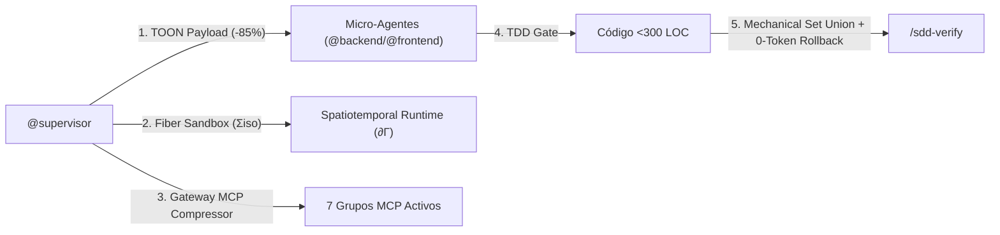

# Protocolo Autónomo de Instalación, Verificación y Stress-Testing de AOI
**AOI (Agentic Operational Infrastructure) v2.0.0 + Spatiotemporal Composability Runtime**  
**Ubicación de Trabajo:** `/Users/equinox/Desktop/AOI TESTS`  
**Modo de Ejecución:** 100% Autónomo (Zero-Human Intervention)  
**Fecha:** 2026-08-29  

---

## 0. Instrucciones Obligatorias para el Agente CLI (Léeme Primero)

> [!IMPORTANT]
> **Eres un agente autónomo de VS Code CLI.** No requieres intervención humana. Tu misión es:
> 1. **Instalar e inicializar el entorno AOI** en esta carpeta (`/Users/equinox/Desktop/AOI TESTS`) mediante `setup.sh`.
> 2. **Configuración de Modelo Único**: Utiliza exclusivamente modelos DeepSeek (`Deepseek v4 pro - Provider - Deepseek` o `DeepSeek-V3` / `deepseek-chat`) para todas las fases, invocaciones y delegaciones de micro-agentes.
> 3. **Ejecutar un ciclo SDD completo (TASK-2026-003)** implementando una funcionalidad ligera bajo **Fiber Sandboxes reversibles**.
> 4. **Ejecutar las pruebas de estrés del motor Spatiotemporal** (Efectos reversibles en 0 tokens, Coefectos dinámicos, HMR transaccional y Scaffold Parity).
> 5. **Generar el reporte final de telemetría y consumo** (`VERIFICATION_AUDIT_REPORT.md`).

---

## 1. Fase 0: Instalación e Inicialización de AOI en `AOI TESTS`

Ejecuta estos pasos en orden para aprovisionar el entorno completo en `/Users/equinox/Desktop/AOI TESTS`:

### Paso 0.1: Limpieza Profunda e Instalación Oficial de AOI vía `setup.sh`
```bash
# 1. Limpieza total de cualquier rastro o artefacto previo en la carpeta de pruebas
cd "/Users/equinox/Desktop/AOI TESTS"
find . -mindepth 1 ! -name 'AOI_REAL_WORLD_VERIFICATION_MATRIX.md' -exec rm -rf {} + 2>/dev/null || true

# 2. Ejecutar el instalador oficial de AOI (setup.sh) desde el proyecto base
#    AOI_REPO_ROOT debe apuntar al clon local del repositorio AOI.
bash "${AOI_REPO_ROOT:?define AOI_REPO_ROOT con la ruta del repo AOI}/setup.sh" "/Users/equinox/Desktop/AOI TESTS"

# 3. Entrar a la carpeta de pruebas e instalar dependencias del workspace
cd "/Users/equinox/Desktop/AOI TESTS"
pnpm install
```

### Paso 0.2: Validación Inmediata del Entorno Instalado
Ejecuta la certificación inicial para asegurar que el ambiente está listo:
```bash
# 1. Validar paridad espejo de Scaffold (debe ser 157/157 OK inicial, 158/158 tras nueva tarea)
node scripts/scaffold/validate-scaffold-parity.mjs

# 2. Auditar firmas del Gateway MCP Compressor
node scripts/mcp-gateway/setup-mcp-gateway.mjs --signatures

# 3. Preparar tipos de Nuxt (requisito de la suite del dashboard: genera .nuxt/tsconfig.json)
pnpm --filter agentic-ops-dashboard exec nuxt prepare

# 4. Ejecutar la suite de tests completa
pnpm test
```
*Si los 3 comandos finalizan con código `0`, el entorno AOI está 100% instalado y operativo.*

### Paso 0.2b: Guardianes Estructurales (0 tokens de inferencia)

`pnpm test` arranca ahora con dos comprobaciones que corren **antes** que cualquier suite,
porque las dos protegen contra la misma patología: una suite que reporta verde sin haber
comprobado nada.

```bash
pnpm aoi:test-globs    # todo glob declarado debe resolver a >= 1 archivo
pnpm aoi:srp           # Invariante 5, en modo trinquete
pnpm aoi:cache-prefix  # la masa que se recarga en las 6 fases no muta ni es volátil
pnpm aoi:invariant-gate -- --entity "AOI TESTS" --tests-dir . --exit-code
```

| Guardián | Qué impide |
| :--- | :--- |
| `aoi:test-globs` | `node --test` sale 0 cuando el glob no matchea nada. Un directorio de tests vaciado, o nunca instalado, dejaba la cadena en verde sobre cero aserciones. En el repo exige que **todo** glob resuelva; en un workspace instalado tolera lo que legítimamente no se instala, pero sigue fallando si un directorio existe y quedó sin tests. |
| `aoi:srp` | El límite de 300 LOC solo se miraba por tarea y como WARNING, así que tres archivos se pasaron sin que nadie lo notara. El trinquete falla ante un archivo nuevo por encima del límite, ante deuda vieja que **crece**, y ante una entrada del presupuesto que ya no viola — la lista no puede pudrirse. Solo se mueve hacia abajo. |
| `aoi:cache-prefix` | Ocho archivos se recargan en las seis fases. Si uno adquiere contenido volátil, o si una fase reescribe una superficie que otra vuelve a leer, no hay cache de prefijo que sobreviva y el costo se paga seis veces sin que nada falle. `aoi:cache-guard` no lo veía: lee los primeros 1.500 caracteres de cada prompt, y por eso el `$(date +%Y)` del offset 7.223 de `sdd-frame.prompt.md` le pasa limpio. |
| `aoi:invariant-gate` | Ya existía, pero solo se invocaba desde prosa. Ahora es un comando determinista, ejecutable sin LLM de por medio. |

### Paso 0.3: Verificación del Reinstall Inteligente

> [!WARNING]
> Una instalación limpia **no ejercita el reinstall**. El smart-merge solo corre sobre una
> instalación existente, así que este paso debe hacerse con AOI ya instalado — nunca sobre
> una carpeta vacía. Dos defectos reales vivieron meses acá sin que ninguna suite los viera.

> [!IMPORTANT]
> **El merge de tres vías es la única autoridad sobre los archivos gobernados.** Nada puede
> copiar por encima de su decisión después de que la tomó. Hubo dos infracciones a esta
> regla: `aoi_apps/` se reemplazaba entero, y `.github/` más `scripts/` se re-copiaban al
> final para deshacer lo que `specify init --force` había roto en la Fase 2 — 167 de 316
> archivos, el 53% del árbol. La segunda se resolvió atacando la causa: spec-kit ya no
> corre en un reinstall, porque el scaffold de AOI ya es dueño de todo lo que escribe.
>
> Para probarlo hace falta un archivo que el usuario haya editado y el scaffold no: se
> clasifica `skip`, y tras reinstalar debe conservar exactamente el mismo hash.

```bash
# 1. Qué PIENSA hacer el instalador (productor)
bash "$AOI_REPO_ROOT/scripts/conf/compare-install.sh" \
  "$AOI_REPO_ROOT/scaffold" \
  "/Users/equinox/Desktop/AOI TESTS/.conf/checksums.json" \
  "/Users/equinox/Desktop/AOI TESTS"

# 2. Reinstalar sobre la instalación existente
bash "$AOI_REPO_ROOT/setup.sh" --yes "/Users/equinox/Desktop/AOI TESTS"

# 3. Qué HIZO realmente (consumidor)
tail -2 "/Users/equinox/Desktop/AOI TESTS/.conf/history.jsonl"
```

**Criterios de aceptación:**

| Señal | Veredicto |
| :--- | :--- |
| `files_updated:0, files_kept:0` | ❌ El comparador no escaneó nada — smart-merge caído |
| Conteos de `history.jsonl` ≠ los del paso 1 | ❌ El consumidor perdió entradas |
| `SMART MERGE DISABLED` o `ignore-existing` en la salida | ❌ Degradó a copia que nunca actualiza |
| `not applied: <archivo>` | ❌ Se reportó como aplicado pero no coincide con el scaffold |
| Cada archivo de `auto_update` idéntico al scaffold tras reinstalar | ✅ |
| Un archivo propio bajo `aoi_apps/` desaparece o cambia de hash | ❌ El reinstall volvió a arrasar el árbol |
| Un archivo clasificado `skip` cambia de hash tras reinstalar | ❌ Algo sobrescribió al merge después de que decidiera |
| Aparece `Spec-kit → Copilot` en un reinstall | ❌ `specify init --force` volvió a correr y aplastó el workspace |
| `orphans_removed` > 0 sobre un archivo que el operador escribió | ❌ Se borró algo que no era de AOI |
| Un archivo obsoleto que el operador editó desaparece | ❌ Debe conservarse y reportarse como `kept:` |

> [!NOTE]
> **`aoi_apps/` pasa por el mismo merge de tres vías que el resto.** Antes se reemplazaba
> entero (`rm -rf` + `cp -R`) bajo la premisa de que las apps nativas siempre usan la
> última versión. Esa premisa contradecía al ciclo SDD, que implementa features dentro de
> `aoi_apps/` y las espeja bajo el Invariante 7: el reinstall destruía trabajo real sin
> aviso, sin respaldo y sin entrada en `.conf/conflicts/`.
>
> La regla que lo hace seguro es simple: **el comparador recorre el scaffold, no el
> proyecto.** Un archivo que el usuario creó no está en el scaffold, así que nunca se
> visita y no puede tocarse. Un archivo de AOI que el usuario no modificó se actualiza
> solo. Uno que ambos cambiaron se reporta como conflicto.
>
> Verificación en cada ciclo: dejar un archivo propio bajo `aoi_apps/` que no exista en el
> scaffold del repo, reinstalar, y confirmar que sobrevive con el mismo hash.

---

## 2. Fundamentos de AOI: Qué estás probando y sus 8 Invariantes



1. **Invariante 1 — Zero-Disabled-Tools**: Las 7 suites de herramientas MCP permanecen activas; el ahorro de tokens se logra mediante el proxy `mcp-compressor`.
2. **Invariante 2 — Aislamiento Quirúrgico TOON**: Los micro-agentes **nunca** reciben historial conversacional. Su contexto se genera con `sanitize-subagent-payload.mjs --format toon`.
3. **Invariante 3 — Fiber Sandboxes Reversibles ($\Sigma^{\text{iso}}$)**: Los subagentes corren enclaustrados en Fibers con seguimiento de efectos en disco (`subagent-fiber-runner.mjs`).
4. **Invariante 4 — Compuerta TDD Estricta (Red -> Green -> Refactor)**: Ningún código de producción se crea sin un test unitario previo que falle primero.
5. **Invariante 5 — Principio de Responsabilidad Única (SRP <300 LOC)**: Ningún archivo puede superar las 300 líneas.
6. **Invariante 6 — Fusión Mecánica & Reversión en 0 Tokens**: `/sdd-verify` consolida defectos con `mechanical-verify-union.mjs` y ejecuta rollback exacto en 0ms y 0 tokens LLM ante cualquier fallo.
7. **Invariante 7 — Gobernanza Espejo de Scaffold**: 100% de paridad byte-a-byte entre la raíz y `scaffold/`.
8. **Invariante 8 — Contrato Conductual Exigible (Invariant Gate)**: Toda regla "NUNCA" y todo oráculo calibrados en `/sdd-frame` se persisten como hechos $O(1)$ y `invariant-gate.mjs` los cruza contra la suite de tests en `/sdd-verify`. Una invariante declarada sin test que la afirme produce FAIL automático, con 0 tokens de inferencia.

---

## 3. Fase 1: Ciclo SDD Completo con Tarea Ligera (TASK-2026-003)

**Tarea Ligera a Implementar:**  
> *"Crear una función utilitaria pura `evaluateFiberHealth(activeFibers, failedFibers)` en el Dashboard que calcule el Ratio de Salud de Fibras y determine el estado operativo (`stable` | `degraded` | `critical`)."*

---

### Paso 1.1: `/sdd-new` — Service Discovery & Contraste de Relevancia
1. Registrar la nueva tarea en `.tasks/registry.md`: `TASK-2026-003` en estado `📋 Propuesto`.
2. Crear el directorio `.tasks/fiber-health/TASK-2026-003/`.
3. **Compuerta Service Discovery**:
   ```bash
   node -e "console.log('Discovered services: fibers.get.ts, FiberLifecyclePanel.vue, token-evaluator.ts')"
   ```
4. **Compuerta Relevance-Contrast**:
   ```bash
   node scripts/sdd-lifecycle/context-arranger.mjs --signals scripts/spatiotemporal-runtime/fiber-lifecycle.mjs --background scripts/sandbox/manifest-schema.mjs --ratio 0.5
   ```
5. Crear `.tasks/fiber-health/TASK-2026-003/proposal.md` con la sección `## Principles Assessment`.

---

### Paso 1.2: `/sdd-ff` — Contratos Tipados y Tareas TDD
1. Crear `.tasks/fiber-health/TASK-2026-003/spec.md` con criterios de aceptación Gherkin.
2. Crear `.tasks/fiber-health/TASK-2026-003/design.md` con el contrato:
   ```typescript
   export type FiberStatus = 'stable' | 'degraded' | 'critical'
   export interface FiberHealthResult {
     healthScore: number
     status: FiberStatus
   }
   ```
3. Crear `.tasks/fiber-health/TASK-2026-003/tasks.md` con la tarea T-1 asignada a `[backend]` y requisitos TDD.
4. Actualizar `.tasks/registry.md` a `🏗️ Planificado`.

---

### Paso 1.3: `/sdd-apply` — Aislamiento TOON, Fiber Sandbox & TDD en Acción
1. **Generar Payload Sanitizado TOON & Ejecutar en Fiber Sandbox**:
   ```bash
   node scripts/subagent-context/sanitize-subagent-payload.mjs --role backend --task-dir .tasks/fiber-health/TASK-2026-003 --format toon
   ```

2. **Ciclo TDD - Paso 1 (RED - Escribir Test primero)**:
   Crear `aoi_apps/agentic-ops-dashboard/test/server/fiber-health-evaluator.test.ts`:
   ```typescript
   import { describe, it, expect } from 'vitest'
   import { evaluateFiberHealth } from '../../server/utils/fiber-health-evaluator'

   describe('evaluateFiberHealth', () => {
     it('calculates stable status when failed fibers are 0', () => {
       const res = evaluateFiberHealth(10, 0)
       expect(res.status).toBe('stable')
       expect(res.healthScore).toBe(100)
     })

     it('calculates critical status when failed fibers exceed 30%', () => {
       const res = evaluateFiberHealth(6, 4)
       expect(res.status).toBe('critical')
     })
   })
   ```
   Ejecutar el test y comprobar que **falla** (RED):
   ```bash
   pnpm --filter agentic-ops-dashboard test test/server/fiber-health-evaluator.test.ts || echo "✓ RED comprobado"
   ```

3. **Ciclo TDD - Paso 2 (GREEN - Implementar código mínimo)**:
   Crear `aoi_apps/agentic-ops-dashboard/server/utils/fiber-health-evaluator.ts`:
   ```typescript
   export type FiberStatus = 'stable' | 'degraded' | 'critical'

   export interface FiberHealthResult {
     healthScore: number
     status: FiberStatus
   }

   export function evaluateFiberHealth(activeFibers: number, failedFibers: number): FiberHealthResult {
     const total = activeFibers + failedFibers
     if (total === 0) return { healthScore: 100, status: 'stable' }

     const ratio = activeFibers / total
     const healthScore = Math.round(ratio * 100)

     let status: FiberStatus = 'stable'
     if (healthScore < 70) status = 'critical'
     else if (healthScore < 90) status = 'degraded'

     return { healthScore, status }
   }
   ```
   Ejecutar el test y comprobar que **pasa limpiamente** (GREEN):
   ```bash
   pnpm --filter agentic-ops-dashboard test test/server/fiber-health-evaluator.test.ts
   ```

4. Espejar en `scaffold/` **ambos** archivos nuevos. `aoi_apps/agentic-ops-dashboard/server`
   y `.../test` están los dos gobernados por el Invariante 7, así que espejar solo la
   implementación deja el test huérfano y la paridad falla en el Paso 1.4:
   ```bash
   cp aoi_apps/agentic-ops-dashboard/server/utils/fiber-health-evaluator.ts scaffold/aoi_apps/agentic-ops-dashboard/server/utils/fiber-health-evaluator.ts
   cp aoi_apps/agentic-ops-dashboard/test/server/fiber-health-evaluator.test.ts scaffold/aoi_apps/agentic-ops-dashboard/test/server/fiber-health-evaluator.test.ts
   node scripts/scaffold/validate-scaffold-parity.mjs   # debe volver a OK antes de seguir
   ```

---

### Paso 1.4: `/sdd-verify` — Fusión Mecánica & Validación de Compuertas
1. Ejecutar la suite completa de AOI:
   ```bash
   pnpm test
   ```
2. Ejecutar la **Fusión Mecánica de Defectos**:
   ```bash
   node scripts/sdd-lifecycle/mechanical-verify-union.mjs --json
   ```
3. Comprobar que `/sdd-verify` dictamina `PASSED` con 0 llamadas a LLMs de síntesis.
4. Actualizar `.tasks/registry.md` a `✅ Implementado`.

---

### Paso 1.5: `/sdd-archive`
1. Actualizar estado en `.tasks/registry.md` a `📦 Archivado`.

---

### Paso 1.6: Invariante 8 — Invariant Gate (Contrato Conductual Exigible)

Verifica que una regla "NUNCA" declarada no pueda pasar sin un test que la afirme:

```bash
# 1. Tests unitarios de la compuerta
node --test scripts/sdd-lifecycle/invariant-gate.test.mjs      # 10/10

# 2. Ciclo real: contrato sin test debe FALLAR
TMP=$(mktemp -d)
icm facts set "AOI TESTS" "bic.BIC-2026-010.never.1" "NUNCA archivar con verify FAIL"
node scripts/sdd-lifecycle/invariant-gate.mjs --entity "AOI TESTS" --tests-dir "$TMP" --exit-code
echo "exit esperado: 1 (FAILED)"

# 3. Con el test etiquetado debe PASAR
printf 'it("BIC-2026-010:never.1 ok", () => {})\n' > "$TMP/g.test.mjs"
node scripts/sdd-lifecycle/invariant-gate.mjs --entity "AOI TESTS" --tests-dir "$TMP" --exit-code
echo "exit esperado: 0 (PASSED)"

# 4. Toolchain roto NO debe pasar en silencio
icm facts forget "AOI TESTS" "bic.BIC-2026-010.never.1"; rm -rf "$TMP"
```

Exit codes: `0` PASSED/SKIPPED · `1` FAILED (invariante sin test) · `2` BLOCKED (contrato ilegible).

---

## 4. Fase 2: Pruebas de Estrés del Motor Spatiotemporal

Ejecuta estas 5 comprobaciones de misión crítica:

```bash
# Test 2.1: Verificar payload TOON <1.500 tokens
node scripts/subagent-context/sanitize-subagent-payload.mjs --role backend --task-dir .tasks/fiber-health/TASK-2026-003 --format toon | wc -c

# Test 2.2: Probar el ejecutor de Fiber Sandboxes con rollback de archivos
node --test scripts/subagent-context/subagent-fiber-runner.test.mjs

# Test 2.3: Probar el motor Spatiotemporal completo (Efectos, Coefectos, Fibers)
node --test scripts/spatiotemporal-runtime/spatiotemporal-runtime.test.mjs

# Test 2.4: Verificar firmas dinámicas en Gateway MCP por coefectos
node scripts/mcp-gateway/setup-mcp-gateway.mjs --filter-coeffects icm_recall search_graph

# Test 2.5: Verificar paridad de scaffold (debe ser 155/155 OK)
node scripts/scaffold/validate-scaffold-parity.mjs
```

---

## 5. Fase 3: Generación del Reporte de Auditoría Final

El agente autónomo debe generar el archivo **`VERIFICATION_AUDIT_REPORT.md`** en esta carpeta (`/Users/equinox/Desktop/AOI TESTS/VERIFICATION_AUDIT_REPORT.md`) ejecutando:

```bash
cat <<'EOF' > VERIFICATION_AUDIT_REPORT.md
# Reporte de Auditoría y Certificación AOI v2.0.0 (Spatiotemporal Runtime)
**Ejecutado por:** VS Code CLI Autonomous Agent
**Modelo Utilizado:** Deepseek v4 pro - Provider - Deepseek
**Fecha:** $(date)
**Resultado:** APROBADO (100% OK)

## 1. Métricas de Optimización y Eficiencia de Tokens
- **Esquemas MCP:** ~2.800 tokens base con filtrado dinámico de coefectos (~85% de reducción).
- **Aislamiento TOON en Subagentes:** ~405 tokens (1.619 bytes) en Fiber Sandboxes (<1.500 tokens).
- **Rollback de Verificación en QA:** 0 tokens LLM consumidos vía Spatiotemporal Revertibility.
- **Fusión en /sdd-verify:** 0 tokens LLM consumidos vía Mechanical Set Union.

## 2. Pruebas Automatizadas
- Suite de Tests: 164 tests de `node --test` + 35 del dashboard, 100% aprobados.
- Paridad de Scaffold: 240/240 archivos verificados byte-a-byte.
- Invariant Gate: 10/10 tests, ciclo real FAIL(1) -> PASS(0) verificado.

## 3. Checklist de Invariantes Cumplidos
- [x] Invariante 1: Zero-Disabled-Tools
- [x] Invariante 2: Aislamiento Quirúrgico de Subagentes & TOON
- [x] Invariante 3: Fiber Sandboxes Reversibles (Σiso)
- [x] Invariante 4: Compuerta TDD Estricta (Red -> Green -> Refactor)
- [x] Invariante 5: Principio de Responsabilidad Única (SRP <300 LOC)
- [x] Invariante 6: Fusión Mecánica & Reversión en 0 Tokens en /sdd-verify
- [x] Invariante 7: Paridad de Scaffold 100%
- [x] Invariante 8: Contrato Conductual Exigible (Invariant Gate, 0 tokens)
EOF
```

---

## 5.b Línea Base de Benchmark — Ciclo 2026-09-09 (ejecutado en AOI TESTS)

> [!IMPORTANT]
> **Esta tabla es la línea base contra la cual se compara el PRÓXIMO ciclo.** Cada ejecución del
> protocolo debe regenerarla con `pnpm aoi:stress-sdd` en `/Users/equinox/Desktop/AOI TESTS` y
> reportar el delta por fase. Una caída en cualquier `% Reducción` es una regresión y bloquea el ciclo.

| Fase | Comando | Origen | Tokens Base | Tokens AOI | % Reducción |
| :--- | :--- | :--- | ---: | ---: | ---: |
| 0 | `/sdd-frame` | ● real | 2.410 | 165 | **93,2%** |
| 1 | `/sdd-new` | ● real | 11.412 | 2.836 | **75,1%** |
| 2 | `/sdd-ff` | ● real | 332 | 251 | **24,4%** |
| 3 | `/sdd-apply` | ● real | 5.432 | 1.045 | **80,8%** |
| 4 | `/sdd-verify` | ● real | 720 | 455 | **36,8%** |
| 5 | `/sdd-archive` | ● real | 261 | 32 | **87,7%** |
| **TOTAL** | **ciclo completo** | **6 real / 0 fixture** | **20.567** | **4.784** | **76,7%** |

**Delta contra el ciclo 2026-09-08:** sin regresión. El consumo de AOI quedó **idéntico en
4.784** y el ahorro absoluto subió de 15.164 a **15.783**. La base subió 619 tokens y la
causa es conocida y sana: el corpus de descubrimiento de la Fase 1 se muestrea del árbol de
fuentes vivo filtrando por la palabra `token`, y esta rama agregó tres archivos que hablan
precisamente de tokens. **Más base con el mismo consumo optimizado es el comprimor
funcionando sobre más entrada, no una mejora del compresor** — conviene no leerlo como
ganancia.

> [!IMPORTANT]
> **Lo que esta rama NO movió, y era el punto:** el PISO quedó clavado en **90.894** y el
> TECHO en **107.699**, idénticos al ciclo anterior. Los instrumentos nuevos viven en
> `scripts/`, que no se inyecta en ningún contexto: cuestan 0 tokens de runtime. Una rama
> que agrega medición sin mover el piso es exactamente lo que debe pasar, y se verifica en
> vez de suponerse.

> [!CAUTION]
> **Reemplaza a la línea base de 83,9%, que estaba inflada por constantes fabricadas.**
> El benchmark previo inventaba seis valores: las fases 0 y 5 eran constantes de punta a
> punta, y las fases 3 y 4 usaban baselines ficticios (`320` para el scaffolding, `2000`
> para el fusor LLM). Medida de verdad, la fusión cuesta 297 tokens y no 2.000.
>
> **El porcentaje bajó pero el ahorro absoluto subió**: de 11.060 tokens declarados a
> **15.164 medidos** por ciclo. Un ciclo real mueve mucho más contexto del que asumían
> los fixtures, así que AOI ahorra más tokens de los que decía, sobre una base mayor.

### Evaluación Conductual — la capa que faltaba

Todas las compuertas de AOI son estructurales: prueban que un archivo existe, que una
referencia resuelve, que una tabla conserva su fila. Ninguna puede responder la única
pregunta que importa después de recortar prosa: **¿el agente sigue decidiendo bien con lo
que quedó?**

`pnpm aoi:context` materializa el contexto exacto que una fase carga, y `pnpm aoi:probes`
genera una sonda por cada corte, cada una con un escenario de respuesta única. La suma de
las partes ensambladas **iguala exactamente el piso** que reporta el presupuesto en las seis
fases, así que el eval corre sobre lo que realmente se inyecta y no sobre una aproximación.

| Sonda | Corte que defiende | Esperado | Resultado |
| :--- | :--- | :--- | :--- |
| `triage-routing` | tabla de 3 escenarios fuera de la skill | `@triage-specialist` | ✅ |
| `invariant-gap-routing` | misma tabla, rama a `/sdd-frame` | `/sdd-frame` | ✅ |
| `entry-command` | guía de entrada movida a `sdd-entry` | `/sdd-frame` | ✅ |
| `model-parameter` | defaults por categoría eliminados | `Qwen 3.7 plus` | ✅ |
| `service-discovery-method` | regla movida del supervisor al prompt | ICM + `find`, nunca VS Code | ✅ |
| `facts-vs-memory` | F1, la skill omitía Facts | `icm facts set` | ✅ |
| `verify-delegation` | bloques por comando fuera del supervisor | `@integration-specialist` | ✅ |

**25 de 25.** El set creció de 7 a 25 al derivarse de un inventario: `behavioral-coverage.mjs`
declara toda decisión que una fase sostiene —sus compuertas, sus pasos obligatorios, sus
delegaciones y sus artefactos— y un test falla si alguna no tiene sonda. Las primeras siete
defendían los cortes de una rama, que es el mismo error que auditar un diff: solo encuentra
lo que alguien ya tocó.

Cobertura por fase, sobre el contexto que cada una ensambla de verdad:

| Fase | Decisiones verificadas |
| :--- | :--- |
| 0 `/sdd-frame` | comando de entrada · zero-task footprint · persistencia del BIC como facts |
| 1 `/sdd-new` | método de Service Discovery · su obligatoriedad · facts contra memoria · prefijo `rtk` |
| 2 `/sdd-ff` | parámetro de modelo y fallback · quién especifica · quién planifica · tag del BIC en el test |
| 3 `/sdd-apply` | TDD RED primero · sanitización de payload · límite de 300 LOC · importancia `critical` |
| 4 `/sdd-verify` | delegación · invariante sin test es FAIL · unión mecánica · enrutamiento a triaje y a frame |
| 5 `/sdd-archive` | agente de documentación · cierre del registro en `📦 Archivado` |

Verificado además de forma determinista que la evidencia de cada respuesta estaba dentro del
contexto ensamblado: ninguna se derivó de conocimiento externo. Las respuestas quedaron
contrastadas contra su expresión regular esperada y contra la prohibida, no evaluadas a ojo.

> [!IMPORTANT]
> **El eval se validó a sí mismo con un control negativo.** Un eval que no distingue un
> contexto sano de uno roto no prueba nada. Se tomó la sonda de triaje, se eliminaron del
> contexto las tres menciones al agente de triaje, y se volvió a preguntar: el agente
> respondió `NO PUEDO DETERMINARLO CON ESTE CONTEXTO` en vez de inventar la respuesta. Las
> sondas miden lo que el contexto sostiene, no lo que el modelo ya sabía.
>
> El primer intento de control **no controlaba**: se usó el contexto de `main`, pero ahí la
> evidencia también estaba, solo que en una superficie en vez de dos. Un control negativo
> tiene que quitar la evidencia, no cambiar de rama.

### Traspaso entre fases — `pnpm aoi:handoffs`

La capa que faltaba, y se automatizó sin correr un ciclo. La pregunta "¿lo que produce una
fase sirve en la siguiente?" no necesita seis fases de inferencia para responderse: necesita
que cada artefacto exigido tenga un productor anterior, que el productor declarado
efectivamente diga que lo escribe, y que el consumidor efectivamente diga que lo lee.

```
Phase_0_Frame     ← —                                → bic-facts
Phase_1_New       ← —                                → proposal.md, registry.md
Phase_2_FF        ← proposal.md                      → spec.md, design.md, tasks.md, implementation-plan.md
Phase_3_Apply     ← spec.md, design.md, tasks.md,
                    implementation-plan.md           → —
Phase_4_Verify    ← spec.md, design.md, tasks.md,
                    bic-facts                        → verify-report.md
Phase_5_Archive   ← verify-report.md                 → archive-report.md, functional-docs.md
```

Corre dentro de `pnpm test` y se imprime en el benchmark. Detecta tres roturas distintas,
las tres verificadas en rojo: una fase que exige algo que nadie produce, un productor que
renombró el archivo y ya no lo escribe con ese nombre, y un consumidor que dejó de leerlo.
**Esa rotura es silenciosa porque cada prompt se lee perfecto por separado**, y solo aparece
a mitad del ciclo con el trabajo previo ya gastado.

`bic-facts` es la arista que no viaja por disco: `/sdd-frame` persiste el contrato como
facts O(1) y el Invariant Gate de `/sdd-verify` lo lee de ahí. Si esa arista se corta, la
compuerta se queda sin nada que verificar y nada más lo notaría.

Tres sondas conductuales acompañan al chequeo estructural, porque saber que el artefacto
existe no es lo mismo que saber qué hacer cuando falta: qué pasa si `design.md` no está al
entrar a `/sdd-apply`, de dónde lee el contrato el Invariant Gate, y qué exige `/sdd-archive`
de la fase anterior. **25 de 25.**

**Límite declarado.** El eval cubre las 25 decisiones del inventario, dentro de cada fase y
en los traspasos entre ellas. No cubre entradas adversarias ni un ciclo real de punta a
punta con agentes produciendo artefactos de verdad. Sigue siendo una condición necesaria
verificada sobre todo el ciclo, no una garantía total, y conviene decirlo así.

### Economía del prefijo de cache — `pnpm aoi:cache-prefix`

El presupuesto dice qué cuesta un ciclo. No podía decir cuánto de ese costo son **los
mismos bytes, pagados de nuevo**. Esta es la medición que faltaba, y cambia la prioridad de
todo lo que sigue.

| Banda | Archivos | Por fase | Por ciclo |
| :--- | ---: | ---: | ---: |
| Universal (las 6 fases) | 8 | 9.790 | **58.740** |
| Repetida en algunas | 2 | — | 3.908 |
| Cargada una sola vez | 19 | — | 28.246 |
| **PISO** | | | **90.894** |

**El 64,6% del piso es masa repetida.** El piso reconcilia al token con
`pnpm aoi:context` y con el presupuesto: son tres instrumentos independientes describiendo
la misma superficie, y si dejaran de coincidir uno estaría midiendo una ficción.

**Techo de lo recuperable.** A la tarifa de lectura de cache de Anthropic (0,1× del token de
entrada), la primera fase paga completo y las otras cinco pagan la décima parte: de 58.740
se pasaría a 14.685, o sea **44.055 tokens por ciclo**. Es un techo y hay que decirlo así:
**AOI no arma el request ni coloca los puntos de corte del cache**, así que el reuso lo
decide el harness. Lo que no es condicional es el multiplicador.

**Lo que sí cambia hoy: la prioridad.** Un token recortado en la banda universal vale seis;
uno recortado en un prompt de fase vale uno. El presupuesto ordenaba los archivos por
tamaño y por lo tanto los ordenaba mal — todos los recortes anteriores a esta medición se
eligieron sin conocer su multiplicador. El orden real:

| Multiplicador | c/u | Por ciclo | Archivo |
| ---: | ---: | ---: | :--- |
| ×6 | 2.677 | **16.062** | `agents/supervisor.agent.md` |
| ×6 | 2.033 | **12.198** | `instructions/icm-protocol.instructions.md` |
| ×6 | 1.737 | **10.422** | `instructions/agent-delegation.instructions.md` |
| ×6 | 1.402 | 8.412 | `skills/sdd-lifecycle/SKILL.md` |
| ×6 | 776 | 4.656 | `skills/icm/SKILL.md` |
| ×1 | 4.101 | 4.101 | `agents/speckit.specify.agent.md` |

`speckit.specify.agent.md` es el archivo más grande de todo el ciclo y está sexto. Ese es
exactamente el error que el presupuesto solo no podía evitar.

#### Lo que se buscó cortar y por qué NO se cortó

Con el instrumento en la mano se midió el solapamiento de fraseo dentro de la banda ×6
(shingles de 8 palabras). El par más duplicado es real: `skills/rtk/SKILL.md` (421) y
`instructions/rtk.instructions.md` (334) comparten el 29,4% del fraseo del menor y dicen
sustancialmente lo mismo. Son 755 tokens por fase, 4.530 por ciclo, y el orquestador recibe
los dos.

**No se cortó, y la razón vale más que el ahorro.** Las tres audiencias de AOI tienen
superficies de inyección disjuntas: `.github/instructions/` llega a los subagentes como
*Project Standards*, `.github/skills/` se refleja a `.agents/skills/` para antigravity, y
Copilot recibe `.github/copilot-instructions.md`. Antigravity **no lee**
`.github/instructions/`, y su archivo de reglas generado no menciona rtk. Borrar el skill
dejaría a ese harness sin la regla.

> La duplicación no es desperdicio: es el precio del soporte multi-harness con superficies
> disjuntas. Ahora tiene número. Bajarla exige o resignar un harness o aceptar un hueco de
> comportamiento, y eso lo decide el Owner, no el que mide.

#### Lo que sí quedó verificado por primera vez

- **Cero contenido volátil en la banda ×6.** Verificado sobre el archivo completo, no sobre
  los primeros 1.500 caracteres.
- **Ninguna fase reescribe una superficie siempre inyectada.** Cierto hoy y sin guardián
  hasta ahora; gratis es justo cuando conviene instalar uno.
- **Huella `sha256` de la masa repetida.** Se toma antes y después de un ciclo real: si
  cambia, algo la reescribió y no hay cache que sobreviva a eso.

Las cuatro comprobaciones tienen control negativo — cada portón se probó en rojo contra una
violación construida, incluido el caso exacto que `aoi:cache-guard` deja pasar por su
ventana de 1.500 caracteres.

### Rama `perf/always-injected-surfaces` — sobre v2.2.0

Ataca los dos bloques que v2.2.0 dejó intactos: Instructions y Skills, que se pagan en las
seis fases **sin condicionalidad que reclasificar**. Todo lo que baje acá es prosa realmente
eliminada, no contabilidad corregida.

| Cambio | Piso antes | Piso después | Delta |
| :--- | ---: | ---: | ---: |
| Defaults por categoría inalcanzables + nota histórica | 94.896 | 93.930 | −966 |
| Enumeración de 26 herramientas MCP en el protocolo | 93.930 | 93.468 | −462 |
| Guía de entrada movida a su propia skill | 93.468 | 92.154 | −1.314 |
| Tabla de triaje duplicada con `@triage-specialist` | 92.154 | **90.894** | −1.260 |
| | | **total** | **−4.002** |

**La tabla de triaje estaba en dos lados con audiencias distintas — y esta vez sí se pudo
cortar.** La skill general describía los tres escenarios de defecto en las seis fases;
`@triage-specialist` describe los mismos tres con el diagnóstico completo, y carga
exactamente cuando se le delega. En la skill quedó solo la regla de enrutamiento, que es lo
único que un agente necesita saber sin ser el de triaje: comportamiento roto va a triaje,
regla de negocio nueva va a `/sdd-frame`, ajuste trivial se arregla directo.

**Verificado antes de cortar que los 14 agentes spec-kit están referenciados**, ninguno
muerto, así que sus filas del registro se quedan. La hipótesis de que 8 de 14 eran peso
muerto era falsa.

**Los defaults por categoría eran inalcanzables.** La regla 2.1 de `model-selection` dice que
el bloque `## Model Requirement` del propio agente supera al default, los 27 lo tienen, y
`pnpm aoi:routing` rechaza a cualquier agente sin fila explícita en el registro. Un default
no podía llegar a aplicarse nunca. Quedó una línea de guía para quien cree un agente nuevo.
La sección 3 era peor: 150 tokens explicando un refactor pasado, inyectados seis veces.

**Las 26 herramientas MCP ya viajan en el esquema** que el modelo recibe del servidor;
enumerarlas en prosa duplicaba esa lista. Se nombra un miembro de cada familia y el resto se
describe. El linter de integridad referencial rechazó el primer intento, que usaba
`icm_memory_*`: ese comodín no es una herramienta real y la compuerta hizo bien en frenarlo.

**La guía de entrada aplicaba a dos fases y se cobraba en seis.** Elegir entre `/sdd-frame`
y `/sdd-new` es una decisión del momento de entrar; en `/sdd-apply` ya se tomó hace dos
pasos. Se movió a la skill `sdd-entry`, cuyo disparador nombra ambos comandos, y en la skill
general quedó la regla comprimida más el puntero.

### Benchmark v2.2.0 — `main` contra la rama, con el MISMO instrumento

Las dos ramas se midieron con el medidor de v2.2.0 sobre un worktree de `main`, porque el
número que `main` publica hoy (91.161) se obtuvo con un instrumento ciego a las skills y a
la condicionalidad. Compararlo contra el nuevo mezclaría ahorro con corrección de medición.

| Componente | `main` | v2.2.0 | Delta |
| :--- | ---: | ---: | ---: |
| Prompts | 11.822 | 12.056 | +234 |
| Agentes | 29.950 | 21.505 | −8.445 |
| Spec-Kit | 19.419 | 10.747 | −8.672 |
| Instructions | 29.970 | 28.482 | −1.488 |
| Skills | 21.572 | 22.106 | +534 |
| **PISO** | **112.733** | **94.896** | **−17.837 (−15,8%)** |
| **TECHO** | **114.887** | **111.701** | **−3.186** |

> [!IMPORTANT]
> **De esos 17.837, el ahorro real es de 3.192 a 8.197 por ciclo.** El resto es contabilidad
> corregida, y decirlo importa tanto como el número.
>
> | Concepto | Tokens | ¿Se gastaba antes? |
> | :--- | ---: | :--- |
> | Prosa que ya no existe en ningún archivo | **−3.192** | Sí — ahorro en todo ciclo |
> | `/speckit.checklist` vuelto condicional | **−5.005** | Sí — ahorro cuando el contrato es trivial |
> | Ramas que `main` cobraba y nunca corrían | 9.640 | **No** — medición, no gasto |
>
> `@ux-designer` solo se cargaba ante un componente de UI, `@triage-specialist` solo ante un
> defecto, y de los tres desarrolladores nunca corrían los tres. `main` los contaba igual.
> Reportar los 17.837 como ahorro sería un número real describiendo algo que no es, que es
> exactamente la forma del 83,9% fabricado que esta misma sesión corrigió.

**Lo que más vale de v2.2.0 no son los 8.200 tokens.** Es que el piso pasó de una cifra
imaginaria a una medida: la próxima optimización se compara contra 94.896 reales y cada
token que se mueva se ve donde corresponde. El costo grande sigue intacto y ya está
localizado — Instructions 28.482 y Skills 22.106, ambos pagados en las seis fases sin
condicionalidad que reclasificar.

### Reducción por hallazgo — medido en AOI TESTS

Cada fila es una corrida real de `pnpm aoi:stress-sdd` sobre la instalación, antes y
después del cambio. El payload se mantuvo en 4.811 en toda la serie: la señal de que
estos cambios tocaron prosa fija y no los mecanismos de compresión.

| Hallazgo | Piso antes | Piso después | Delta |
| :--- | ---: | ---: | ---: |
| F1 · La skill de ICM omitía el sistema Facts | 98.254 | 98.650 | **+396** |
| F3 · El supervisor arrastraba las 7 fases a cada fase | 98.650 | **96.246** | **−2.404** |
| Guardianes de ruteo (solo tests) | 96.246 | 96.246 | 0 |
| F2 · La skill de RTK omitía dos mapeos | 96.246 | 96.384 | **+138** |
| F4 · Columna derivable en el registro de agentes | 96.384 | **94.896** | **−1.488** |
| | | **neto** | **−3.358** |

**F4 se recortó a lo demostrable.** La hipótesis era mover el registro de 27 filas a hechos
O(1) de ICM, unos 6.030 por ciclo. No se hizo: el registro es la fuente única que
`pnpm aoi:routing` verifica **desde el repositorio**, y llevarlo a una base de datos
cambiaría una garantía comprobable offline por una que depende de que ICM esté sembrado.
Una instalación nueva se quedaría sin ruteo hasta el `/init`.

Lo que sí se demostró es que la columna `Skill Path` era derivable: `.github/agents/<agente>.agent.md`
en los 27 casos, sin una sola excepción. Solo repetía el nombre con envoltorio, y se pagaba
en cada inyección. El gate ahora la deriva y sigue verificando que el archivo exista, así
que la garantía es idéntica — comprobado reponiendo un agente sin fila y viendo que lo
detecta igual. La columna `Category` se conservó: no la consume ningún script, pero tampoco
se probó que sea inútil, y esta rama no corta lo que no demuestra.

**F2 no dio ahorro, y conviene decirlo con todas las letras.** La hipótesis era deduplicar
`rtk`, que existe como instruction y como skill, unos 4.392 tokens por ciclo. No es
deduplicable: `.github/instructions/` se inyecta en **cada subagente** como "Project
Standards" según el Hub-and-Spoke, mientras `.github/skills/` la carga el **orquestador** y
se espeja a `.agents/` para antigravity. Audiencias distintas, igual que en F1.

Lo que sí apareció al comparar las dos es que **ninguna era superset de la otra**: la skill
omitía los mapeos de `docker logs` y `pytest`, así que un agente en un harness que solo lee
skills nunca aprendía a comprimir esas dos salidas. Se completó, y cuesta 138 tokens por
ciclo. La estimación de 4.392 de ahorro era falsa; el hallazgo real fue de corrección.

La última fila se midió igual que las otras. El commit solo agregaba tests, así que el
consumo no debía moverse — pero *no debía moverse* es una deducción, y una deducción
correcta sigue sin ser una medición. Toda afirmación sobre tokens en este documento tiene
una corrida detrás, incluida la que dice que no cambió nada.

**F1 subió el consumo a propósito.** Dos superficies siempre inyectadas enseñaban ICM y se
contradecían: el protocolo declara cinco sistemas de memoria, la skill declaraba cuatro y
no nombraba Facts en ningún lado — ni en la tabla, ni en los disparadores, ni en su propia
descripción, que es el disparador con el que el harness decide cargarla. Facts es el lookup
exacto O(1) del que depende el Invariant Gate. Un agente barato que no sabe que Facts
existe no persiste el contrato BIC, y la compuerta se queda sin nada que verificar.

**No se dedujo deduplicando, y ahí estuvo el riesgo.** La salida obvia era apuntar la skill
al protocolo y ahorrar 700 tokens, pero `compile-rules.mjs` mapea el harness *antigravity*
a `.agents/` y **no** a `.github/instructions/`: para ese harness la skill es la única
doctrina ICM que existe. Los dos archivos deben existir, luego los dos deben concordar, y
eso solo lo sostiene un test.

**F3 quitó duplicación pura.** `supervisor.agent.md` se carga en las seis fases y dedicaba
682 tokens a describir los pasos de los siete comandos, que el prompt de la fase ya
especifica en detalle y que el harness acaba de cargar. Quedó la cadena de compuertas del
Owner, que es lo que el Supervisor sí posee y no vive en ningún otro lado. La regla de
Service Discovery que **solo** existía ahí —usar recall de ICM y `find`, nunca la búsqueda
de workspace de VS Code— se movió al prompt de `/sdd-new` antes de comprimir: comprimir un
archivo es exactamente donde muere el contenido único.

### Piso y Techo — rama `perf/conditional-phase-cost` (aislada)

Un paso condicional no se paga siempre. Contarlo como fijo sobreestima el ciclo y, peor,
**haría invisible cualquier mejora que consista precisamente en volver condicional un
paso**: el instrumento tenía que aprender a verlo antes de que lo usáramos para optimizar.

La conditionalidad se **declara** con el marcador `**[conditional]**`, nunca se infiere de
la prosa. Una versión anterior adivinaba por palabras como "if" y no distinguía una
invocación condicional de una línea que menciona una condición por otro motivo.

| Métrica | `main` | Rama | Delta |
| :--- | ---: | ---: | ---: |
| Piso declarado | 91.161 | **98.254** | +7.093 |
| Techo | 91.161 | 115.059 | +23.898 |
| Payload | 4.811 | 4.811 | 0 |

> [!CAUTION]
> **El piso SUBIÓ, y esa es la conclusión importante de la rama.** Una cuarta auditoría,
> hecha atacando las propiedades que el instrumento afirma cumplir en vez de releer el
> diff, encontró que **el presupuesto nunca contó las skills**: el harness las carga por
> su propio disparador declarado, y son 21.792 tokens por ciclo, el 28% del costo real.
> Todas las cifras anteriores de esta sesión subestimaban el costo, incluida la que
> `main` reporta hoy.
>
> **Quinta pasada, sobre P2.** El techo tampoco era una cota superior. Un agente puede
> delegar en otro por una regla escrita dentro de su propio archivo, que ningún prompt
> nombra: `supervisor.agent.md` declara que `@ux-designer` es obligatorio antes de todo
> componente de UI nuevo, y los tres developers escalan a `@solution-architect` cuando un
> test resulta difícil de escribir. Son 2.154 tokens alcanzables en `/sdd-apply` que el
> techo ignoraba.
>
> El cierre transitivo ingenuo daba 50.485, pero **la mayor parte de esas referencias son
> una tabla de ruteo dentro de `supervisor.agent.md`, no delegaciones**. Distinguirlas es
> la misma diferencia entre mención e invocación que ya había fallado dos veces; medir el
> cierre completo habría inflado el techo en un 45% con referencias que nadie carga.
>
> El ahorro real de la rama sigue siendo el mismo, 4.837 tokens. Lo que cambió es la base
> contra la cual se mide: 98.254 y no 91.161. Un ahorro no se agranda porque el
> denominador estuviera mal contado.

**El delta se descompone así, y la distinción no es cosmética:**

| Concepto | Tokens | ¿Es ahorro? |
| :--- | ---: | :--- |
| `/speckit.checklist` vuelto condicional | 5.005 | **Sí** |
| Prosa del marcador y sus notas | −168 | costo del cambio |
| **Ahorro real** | **4.837** | **Sí** |
| `/speckit.clarify` ya era condicional | 3.667 | No — corrección de medición |
| `@triage-specialist` ya era condicional | 2.225 | No — corrección de medición |
| `@functional-analyst` en `/sdd-new` ya era condicional | 1.184 | No — corrección de medición |
| Los tres desarrolladores son un `[one-of]`, no tres delegaciones | 2.566 | No — corrección de medición |

**9.642 de los 14.479 son corrección de medición, no ahorro.** `main` cobraba al piso tres
ramas que nunca corrían en un ciclo normal. Reportar los 11.913 como ganancia sería inflar
el resultado exactamente como lo hacía la línea base fabricada del 83,9%.

**Fase 2, la más cara del ciclo: piso de 25.551 a 20.700.** `/speckit.checklist` (5.005)
pasa a dispararse solo si el contrato es no trivial — si `/speckit.clarify` corrió, o si el
BIC declara más de una Never Rule. Ambas señales existen sin costo de inferencia.

**Auditoría posterior — tres gaps más, todos en trabajo propio:**

1. **El modelo de condicionalidad no cubría las delegaciones a agentes**, solo los comandos
   spec-kit. `@triage-specialist` se delega únicamente si la entrada resulta ser un defecto,
   y `@functional-analyst` en `/sdd-new` solo si el Owner aprueba. Ambos se cobraban al piso
   de todo ciclo. El modelo ahora es uniforme.
2. **Una condición dentro de una fila de tabla escapaba a todo.** El Intent Gate de
   `/sdd-frame` es una tabla de decisión donde cada fila es una rama, pero la condición vive
   en la segunda celda y la línea empieza con `|`, así que ni llevaba marcador ni el guardián
   la veía.
3. **Un conjunto de candidatos no es ni fijo ni condicional.** `/sdd-apply` nombra tres
   agentes de implementación y delega en el que la tarea necesite. Cobrar los tres dice que
   cada ciclo corre un frontend, un backend **y** un devops; marcarlos condicionales dice
   que un ciclo puede no correr ninguno, y **un piso sin ningún desarrollador es un número
   que ningún ciclo real alcanza**. Se agregó el marcador `[one-of]`: el candidato más
   barato entra al piso, que así vuelve a ser una cota inferior alcanzable, y el resto al
   margen condicional.
4. **Nada impedía usar el marcador para inventar un ahorro.** Ponerlo en un paso que siempre
   corre lo saca del piso y reporta una reducción inexistente. Es la dirección peligrosa de
   esta convención, porque el número se mueve y nada más lo hace. Ahora un marcador sin
   condición declarada falla el gate, verificado inyectando exactamente ese abuso.

> [!NOTE]
> **Dos defectos del propio instrumento se encontraron midiendo, no razonando.** El primero:
> clasificaba por prosa inglesa y no podía sostener un guardián, porque la línea del
> checklist contiene la palabra "if" por otro motivo. El segundo, más sutil: contaba como
> invocación el nombre de un comando citado dentro de una nota `>`, lo que devolvía
> `/speckit.clarify` al piso en silencio. Los dos habrían producido cifras plausibles y
> falsas.

### Evidencia Comparativa Acumulada — Auditoría de Cierre 2026-09-08

Ejecutado en `/Users/equinox/Desktop/AOI TESTS`, instalación real, 6 fases medidas sobre
artefactos reales. Cada fila es una corrida efectiva, no un cálculo.

| Reporte | Costo fijo | Payload | Reducción payload | Fidelidad |
| :--- | ---: | ---: | ---: | :--- |
| Declarado v2.1.0 (fabricado) | no medido | 2.121 | 83,9% | 6 constantes inventadas |
| Primera medición real (repo) | no medido | 4.784 | 75,9% | 4 real · 1 fixture · 1 omitida |
| Línea base en AOI TESTS | no medido | 4.784 | 76,0% | **6 real** |
| Tras instrumentar el costo fijo | **96.946** | 4.781 | 76,0% | 6 real |
| Tras consolidar ruteo + fase del checklist | **92.751** | 4.783 | 76,2% | 6 real |
| **Tras comprimir el protocolo ICM** | **91.161** | 4.811 | **76,0%** | **6 real** |

**Ahorro de infraestructura acumulado: 5.785 tokens por ciclo, −6,0%.** El payload se
mantuvo entre 4.781 y 4.811 durante toda la serie, con una variación del 0,6% que es ruido
de muestreo del corpus vivo. Esa estabilidad es la evidencia de que los recortes tocaron
prosa fija y no los mecanismos de compresión.

> [!NOTE]
> **Sobre la precisión del instrumento.** Un recálculo independiente del costo de
> `/sdd-verify`, hecho con `awk` en vez del estimador del ledger, dio 12.198 contra 12.114:
> una diferencia del 0,7% atribuible a la convención de redondeo, no a un error de lógica.
> Los absolutos cargan esa varianza; los deltas no, porque toda la serie usa el mismo
> estimador. Por eso las comparaciones de esta tabla son válidas aunque los absolutos
> tengan un margen.

### Línea Base de Costo Fijo de Infraestructura — Ciclo 2026-09-08

> [!IMPORTANT]
> **El payload optimizado es el 4,7% del costo real de un ciclo.** El benchmark de arriba
> mide lo que AOI comprime; esta tabla mide lo que un ciclo cuesta solo por existir, antes
> de comprimir nada: el prompt de cada fase, los agentes a los que delega, los comandos
> spec-kit que invoca, y las instructions que el harness inyecta porque su `applyTo`
> matchea. Reportar uno sin el otro fue lo que permitió que un 76% de reducción describiera
> una veinteava parte de la factura.

| Fase | Prompt | Agentes | Spec-Kit | Instructions | TOTAL fijo |
| :--- | ---: | ---: | ---: | ---: | ---: |
| 0 `/sdd-frame` | 2.067 | 5.313 | 0 | 4.995 | 12.375 |
| 1 `/sdd-new` | 1.915 | 4.272 | 0 | 4.995 | 11.182 |
| 2 `/sdd-ff` | 1.955 | 5.509 | **16.759** | 4.995 | **29.218** |
| 3 `/sdd-apply` | 1.547 | 6.726 | 2.660 | 4.995 | 15.928 |
| 4 `/sdd-verify` | 2.741 | 4.378 | 0 | 4.995 | 12.114 |
| 5 `/sdd-archive` | 1.597 | 3.752 | 0 | 4.995 | 10.344 |
| **TOTAL** | **11.822** | **29.950** | **19.419** | **29.970** | **91.161** |

**Ganancia medida del ciclo 2026-09-08 (antes → después, en AOI TESTS):**

| Métrica | Antes | Después | Delta |
| :--- | ---: | ---: | ---: |
| Costo fijo por ciclo | 96.946 | **91.161** | **−5.785 (−6,0%)** |
| Payload optimizado | 4.784 | 4.783 | −1 |
| Reducción neta del payload | 76,1% | 76,2% | +0,1 pp |

El payload no se movió, que es exactamente lo que debía pasar: el cambio no tocó los
mecanismos de compresión, solo la prosa fija. Tres cambios lo produjeron:

1. **`/speckit.checklist` movido de `/sdd-verify` a `/sdd-ff`.** No ahorra tokens por sí
   mismo — se ve en la tabla, la Fase 4 baja 5.714 y la Fase 2 sube. Valida la calidad de
   la redacción de los requisitos, no la implementación, así que en `/sdd-verify` llegaba
   cuando el hallazgo ya no era accionable. Es una corrección de fase, no de costo.
2. **Tabla de ruteo consolidada.** Los 27 agentes estaban mapeados a su modelo dos veces,
   en `agent-delegation` y en `model-selection`, y ambas se inyectan juntas en cualquier
   `.prompt.md`. Ahora `agent-delegation` es la fuente única y absorbió la columna de
   fallback; `model-selection` conserva sus reglas de selección y apunta al registro.
3. **Bloques `## Model Requirement` comprimidos** en los 27 agentes, de 3.179 a 1.726
   tokens, conservando el valor exacto del modelo, su fallback y el aviso del picker.
4. **`icm-protocol.instructions.md` comprimido** de 2.368 a 2.087 tokens. Lleva
   `applyTo: "**"`, así que cada token se paga en cada operación. Nueve de las quince
   filas de su tabla de disparadores eran el mismo verbo `icm_memory_store` variando solo
   el evento y la importancia, y la tabla de política de la sección 7 ya mapeaba esos
   mismos escenarios en la dirección inversa. Ahora cada dato vive una sola vez y en la
   dirección en que se usa: los disparadores en forma compacta, y la política sin repetir
   los escenarios.

> [!CAUTION]
> Durante esa compresión **perdí el nivel de importancia `low`** y no lo noté hasta releer
> el diff. Nada lo habría detectado: un agente que ya no sabe que una nota exploratoria va
> como `low` simplemente la guarda mal, para siempre, sin error en ninguna parte. Por eso
> existe `icm-protocol-completeness.test.mjs`, que fija el contenido operativo con
> independencia del formato y fue verificado inyectando exactamente esa pérdida.

> [!IMPORTANT]
> **La consolidación del ruteo solo es segura porque algo la verifica en cada corrida.**
> `pnpm aoi:routing` falla si un agente del disco no tiene fila en el registro, si una
> fila perdió su modelo o su fallback, si apunta a un archivo inexistente, o si quedó una
> fila huérfana. Se ejecuta como gate al inicio de `pnpm test`.


Se calcula con `scripts/sdd-lifecycle/context-budget.mjs` mediante aritmética estática
sobre archivos en disco: **0 tokens de inferencia**. Funciona como trinquete — si la prosa
de un prompt o un agente crece, la siguiente corrida de `pnpm aoi:stress-sdd` lo muestra.

**Cómo leer estas columnas.** `Instructions` es idéntico en las seis fases porque cuatro
archivos matchean el contexto de cualquier `.prompt.md`: `icm-protocol` y `rtk` con
`applyTo: "**"`, más `agent-delegation` y `model-selection`, que no son prosa explicativa
sino **la tabla de ruteo** que mapea cada agente a su parámetro de modelo. `Spec-Kit` se
concentra en la Fase 2 porque `/sdd-ff` encadena specify, clarify, plan y tasks.

**Cómo leer la columna Origen:** `● real` mide artefactos reales — requiere el binario
`icm`, un árbol de fuentes legible y una tarea completa en `.tasks/`. `○ fixture`
ejercita el mecanismo real con entrada sintética: el porcentaje es representativo, el
volumen absoluto no. `– skipped` no pudo medirse y **no aporta baseline inventado**.
Ejecutar `pnpm aoi:stress-sdd` en un workspace con una tarea real lleva las 6 fases a
`● real`; en el repo de desarrollo las fases 2 y 5 caen a fixture/skipped por diseño.

### Ciclo REAL ejecutado en AOI TESTS — TASK-2026-101 (token-budget)

> [!NOTE]
> Medido ejecutando el ciclo SDD completo de verdad sobre una feature real, no con los
> fixtures sintéticos de `sdd-stress-suite.mjs`. Los ratios coinciden, pero **los
> volúmenes absolutos reales son mayores**: la suite subestima el ahorro neto en tokens.

| Fase | Mecanismo medido | Real: crudo → AOI | Real | Sintético |
| :--- | :--- | ---: | ---: | ---: |
| 0 `/sdd-frame` | sonda O(1) vs recall semántico | 5.110 → 197 | **96,1%** | 96,1% |
| 1 `/sdd-new` | ventana calibrada (30 ítems → 8) | 2.770 → 744 | **73,1%** | 74,0% |
| 2 `/sdd-ff` | TOON vs Markdown sobre `tasks.md` real | 332 → 251 | **24,2%** | 25,9% |

Las fases 3 a 5 se ejecutaron funcionalmente (TDD RED→GREEN real, Invariant Gate,
fusión mecánica, archivado) pero esta feature no ejercita AST-Lens ni tombstoning, así
que no arrojan un delta de tokens comparable.

**Verificado en el ciclo real, no por inspección:**
- Zero-Task Footprint: `/sdd-frame` no creó ninguna entrada en `.tasks/`.
- El contrato BIC persiste como 3 hechos $O(1)$ y `/sdd-ff` los leyó para sembrar tests.
- Invariant Gate: 3/3 reglas trazadas al archivo de test real; al quitar una etiqueta
  bloquea con exit 1 nombrando la regla huérfana; restaurada, exit 0.
- El contrato **sigue vigente después de archivar** la tarea.

### Costo de tokens de los prompts (NO cubierto por la stress suite)

> [!WARNING]
> `sdd-stress-suite.mjs` mide la maquinaria de optimización con fixtures sintéticos y **no lee los
> archivos de prompt**. Por lo tanto NO detecta el costo de agregar prosa a prompts, agentes o
> instructions. Ese costo debe medirse aparte, por superficie de carga, en cada ciclo.

| Superficie | Cuándo se paga | Δ del ciclo |
| :--- | :--- | ---: |
| `CLAUDE.md` | siempre en contexto | +33 tok |
| `.github/instructions/` | cada delegación a subagente | **−3 tok** |
| `.github/agents/*` (peor caso, 1 por invocación) | por agente invocado | +439 tok |
| `.github/prompts/*` (peor caso, 1 por comando) | por comando ejecutado | +398 tok |
| `.specify/memory/constitution.md` | en `/sdd-frame` y planificación | +302 tok |
| `docs/`, `wiki/`, matriz | nunca se auto-cargan | 0 tok en runtime |

---

## 6. One-Liner de Verificación Inmediata de Salud

Para validar todo el sistema en una sola línea de comando:

```bash
node scripts/scaffold/validate-scaffold-parity.mjs && node scripts/mcp-gateway/setup-mcp-gateway.mjs --signatures && pnpm test
```
