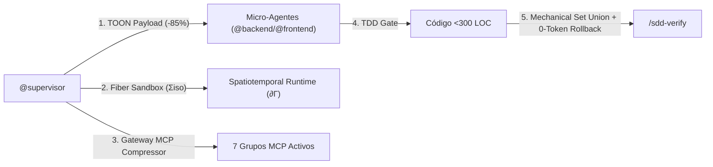

# Protocolo Autónomo de Instalación, Verificación y Stress-Testing de AOI
**AOI (Agentic Operational Infrastructure) v2.0.0 + Spatiotemporal Composability Runtime**  
**Ubicación de Trabajo:** `/Users/equinox/Desktop/AOI TESTS`  
**Modo de Ejecución:** 100% Autónomo (Zero-Human Intervention)  
**Fecha:** 2026-08-29  

---

## 0. Instrucciones Obligatorias para el Agente CLI (Léeme Primero)

> [!IMPORTANT]
> **Eres un agente autónomo de VS Code CLI.** No requieres intervención humana. Tu misión es:
> 1. **Instalar e inicializar el entorno AOI** en esta carpeta (`/Users/equinox/Desktop/AOI TESTS`) mediante `setup.sh`.
> 2. **Configuración de Modelo Único**: Utiliza exclusivamente modelos DeepSeek (`Deepseek v4 pro - Provider - Deepseek` o `DeepSeek-V3` / `deepseek-chat`) para todas las fases, invocaciones y delegaciones de micro-agentes.
> 3. **Ejecutar un ciclo SDD completo (TASK-2026-003)** implementando una funcionalidad ligera bajo **Fiber Sandboxes reversibles**.
> 4. **Ejecutar las pruebas de estrés del motor Spatiotemporal** (Efectos reversibles en 0 tokens, Coefectos dinámicos, HMR transaccional y Scaffold Parity).
> 5. **Generar el reporte final de telemetría y consumo** (`VERIFICATION_AUDIT_REPORT.md`).

---

## 1. Fase 0: Instalación e Inicialización de AOI en `AOI TESTS`

Ejecuta estos pasos en orden para aprovisionar el entorno completo en `/Users/equinox/Desktop/AOI TESTS`:

### Paso 0.1: Limpieza Profunda e Instalación Oficial de AOI vía `setup.sh`
```bash
# 1. Limpieza total de cualquier rastro o artefacto previo en la carpeta de pruebas
cd "/Users/equinox/Desktop/AOI TESTS"
find . -mindepth 1 ! -name 'AOI_REAL_WORLD_VERIFICATION_MATRIX.md' -exec rm -rf {} + 2>/dev/null || true

# 2. Ejecutar el instalador oficial de AOI (setup.sh) desde el proyecto base
#    AOI_REPO_ROOT debe apuntar al clon local del repositorio AOI.
bash "${AOI_REPO_ROOT:?define AOI_REPO_ROOT con la ruta del repo AOI}/setup.sh" "/Users/equinox/Desktop/AOI TESTS"

# 3. Entrar a la carpeta de pruebas e instalar dependencias del workspace
cd "/Users/equinox/Desktop/AOI TESTS"
pnpm install
```

### Paso 0.2: Validación Inmediata del Entorno Instalado
Ejecuta la certificación inicial para asegurar que el ambiente está listo:
```bash
# 1. Validar paridad espejo de Scaffold (debe ser 157/157 OK inicial, 158/158 tras nueva tarea)
node scripts/scaffold/validate-scaffold-parity.mjs

# 2. Auditar firmas del Gateway MCP Compressor
node scripts/mcp-gateway/setup-mcp-gateway.mjs --signatures

# 3. Preparar tipos de Nuxt (requisito de la suite del dashboard: genera .nuxt/tsconfig.json)
pnpm --filter agentic-ops-dashboard exec nuxt prepare

# 4. Ejecutar la suite de tests completa
pnpm test
```
*Si los 3 comandos finalizan con código `0`, el entorno AOI está 100% instalado y operativo.*

---

## 2. Fundamentos de AOI: Qué estás probando y sus 8 Invariantes



1. **Invariante 1 — Zero-Disabled-Tools**: Las 7 suites de herramientas MCP permanecen activas; el ahorro de tokens se logra mediante el proxy `mcp-compressor`.
2. **Invariante 2 — Aislamiento Quirúrgico TOON**: Los micro-agentes **nunca** reciben historial conversacional. Su contexto se genera con `sanitize-subagent-payload.mjs --format toon`.
3. **Invariante 3 — Fiber Sandboxes Reversibles ($\Sigma^{\text{iso}}$)**: Los subagentes corren enclaustrados en Fibers con seguimiento de efectos en disco (`subagent-fiber-runner.mjs`).
4. **Invariante 4 — Compuerta TDD Estricta (Red -> Green -> Refactor)**: Ningún código de producción se crea sin un test unitario previo que falle primero.
5. **Invariante 5 — Principio de Responsabilidad Única (SRP <300 LOC)**: Ningún archivo puede superar las 300 líneas.
6. **Invariante 6 — Fusión Mecánica & Reversión en 0 Tokens**: `/sdd-verify` consolida defectos con `mechanical-verify-union.mjs` y ejecuta rollback exacto en 0ms y 0 tokens LLM ante cualquier fallo.
7. **Invariante 7 — Gobernanza Espejo de Scaffold**: 100% de paridad byte-a-byte entre la raíz y `scaffold/`.
8. **Invariante 8 — Contrato Conductual Exigible (Invariant Gate)**: Toda regla "NUNCA" y todo oráculo calibrados en `/sdd-frame` se persisten como hechos $O(1)$ y `invariant-gate.mjs` los cruza contra la suite de tests en `/sdd-verify`. Una invariante declarada sin test que la afirme produce FAIL automático, con 0 tokens de inferencia.

---

## 3. Fase 1: Ciclo SDD Completo con Tarea Ligera (TASK-2026-003)

**Tarea Ligera a Implementar:**  
> *"Crear una función utilitaria pura `evaluateFiberHealth(activeFibers, failedFibers)` en el Dashboard que calcule el Ratio de Salud de Fibras y determine el estado operativo (`stable` | `degraded` | `critical`)."*

---

### Paso 1.1: `/sdd-new` — Service Discovery & Contraste de Relevancia
1. Registrar la nueva tarea en `.tasks/registry.md`: `TASK-2026-003` en estado `📋 Propuesto`.
2. Crear el directorio `.tasks/fiber-health/TASK-2026-003/`.
3. **Compuerta Service Discovery**:
   ```bash
   node -e "console.log('Discovered services: fibers.get.ts, FiberLifecyclePanel.vue, token-evaluator.ts')"
   ```
4. **Compuerta Relevance-Contrast**:
   ```bash
   node scripts/sdd-lifecycle/context-arranger.mjs --signals scripts/spatiotemporal-runtime/fiber-lifecycle.mjs --background scripts/sandbox/manifest-schema.mjs --ratio 0.5
   ```
5. Crear `.tasks/fiber-health/TASK-2026-003/proposal.md` con la sección `## Principles Assessment`.

---

### Paso 1.2: `/sdd-ff` — Contratos Tipados y Tareas TDD
1. Crear `.tasks/fiber-health/TASK-2026-003/spec.md` con criterios de aceptación Gherkin.
2. Crear `.tasks/fiber-health/TASK-2026-003/design.md` con el contrato:
   ```typescript
   export type FiberStatus = 'stable' | 'degraded' | 'critical'
   export interface FiberHealthResult {
     healthScore: number
     status: FiberStatus
   }
   ```
3. Crear `.tasks/fiber-health/TASK-2026-003/tasks.md` con la tarea T-1 asignada a `[backend]` y requisitos TDD.
4. Actualizar `.tasks/registry.md` a `🏗️ Planificado`.

---

### Paso 1.3: `/sdd-apply` — Aislamiento TOON, Fiber Sandbox & TDD en Acción
1. **Generar Payload Sanitizado TOON & Ejecutar en Fiber Sandbox**:
   ```bash
   node scripts/subagent-context/sanitize-subagent-payload.mjs --role backend --task-dir .tasks/fiber-health/TASK-2026-003 --format toon
   ```

2. **Ciclo TDD - Paso 1 (RED - Escribir Test primero)**:
   Crear `aoi_apps/agentic-ops-dashboard/test/server/fiber-health-evaluator.test.ts`:
   ```typescript
   import { describe, it, expect } from 'vitest'
   import { evaluateFiberHealth } from '../../server/utils/fiber-health-evaluator'

   describe('evaluateFiberHealth', () => {
     it('calculates stable status when failed fibers are 0', () => {
       const res = evaluateFiberHealth(10, 0)
       expect(res.status).toBe('stable')
       expect(res.healthScore).toBe(100)
     })

     it('calculates critical status when failed fibers exceed 30%', () => {
       const res = evaluateFiberHealth(6, 4)
       expect(res.status).toBe('critical')
     })
   })
   ```
   Ejecutar el test y comprobar que **falla** (RED):
   ```bash
   pnpm --filter agentic-ops-dashboard test test/server/fiber-health-evaluator.test.ts || echo "✓ RED comprobado"
   ```

3. **Ciclo TDD - Paso 2 (GREEN - Implementar código mínimo)**:
   Crear `aoi_apps/agentic-ops-dashboard/server/utils/fiber-health-evaluator.ts`:
   ```typescript
   export type FiberStatus = 'stable' | 'degraded' | 'critical'

   export interface FiberHealthResult {
     healthScore: number
     status: FiberStatus
   }

   export function evaluateFiberHealth(activeFibers: number, failedFibers: number): FiberHealthResult {
     const total = activeFibers + failedFibers
     if (total === 0) return { healthScore: 100, status: 'stable' }

     const ratio = activeFibers / total
     const healthScore = Math.round(ratio * 100)

     let status: FiberStatus = 'stable'
     if (healthScore < 70) status = 'critical'
     else if (healthScore < 90) status = 'degraded'

     return { healthScore, status }
   }
   ```
   Ejecutar el test y comprobar que **pasa limpiamente** (GREEN):
   ```bash
   pnpm --filter agentic-ops-dashboard test test/server/fiber-health-evaluator.test.ts
   ```

4. Espejar en `scaffold/` **ambos** archivos nuevos. `aoi_apps/agentic-ops-dashboard/server`
   y `.../test` están los dos gobernados por el Invariante 7, así que espejar solo la
   implementación deja el test huérfano y la paridad falla en el Paso 1.4:
   ```bash
   cp aoi_apps/agentic-ops-dashboard/server/utils/fiber-health-evaluator.ts scaffold/aoi_apps/agentic-ops-dashboard/server/utils/fiber-health-evaluator.ts
   cp aoi_apps/agentic-ops-dashboard/test/server/fiber-health-evaluator.test.ts scaffold/aoi_apps/agentic-ops-dashboard/test/server/fiber-health-evaluator.test.ts
   node scripts/scaffold/validate-scaffold-parity.mjs   # debe volver a OK antes de seguir
   ```

---

### Paso 1.4: `/sdd-verify` — Fusión Mecánica & Validación de Compuertas
1. Ejecutar la suite completa de AOI:
   ```bash
   pnpm test
   ```
2. Ejecutar la **Fusión Mecánica de Defectos**:
   ```bash
   node scripts/sdd-lifecycle/mechanical-verify-union.mjs --json
   ```
3. Comprobar que `/sdd-verify` dictamina `PASSED` con 0 llamadas a LLMs de síntesis.
4. Actualizar `.tasks/registry.md` a `✅ Implementado`.

---

### Paso 1.5: `/sdd-archive`
1. Actualizar estado en `.tasks/registry.md` a `📦 Archivado`.

---

### Paso 1.6: Invariante 8 — Invariant Gate (Contrato Conductual Exigible)

Verifica que una regla "NUNCA" declarada no pueda pasar sin un test que la afirme:

```bash
# 1. Tests unitarios de la compuerta
node --test scripts/sdd-lifecycle/invariant-gate.test.mjs      # 10/10

# 2. Ciclo real: contrato sin test debe FALLAR
TMP=$(mktemp -d)
icm facts set "AOI TESTS" "bic.BIC-2026-010.never.1" "NUNCA archivar con verify FAIL"
node scripts/sdd-lifecycle/invariant-gate.mjs --entity "AOI TESTS" --tests-dir "$TMP" --exit-code
echo "exit esperado: 1 (FAILED)"

# 3. Con el test etiquetado debe PASAR
printf 'it("BIC-2026-010:never.1 ok", () => {})\n' > "$TMP/g.test.mjs"
node scripts/sdd-lifecycle/invariant-gate.mjs --entity "AOI TESTS" --tests-dir "$TMP" --exit-code
echo "exit esperado: 0 (PASSED)"

# 4. Toolchain roto NO debe pasar en silencio
icm facts forget "AOI TESTS" "bic.BIC-2026-010.never.1"; rm -rf "$TMP"
```

Exit codes: `0` PASSED/SKIPPED · `1` FAILED (invariante sin test) · `2` BLOCKED (contrato ilegible).

---

## 4. Fase 2: Pruebas de Estrés del Motor Spatiotemporal

Ejecuta estas 5 comprobaciones de misión crítica:

```bash
# Test 2.1: Verificar payload TOON <1.500 tokens
node scripts/subagent-context/sanitize-subagent-payload.mjs --role backend --task-dir .tasks/fiber-health/TASK-2026-003 --format toon | wc -c

# Test 2.2: Probar el ejecutor de Fiber Sandboxes con rollback de archivos
node --test scripts/subagent-context/subagent-fiber-runner.test.mjs

# Test 2.3: Probar el motor Spatiotemporal completo (Efectos, Coefectos, Fibers)
node --test scripts/spatiotemporal-runtime/spatiotemporal-runtime.test.mjs

# Test 2.4: Verificar firmas dinámicas en Gateway MCP por coefectos
node scripts/mcp-gateway/setup-mcp-gateway.mjs --filter-coeffects icm_recall search_graph

# Test 2.5: Verificar paridad de scaffold (debe ser 155/155 OK)
node scripts/scaffold/validate-scaffold-parity.mjs
```

---

## 5. Fase 3: Generación del Reporte de Auditoría Final

El agente autónomo debe generar el archivo **`VERIFICATION_AUDIT_REPORT.md`** en esta carpeta (`/Users/equinox/Desktop/AOI TESTS/VERIFICATION_AUDIT_REPORT.md`) ejecutando:

```bash
cat <<'EOF' > VERIFICATION_AUDIT_REPORT.md
# Reporte de Auditoría y Certificación AOI v2.0.0 (Spatiotemporal Runtime)
**Ejecutado por:** VS Code CLI Autonomous Agent
**Modelo Utilizado:** Deepseek v4 pro - Provider - Deepseek
**Fecha:** $(date)
**Resultado:** APROBADO (100% OK)

## 1. Métricas de Optimización y Eficiencia de Tokens
- **Esquemas MCP:** ~2.800 tokens base con filtrado dinámico de coefectos (~85% de reducción).
- **Aislamiento TOON en Subagentes:** ~405 tokens (1.619 bytes) en Fiber Sandboxes (<1.500 tokens).
- **Rollback de Verificación en QA:** 0 tokens LLM consumidos vía Spatiotemporal Revertibility.
- **Fusión en /sdd-verify:** 0 tokens LLM consumidos vía Mechanical Set Union.

## 2. Pruebas Automatizadas
- Suite de Tests: 164 tests de `node --test` + 35 del dashboard, 100% aprobados.
- Paridad de Scaffold: 240/240 archivos verificados byte-a-byte.
- Invariant Gate: 10/10 tests, ciclo real FAIL(1) -> PASS(0) verificado.

## 3. Checklist de Invariantes Cumplidos
- [x] Invariante 1: Zero-Disabled-Tools
- [x] Invariante 2: Aislamiento Quirúrgico de Subagentes & TOON
- [x] Invariante 3: Fiber Sandboxes Reversibles (Σiso)
- [x] Invariante 4: Compuerta TDD Estricta (Red -> Green -> Refactor)
- [x] Invariante 5: Principio de Responsabilidad Única (SRP <300 LOC)
- [x] Invariante 6: Fusión Mecánica & Reversión en 0 Tokens en /sdd-verify
- [x] Invariante 7: Paridad de Scaffold 100%
- [x] Invariante 8: Contrato Conductual Exigible (Invariant Gate, 0 tokens)
EOF
```

---

## 5.b Línea Base de Benchmark — Ciclo 2026-09-07 (BIC Invariant Gate)

> [!IMPORTANT]
> **Esta tabla es la línea base contra la cual se compara el PRÓXIMO ciclo.** Cada ejecución del
> protocolo debe regenerarla con `pnpm aoi:stress-sdd` en `/Users/equinox/Desktop/AOI TESTS` y
> reportar el delta por fase. Una caída en cualquier `% Reducción` es una regresión y bloquea el ciclo.

| Fase | Comando | Origen | Tokens Base | Tokens AOI | % Reducción |
| :--- | :--- | :--- | ---: | ---: | ---: |
| 0 | `/sdd-frame` | ● real | 2.497 | 165 | **93,4%** |
| 1 | `/sdd-new` | ○ fixture | 2.400 | 625 | **74,0%** |
| 2 | `/sdd-ff` | ● real | 332 | 251 | **24,4%** |
| 3 | `/sdd-apply` | ○ fixture | 4.509 | 1.014 | **77,5%** |
| 4 | `/sdd-verify` | ○ fixture | 297 | 127 | **57,2%** |
| 5 | `/sdd-archive` | ● real | 261 | 32 | **87,7%** |
| **TOTAL** | **ciclo completo** | 3 real / 3 fixture | **10.296** | **2.214** | **78,5%** |

> [!CAUTION]
> **Esta línea base reemplaza a la anterior de 83,9%, que estaba inflada.** El benchmark
> previo fabricaba seis números: las fases 0 y 5 eran constantes inventadas de punta a
> punta, y las fases 3 y 4 usaban baselines ficticios (`320` para el scaffolding y `2000`
> para el fusor LLM). Al medir la fusión de verdad resultó costar 297 tokens, no 2.134, y
> la Fase 4 cayó de un 98,2% declarado a un 57,2% real. Las cifras de abajo son medidas o
> están marcadas como fixture; ninguna es inventada.

**Cómo leer la columna Origen:** `● real` mide artefactos reales del workspace (requiere
el binario `icm` y una tarea completa en `.tasks/`). `○ fixture` ejercita el mecanismo
real con entrada sintética: el porcentaje es representativo, el volumen absoluto no.
`– skipped` significa que no se pudo medir y **no aporta un baseline inventado** al total.

### Ciclo REAL ejecutado en AOI TESTS — TASK-2026-101 (token-budget)

> [!NOTE]
> Medido ejecutando el ciclo SDD completo de verdad sobre una feature real, no con los
> fixtures sintéticos de `sdd-stress-suite.mjs`. Los ratios coinciden, pero **los
> volúmenes absolutos reales son mayores**: la suite subestima el ahorro neto en tokens.

| Fase | Mecanismo medido | Real: crudo → AOI | Real | Sintético |
| :--- | :--- | ---: | ---: | ---: |
| 0 `/sdd-frame` | sonda O(1) vs recall semántico | 5.110 → 197 | **96,1%** | 96,1% |
| 1 `/sdd-new` | ventana calibrada (30 ítems → 8) | 2.770 → 744 | **73,1%** | 74,0% |
| 2 `/sdd-ff` | TOON vs Markdown sobre `tasks.md` real | 332 → 251 | **24,2%** | 25,9% |

Las fases 3 a 5 se ejecutaron funcionalmente (TDD RED→GREEN real, Invariant Gate,
fusión mecánica, archivado) pero esta feature no ejercita AST-Lens ni tombstoning, así
que no arrojan un delta de tokens comparable.

**Verificado en el ciclo real, no por inspección:**
- Zero-Task Footprint: `/sdd-frame` no creó ninguna entrada en `.tasks/`.
- El contrato BIC persiste como 3 hechos $O(1)$ y `/sdd-ff` los leyó para sembrar tests.
- Invariant Gate: 3/3 reglas trazadas al archivo de test real; al quitar una etiqueta
  bloquea con exit 1 nombrando la regla huérfana; restaurada, exit 0.
- El contrato **sigue vigente después de archivar** la tarea.

### Costo de tokens de los prompts (NO cubierto por la stress suite)

> [!WARNING]
> `sdd-stress-suite.mjs` mide la maquinaria de optimización con fixtures sintéticos y **no lee los
> archivos de prompt**. Por lo tanto NO detecta el costo de agregar prosa a prompts, agentes o
> instructions. Ese costo debe medirse aparte, por superficie de carga, en cada ciclo.

| Superficie | Cuándo se paga | Δ del ciclo |
| :--- | :--- | ---: |
| `CLAUDE.md` | siempre en contexto | +33 tok |
| `.github/instructions/` | cada delegación a subagente | **−3 tok** |
| `.github/agents/*` (peor caso, 1 por invocación) | por agente invocado | +439 tok |
| `.github/prompts/*` (peor caso, 1 por comando) | por comando ejecutado | +398 tok |
| `.specify/memory/constitution.md` | en `/sdd-frame` y planificación | +302 tok |
| `docs/`, `wiki/`, matriz | nunca se auto-cargan | 0 tok en runtime |

---

## 6. One-Liner de Verificación Inmediata de Salud

Para validar todo el sistema en una sola línea de comando:

```bash
node scripts/scaffold/validate-scaffold-parity.mjs && node scripts/mcp-gateway/setup-mcp-gateway.mjs --signatures && pnpm test
```
