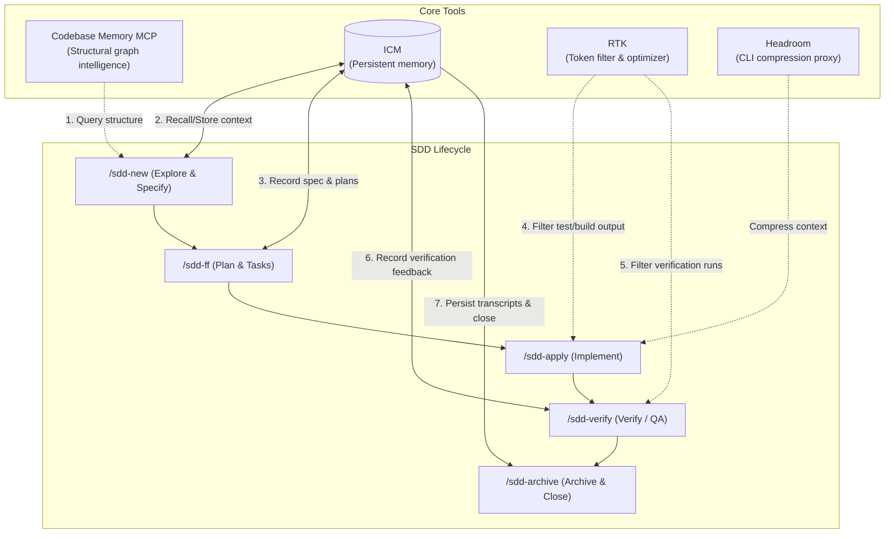

# AOI — Agentic Operational Infrastructure

Installs a complete agentic ecosystem into any project: **RTK** (token optimization) + **ICM** (persistent memory) + **Spec-Kit** (SDD lifecycle) + **11 specialized agents** synced across Copilot and Antigravity.

## Quick Start

### macOS / Linux

```bash
bash "/path/to/AOI/setup.sh" /path/to/my-project
```

### Windows 11+ (PowerShell)

```powershell
powershell -NoProfile -ExecutionPolicy Bypass -File "C:\path\to\AOI\setup.ps1" "C:\path\to\my-project"
```

### Windows 11+ (Git Bash)

```bash
bash "/c/repos/AOI/AOI/setup.sh" "/c/repos/bsc-portal-comercial-pj"
```

Then in VS Code Copilot Chat:

```text
/init # Configure project stack, agents, constitution
/sdd-new # Start first feature

```

## Onboarding

Use AOI in one of two modes:

1. **Install AOI into another project**
   Run `setup.sh` or `setup.ps1` and point it at the target repository you want to bootstrap with the AOI stack.
2. **Work on AOI itself**
   Open this repository, install the workspace dependencies, and use the internal dashboard plus the SDD prompts to evolve the template.

Minimum prerequisites before the first run:

- Node `>=20.19.0`
- `corepack` or `pnpm >=11.3.0`
- `icm`
- GitHub Copilot in VS Code

Recommended first session inside this repository:

1. Open the repository in VS Code.
2. Run `pnpm install` or `corepack pnpm install`.
3. Start the dashboard with `pnpm dev:dashboard`.
4. Open Copilot Chat and run `/speckit.constitution` if you are shaping a new downstream installation.
5. Start the first workflow with `/sdd-new`.

The published AOI repository starts clean: task registries are empty, no sandboxes are active, and versioned memory has no active workspace registered yet.

Release and validation artifacts:

- [docs/internal/releases/v0.1.0.md](docs/internal/releases/v0.1.0.md) — first public template baseline notes.
- [docs/internal/verification/external-smoke-plan.md](docs/internal/verification/external-smoke-plan.md) — external validation checklist for AOI as repo and bootstrapper.

Documentation boundary:

- `docs/internal/` contains AOI-maintainer documentation for the bootstrapper itself.
- `scaffold/docs/` is reserved for documentation that should be installed into downstream projects.

## What Gets Installed

### Tools (in priority order)

| Tool                    | Purpose                                   | macOS / Linux                                   | Windows 11+                                                   |
| ----------------------- | ----------------------------------------- | ----------------------------------------------- | ------------------------------------------------------------- |
| **RTK**                 | Token optimization (60-90% savings)       | `brew install rtk`                              | GitHub release binary via `setup.ps1`                         |
| **ICM**                 | Persistent memory (4 methods)             | `brew tap rtk-ai/tap && brew install icm`       | Official `install.ps1` via `setup.ps1`                        |
| **Headroom**            | CLI compression layer (60-95%)            | `bash scripts/install-headroom.sh --yes`        | `powershell scripts/install-headroom.ps1 -Yes`                |
| **Codebase Memory MCP** | Structural code intelligence / code graph | `bash scripts/install-codebase-memory.sh --ui --yes` | `powershell scripts/install-codebase-memory.ps1 -Yes -Variant ui`         |
| **Specify CLI**         | Spec-Driven Development lifecycle         | `uv tool install specify-cli`                   | `winget install --id astral-sh.uv -e` + `uv tool install ...` |

On Windows, AOI uses `winget` for `uv` when available. RTK does not currently document an official `winget` package, so `setup.ps1` installs the Windows release binary directly.

`ICM` is mandatory: setup fails if it cannot verify a working `icm` command. `RTK` and `Headroom` are recommended but non-blocking: if their install fails, AOI continues.

`Headroom` compresses context for CLI-based agents (Claude Code, Codex, `gh copilot`). It does **not** intercept VS Code Copilot Chat traffic — that extension calls GitHub's API directly. Token savings for VS Code Chat come from **RTK** (terminal output filtering) and **Codebase Memory MCP** (120× fewer tokens in code exploration).

`Codebase Memory MCP` is optional. AOI installs it in safe mode with upstream `--skip-config`, so the binary lands on the machine but AGENTS/GEMINI files under the operator home stay untouched. When the binary is present, AOI registers it only in the project-local `.vscode/mcp.json`.

Setup offers two variants during Phase 1.8:

- **`standard`** — binary only, no graph visualization UI.
- **`ui`** (recommended) — includes the embedded 3D graph visualization at `http://localhost:9749`, available whenever VS Code has the MCP server connected.

A `post-commit` hook is also installed as an explicit backup re-indexer alongside the native watcher.

The dashboard runtime is mandatory too. Setup no longer skips dashboard bootstrap: it now fails unless Node `>=20.19.0` and either `corepack` or `pnpm@11.3.0` are available before dependency installation.

### Scaffold (copied to your project)

```

.vscode/
├── settings.json # Workspace terminal setup for tool resolution
└── mcp.json # Workspace-local MCP registration (ICM required, codebase-memory-mcp optional)

.githooks/
└── pre-commit-aoi-guard.sh  # Blocks headroom learn from overwriting AOI-managed files

.resources/
├── constitution.md # Local contract for the resources subtree
├── userstories/ # Reusable user-story context
└── workflows/ # Component interaction definitions (non-executable)

.github/
├── agents/ # 11 Copilot agent definitions
│ ├── supervisor.agent.md # SDD orchestrator (Hub-and-Spoke)
│ ├── functional-analyst.agent.md
│ ├── solution-architect.agent.md
│ ├── frontend-developer.agent.md
│ ├── backend-developer.agent.md
│ ├── devops-engineer.agent.md
│ ├── ux-designer.agent.md
│ ├── documentation-analyst.agent.md
│ ├── integration-specialist.agent.md
│ ├── project-analyzer.agent.md
│ └── project-expert.agent.md
├── prompts/ # SDD workflow commands
│ ├── init.prompt.md # /init — project setup wizard
│ ├── sdd-new.prompt.md # /sdd-new — explore + specify
│ ├── sdd-ff.prompt.md # /sdd-ff — plan + tasks
│ ├── sdd-apply.prompt.md # /sdd-apply — implementation
│ ├── sdd-verify.prompt.md # /sdd-verify — QA
│ ├── sdd-archive.prompt.md # /sdd-archive — close
│ ├── export-memory-bundle.prompt.md # /export-memory-bundle — portable governed memory export
│ ├── import-memory-bundle.prompt.md # /import-memory-bundle — bundle-to-candidate memory import
│ ├── sync-workspace-memory.prompt.md # /sync-workspace-memory — governed memory import
│ └── rollback-workspace-memory.prompt.md # /rollback-workspace-memory — restore previous memory version
└── instructions/ # Always-loaded rules
├── icm-protocol.instructions.md # ICM 4-method compliance
├── dual-sync.instructions.md # Copilot ↔ Antigravity sync
└── model-selection.instructions.md# Mandatory Model Selection Policy

GEMINI.md # Antigravity root instructions
.agent/skills/
├── \_shared/icm-protocol.md # Shared ICM convention
├── \_shared/model-selection.md # Mandatory Model Selection Policy
└── agents/ # 11 Antigravity agent mirrors

```

## Core Tooling Architecture: Integration, Roles, and Lifecycle

AOI orchestrates a complex developer-agent ecosystem. Rather than running in isolation, each tool (RTK, ICM, Headroom, Codebase Memory MCP) has a specific role, direct integration points with the workspace, and acts during distinct stages of the Spec-Driven Development (SDD) lifecycle.



### 1. RTK (Token Output Optimizer)
* **Core Role:** Optimizes the token window of LLM agents by filtering, compressing, and pruning verbose terminal outputs (such as build logs, long test progress bars, npm/pip install noise, and linters). It typically achieves **60% to 90% token savings** on long executions.
* **Technical Integration:**
  - Placed directly in the workspace terminal shell path (via `setup.sh` / `setup.ps1`).
  - Integrated via command prefixes in the system instructions (`GEMINI.md` and `.github/instructions/`).
  - **Mandatory Usage rule:** Every tool-driven command executed by the AI must be prefixed with `rtk` (e.g., `rtk npm run test`, `rtk git status`).
* **Lifecycle Role:**
  - **Implement (`/sdd-apply`) & Verify (`/sdd-verify`):** Extremely active here. When developers or agents run builds, compiler checks, or test suites, RTK compresses the output before it returns to the agent's context, preventing context-window bloat and lowering token costs.

### 2. ICM (Intelligent Context Manager - Persistent Memory)
* **Core Role:** Solves "agent amnesia" by persisting semantic memories, memoirs (knowledge graphs), corrections (feedback), and raw session transcripts across separate conversation turns and between different agents.
* **Technical Integration:**
  - Invoked through the `icm` CLI wrapper.
  - Automatically recalled on startup via `icm recall-context` and stored via `icm store` hook commands.
  - Topics and memoirs are scoped using the `{WORKSPACE}` name as a prefix to avoid cross-project pollution.
* **Lifecycle Role:**
  - **Explore (`/sdd-new`):** Calls `icm recall` to retrieve previous learnings or user preferences. Initiates transcripts for verbatim replay.
  - **Specify / Plan (`/sdd-ff`):** Stores structural design decisions (`decisions-{project}`) and system constraints.
  - **Verify (`/sdd-verify`):** Collects user feedback or corrections and stores them under the `errors-resolved` or `preferences` topics so the agent learns from mistakes.
  - **Archive (`/sdd-archive`):** Triggers a final transcript backup and saves a high-level summary of the completed feature context.

### 3. Headroom (CLI Compression Proxy)
* **Core Role:** Acts as an OpenAI-compatible local API proxy that compresses prompt inputs and outputs specifically for CLI-based agents (like Claude Code, Codex, or GitHub Copilot CLI), achieving up to 95% token savings.
* **Technical Integration:**
  - Runs as a background proxy on `localhost:8787` (configured during installation).
  - Terminal agents have their `OPENAI_BASE_URL` or equivalent environment variable routed through this local proxy.
  - Integrates the `.githooks/pre-commit-aoi-guard.sh` hook to prevent `headroom learn --apply` from silently overwriting core configuration files like `GEMINI.md` or `AGENTS.md`.
* **Lifecycle Role:**
  - **Transversal:** Runs silently in the background of any terminal execution or manual CLI interaction, independent of VS Code Copilot Chat.

### 4. Codebase Memory MCP (Code Graph Intelligence)
* **Core Role:** Builds a structural, queryable graph representation of the codebase. Instead of relying on full-text search (`grep`), it allows agents to navigate semantic relationships (e.g., finding where a class is instantiated, tracing function calls, or extracting specific code symbols).
* **Technical Integration:**
  - Registered locally in the project workspace's `.vscode/mcp.json`.
  - Exposes custom MCP tools (`search_graph`, `trace_path`, `get_code_snippet`, `query_graph`, `get_architecture`).
  - Maintains index state using a `post-commit` Git hook to automatically re-index on git commits.
* **Lifecycle Role:**
  - **Explore (`/sdd-new`) & Plan (`/sdd-ff`):** Used during the initial assessment of a codebase or feature request to map files, trace data flows, and determine dependencies before generating the specification (`spec.md`) and implementation plan (`implementation_plan.md`).

## Code Discovery Protocol

When `codebase-memory-mcp` is registered in `.vscode/mcp.json`, agents automatically prefer its graph tools over broad grep or file-by-file reads:

| Priority | Tool | Use case |
|---|---|---|
| 1 | `search_graph` | Find functions, classes, routes by pattern |
| 2 | `trace_path` | Follow call chains inbound/outbound |
| 3 | `get_code_snippet` | Read exact source of an already-found symbol |
| 4 | `query_graph` | Complex Cypher-like structural queries |
| 5 | `get_architecture` | Codebase overview: languages, hotspots, clusters |
| 6 | `grep` / `read` | Literals, config files, non-code files, or fallback |

If the project is not indexed yet, call `index_repository` first. If the MCP server is absent, the normal local search flow applies.

## SDD Lifecycle

Built on [spec-kit](https://github.com/github/spec-kit). Our prompts orchestrate spec-kit commands with agent assignment and ICM persistence.

```

/sdd-new → Explore + Specify → @functional-analyst
↓
/sdd-ff → Plan + Tasks → @solution-architect
↓
/sdd-apply → Implement (batches) → @frontend/@backend/@devops
↓
/sdd-verify → QA + Validation → @integration-specialist
↓
/sdd-archive → Documentation + Close → @documentation-analyst

```

Each phase has an **Owner approval gate** before advancing.

## Optional Resources Subsystem

AOI now installs a governed `.resources/` subtree for reusable context:

```text
.resources/
├── constitution.md
├── userstories/
└── workflows/
```

- `userstories/` stores reusable task-construction context.
- `workflows/` stores component interaction definitions across one or many user
  stories. These files are **not executable commands**.
- SDD workflows do **not** auto-read `.resources/`. A resource is used only if
  the Owner explicitly links it during task construction.

Resource structure is governed by:

- root authority: `.specify/memory/constitution.md`
- local subtree contract: `.resources/constitution.md`

Administrative commands:

- `/new-resource-folder` — create a governed folder inside `.resources/`
- `/move-resource-folder` — move a governed folder inside `.resources/`
- `/delete-resource-folder` — delete a governed folder inside `.resources/`

## Internal Dashboard Runtime

AOI now provisions an internal self-contained Nuxt runtime package for
real-time project operations visibility.

Runtime surfaces:

```text
aoi_apps/agentic-ops-dashboard/
aoi_apps/agentic-ops-dashboard/package.json
scaffold/aoi_apps/agentic-ops-dashboard/
scaffold/aoi_apps/agentic-ops-dashboard/package.json
```

- The dashboard reads `.tasks/registry.md`, task artifact directories, and the
  optional `.resources/` subtree as its authoritative workspace snapshot.
- Explicit task-to-resource links are stored beside task artifacts in
  `.tasks/{feature}/TASK-YYYY-NNN/relations.json`.
- Server-side writes are limited to governed `.resources/` mutations only.
- The dashboard shell supports an explicit English/Spanish toggle and stores the
  chosen locale locally so the same language returns on reload.
- Translation is presentation-only: task identifiers, registry values, and raw
  artifact preview payloads stay source-authored instead of being rewritten by
  the UI.
- Realtime task changes preserve context inside the board: changed cards are
  highlighted and status moves animate between workflow columns instead of
  feeling like a full-surface refresh.

Runtime commands:

- `pnpm --dir aoi_apps/agentic-ops-dashboard dev` — run the internal dashboard locally
- `pnpm --dir aoi_apps/agentic-ops-dashboard test` — run the dashboard validation suite
- `pnpm --dir aoi_apps/agentic-ops-dashboard exec nuxt prepare` — generate Nuxt types for the dashboard runtime
- `pnpm --dir aoi_apps/agentic-ops-dashboard build` — build the dashboard for production smoke checks

## Versioned Memory Governance

AOI now provisions a governed version store for operational memory state:

```text
.exportsmemories/
└── *.memory-bundle.json.gz

.specify/memory/versions/
├── README.md
├── active.json
├── manifests/
│   └── {workspace}/
├── constitutions/
│   └── {workspace}/
└── templates/
		├── memory-version.template.json
		├── memory-bundle.template.json
		└── dynamic-constitution.template.md
```

- `.exportsmemories/` is the governed repository-local base directory for
  exported portable memory bundles.
- `active.json` is the canonical pointer to the active and immediately
  restorable memory version per workspace.
- Each manifest records `sourceWorkspace`, `sourceVersionId`, selected scopes,
  Owner context, and `retain` / `complement` / `discard` decisions.
- Bundle-sourced manifests also preserve `sourceTransport`, bundle provenance,
  included and omitted scopes, and integrity metadata.
- Each candidate or active version carries its own dynamic constitutional
  snapshot for auditability and rollback safety.

Governed workflows:

- `/export-memory-bundle` — exports an explicit memory version into a governed
  portable bundle inside `.exportsmemories/`.
- `/import-memory-bundle` — validates a portable bundle and prepares a governed
  candidate version before any activation.
- `/sync-workspace-memory` — prepares a candidate version from an explicit
  source workspace and source version, then activates it only after Owner
  approval.
- `/rollback-workspace-memory` — restores the registered previous version with
  an explicit rollback reason.

Deterministic script surface:

- `scripts/memory-sync/resolve-active-version.mjs`
- `scripts/memory-sync/prepare-version-manifest.mjs`
- `scripts/memory-sync/export-memory-bundle.mjs`
- `scripts/memory-sync/import-memory-bundle.mjs`
- `scripts/memory-sync/activate-version.mjs`
- `scripts/memory-sync/rollback-version.mjs`
- `pnpm test:memory-sync` — validate the version lifecycle with Node tests
- `pnpm test:memory-sync:bundle` — validate the portable bundle contract,
  export/import flow, and lifecycle preservation

## ICM — 4 Memory Methods

All agents use [ICM](https://github.com/rtk-ai/icm) with four complementary methods:

| Method                        | What                             | When                                       |
| ----------------------------- | -------------------------------- | ------------------------------------------ |
| **Memories** (episodic)       | Store/recall with temporal decay | Every phase — decisions, progress, context |
| **Memoirs** (knowledge graph) | Permanent concepts + relations   | Architecture decisions, component graphs   |
| **Feedback** (corrections)    | Learn from mistakes              | Verify phase, post-implementation          |
| **Transcripts** (verbatim)    | Capture raw session replay       | Explore and Archive phases                 |

No context is lost between sessions.

## Dual-Sync Rule

**MANDATORY**: Every agent/skill must exist in both Copilot AND Antigravity formats.

| Copilot                          | Antigravity                      |
| -------------------------------- | -------------------------------- |
| `.github/agents/{name}.agent.md` | `.agent/skills/agents/{name}.md` |

The `dual-sync.instructions.md` enforces this rule automatically. If agents diverge, `/sdd-verify` fails.

## Windows Notes

- Native Windows 11+ installation is supported through `setup.ps1`.
- If you launch setup from Git Bash, run `setup.sh` with Git Bash paths such as `/c/repos/AOI/AOI/setup.sh`; the script delegates to `setup.ps1` automatically.
- The installer injects `terminal.integrated.env.windows.Path` into the target workspace so `rtk`, `icm`, and `specify` resolve from VS Code terminals.
- AOI also rewrites local Copilot hook commands to PowerShell wrappers on Windows.
- RTK upstream still recommends WSL for the broadest shell-hook compatibility across tools, but this template now provides a native PowerShell path for GitHub Copilot projects.

## Teardown

```bash
# macOS / Linux
bash "/path/to/AOI/teardown.sh" /path/to/my-project
```

```powershell
# Windows 11+
powershell -NoProfile -ExecutionPolicy Bypass -File "C:\path\to\AOI\teardown.ps1" "C:\path\to\my-project"
```

## Agents

| Agent                       | SDD Phase                      | File (Copilot)                    |
| --------------------------- | ------------------------------ | --------------------------------- |
| **@supervisor**             | All (orchestrator)             | `supervisor.agent.md`             |
| **@functional-analyst**     | Explore, Specify               | `functional-analyst.agent.md`     |
| **@solution-architect**     | Plan, Tasks                    | `solution-architect.agent.md`     |
| **@frontend-developer**     | Implement                      | `frontend-developer.agent.md`     |
| **@backend-developer**      | Implement                      | `backend-developer.agent.md`      |
| **@devops-engineer**        | Implement                      | `devops-engineer.agent.md`        |
| **@ux-designer**            | Implement                      | `ux-designer.agent.md`            |
| **@documentation-analyst**  | Archive                        | `documentation-analyst.agent.md`  |
| **@integration-specialist** | Verify                         | `integration-specialist.agent.md` |
| **@triage-specialist**      | Bug & Definition — transversal | `triage-specialist.agent.md`      |
| **@resource-analyst**       | Resources — transversal        | `resource-analyst.agent.md`       |

---

**AOI v3.0** — Agentic Operational Infrastructure powered by RTK, ICM, Spec-Kit, and Hub-and-Spoke Agents
