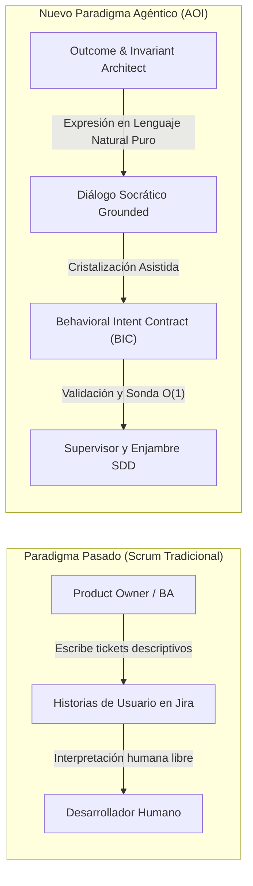
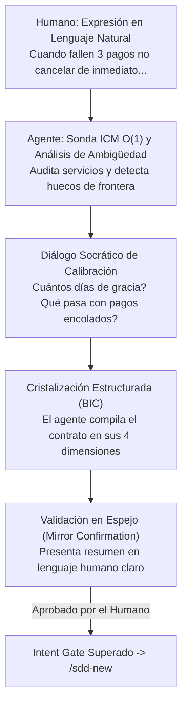
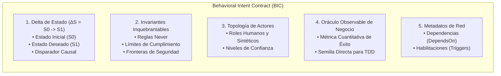
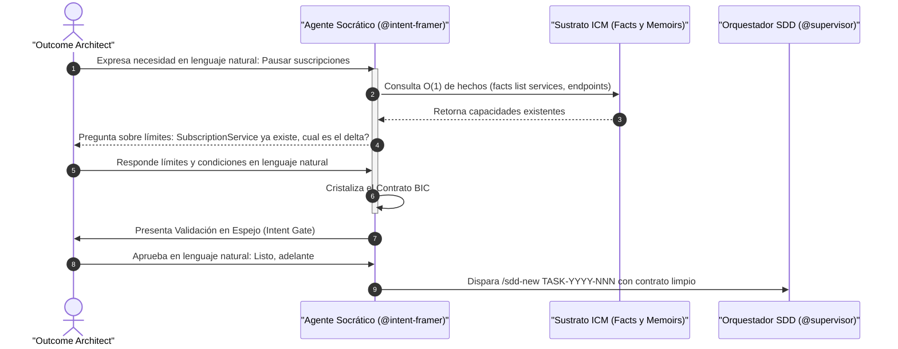
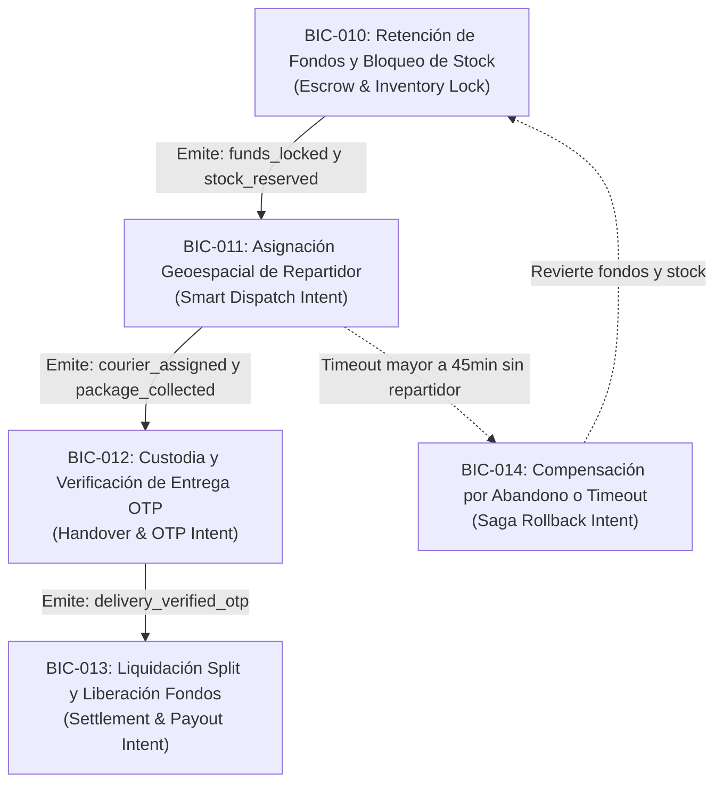
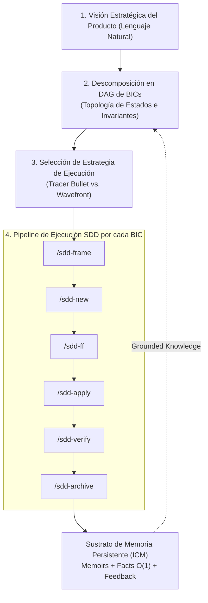
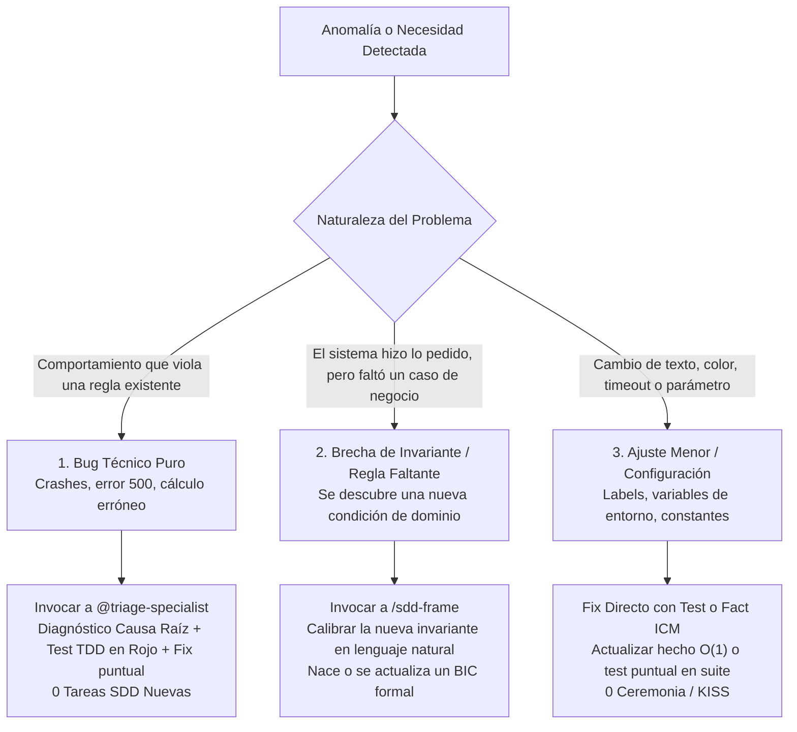

# El Paradigma de la Intención: De la Historia de Usuario al Contrato Conductual en la Era Agéntica

> **Tratado Metodológico y Operativo para AOI (Agentic Operational Infrastructure)**  
> *Cómo tender el puente definitivo entre la visión funcional humana en lenguaje natural y la ejecución autónoma de software con rigor matemático, sin ambigüedades y con cero desperdicio de tokens.*

---

## Prólogo: La Crisis de la "Historia de Usuario"

Durante más de dos décadas, el desarrollo de software ágil descansó sobre un pilar fundamental: **la Historia de Usuario (User Story)**. Concebida a principios de los años 2000 dentro del movimiento *Extreme Programming* y popularizada por Scrum, la fórmula canónica parecía infalible:

$$\text{"Como } [Rol], \text{ quiero } [Acción], \text{ para } [Beneficio]\text{"}$$

Este artefacto fue diseñado deliberadamente como una promesa de conversación informal entre **humanos**: un recordatorio en un post-it para que un desarrollador y un analista funcional dialogaran frente a una pizarra, estimaran puntos de esfuerzo en una serie de Fibonacci y batcharan trabajo en sprints de dos semanas.

Sin embargo, **el software ha experimentado un salto de fase**. En ecosistemas agénticos modernos como **AOI (Agentic Operational Infrastructure)**, los agentes de inteligencia artificial no operan mediante conjeturas informales de pasillo. Razonan sobre grafos de arquitectura en memoria persistente (ICM), generan especificaciones formales mediante Spec-Kit, ejecutan ciclos de desarrollo guiados por pruebas (TDD) y aíslan mutaciones en *fibers* transaccionales reversibles.

Someter a un enjambre de agentes autónomos a una historia de usuario tradicional genera una triple patología:
1. **Prescripción Prematura de Soluciones:** El analista suele pedir *"un botón rojo y una tabla intermedia"* para resolver lo que en realidad es un problema de sincronización de datos o reglas de negocio no declaradas.
2. **Desconexión con el Estado Real del Sistema:** La historia de usuario se escribe en un vacío (un ticket de Jira) ignorando qué servicios, endpoints o hechos de configuración ya existen en el código fuente.
3. **Ambigüedad en los Límites Críticos:** El formato tradicional describe el camino feliz (*happy path*) y algunos criterios de aceptación cosméticos, pero calla respecto a los **invariantes**: aquello que el sistema *nunca* debe permitir bajo ninguna circunstancia.

Para que la infraestructura agéntica opere a su máxima potencia, necesitamos reemplazar la historia de usuario por un nuevo estándar previo a la fase de exploración técnica: el **Behavioral Intent Contract (BIC)**.

---

## 1. El Nuevo Rol: El Arquitecto de Resultados e Invariantes (*Outcome & Invariant Architect*)

En el paradigma de desarrollo agéntico, la persona funcional (Product Manager, Business Analyst, Líder de Operaciones, Consultor de Dominio) **deja de ser un redactor de tareas técnicas**. No necesita saber cómo diseñar esquemas de bases de datos, ni tiene que escribir pseudocódigo o adivinar contratos de API.

Su rol evoluciona y se eleva a una disciplina de mayor valor estratégico: **El Custodio de la Intención, los Estados y las Políticas de Negocio**.



### ¿Qué hace y qué NO hace este nuevo rol?

| Dimensión | Lo que el rol funcional NO hace | Lo que el rol funcional SÍ hace |
| :--- | :--- | :--- |
| **Enfoque** | Diseñar pantallas, botones o especificar tablas relacionales. | Definir **Estados Deseados** del sistema y transiciones válidas. |
| **Límites** | Asumir que el programador "usará el sentido común". | Blindar el dominio mediante **Invariantes Inquebrantables**. |
| **Validación** | Escribir listas informales de verificación cosmética. | Declarar el **Oráculo Observable de Negocio** (criterios medibles). |
| **Relación con el Sistema** | Trabajar aislado en una herramienta de gestión de proyectos. | Participar en un **diálogo socrático en lenguaje natural** con los agentes de AOI. |

---

## 2. La Experiencia Humana: De la Expresión en Lenguaje Natural a la Cristalización Agéntica

Un principio no negociable de este paradigma es que **la persona humana NO debe aprender una sintaxis rígida, ni escribir markdown complejo, ni formular ecuaciones matemáticas**.

La persona funcional se expresa en su medio nativo: **lenguaje natural fluido, cotidiano y espontáneo** (mediante audio, mensajes de chat, notas de voz o texto libre).

La responsabilidad de transformar ese lenguaje natural en un contrato matemáticamente riguroso recae en el **Agente Socrático de Intención (`@intent-framer`)** dentro de la fase `/sdd-frame`.



### El Ciclo de Interacción en 4 Pasos

#### Paso 1: Entrada en Lenguaje Natural Libre (Voice or Text Ingestion)
El humano simplemente cuenta el problema o la necesidad tal como la vive el negocio:
> *"Quiero que cuando un cliente acumule tres cobros rechazados, no le cortemos el servicio de inmediato porque muchos se van enojados. Mejor démosle unos días de gracia, pero eso sí, que mientras esté debiendo no pueda solicitar créditos nuevos ni cambiar de plan."*

#### Paso 2: Escucha Activa y Sonda ICM en $O(1)$
El agente no se limita a "procesar el texto". Consulta en tiempo real la memoria persistente del repositorio para aterrizar la solicitud en la realidad del software:
```bash
icm facts list "{WORKSPACE}.service"
icm facts list "{WORKSPACE}.endpoint"
icm recall-context "política de pagos suscripciones" --limit 3
```
Con esta información, el agente no hace preguntas redundantes, sino que formula **preguntas socráticas de límites e invariantes** en lenguaje natural simple:
> 1. *"Entendido. Ya tenemos un servicio de pagos recurrentes (`SubscriptionService`). Para proteger la operación: ¿cuántos días exactos de gracia damos antes de suspender definitivamente? ¿3 días o 5 días?"*  
> 2. *"¿Qué ocurre si el usuario tiene transferencias o cobros automáticos ya programados para mañana? ¿Se intentan cobrar o se congelan?"*  
> 3. *"¿Quién es el único rol que podría extender el plazo de gracia manualmente si el cliente llama a soporte?"*

#### Paso 3: Cristalización Asistida del Contrato (Agentic Crystallization)
Con las respuestas del humano (que siguen siendo frases simples como: *"3 días calendario, los cobros programados se pausan y solo soporte nivel 2 puede extenderlo"*), el agente asume el trabajo pesado y **sintetiza el Behavioral Intent Contract (BIC)** formal con sus 4 dimensiones estructuradas.

#### Paso 4: Validación en Espejo (Mirror Confirmation)
Antes de tocar cualquier archivo del proyecto, el agente le presenta al humano una **traducción en espejo** de lo que ha entendido, asegurando que el modelo mental del humano coincida al 100% con el contrato agéntico:
> *"He compilado tu intención en el contrato `BIC-042`. En resumen:*  
> * * **Comportamiento:** La cuenta pasará a estado de gracia por 72 horas ante 3 fallos consecutivos.*  
> * * **Regla Inquebrantable:** El sistema NUNCA permitirá que una cuenta en gracia solicite créditos ni cambie de plan.*  
> * * **Prueba de Éxito:** Simularemos 3 rechazos y verificaremos que el acceso se mantenga, pero un intento de pedir crédito sea rechazado de inmediato.*  
> *¿Representa esto con exactitud lo que necesitas?"*

Cuando el humano responde *"Sí, adelante"*, la compuerta **Intent Gate** se abre y el proceso viaja a `/sdd-new` con una precisión quirúrgica.

---

## 3. El Núcleo del Paradigma: El *Behavioral Intent Contract* (BIC)

El **Behavioral Intent Contract (BIC)** es el artefacto que resulta de esta cristalización. No es una lista de deseos; es un contrato declarativo compuesto por sus dimensiones esenciales:



### Dimensión 1: El Delta de Estado ($\Delta S = S_0 \to S_1$)
Define la **transformación del universo del sistema**:
* **Estado Actual ($S_0$):** Descripción conductual del comportamiento presente del sistema ante un evento o condición.
* **Estado Deseado ($S_1$):** Cómo debe responder el sistema tras la intervención, qué entidades cambian de estado y qué ciclo de vida adquieren.
* **Disparador Causal:** Qué suceso del mundo real provoca la transición (un webhook bancario, una acción de usuario, un timeout del reloj).

### Dimensión 2: Invariantes Inquebrantables de Negocio (*The "Never" Rules*)
Es el núcleo de seguridad conceptual. Los agentes de IA son extraordinariamente creativos proponiendo soluciones de código, pero requieren fronteras infranqueables. Las invariantes declaran aquello que **BAJO NINGUNA CIRCUNSTANCIA** debe ocurrir:
* *"Ningún descuento acumulado puede superar el 40% del margen bruto de la orden."*
* *"El balance contable general jamás puede cerrar el día con débitos $\neq$ créditos."*
* *"Ninguna cuenta en mora puede originar nuevas solicitudes de crédito."*

### Dimensión 3: Topología de Actores y Niveles de Confianza
Establece quiénes intervienen en la transición y su legitimidad:
* Actores humanos (usuarios finales, auditores, soporte nivel 2).
* Actores sintéticos (pasarelas de pago, motores antifraude, cron schedulers).
* Fronteras de confianza: ¿La entrada es confiable o no sanitizada? ¿Requiere firma criptográfica o doble factor?

### Dimensión 4: El Oráculo Observable de Negocio (*Business Oracle*)
¿Cómo valida el negocio que la intención se cumplió de forma inequívoca, sin necesidad de abrir un archivo de código ni leer un log técnico?
* **Evidencia Medible:** Un experimento reproducible en términos del dominio.
* **Traducción directa a TDD:** Este oráculo es el insumo que el ciclo SDD posterior utilizará para generar los tests de aceptación en la compuerta **TDD Gate**.

---

## 4. La Fase Pre-SDD en AOI: `Intent Framing` (`/sdd-frame`)

Dentro de la arquitectura de ciclo de vida de AOI, esta fase se posiciona como la **Fase -1**, anterior e independiente de `/sdd-new`.



### El Principio de "Zero-Task Footprint"
Uno de los mayores defectos de los flujos de trabajo basados en agentes es la polución prematura del sistema. En AOI, la fase Pre-SDD opera bajo un principio estricto:

> [!IMPORTANT]
> **Zero-Task Footprint:** Ningún identificador de tarea (`TASK-YYYY-NNN`) se genera, ningún directorio en `.tasks/` se crea y ninguna entrada en [`.tasks/registry.md`](file:///Users/equinox/Desktop/Proyectos/AOI/.tasks/registry.md) se escribe hasta que la intención haya superado la compuerta **Intent Gate**.

### ¿En qué se diferencian `/sdd-frame` y `/sdd-new`? ¿Cuándo usar cada una?

Aunque forman una secuencia natural dentro de la metodología, `/sdd-frame` y `/sdd-new` son dos comandos totalmente desacoplados. **No es obligatorio ejecutar `/sdd-frame` para cada tarea; puedes entrar directamente a `/sdd-new` si el contexto lo amerita.**

| Criterio | `/sdd-frame` (Pre-Flight) | `/sdd-new` (Explore & Propose) |
| :--- | :--- | :--- |
| **Espacio de Trabajo** | **Espacio del Problema** *(Problem Space)* | **Espacio de la Solución** *(Solution Space)* |
| **Huella en Disco** | **Zero-Task Footprint:** No genera IDs de tarea, no crea carpetas en `.tasks/`, no altera el registry. | **Materializada:** Genera `TASK-YYYY-NNN`, crea el directorio físico y registra en [`.tasks/registry.md`](file:///Users/equinox/Desktop/Proyectos/AOI/.tasks/registry.md). |
| **Entrada Típica** | Lenguaje natural libre, conversacional o informal (audio, notas, ideas abiertas). | Requerimiento maduro, concreto o contrato BIC ya calibrado. |
| **Salida Formal** | **Behavioral Intent Contract (BIC)** (o canvas efímero de intención). | [**`proposal.md`**](file:///Users/equinox/Desktop/Proyectos/AOI/.github/prompts/sdd-new.prompt.md) con arquitectura, principios y criterios de aceptación. |
| **Compuerta** | **Intent Gate:** Aprobación humana del modelo mental y de las reglas "NUNCA". | **Proposal Gate:** Aprobación humana de la propuesta técnica para habilitar `/sdd-ff`. |

#### Guía de Decisión: ¿Con cuál comando iniciar?

* **Utiliza `/sdd-frame` primero cuando:**
  * La solicitud nace de una conversación de negocio, dolor operativo o idea funcional aún no aterrizada.
  * Deseas auditar en $O(1)$ contra los *facts* de ICM si la capacidad ya existe antes de consumir un ID de tarea.
  * Necesitas un diálogo socrático para blindar las invariantes ("Never Rules") y definir el oráculo de éxito sin entrar a debatir código.
* **Entra directamente a `/sdd-new` cuando:**
  * La necesidad ya está 100% madura, clara y acotada en tu mente.
  * Se trata de una mejora técnica directa, una refactorización conocida o un cambio con límites inequívocos.
  * Deseas que el Supervisor asigne de inmediato el número `TASK-YYYY-NNN`, audite el Service Discovery Gate y elabore la propuesta técnica formal (`proposal.md`) sin pasos previos.

---

## 5. Galería Gradual de Ejemplos: De lo Atómico a la Red Multi-Actor

Para comprender la elasticidad del concepto, exploraremos tres niveles de complejidad: desde una regla atómica puntual, pasando por una transacción asíncrona, hasta un ecosistema complejo de múltiples actores con BICs interdependientes en red.

---

### Ejemplo 1: Nivel Atómico (Simple)
*Ámbito:* Un solo actor, un único servicio, sin dependencias externas.

```markdown
# BIC-001: Rate Limiting Adaptativo en Reseteo de Credenciales

## 1. Delta de Estado (ΔS)
- S₀ (Actual): La solicitud de reseteo envía un email cada vez que se presiona el botón, permitiendo spam masivo si el usuario o un bot reitera peticiones.
- S₁ (Deseado): La solicitud entra en una ventana de enfriamiento exponencial tras el 3er intento por IP/Email, bloqueando la emisión de correos y notificando al cliente sobre el tiempo de espera restante sin revelar si la cuenta existe.
- Disparador: Petición HTTP POST a recuperación de contraseña.

## 2. Invariantes Inquebrantables (Never Rules)
- NUNCA revelar al solicitante si el email existe o no en la base de datos (prevención de user enumeration).
- NUNCA bloquear la cuenta principal para inicio de sesión regular mientras esté activo el rate-limit de recuperación.
- El factor de multiplicación de enfriamiento jamás superará los 60 minutos como límite máximo.

## 3. Topología de Actores
- Actor: Usuario anónimo / Solicitante web (Nivel de confianza: CERO / No autenticado).

## 4. Oráculo Observable de Negocio
- Al disparar 5 solicitudes consecutivas en menos de 10 segundos para el mismo correo:
  a) Solo los primeros 3 generan despacho de email.
  b) El 4to y 5to intento devuelven HTTP 429 con cabecera `Retry-After: 300` y payload de respuesta idéntico al exitoso.
```

---

### Ejemplo 2: Nivel Intermedio (Transaccional con Terceros)
*Ámbito:* Dos actores, integración externa asíncrona, estados transitorios y degradación tolerante.

```markdown
# BIC-042: Ciclo de Gracia en Cobro Recurrente Fallido (SaaS)

## 1. Delta de Estado (ΔS)
- S₀ (Actual): Si la pasarela de pagos rechaza el cobro recurrente mensual, el plan del cliente se degrada inmediatamente a gratuito (`FREE`), cancelando accesos operativos en mitad de la jornada.
- S₁ (Deseado): Ante un rechazo por fondos insuficientes, la suscripción pasa a estado `PAST_DUE_GRACE` por 72 horas con reintentos programados a las 24h y 48h. El acceso del usuario se mantiene intacto con un banner informativo no intrusivo.
- Disparador: Webhook entrante de Stripe con evento `invoice.payment_failed`.

## 2. Invariantes Inquebrantables (Never Rules)
- NUNCA degradar o revocar accesos si el fallo reportado por la pasarela es de tipo `processor_network_error` o caída del proveedor.
- NUNCA reintentar un cobro si la causa del rechazo fue `fraudulent` o `stolen_card`.
- El tiempo acumulado en `PAST_DUE_GRACE` jamás superará las 72 horas reloj bajo ningún parámetro de configuración.

## 3. Topología de Actores
- Actor Primario: Webhook de Pasarela de Pagos (Sintético, firma HMAC verificada).
- Actor Secundario: Cliente Administrador de la Organización (Humano, autenticado).

## 4. Oráculo Observable de Negocio
- Al simular un webhook `payment_failed` con motivo `insufficient_funds`:
  a) La organización permanece con sus cuotas y funcionalidades enterprise activas.
  b) Se programa exactamente una tarea de reintento en el scheduler para dentro de 24 horas.
  c) Si se inyecta un pago exitoso a las 20 horas, el estado transiciona de inmediato a `ACTIVE` y se cancela el reintento de las 48h.
```

---

### Ejemplo 3: Nivel Complejo (Red Multi-Actor con Grafo de BICs)
*Ámbito:* Cuatro actores (Comprador, Comercio, Repartidor, Escrow), transacciones distribuidas, compensaciones de fallos (Saga) y cuatro BICs acoplados por eventos.

En una plataforma de entregas y pagos en custodia (*Escrow Delivery*), un único contrato resultaría monolítico e inmanejable. Se diseña una **Red de BICs interconectados**:



Veamos la especificación de dos de los nodos de este grafo para observar cómo se relacionan entre sí:

```markdown
# BIC-010: Retención de Fondos y Bloqueo de Stock (Escrow Lock)

## Metadatos de Red
- ID: BIC-010
- Triggers Downstream: [BIC-011]
- Compensado Por: [BIC-014]

## 1. Delta de Estado (ΔS)
- S₀: El carrito de compras contiene items confirmados, fondos en tarjeta del cliente sin tocar y stock general libre.
- S₁: Fondos congelados en billetera escrow (`HELD_IN_ESCROW`), stock de los ítems debitado del inventario activo y pasado a `RESERVED_FOR_ORDER`. La orden queda en estado `DISPATCH_READY`.
- Disparador: Comprador presiona "Confirmar Pedido".

## 2. Invariantes Inquebrantables
- NUNCA retener fondos si al menos 1 de los ítems del carrito quedó sin stock en la verificación atómica previa.
- NUNCA transferir los fondos a la cuenta del comercio o del repartidor en este punto; el dinero permanece 100% cautivo bajo la cuenta escrow del sistema.

## 3. Oráculo Observable de Negocio
- Si la pasarela aprueba el cargo: la base de datos de inventario refleja `stock_actual = stock_anterior - items`, el balance escrow incrementa por el monto exacto del pedido y se emite el evento de dominio `order.funds_locked` conteniendo el payload para el despachador.
```

```markdown
# BIC-012: Custodia y Verificación de Entrega Criptográfica / OTP

## Metadatos de Red
- ID: BIC-012
- Depende De: [BIC-011 (Repartidor asignado y en tránsito)]
- Triggers Downstream: [BIC-013 (Liquidación)]

## 1. Delta de Estado (ΔS)
- S₀: El repartidor se encuentra a menos de 50 metros de las coordenadas del comprador portando el paquete en estado `IN_TRANSIT`.
- S₁: El comprador proporciona el código OTP dinámico de 6 dígitos generado en su terminal móvil. Al validarse, la orden transiciona a `DELIVERED_VERIFIED` y el paquete se declara formalmente recibido.
- Disparador: Repartidor ingresa en su app el OTP provisto verbalmente por el comprador.

## 2. Invariantes Inquebrantables
- NUNCA aceptar un OTP si el GPS del repartidor se encuentra a más de 100 metros del punto de entrega pactado (tolerancia geográfica estricta).
- NUNCA permitir más de 3 intentos fallidos de OTP en una misma entrega; tras el 3er intento erróneo, la entrega se bloquea y escala al soporte antifraude.
- NUNCA dar por entregada una orden mediante la sola confirmación del repartidor sin la firma criptográfica o validación del OTP del comprador.

## 3. Oráculo Observable de Negocio
- Al enviar un OTP correcto dentro del radio de 50 metros:
  a) La orden emite inmediatamente `delivery.verified`.
  b) El evento activa de forma automática el inicio del `BIC-013` (Liquidación de Fondos).
  c) La app del comprador recibe confirmación push y el repartidor queda libre en el pool geográfico.
```

---

## 6. Estrategia End-to-End: Cómo Conducir un Proyecto Completo con BICs

Cuando un equipo decide construir un producto o proyecto entero desde cero (o una migración de gran calado), surge la pregunta: *¿Cómo pasamos de la visión general a la ejecución agéntica sin perdernos en un mar de micro-tareas desarticuladas?*

Aquí se detalla la metodología completa en **4 fases estratégicas**:



---

### Fase A: Cartografía de la Intención (Intent Mapping & DAG de BICs)

En lugar de crear un Product Backlog plano de 150 historias de usuario en Jira:

1. **Definir los Hitos de Estado del Negocio:** Se listan en lenguaje natural los macro-estados que el sistema debe atravesar para ser viable (ej. *Identidad ➔ Catálogo ➔ Carrito ➔ Escrow ➔ Despacho ➔ Facturación*).
2. **Construir el Grafo Acíclico Dirigido (DAG):** Cada nodo es un `BIC`. Las aristas son dependencias causales explícitas (`BIC-B` no puede iniciar su exploración si `BIC-A` no ha definido sus contratos de salida).
3. **Identificar las Invariantes Globales del Sistema:** Aquellas reglas constitucionales que rigen para *todos* los BICs del proyecto (ej. cumplimiento de normativas GDPR, límites de latencia <200ms, transaccionalidad ACID en finanzas). Se persisten en `.specify/memory/constitution.md`.

---

### Fase B: Selección de la Estrategia de Ejecución

Existen dos estrategias probadas para conducir el enjambre agéntico a través del DAG:

#### Estrategia 1: *Tracer Bullet* (Lanza Perforante Vertical) — *Recomendada para Fases Tempranas*
* **Cuándo usarla:** Al inicio del proyecto, cuando la arquitectura es joven y los riesgos de integración son desconocidos.
* **Mecánica:** Se selecciona una ruta crítica de BICs de extremo a extremo (ejemplo: `BIC-001 (Auth básica) ➔ BIC-010 (Pago mínimo) ➔ BIC-012 (Entrega simulada)`).
* **Objetivo:** Atravesar todas las capas (Frontend, Backend, DB, Infra) con la funcionalidad mínima posible para calibrar la infraestructura, los runners de test y la integración de ICM.

#### Estrategia 2: *Topological Wavefront* (Frente de Olas por Dependencia) — *Recomendada para Maduración*
* **Cuándo usarla:** Cuando el esqueleto arquitectónico está probado y se requiere escalar la construcción de capacidades.
* **Mecánica:** Los agentes toman en paralelo todos los BICs cuyas dependencias upstream ya estén archivadas (`📦 Archivado` en el Task Registry).
* **Ejecución en Olas:**
  * *Ola 1:* BICs raíz (Fundaciones de datos y catálogos independientes).
  * *Ola 2:* BICs transaccionales intermedios.
  * *Ola 3:* BICs de analítica, reporting y reconciliaciones secundarias.

---

### Fase C: El Pipeline Operativo de Cada BIC a través de SDD

Cada BIC del proyecto transiciona de forma determinística por las compuertas de calidad de AOI:

```
[BIC Validado] ➔ /sdd-new (Task ID asignado) ➔ /sdd-ff (Spec, Design, TDD Tasks) 
               ➔ /sdd-apply (Fibers aislados + TDD) ➔ /sdd-verify (Mechanical Set Union) 
               ➔ /sdd-archive (Distilación a Memoir & Fact O(1))
```

1. **Pre-Flight (`/sdd-frame`):** Se redacta y calibra el BIC en diálogo natural y se valida contra los hechos de ICM en 0 tokens en disco. Supera la **Intent Gate**.
2. **Exploración (`/sdd-new`):** Nace el `TASK-YYYY-NNN`. Se valida el **Service Discovery Gate** obligatorio (si se omite, falla la auditoría futura).
3. **Planificación Rápida (`/sdd-ff`):** El `@solution-architect` transforma el oráculo del BIC en casos de prueba de aceptación y diagrama de secuencia. Se genera el desglose de tareas con la sección `## Test Requirements` obligatoria para TDD.
4. **Implementación Aislada (`/sdd-apply`):**
   * El payload para los subagentes se sanitiza vía `sanitize-subagent-payload.mjs --format toon` (-85% tokens).
   * Los subagentes operan dentro de **Spatiotemporal Fiber Sandboxes** reversibles.
   * Se ejecuta el ciclo estricto de **TDD Gate**: RED (escribir test que falle) ➔ GREEN (código mínimo para pasar) ➔ REFACTOR.
   * Se respeta la regla de **Responsabilidad Única (SRP <300 LOC)** por archivo.
5. **Verificación Determinística (`/sdd-verify`):**
   * Se evalúa la conformidad contra el oráculo del BIC original.
   * Se ejecuta `mechanical-verify-union.mjs` para consolidar fallos de forma determinística sin gastar tokens de un LLM evaluador.
   * Si algo falla, el runtime ejecuta `recover_Γ` / `sandbox.rollback()` restaurando el estado en **0 ms y 0 tokens**.
6. **Cierre y Memoria (`/sdd-archive`):**
   * Se extraen los patrones arquitectónicos y se destilan en las **Memoirs** del proyecto (`icm memoir distill`).
   * Se registran los nuevos servicios y endpoints en el almacén de **Facts $O(1)$** de ICM.
   * El BIC queda formalmente archivado y habilita los BICs que dependían de él en el DAG.

---

### Fase D: Gobernanza de Memoria Continua y Prevención del Drift

A medida que un proyecto acumula 20, 50 o 100 tareas ejecutadas por agentes, los sistemas tradicionales sufren de **Amnesia Agéntica** o **Context Bloat** (alucinaciones por exceso de tokens en el historial).

En AOI, la salud del proyecto completo se mantiene mediante tres salvaguardas continuas:
1. **Regla de Consolidación a las 7 Entradas:** Cada vez que un tópico de memoria episódica acumula 7 entradas, el Supervisor ejecuta inmediatamente `icm_memory_consolidate`, sintetizando los aprendizajes y purgando la charla redundante.
2. **Evolución del Grafo Arquitectónico en Memoirs:** Las decisiones técnicas de cada BIC no se quedan en texto plano; se conectan como conceptos tipados en `{WORKSPACE}-architecture`.
3. **Health Check Diario con `aoi-doctor`:**
   ```bash
   pnpm aoi:doctor
   ```
   Audita la paridad de `scaffold/`, la consistencia de los registros en `.tasks/registry.md` y la salud del sustrato de memoria en 0 tokens.

---

## 7. Plantilla Estándar: El Canvas Operativo del BIC (v2.0)

Esta es la especificación formal del archivo `intent-canvas.md` que el Agente Socrático compila tras el diálogo en lenguaje natural con el humano:

```markdown
# [BIC-ID] : [Nombre Formal de la Intención Conductual]

> **Autor (Outcome & Invariant Architect):** [Nombre del líder funcional]  
> **Fecha de Emisión:** [YYYY-MM-DD]  
> **Clasificación de Escala:** [S (<100 LOC) | M (<300 LOC) | L (Requiere 2 Fibers) | Epic (Requiere subdivisión en DAG)]  
> **Dependencias en Grafo:**
>   - DependsOn: [BIC-IDs previos necesarios para iniciar]
>   - Triggers: [BIC-IDs posteriores habilitados por este contrato]
> **Veredicto de Factibilidad:** [READY_FOR_SDD | REUSE_EXISTING | REQUIRES_TRIAGE | ARCHITECTURAL_CONFLICT]

---

### 1. Enmarcado del Problema (Problem-Space Framing)
* **Dolor / Brecha Real:** [Descripción pura del problema en lenguaje de dominio, sin mención de tecnologías ni librerías].
* **Impacto:** [Consecuencia medible en el negocio si no se atiende].
* **Fronteras y No-Objetivos (Out of Scope):** 
  - [Lo que NO intentamos resolver con este contrato].
  - [Límites deliberados para evitar dispersión agéntica].

### 2. Delta de Estado (State Delta: S₀ → S₁)
* **Estado Inicial (S₀):** [Comportamiento, configuración o flujo observable presente].
* **Estado Deseado (S₁):** [Nuevo estado persistente esperado tras la ejecución].
* **Disparador Causal:** [Evento de negocio, tiempo o acción que inicia la transición].

### 3. Invariantes Inquebrantables de Negocio ("Never Rules")
* **Invariante 1:** [Condición estricta que el sistema NUNCA debe violar].
* **Invariante 2:** [Frontera legal, regulatoria, contable o de seguridad].
* **Invariante 3:** [Límite de explosión o tolerancia ante fallos externos].

### 4. Topología de Actores y Permisos
* **Actores Principales:** [Roles humanos y agentes/servicios sintéticos participantes].
* **Nivel de Confianza:** [Confiable / No autenticado / Requiere elevación criptográfica].
* **Recursos Involucrados:** [Entidades lógicas del dominio que cambian de estado].

### 5. Oráculo Observable de Negocio (Business Oracle)
* **Escenario Experimental de Éxito:** [Experimento concreto y reproducible para validar el contrato].
* **Métrica / Verificación Inequívoca:** [Condiciones cuantitativas que el test de aceptación debe certificar].

---

### 6. Sonda de Grounding ICM (Co-creada con el Agente Socrático)
* **Servicios Existentes Identificados:** [Salida de icm facts list "{WORKSPACE}.service"].
* **Endpoints Existentes Aprovechables:** [Salida de icm facts list "{WORKSPACE}.endpoint"].
* **Alineación Constitucional:** [Certificación contra .specify/memory/constitution.md: OK / ADVERTENCIA].
* **Ruta de Enrutamiento Recomendada:** [Avanzar a /sdd-new | Resolver como fact O(1) | Pasar a @triage-specialist].
```

---

## 8. Triaje, Diagnóstico y Ajustes: El Manejo de Defectos bajo el Paradigma BIC

En la operación cotidiana de software agéntico, surge una pregunta crítica: *¿Todo problema detectado requiere redactar un nuevo BIC o abrir una tarea en `/sdd-new`?* 

La respuesta es rotundamente **no**. Confundir un error de codificación con un cambio en las reglas de negocio produce inflación innecesaria de tareas, descontrol en el registro y desperdicio de tokens.

Bajo este paradigma, cualquier anomalía, queja o necesidad de ajuste se clasifica de forma estricta en una de **tres categorías operativas**:



### Los 3 Escenarios de Interacción

| Escenario | Diagnóstico | Acción Recomendada | Impacto en el Ciclo SDD |
| :--- | :--- | :--- | :--- |
| **1. Bug Técnico Puro** *(Violación de Contrato)* | El código no cumple una regla o invariante que **ya estaba formalmente especificada** (ej. concurrencia que permite saldo negativo, error 500 en endpoint). | Invocar a **`@triage-specialist`**. Analiza logs, busca feedback en ICM, genera un test unitario en rojo (RED) y delega la corrección al desarrollador. | **0 Tareas Nuevas.** Se resuelve en caliente dentro del componente afectado sin alterar el Task Registry. |
| **2. Brecha de Invariante** *(Regla de Negocio no contemplada)* | El código hizo exactamente lo programado, pero el negocio descubre que en ciertos casos la regla debe ser distinta (ej. *"si el cliente tiene reclamo abierto, no bloquear su cuenta"*). | Invocar a **`/sdd-frame`**. Se dialoga en lenguaje natural para calibrar la nueva invariante ("Never Rule") y el oráculo observable. | **Evolución de Intención.** Se actualiza el BIC existente o se abre `/sdd-new` con especificación limpia. |
| **3. Ajuste Menor o Configuración** *(Tweak Trivial)* | Modificación cosmética de UI, ajuste de un timeout de 30s a 60s, o actualización de variables de entorno. | **Ajuste Directo**. Si es configuración, se persiste en facts de ICM (`icm facts set`). Si es código, se edita directamente con test unitario pasando. | **0 Ceremonia.** Aplicación estricta de KISS y YAGNI para evitar quema de tokens. |

### Matriz de Decisión Rápida de Bolsillo

* *¿El sistema está roto frente a lo que ya habíamos acordado?* ➔ **`@triage-specialist`** *(diagnóstico objetivo y corrección TDD)*.
* *¿Nos dimos cuenta de que queremos cambiar o sumar una regla de negocio?* ➔ **`/sdd-frame`** *(calibración de intención en lenguaje natural)*.
* *¿Es solo un parámetro, copia de texto o detalle menor que no altera la lógica?* ➔ **Fix directo con test o Fact de ICM** *(cero overhead)*.

---

## 9. Los 7 Mandamientos del Paradigma de Intención

1. **El humano habla humano, el agente estructura:** La persona funcional no debe aprender sintaxis de código; el agente es el traductor socrático de su lenguaje natural.
2. **El problema manda, la solución obedece:** Nunca especifiques un botón antes de aislar el estado y el dolor de negocio.
3. **Las invariantes son sagradas:** Decirle al enjambre agéntico lo que *nunca* debe hacer es diez veces más valioso que describir el camino feliz.
4. **El sistema tiene memoria:** Antes de imaginar algo nuevo, audita en $O(1)$ con ICM lo que ya está construido y probado.
5. **Zero-Task Footprint:** No contamines el registro de tareas con ideas embrionarias o no decantadas.
6. **Oráculos sobre conjeturas:** Si no puedes definir cómo verificarás objetivamente el éxito del cambio, la intención aún no está lista para implementarse.
7. **Proyectos como Grafos Acíclicos:** Un sistema completo no es un listado vertical de tareas; es una red causal de BICs que se conquista por olas topológicas.

---

*Este documento constituye la referencia teórica y metodológica oficial de la fase Pre-SDD (`Intent Framing`) de AOI v2.0.0.*
