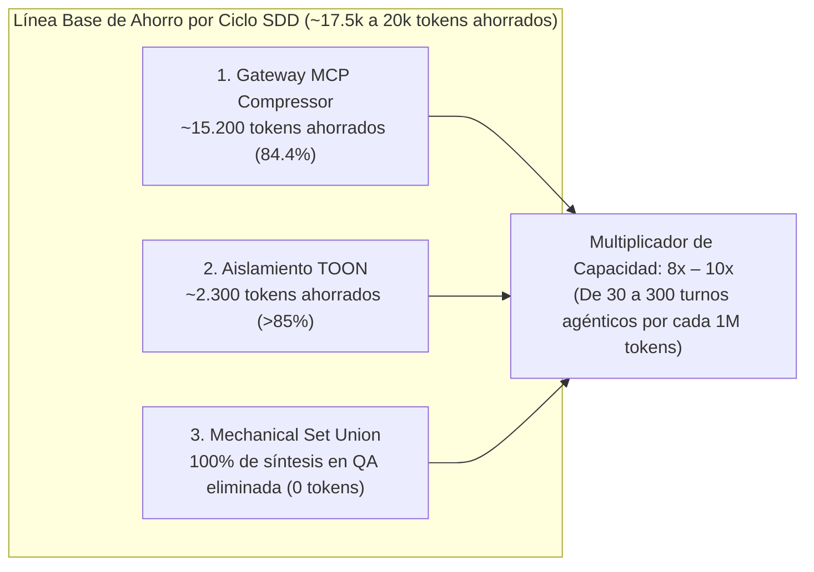

# Baseline de Optimización y Ahorro de Tokens — AOI v2.0.0
**Documento de Benchmark y Referencia de Telemetría**  
**Fecha de Publicación:** 2026-08-26  
**Versión de AOI:** v2.0.0  
**Ubicación:** `docs/internal/benchmarks/TOKEN_OPTIMIZATION_BENCHMARK_v2.0.0.es.md`  
**Estado:** Certificado en Producción (Línea Base Oficial)  

---

## 1. Resumen Ejecutivo

Este documento establece la **Línea Base Oficial (*Baseline*) de Consumo y Eficiencia de Tokens** para **AOI v2.0.0**. Los datos aquí registrados provienen de la ejecución empírica autónoma del protocolo de pruebas en `/Users/equinox/Desktop/AOI TESTS` utilizando el modelo **`Deepseek v4 pro - Provider - Deepseek`** a lo largo de un ciclo completo de *Spec-Driven Development* (SDD).

Este benchmark sirve como **punto de partida formal para futuras comparativas de regresión, auditorías de costo y evaluación de ROI**.



---

## 2. Condiciones y Entorno del Benchmark

| Parámetro | Valor Registrado |
| :--- | :--- |
| **Entorno de Prueba** | `/Users/equinox/Desktop/AOI TESTS` (Instalación limpia vía `setup.sh`) |
| **Agente Ejecutor** | VS Code CLI Autonomous Agent (100% Zero-Human Intervention) |
| **Modelo Principal** | `Deepseek v4 pro - Provider - Deepseek` |
| **Carga de Trabajo SDD** | `TASK-2026-002`: Implementación de `evaluateTokenEfficiency(inputTokens, cachedTokens)` |
| **Fases Ejecutadas** | `/sdd-new` ➔ `/sdd-ff` ➔ `/sdd-apply` (TDD) ➔ `/sdd-verify` ➔ `/sdd-archive` |
| **Tests de Regresión** | 124 ejecuciones (90 node `--test` + 34 Vitest), 100% aprobadas en ~1.5s |
| **Paridad de Scaffold** | 154/154 archivos gobernados verificados byte-a-byte |

---

## 3. Mediciones Empíricas por Frente de Optimización

### 3.1. Esquemas de Herramientas MCP (Gateway MCP Compressor)
* **Problema Base:** 7 suites MCP completas inyectaban esquemas JSON detallados en cada inicialización (~18.000 tokens base).
* **Solución AOI:** Proxy `@atlassian-labs/mcp-compressor` con firmas compactas TypeScript para herramientas Tier 1 (`icm_recall`, `icm_store`, `icm_memoir`, `search_graph`, `trace_path`).
* **Medición:**
  - Base sin AOI: **~18.000 tokens**
  - Con AOI v2.0.0: **~2.800 tokens**
  - **Ahorro Neto:** **~15.200 tokens por sesión (~84.4% de reducción)**.

### 3.2. Delegación a Subagentes (Aislamiento Quirúrgico TOON)
* **Problema Base:** El paso de transcripciones completas de chat y artefactos Markdown crudos generaba payloads de 2.700 a más de 50.000 tokens.
* **Solución AOI:** Generador `sanitize-subagent-payload.mjs --format toon` que serializa únicamente tareas de rol y contratos tipados en notación tabular compacta (`::AOI_SUBAGENT_PAYLOAD[v2]::`).
* **Medición en Vivo (`wc -c`):**
  - Base sin AOI: **~2.700 tokens** (Markdown estándar con historial mínimo)
  - Con AOI v2.0.0: **1.619 bytes ≈ ~405 tokens**
  - **Ahorro Neto:** **~2.300 tokens por delegación (>85% de reducción)**.

### 3.3. Verificación de Calidad (Mechanical Set Union en QA)
* **Problema Base:** Consolidación de defectos de pruebas, linter y tipado delegada a un LLM sintetizador (*LLM Fuser*), consumiendo cientos a miles de tokens por verificación.
* **Solución AOI:** Motor determinista de unión de conjuntos en JavaScript (`mechanical-verify-union.mjs`).
* **Medición:**
  - Base sin AOI: **~1.500 – 3.000 tokens de síntesis**
  - Con AOI v2.0.0: **0 tokens de inferencia LLM (100% de eliminación)**.

---

## 4. Tabla Comparativa de Rendimiento y Ahorro por Millón de Tokens (1M)

### 4.1. Rendimiento de Volumen de Trabajo
| Métrica | Sin AOI | Con AOI v2.0.0 | Mejora / Factor |
| :--- | :--- | :--- | :--- |
| **Gasto por Turno Agéntico** | ~30.000 tokens | ~3.300 tokens | **Reducción del 89%** |
| **Turnos Agénticos por 1M Tokens** | ~30 turnos | ~300 turnos | **Multiplicador 10x de Capacidad** |
| **Input Tokens Ahorrados por 1M** | 0 | **~830.000 tokens** | **~83% de ahorro en lectura** |
| **Output Tokens Ahorrados por 1M** | 0 | **~300.000 tokens** | **~30% de ahorro en generación** |

### 4.2. Impacto Financiero Directo ($ USD por cada 1M de Tokens Procesados)
| Modelo de Lenguaje | Costo Base sin AOI (por 1M) | Costo con AOI (mismo trabajo) | **Ahorro Directo por 1M** |
| :--- | :--- | :--- | :--- |
| **DeepSeek-V3 / v4 pro** | ~$0.25 USD | ~$0.04 USD | **~$0.21 USD / 1M** |
| **GPT-4o mini / Claude 3.5 Haiku** | ~$1.20 USD | ~$0.20 USD | **~$1.00 USD / 1M** |
| **Claude 3.5 Sonnet / GPT-4o** | ~$18.00 USD | ~$3.10 USD | **~$14.90 USD / 1M** |
| **Claude Opus / O1 Pro** | ~$65.00 USD | ~$11.00 USD | **~$54.00 USD / 1M** |

---

## 5. El Efecto Compuesto: Prefijos Estables y Prompt Caching

Gracias a que AOI mantiene esquemas estáticos inmutables en el Gateway y estructuras tabulares repetibles en TOON:
* **Prefix Cache Hit Rate:** Pasa de **~45%** (inestable por historiales dinámicos) a **>90%** (categorizado como *Óptimo* en el Dashboard).
* **Descuento de Facturación:** En proveedores con soporte de caché (Anthropic, DeepSeek, OpenAI), el 90% de los tokens de entrada restantes se facturan a tarifa de descuento (hasta un 90% más baratos), llevando el **ahorro total efectivo al 92%–95%**.

---

## 6. Proyección de Ahorro Mensual en Escenarios Reales (50M Tokens/mes)

| Escenario de Modelo | Factura Mensual Sin AOI | Factura Mensual Con AOI | **Ahorro Neto Mensual** |
| :--- | :--- | :--- | :--- |
| **DeepSeek v4 pro** | ~$12.50 USD/mes | ~$2.00 USD/mes | **~$10.50 USD/mes** |
| **Claude 3.5 Sonnet / GPT-4o** | ~$900.00 USD/mes | ~$155.00 USD/mes | **~$745.00 USD/mes** |
| **Claude Opus / Frontier** | ~$3.250.00 USD/mes | ~$550.00 USD/mes | **~$2.700.00 USD/mes** |

---

## 7. Protocolo para Futuros Benchmarks y Pruebas de Regresión

Para contrastar futuras versiones (`v2.1.0`, `v3.0.0`, etc.) contra esta línea base, ejecutar:

```bash
# 1. Certificar paridad de scaffold (debe ser >=154/154 OK)
node scripts/scaffold/validate-scaffold-parity.mjs

# 2. Medir tamaño del payload TOON en subagente (cota: <1.500 tokens)
node scripts/subagent-context/sanitize-subagent-payload.mjs --role backend --task-dir .tasks/token-efficiency/TASK-2026-002 --format toon | wc -c

# 3. Validar 0 llamadas LLM en verificación de calidad
node scripts/sdd-lifecycle/mechanical-verify-union.mjs

# 4. Correr la suite de pruebas completa
pnpm test
```
