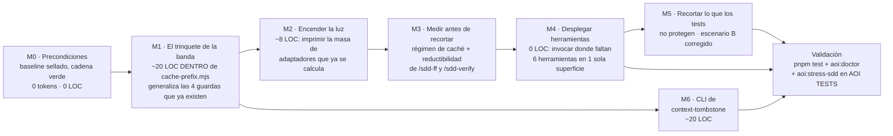
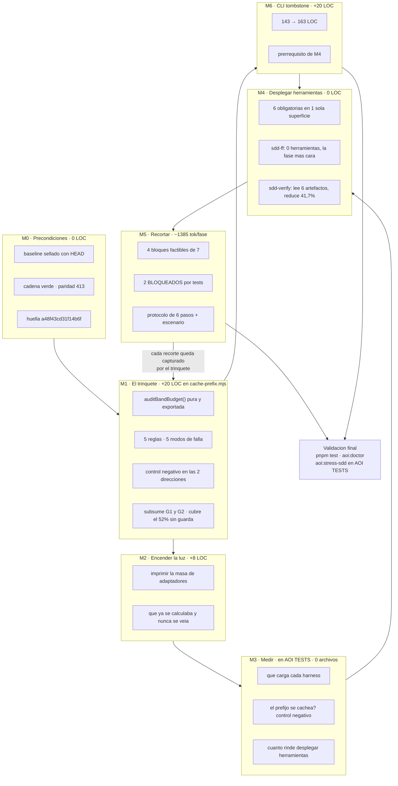

# AOI — Plan de Implementación de Gobernanza de Contexto

> **Document ID:** `AOI-PLAN-2026-09-19-CTX-GOV`
> **Tipo:** Plan de implementación con auditoría previa de las cuatro propuestas hermanas
> **Estado:** **ABIERTO — es un documento, no una autorización.** Ninguna sección constituye
> aprobación. El entregable de este plan es el plan.
> **Fecha:** 2026-09-19
> **Autor / Modelo:** GitHub Copilot · Deepseek v4 flash (Provider: Deepseek)
> **Sello de versión:** `v2.5.2-103-gb1b6863` · HEAD `b1b6863` (2026-09-18 21:40:07 -0500)
> **Árbol medido:** `git status --porcelain` → 3 archivos `A` (las tres propuestas previas) + 1
> `??` (esta familia de documentos). Nada más. **Pero la cadena estaba ROJA**, y la causa se
> documenta en §3.7.1(b): un directorio vacío dejado por la reversión. Ver §14.
>
> **Revisión v1.1.0 (2026-09-19).** Reescribí §2.1 y §3.5 tras medir el **acoplamiento** y
> encontrar **cuatro guardas de tokens que ya existen** —la tesis de v1.0.0, *"ninguna compuerta
> mide tokens"*, era **falsa**—. Re-scopé los movimientos M1/M2/M5 (de 220 LOC nuevas a ~28
> dentro de un archivo existente), marqué los bloques de recorte que los tests **protegen**, y
> corregí la proyección del escenario B a la baja. Todo lo cambiado está listado en §15.
>
> **Documentos auditados en este plan:**
> `AOI_ULTRA_LIGHT_ZERO_WASTE_PROPOSAL_GEMINI.md` (propuesta original) ·
> `AOI_ULTRA_LIGHT_ZERO_WASTE_PROPOSAL_MINIMAX.md` ·
> `AOI_ULTRA_LIGHT_ZERO_WASTE_PROPOSAL_DEEPSEEK_V4_FLASH.md` ·
> `AOI_TOKEN_GOVERNANCE_PROPOSAL_CLAUDE_OPUS_5.md`

---

## Índice

1. [Cómo leer este documento](#1-cómo-leer-este-documento)
2. [Resumen ejecutivo](#2-resumen-ejecutivo)
3. [El problema, medido](#3-el-problema-medido)
4. [Auditoría de las cuatro propuestas](#4-auditoría-de-las-cuatro-propuestas)
5. [Hallazgos que ninguna de las cuatro nombró](#5-hallazgos-que-ninguna-de-las-cuatro-nombró)
6. [Decisiones, una por una, con su justificación](#6-decisiones-una-por-una-con-su-justificación)
7. [Qué se va y qué se queda](#7-qué-se-va-y-qué-se-queda)
8. [Plan de implementación](#8-plan-de-implementación)
9. [Proyecciones de simplificación](#9-proyecciones-de-simplificación)
10. [Criterios de aceptación y compuertas](#10-criterios-de-aceptación-y-compuertas)
11. [Matriz de riesgos](#11-matriz-de-riesgos)
12. [Decisiones que requieren al Owner](#12-decisiones-que-requieren-al-owner)
13. [Anexos](#13-anexos)
14. [Cambios que este análisis aplicó al árbol](#14-cambios-que-este-análisis-aplicó-al-árbol)
15. [Registro de la revisión v1.1.0, y el siguiente entregable](#15-registro-de-la-revisión-v110-y-el-siguiente-entregable)
16. [Protocolo de verificación del ciclo SDD por fase](#16-protocolo-de-verificación-del-ciclo-sdd-por-fase)

---

## 1. Cómo leer este documento

### 1.1. Qué es y qué no es

Este documento es un **análisis con plan**. Hace tres cosas y ninguna más:

1. **Reconstruye el problema con medición propia**, no citando a las propuestas hermanas.
2. **Decide**, nombrando para cada decisión qué evidencia la sostiene, qué contraparte se
   consideró y qué cuesta equivocarse.
3. **Proyecta** el efecto de cada movimiento, en dos regímenes de facturación distintos,
   porque el régimen no está medido y **la proyección correcta depende de él**.

No hace lo que este repositorio ya pagó caro una vez: **no adelanta implementación**. El
episodio está fechado y se documenta en §3.7. La regla que deja es explícita —
*encontrar código escrito a partir de una propuesta abierta es un hallazgo de violación de
proceso, no un estado de avance que se incorpora al análisis*. Este plan respeta esa regla
por construcción: no crea rama, no toca ningún archivo gobernado, no modifica `setup.sh`, no
crea `scripts/governance/`, no elimina `scaffold/`.

### 1.2. Separación de la carga probatoria

Todo enunciado de este documento cae en una de cuatro categorías, y cada tabla lo declara:

| Marca | Significado |
| :--- | :--- |
| **MEDIDO** | Ejecuté el instrumento y reproduje la cifra, o la derivé en esta sesión |
| **VERIFICADO** | Leí el archivo/línea y confirmé la afirmación de otro documento |
| **DERIVADO** | Aritmética sobre cifras MEDIDAS. La operación es mía, los insumos no |
| **cita** | Lo dijo otro documento; no lo verifiqué. Se usa sólo para contrastar |

Las cifras que no caen en ninguna de las cuatro **no aparecen**. Es la razón por la que este
documento no promete un porcentaje de ahorro antes de §9, y por la que §9 existe: lo que se
puede proyectar sin inventar es poco, pero es real.

### 1.3. Nota de método: por qué los nombres de archivos futuros no llevan `node`

`aoi:lint-refs` escanea prosa narrativa (`docs/`, `wiki/`) y valida exactamente dos cosas:
rutas de script y comandos slash. Pero **sólo** reconoce una ruta de script cuando está
precedida por la palabra `node`:

```javascript
const SCRIPT_REF  = /node\s+(scripts\/[A-Za-z0-9/_.-]+\.mjs)/g
const COMMAND_REF = /(?:^|[\s(`"])\/((?:sdd-|speckit\.)[a-z0-9-]+(?:\.[a-z0-9-]+)*)/g
```

Consecuencia práctica para este documento: **los archivos y comandos que el plan propone
crear se nombran sin el prefijo `node`** —porque una ruta que el plan *propone crear* no es
una invocación que deba resolver, y el linter tiene razón en tratarla como tal si se escribe
como invocación. Igual criterio para los comandos: sólo se nombran `/sdd-*` y `/speckit.*`
que hoy existen en `.github/prompts/`. Es una decisión deliberada, no un descuido de
redacción, y se declara acá para que no se lea como una omisión.

---

## 2. Resumen ejecutivo

### 2.1. La tesis, en un párrafo

Las cuatro propuestas discuten **qué recortar**. Ninguna se pregunta **por qué el recorte se
va a mantener**, y la respuesta medida es que no se mantiene.

**Y acá corrijo la tesis de la v1.0.0 de este documento.** Yo escribí que *"de las 26 compuertas
de `pnpm test`, ninguna mide tokens"*. **Es falso.** Existen **cuatro guardas de tokens**, y tres
de ellas cubren dos archivos de la banda universal:

| Guarda | Archivo objetivo | Cap | Hoy |
| :--- | :--- | ---: | ---: |
| `lifecycle-wiring.test.mjs:165` | `.github/agents/supervisor.agent.md` | ≤ 2800 | **2420** |
| `icm-protocol-completeness.test.mjs:88` | `.github/instructions/icm-protocol.instructions.md` | ≤ 2200 | **2124** |
| `agent-model-blocks.test.mjs:69` | cada `## Model Requirement` de los 27 agentes | ≤ 110 | ? |
| `auditSelectionProtocol` (ídem, :23) | `.github/instructions/model-selection.instructions.md` | contenido, **sin tamaño** | 396 |

La tesis correcta es **más precisa y más interesante**: hay caps, no hay ratchet, y cubren
**48% de la banda** (4.544 de 9.457 tok/fase). Los otros 4.913 tok/fase = **34.391 por ciclo**
no tienen ninguna guarda de tamaño. Y un cap no es un ratchet: `supervisor.agent.md` puede
pasar de 2420 a 2799 con las 26 compuertas en verde, **o recortarse a 1800 y volver a crecer a
2799** sin que el ahorro quede capturado. Lo que falta no es una compuerta nueva: es
**generalizar la que ya existe, sobre la banda entera, y convertirla en trinquete.**

`cache-prefix.mjs` audita **volatilidad** (que la masa repetida no contenga timestamps ni
UUIDs, y que una fase no reescriba una superficie que el ciclo recarga), nunca **tamaño**.
`cache-guard.mjs` escanea los primeros 1.500 caracteres de `.github/prompts/*.prompt.md`
buscando esos mismos patrones volátiles. Y `context-budget.mjs` —el módulo más completo que AOI
tiene sobre su propia economía, el que diagnosticó el problema en su propio docstring— tiene
**cero `process.exit`** y **no figura en ningún script de `package.json`**.

Por eso la propuesta de este plan invierte el orden: **primero el termostato, después bajar la
calefacción.** Y por eso el termostato no es un archivo nuevo: **son las cuatro guardas que ya
existen, generalizadas a la banda, dentro del instrumento que ya es el paso 6 de la cadena.**

### 2.2. Veredicto sobre los cinco pilares de la propuesta original

| Pilar (Gemini) | Gemini | MiniMax | DeepSeek | Claude Opus | **Este plan** |
| :--- | :---: | :---: | :---: | :---: | :--- |
| 1 · Eliminar `scaffold/` | aprueba | rechaza | enmienda o revertir | no ahora | **NO AHORA** |
| 2 · 27 → 3 agentes | aprueba | rechaza | rechaza | rechaza | **RECHAZAR** |
| 3 · Archify first-class | aprueba | auditar | no construir | no construir | **NO CONSTRUIR** |
| 4 · Invertir prefijo Tier 0 | aprueba | aprueba c/obs. | rechaza | rechaza | **RECHAZAR** |
| 5 · CLI de `context-tombstone` | aprueba | aprueba | aprueba | aprueba | **APROBAR** |

Un dato ordena la discusión entera: **el único pilar que los cuatro aprueban es el más
chico** —143 LOC y un runner de ~20— y el único que tres rechazan es el más invasivo. Eso ya
es un veredicto colectivo, antes de cualquier medición.

### 2.3. Lo que este plan propone, en seis movimientos



**El orden no es negociable, y es el aporte central del plan.**

- **M1 antes que M5:** recortar sin trinquete es pagar dos veces la misma factura.
- **M3 antes que M4 y M5:** hoy nadie sabe si el esfuerzo debe ir a la banda universal o a la
  masa por fase, ni cuánto rinde desplegar las herramientas. **Sin ese dato, M4 y M5 son
  apuestas** — y las cuatro propuestas hermanas ya apostaron sin él.
- **M5 al final:** es el único movimiento que depende de los tres anteriores.

**Y una regla que atraviesa todos: LOC netas ≤ 0 por movimiento.** Cada línea de código
agregada se paga con una de prosa removida. Es la operacionalización de *"pulir el diamante,
no agrandarlo"*: sin un número, es una intención.

### 2.4. Superficie de cambio, comparada

| | Gemini | MiniMax | DeepSeek | Claude Opus | **Este plan** |
| :--- | ---: | ---: | ---: | ---: | ---: |
| Archivos eliminados | 541+ | 0 | 0 | 0 | **0** |
| Violaciones constitucionales | 2 | 0 | 0 | 0 | **0** |
| Invariantes del BIC rotos | 1 | 1 | 1 | 0 | **0** |
| Dependencias nuevas | 1 (Zod) | 0 | 0 | 0 | **0** |
| Depende de un archivo inexistente | sí | sí | sí | no | **no** |
| Compuerta nueva que sostiene el ahorro | ninguna | ninguna | ninguna | `aoi:token-budget` | **trinquete en `cache-prefix.mjs`, generalizando 4 guardas existentes** |
| LOC de código nuevas | +1000s (pilares) | ~0 | ~0 | ~110 | **~28 dentro de un archivo existente** |
| Archivos nuevos | 3+ | 0 | 0 | 2 | **0** |
| Ahorro cifrado antes de medir | 70–85% | 13.650/ciclo | 13.807/ciclo | ninguno | **ninguno sin medir** |

> **Nota de precisión sobre la primera fila.** "0 archivos eliminados" es literal: cero
> **archivos**. Pero este análisis **removió un directorio vacío** —`scripts/governance/`— como
> parte de su propia medición, porque era la causa probada de `pnpm test` → `exit 1`. Está
> declarado en §14 con su reversión exacta (`mkdir`). Las cuatro propuestas, para comparar,
> proponen eliminar entre 237 y 541 **archivos con contenido**.

---

## 3. El problema, medido, y lo que lo acopla

### 3.1. Baseline del ciclo SDD

`node scripts/sdd-lifecycle/cache-prefix.mjs`, corrida del 2026-09-19 sobre `b1b6863`:

```text
COSTO FIJO DEL PAYLOAD LITERAL:
- Payload literal fijo:                   105,466 tokens
- Contenido atribuible a archivos:        104,382 tokens
- Framing del assembler (sin asignar):    1,084 tokens

REPETICION DEL CONTENIDO ATRIBUIBLE:
- Universal, en las 7 fases: 8 archivos, 9,457 tok/fase = 66,199 por ciclo
- Repetido en algunas fases:            4,466 por ciclo
- Cargado una sola vez:                 33,717 por ciclo
- El 62.8% del payload literal es contenido repetido atribuible.

MASA QUE UN CACHE DE PREFIJO PODRIA REUTILIZAR:
- Sin cache:      66,199 tokens
- Con cache a 0.1: 15,131 tokens
- Recuperable:    51,068 tokens por ciclo

Huella de la masa repetida: a48f43cd31f14b6f
```

**MEDIDO.** Estas cuatro cifras —105.466 · 9.457 · 66.199 · 62,8%— son el terreno común de las
cuatro propuestas. Las cuatro las citan y las cuatro coinciden con el instrumento. Es
importante decirlo antes de discutir el resto: **las cuatro midieron de verdad sobre este
eje.**

### 3.2. Payload por fase — y la fase que la propuesta original omitió

Reproducido con `assemblePhaseContext()` sobre las 7 fases de `sdd-phases.mjs`:

| Fase | **MEDIDO** | % del ciclo | Gemini decía |
| :--- | ---: | ---: | ---: |
| `Phase_-2_Genesis` | 12.822 | 12,2% | 13.916 |
| `Phase_0_Frame` | 12.861 | 12,2% | 13.432 |
| `Phase_1_New` | 12.669 | 12,0% | 12.870 |
| **`Phase_2_FF`** | **23.471** | **22,3%** | *ausente* |
| `Phase_3_Apply` | 16.849 | 16,0% | 16.240 |
| `Phase_4_Verify` | 14.853 | 14,1% | 18.110 |
| `Phase_5_Archive` | 11.941 | 11,3% | 14.180 |
| **Total** | **105.466** | 100% | **105.466** ✅ |

`/sdd-ff` es la fase **más cara del ciclo**: 22,3% del payload total, más que `/sdd-apply` y
`/sdd-archive` juntas. La propuesta original no la lista, y en su lugar pone una fila
`/speckit.* (promedio)` que **promedia algo que no es una fase** —`/speckit.*` son comandos
que algunas fases invocan, y `sdd-phases.mjs` define exactamente siete fases. La suma de esa
tabla cierra en 105.466 porque el residuo se asignó a la fila inventada.

### 3.3. Descomposición por categoría — el dato que reordena todo

Suma cruda sobre las apariciones de `assemblePhaseContext().parts` en las 7 fases:

| Categoría | tok/ciclo | % de 105.466 | Banda |
| :--- | ---: | ---: | :--- |
| `instructions` | **34.195** | **32,4%** | **100% universal (×7)** |
| `agents` | 32.976 | 31,3% | mixta |
| `skills` | 19.530 | 18,5% | mixta |
| prompt de fase | 17.681 | 16,8% | ×1 |
| *framing del assembler* | *1.084* | *1,0%* | universal |

**MEDIDO y DERIVADO.** Y el dato que cierra el argumento, verificable con una multiplicación:

```text
Banda universal de la categoría instructions:
  icm-protocol.instructions.md         2.124
  agent-delegation.instructions.md     2.031
  model-selection.instructions.md        396
  rtk.instructions.md                    334
                                      ─────
                                       4.885  × 7 = 34.195

Categoría instructions del ciclo completo   = 34.195   ← idéntico
```

**`instructions` es 100% banda universal. No tiene masa por fase.** Cada token que sobra ahí
se paga siete veces, sin excepción y sin depender de proveedor. Ninguna de las cuatro
propuestas lo nombró como categoría; la propuesta original ataca agentes, y las tres
revisiones atacan archivos sueltos.

### 3.4. La banda universal, archivo por archivo

| Archivo | tok/archivo | × | tok/ciclo | % de la banda |
| :--- | ---: | :---: | ---: | ---: |
| `.github/agents/supervisor.agent.md` | 2.420 | 7 | **16.940** | 25,6% |
| `.github/instructions/icm-protocol.instructions.md` | 2.124 | 7 | **14.868** | 22,5% |
| `.github/instructions/agent-delegation.instructions.md` | 2.031 | 7 | **14.217** | 21,5% |
| `.github/skills/sdd-lifecycle/SKILL.md` | 1.510 | 7 | 10.570 | 16,0% |
| `.github/skills/icm/SKILL.md` | 414 | 7 | 2.898 | 4,4% |
| `.github/instructions/model-selection.instructions.md` | 396 | 7 | 2.772 | 4,2% |
| `.github/instructions/rtk.instructions.md` | 334 | 7 | 2.338 | 3,5% |
| `.github/skills/rtk/SKILL.md` | 228 | 7 | 1.596 | 2,4% |
| **Total** | **9.457** | | **66.199** | 100% |

**MEDIDO.** Los tres primeros suman **46.025 tok/ciclo = 69,5% de toda la masa repetida**, y
son los tres archivos con mejor retorno por unidad de esfuerzo del sistema. Ninguno de los
tres aparece en la propuesta original —que persigue los 5.466 del catálogo propio y no
nombra a `supervisor.agent.md`, que pesa **3,1 veces más que todo su alcance**.

La banda se puede derivar, no hardcodear: `cache-prefix.mjs` la define como
`rows.filter((r) => r.multiplier === phaseCount)`. Cualquier ratchet debe usar **el mismo
predicado**, por la misma razón por la que `validate-srp.mjs` usa su propio conteo de líneas
en vez de `wc -l`: para que la compuerta y el instrumento no puedan discrepar.

### 3.5. Las cuatro guardas que YA existen — y por qué un cap no es un ratchet

La cadena completa de `pnpm test` —26 pasos, verificado en `package.json`:

```text
1  aoi:test-globs      8  aoi:hooks          15 test:subagent-payload  22 aoi:lint-refs
2  aoi:srp             9  aoi:registry       16 test:conf              23 aoi:audit-protocol
3  aoi:reachability   10  test:parity        17 test:sdd-lifecycle     24 aoi:claims
4  aoi:routing        11  test:doctor        18 test:spatiotemporal    25 aoi:importance
5  aoi:handoffs       12  test:multi-harness 19 test:mcp-gateway       26 test:dashboard
6  aoi:cache-prefix   13  test:sandbox       20 test:code-lens
7  aoi:tools          14  test:memory-sync   21 aoi:cache-guard
```

El repositorio gobierna LOC, paridad de espejo, alcanzabilidad de fuentes, globs de test,
referencias en prosa, ruteo de agentes, invariantes del BIC, cierre de blueprints, cableado de
hooks, protocolo, afirmaciones e importancia de memorias. Y **sí mide tokens** — en cuatro
lugares, no en cero. La guarda existe desde antes de este plan:

| # | Guarda | Archivo objetivo | Forma | Cap | Hoy | Margen |
| :---: | :--- | :--- | :--- | ---: | ---: | ---: |
| **G1** | `lifecycle-wiring.test.mjs:165` | `.github/agents/supervisor.agent.md` | `Math.round(len/4)` + `assert.ok(tokens <= 2800)` | 2800 | **2420** | 380 |
| **G2** | `icm-protocol-completeness.test.mjs:88` | `.github/instructions/icm-protocol.instructions.md` | ídem, `<= 2200` | 2200 | **2124** | 76 |
| **G3** | `agent-model-blocks.test.mjs:69` | cada `## Model Requirement` de **27** agentes | ídem, `<= 110` por bloque | 110 | ? | ? |
| **G4** | `agent-model-blocks.test.mjs:23` | `.github/instructions/model-selection.instructions.md` | `auditSelectionProtocol` — needles + % obsoleto | — | 396 | n/a |

#### 3.5.1. Y sin embargo, el agujero es real: caps, no trinquete

Tres propiedades separan lo que hay de lo que falta, y las tres están medidas:

**(a) La cobertura es 48%.** G1 + G2 cubren **4.544 de los 9.457 tok/fase**. Los **4.913
restantes = 34.391 por ciclo** no tienen ninguna guarda de tamaño:

| Archivo de la banda sin guarda de tamaño | tok/fase | tok/ciclo |
| :--- | ---: | ---: |
| `.github/instructions/agent-delegation.instructions.md` | 2031 | **14.217** |
| `.github/skills/sdd-lifecycle/SKILL.md` | 1510 | **10.570** |
| `.github/skills/icm/SKILL.md` | 414 | 2.898 |
| `.github/instructions/model-selection.instructions.md` | 396 | 2.772 |
| `.github/instructions/rtk.instructions.md` | 334 | 2.338 |
| `.github/skills/rtk/SKILL.md` | 228 | 1.596 |
| **Total desprotegido** | **4.913** | **34.391** |

**(b) Un cap no captura el ahorro.** G1 acepta 2420 → 2799. Si alguien recorta
`supervisor.agent.md` a 1800, el cap **sigue en 2800**: puede volver a crecer 1.000 tokens con
las 26 compuertas en verde, y el ahorro se evapora sin que nada lo registre. Un cap impone un
techo; un trinquete **registra un valor del que sólo se puede bajar**. `validate-srp.mjs` ya
documenta esa diferencia para las LOC con `STALE BUDGET`.

**(c) La misma guarda está escrita tres veces.** G1, G2 y G3 son la misma decisión
duplicada en tres archivos de test, con el mismo cálculo y el mismo `assert.ok(tokens <= N)`. Si
mañana se suma un archivo a la banda, **no hay ningún lugar donde agregar su cap** — hay que
escribir una cuarta copia en un cuarto test, y el 52% desprotegido es la prueba de que eso no
pasa solo.

#### 3.5.2. El resto del «hueco» sigue en pie

Lo que **sí** es cierto de la v1.0.0, y hay que decirlo con la misma precisión:

| Instrumento | ¿En `pnpm test`? | ¿Falla por crecimiento? | Qué mira en realidad |
| :--- | :---: | :--- | :--- |
| `cache-prefix.mjs` | Sí (paso 6) | **No** | `CACHE_BUSTER_PATTERNS` y reescrituras mid-ciclo |
| `context-budget.mjs` | **No** | **No se puede invocar** | Cero `process.exit`. Sólo librería |
| `cache-guard.mjs` | Sí (paso 21) | No | Timestamps/UUIDs en los primeros 1.500 chars de los prompts |

- `context-budget.mjs` termina en `formatHarnessAdapters(...)` y **no tiene `main()` ni bloque
  de entrada**. No hay `pnpm aoi:context-budget`.
- `auditRepeatedMass()` de `cache-prefix.mjs` recorre la masa repetida buscando
  `CACHE_BUSTER_PATTERNS`. **Nunca compara un tamaño contra nada.**
- `cache-guard.mjs` declara en su cabecera *"guaranteeing >95% prompt cache hit rates"*: una
  promesa que el instrumento **no puede medir**.
- **Las cuatro guardas viven en archivos de test** (`test:multi-harness`), no en una compuerta
  `aoi:*` propia. No hay un `aoi:token-budget` que se pueda correr y leer solo.

**Consecuencia directa sobre las cuatro propuestas hermanas: cualquiera de sus recortes se
revierte solo.** Un recorte de 500 tokens en `agent-delegation.instructions.md` —sin guarda—
vale 3.500 por ciclo el día que se hace, y vale **cero** el día que alguien agrega dos párrafos,
porque **nada falla**. Y en `icm-protocol.instructions.md` —con guarda— el recorte tampoco queda
capturado: el cap sigue en 2200 mientras el archivo esté por debajo.

```javascript
// validate-srp.mjs — el patrón que falta sobre la economía de tokens
//   LEGACY_BUDGET registra la deuda y sólo puede bajar
//   GREW  <archivo> — N LOC, was M; legacy debt may only shrink
//   STALE BUDGET  <archivo> no longer violates — remove it from LEGACY_BUDGET
```

#### 3.5.3. Por qué esto refuerza la propuesta en vez de debilitarla

Si la guarda ya existe en tres formas ad-hoc, generalizarla **no es agregar gobernanza: es
unificar la que hay.** El movimiento pasa a ser:

| | v1.0.0 del plan | v1.1.0 (esta revisión) |
| :--- | :--- | :--- |
| Qué se crea | `aoi:token-budget`, archivo nuevo, ~90 LOC + test ~130 | `auditBandBudget()` **dentro de `cache-prefix.mjs`**, ~20 LOC |
| Qué pasa con G1/G2/G3 | conviven con la nueva | **quedan subsumidas**: sus valores entran al baseline del trinquete |
| Cobertura | 8 archivos de la banda | 8 archivos, **y los tres caps existentes como entradas** |
| Derivaciones de la banda | **2** (una nueva, hardcodeada) | **1** (la de `cache-prefix.mjs`, que ya existe) |
| Archivos nuevos · entradas en `package.json` · pasos nuevos en la cadena | 2 · 2 · 1 | **0 · 0 · 0** |

Eso es *pulir el diamante*: la forma correcta ya está tallada tres veces; el trabajo es una sola
piedra con las ocho caras, no una cuarta copia.

### 3.6. Límites de esta medición — y por qué importan

Esta sección existe porque `cache-prefix.mjs` la tiene, y es la razón por la que ese
instrumento es confiable. Un número sin su frontera es una promesa, no una medición.

**Lo que NO medí:**

1. **Facturación real de ningún proveedor.** Todas las cifras de este documento son
   aritmética estática sobre archivos en disco. Es lo que AOI puede medir y lo único que voy
   a afirmar.
2. **Si el harness realmente inyecta la banda.** No lo verifiqué en una corrida real. Ver
   §3.6.2.
3. **Si el proveedor cachea.** AOI no arma la request HTTP ni coloca los breakpoints. Lo dice
   su propio instrumento: *"WHAT THIS DOES NOT CLAIM. AOI does not build the API request and
   cannot place cache breakpoints: ordering and reuse belong to the harness."*
4. **Los tokens de salida de un diagrama Archify.** La propuesta original afirma 3.000–5.000
   sin fuente. No tengo una corrida instrumentada y **no voy a inventar el número**.
5. **La corrida completa de `pnpm test`** (26 pasos) durante esta sesión. Corrí las compuertas
   que necesitaba, una por una.
6. **El protocolo en `AOI TESTS`.** Ninguna cifra de acá sustituye una corrida real de
   `aoi:stress-sdd` allí, que es donde se establece la línea base del ciclo de benchmark.

#### 3.6.1. El multiplicador es incondicional; la factura no

Hay que separar dos cosas que las cuatro propuestas mezclan:

- **El multiplicador ×7 es incondicional.** Un token de la banda universal se carga 7 veces,
  lo cachee quien lo cachee. Eso no depende del proveedor.
- **Cuánto se factura depende del caché**, y eso lo decide el harness.

| Intervención | Payload evitado/ciclo | Facturado **sin** caché | Facturado **con** caché a 0,1 |
| :--- | ---: | ---: | ---: |
| Banda universal completa | 66.199 | 66.199 | 15.131 |
| Masa por fase (prompts + agentes + speckit) | 39.267 | 39.267 | **39.267** |

La segunda fila es la clave y es contraintuitiva: **la masa por fase nunca se cachea** —
cambia en cada fase por definición— así que se factura a precio completo en los dos
regímenes. Bajo caché efectivo, la banda universal ya es barata y lo caro es lo específico
de fase. Bajo caché nulo, la banda universal es la mina.

**Por eso M2 no es opcional.** Sin ese dato, cualquier estrategia de recorte es una apuesta
sobre un comportamiento que el repositorio declara explícitamente que no puede determinar.

#### 3.6.2. El modelo de 105.466 es un modelo de Copilot

Esto ninguna de las cuatro propuestas lo dijo y **acota el tamaño del premio**. El piso se
deriva de `applyTo`, que es la convención de instruction-files de VS Code / Copilot:
`instruction-scope.mjs` resuelve la banda matcheando el `applyTo` de cada instruction contra
**el path del prompt de la fase**.

```text
icm-protocol.instructions.md:      applyTo: "**"
rtk.instructions.md:               applyTo: "**"
agent-delegation.instructions.md:  applyTo: ".github/{agents,prompts}/**,**/*.agent.md,**/*.prompt.md"
model-selection.instructions.md:   applyTo: ".github/{agents,prompts}/**,**/*.agent.md,**/*.prompt.md"
```

En Claude Code el camino es distinto: `.claude/commands/sdd-apply.md` es un **puntero** de
**14 líneas** —verificado— que dice *"Read `.github/prompts/sdd-apply.prompt.md` … and
execute it"*, y la superficie siempre-presente es `CLAUDE.md`, de **2.241 tokens** —también
verificado—, no la banda de 9.457.

| Harness | Superficie siempre-on | Multiplicador de la banda |
| :--- | ---: | :--- |
| GitHub Copilot Chat | 9.457 tok/fase vía `applyTo` | ×7 confirmado por el modelo |
| Claude Code | `CLAUDE.md` = 2.241 tok/sesión | **No verificado** — las instructions no se auto-inyectan |
| Cursor / Cline / Agents | dialecto propio | **No verificado** |

Hay que darle crédito al repositorio en la mitad de esto: `context-budget.mjs` ya modela los
adaptadores de harness en `HARNESS_ADAPTERS` y los deja **deliberadamente fuera del piso**,
con una razón bien escrita —*"Sumarlo cambiaría la definición del piso y volvería
incomparable cada línea base histórica"*—. Lo que ese modelo **no** cubre es la pregunta
inversa: da por sentado que el piso se paga en todos lados. Pero **el piso mismo es la
derivación de `applyTo`**.

#### 3.6.3. Un corolario sobre el instrumento que nadie usó

`harnessAdapterCost()` se llama desde `auditContextBudget()`, pero **`formatHarnessAdapters()`
no lo llama ningún camino de producción**. La masa de adaptadores **se calcula y nunca se
imprime**. Hay una función escrita, testeada y con un mensaje de alcance redactado —*"el piso
reportado excluye N tokens de adaptadores; el piso real de un Copilot es de piso+N"*— que
ningún comando muestra. Eso convierte a M5 en un movimiento de costo cero con salida real.

> **Corrección que me aplico.** La propuesta de Claude Opus afirma que `harnessAdapterCost` y
> `formatHarnessAdapters` son consumidos *"únicamente por su propio test"*. **Es falso para el
> primero**: lo llama `context-budget.mjs:141`. Lo que sí es cierto es lo de arriba: el
> formateador no lo llama nadie. El efecto que describe se sostiene; la afirmación de consumo
> es imprecisa.

### 3.7. El estado real del árbol, y el defecto de secuencia que lo produjo

#### 3.7.1. La reversión, medida

```text
$ git show -s --format='%H | %ad | %s' HEAD
b1b6863 | Fri Sep 18 21:40:07 2026 | Add technical review for SDD cycle isolation using Git Worktrees

$ git status --porcelain
A  docs/internal/proposals/…_DEEPSEEK_V4_FLASH.md
A  docs/internal/proposals/…_GEMINI.md
A  docs/internal/proposals/…_MINIMAX.md
?? docs/internal/proposals/AOI_TOKEN_GOVERNANCE_PROPOSAL_CLAUDE_OPUS_5.md

$ git ls-tree -r HEAD --name-only scaffold | wc -l   →  541
$ fd -H -I . scaffold --type f | wc -l               →  541
$ node scripts/scaffold/validate-scaffold-parity.mjs
✅ Scaffold Mirror Parity OK: 413 governed files verified byte-for-byte.       EXIT 0
$ git show HEAD:setup.sh | rg 'SCAFFOLD_DIR='        →  16:SCAFFOLD_DIR="$SCRIPT_DIR/scaffold"
```

**MEDIDO.** Tres consecuencias, y la tercera es la que nadie había establecido.

**(a) La §2 de DeepSeek es historia, no estado.** Fue precisa cuando se midió (13:10) y hoy no
aplica: `/scaffold/` está presente con 541 archivos, la paridad sale 0, `setup.sh` apunta al
espejo, y `scripts/governance/manifest.json` no existe. La lectura de Claude Opus —*"su
recomendación número 1, estabilizar el árbol, ya está cumplida"*— es correcta.

**(b) La reversión fue parcial — y el residuo NO es inerte: rompe una compuerta.** Verificado
con un experimento controlado: `scripts/governance/` **sobrevive como directorio vacío**
(`ls -la` → `total 0`). La tabla de Claude Opus dice *"el directorio no existe"*: casi
correcto. El directorio existe, sin contenido — y **git no lo ve**, porque git no versiona
directorios vacíos. Ahí está el problema: no aparece en `git status`, así que no aparece en
ninguna revisión de diff, **y hace fallar `pnpm test`**.

```
$ pnpm test
✖ describes every area this repository actually ships
  AssertionError: sin descripción en AREA_OWNERSHIP: governance
  + [ 'governance' ]
  - []
CHAIN_EXIT=1
```

**El mecanismo, aislado.** `claude-project-guide.mjs` deriva la tabla de arquitectura del
árbol en vez de hardcodearla:

```javascript
export function discoverAreas(repoRoot) {
  return fs.readdirSync(path.join(repoRoot, 'scripts'), { withFileTypes: true })
    .filter((entry) => entry.isDirectory())
    .map((entry) => entry.name)
    .filter((name) => name !== 'node_modules' && !name.startsWith('.'))
    .sort()
}
```

`discoverAreas` recorre **directorios**, no archivos. Un directorio vacío es, para esa función,
un área del producto. Y `AREA_OWNERSHIP` no tiene entrada para `governance` —no debe tenerla,
porque `governance` nunca fue una decisión aprobada— así que el test reclama:

```
discoverAreas() con el directorio:  code-lens, conf, GOVERNANCE, mcp-gateway, memory-sync,
                                    multi-harness, sandbox, scaffold, sdd-lifecycle, …
discoverAreas() sin él:              code-lens, conf,           mcp-gateway, memory-sync,
                                    multi-harness, sandbox, scaffold, sdd-lifecycle, …
AREA_OWNERSHIP['governance'] = false
```

**MEDIDO, con control:** el mismo árbol, con y sin el directorio, y la única diferencia en el
conjunto de áreas es `governance`. Removido el directorio, `pnpm test` → **exit 0** (suites
muestreadas: 133/133 · 350/350 · 31/31 · 22 tests con 21 pass y 1 skip · 65/65, `fail 0`).

**Consecuencias sobre lo que ya está escrito:**

- **Claude Opus tenía razón sobre el fondo y se le escapó el detalle que importa.** *"No hay
  nada que deshacer, cualquier decisión se toma sobre un árbol verde"* — el árbol **no estaba
  verde**. Su tabla dice *"el directorio no existe"*; existe, y su existencia es un fallo de
  CI.
- **DeepSeek acertó sin saber por qué.** Su §2.2 dijo *"`pnpm test` está rojo ahora mismo"* y
  atribuyó el rojo a los 541 archivos borrados. Eso era cierto a las 13:10. Pero **hoy, con el
  espejo restaurado y la paridad en 0, seguía habiendo exactamente un rojo** — por una causa
  que ninguna de las cuatro propuestas nombró.
- **El residuo no es trazabilidad, es un defecto técnico.** Es exactamente el modo de falla
  que este repositorio documenta como el más caro: algo que rompe **lejos de la causa**. Nada
  en el mensaje del test nombra la reversión, el Pilar 1, ni la propuesta que lo originó. Dice
  "governance no tiene descripción en AREA_OWNERSHIP", y el que lee tiene que reconstruir por
  qué existe un directorio que nadie declaró.

Y `setup.sh` tiene mtime de hoy a las 14:58, la misma marca que `scaffold/`: el instalador fue
tocado en la reversión.

#### 3.7.2. El timeline, fechado por mtime

Ninguna de las cuatro propuestas hizo esto, y es el hallazgo de proceso más importante del
corpus:

```text
11:08:38  se escribe AOI_ULTRA_LIGHT_ZERO_WASTE_PROPOSAL_GEMINI.md
11:12     se crea scripts/governance/                    ← implementación del Pilar 1
11:40:33  revisión #1 (MiniMax/Copilot)
13:10:07  revisión #2 (DeepSeek)                          ← audita el repo ya intervenido
14:58:47  se toca setup.sh y scaffold/                    ← reversión
16:45:45  revisión #3 (Claude Opus)
```

**MEDIDO.** La implementación del Pilar 1 **arrancó cuatro minutos después de escrita la
propuesta y 28 minutos antes de la primera revisión.** Eso convierte el "defecto de secuencia"
que Claude Opus describe en prosa en un hecho fechado.

#### 3.7.3. Y contaminó la revisión #1 — el costo de segundo orden

Esto tampoco lo dijo nadie, y es medible:

| Revision | Afirma | Estado hoy |
| :--- | :--- | :--- |
| MiniMax §2.3 | `resolve-install-files.mjs` *"ya existe como resolvedor"* | **No existe.** Era código no aprobado de 28 min de vida |
| MiniMax §2.3 | `collect-file-paths.mjs` *"ya existe"* como infra | **No existe** |
| DeepSeek §5.5 | cita `collectFilePaths` de ese archivo | Cita un archivo borrado |

La revisión #1 leyó **trabajo en vuelo de una propuesta abierta como si fuera el estado del
repositorio**, y construyó sobre él su inventario de *"lo que ya existe"*. DeepSeek hizo lo
mismo en menor medida. Es la razón por la que este plan **sólo cita lo que verificó hoy**.

#### 3.7.4. La regla que queda

El episodio no se cierra con un `git checkout`. Se cierra con la doctrina que el propio
repositorio ya tiene escrita y que este plan adopta como precondición:

> **Encontrar código escrito a partir de una propuesta abierta es un hallazgo de violación de
> proceso que se reporta como defecto, no un estado de avance que se incorpora al análisis. Al
> analizar o escribir una propuesta el entregable es el documento: no abrir rama, no tocar
> archivos gobernados, no adelantar la parte que parezca obviamente correcta.**

### 3.8. Análisis de acoplamiento: qué lee cada superficie que el plan tocaría

Este chequeo existe porque **una prosa no es un documento: es una entrada de un programa que
otros archivos parsean.** Antes de proponer un recorte hay que saber quién la lee. Lo corrí
superficie por superficie, con `rg --no-ignore` sobre `scripts/` y `.github/`.

#### 3.8.1. La matriz

| Superficie | La leen (código) | La fijan (tests) | ¿Recorte seguro? |
| :--- | :--- | :--- | :--- |
| `.github/agents/supervisor.agent.md` ×7 | `lifecycle-wiring.test.mjs` (**parsea por rangos de sección**), `supervisor-icm-dedup.test.mjs` (**función pura exportada**), `behavioral-probes.test.mjs`, `phase-references.mjs`, `context-budget.test.mjs` (fixture), `reference-integrity.test.mjs` (la vacía a propósito), `validate-agent-routing.test.mjs` (fixture), `agent-model-blocks.test.mjs`, `init.prompt.md` (tabla) | **6 aserciones de contenido + cap 2800 + 3 de dedup** | **LIMITADO** — ver §3.9 |
| `.github/instructions/icm-protocol.instructions.md` ×7 | `icm-protocol-completeness.test.mjs`, `supervisor-icm-dedup.test.mjs`, `importance-consistency.mjs` (const `ICM_PROTOCOL`), **`compile-rules.mjs`** (de acá derivan los 6 dialectos) | **8 aserciones + cap 2200** | **NO en §1/§2/§7/§8** |
| `.github/instructions/agent-delegation.instructions.md` ×7 | `validate-agent-routing.mjs` (**el registro ES el routing**), `agent-model-blocks.test.mjs`, `behavioral-probes.test.mjs`, `gate-exit-codes.test.mjs` | registro de 27 agentes + picker cue única. **Sin cap de tamaño** | **SÍ, en la prosa ilustrativa** |
| `.github/skills/sdd-lifecycle/SKILL.md` ×7 | `lifecycle-wiring.test.mjs` (4 aserciones), `behavioral-probes.test.mjs` | menciones + ausencias. **Sin cap de tamaño** | **SÍ, con contrato** |
| `.github/instructions/model-selection.instructions.md` ×7 | `agent-model-blocks.test.mjs` (`auditSelectionProtocol`) | needles + ausencia de % obsoleto. **Sin cap** | **SÍ, con contrato** |
| `scripts/sdd-lifecycle/cache-prefix.mjs` | `stress-report.mjs` (importa 4 símbolos), `cache-prefix.test.mjs`, `cli-surface.test.mjs`, `audit-protocol-integrity.mjs` (**`SYMBOL_CONTRACTS`: 3 exports obligatorios**), `gate-exit-codes.test.mjs`, `behavioral-probes.test.mjs` (byte-identical en espejo) | reconciliación con el budget + BIC `never.1` + compat de firma | **SÍ — y es el hogar correcto de M1** |
| `scripts/sdd-lifecycle/context-budget.mjs` | `audit-protocol-integrity.mjs` (3 símbolos), `stress-report.mjs`, 3 suites propias, `cache-prefix.test.mjs` | **SRP 300/300, margen 0** | **NO SE LE PUEDE AGREGAR NADA** |

#### 3.8.2. Los tres acoplamientos que invalidan bloques de la v1.0.0

**(a) `lifecycle-wiring.test.mjs` parsea el supervisor por rangos de sección.** Esto es lo que
hace que mi bloque de recorte #1 *—reemplazar la tabla `Phase Routing` por un puntero de 3
líneas, 1.210 tok—* sea **infeasible como lo escribí**:

```javascript
const table = supervisor.slice(
  supervisor.indexOf('## SDD Lifecycle — Phase Routing'),
  supervisor.indexOf('## Hub-and-Spoke')
)
for (const [phase, agent] of ROUTING) {
  const row = table.split('\n').find((l) => l.includes(`**${phase}**`))
  assert.ok(row, `the routing table lost the ${phase} phase`)
  assert.ok(row.includes(agent), `${phase} no longer routes to @${agent}`)
}
```

Si reemplazo la tabla por un puntero, `indexOf` devuelve `-1` para las dos anclas, `slice(-1, -1)`
devuelve `''`, y **las siete fases fallan**. El comentario del propio test anticipa por qué
existe: *"Compressing the supervisor removed a block that also restated routing. It survived
because three other sections carry it, but nothing verified that — the risk was real and
invisible."* **Un recorte anterior del supervisor ya borró el ruteo una vez.** La tabla puede
perder **columnas** (Spec-Kit Command, Deliverable, Artifact Path son derivables del nombre del
prompt y de `phase-handoffs.mjs HANDOFFS`), pero no puede perder **filas ni el par
`**Phase**` + `@agent`**.

**(b) El mismo test exige que el supervisor conserve la cadena de compuertas.** Mi bloque #4
*—eliminar `Workflow Commands → Owner Gates`, 315 tok—* queda **BLOQUEADO**:

```javascript
for (const gate of ['Intent Gate', 'Flexible Archive Gate', 'proposal.md', 'implementation-plan.md']) {
  assert.ok(supervisor.includes(gate), `the supervisor lost the ${gate} handoff`)
}
```

Esos cuatro literales viven **en ese bloque y sólo ahí**. No es un recorte: es un borrado de
contrato.

**(c) `context-budget.mjs` está en 300/300.** Mi M5 de la v1.0.0 *—"agregar `main()`, ~15 LOC,
holgado"—* era **falso y rompía `aoi:srp`**:

```text
scripts/sdd-lifecycle/context-budget.mjs → 300 según validateFileSizes · margen 0
```

Agregarle un `main()` da ~315 → `NEW VIOLATION` → `aoi:srp` exit 1. **El movimiento que
pretendía exponer el instrumento de economía rompía la compuerta de tamaño.** El hogar correcto
de M2 es `cache-prefix.mjs`, que **ya tiene `budget` en la mano** (§8.3).

#### 3.8.3. Un hallazgo adicional del barrido: la guarda está *triplicada*

G1, G2 y G3 (§3.5) son **la misma decisión escrita tres veces** en tres archivos de test:

```javascript
const tokens = Math.round(text.length / 4)
assert.ok(tokens <= N, '<archivo> grew to N tokens')
```

`lifecycle-wiring.test.mjs:164` · `icm-protocol-completeness.test.mjs:87` ·
`agent-model-blocks.test.mjs:68`. Tres copias, tres archivos, tres archivos objetivo de los ocho
de la banda. **El 52% desprotegido no es un olvido: es lo que produce un mecanismo que hay que
re-escribir a mano cada vez.** Generalizarlo en `cache-prefix.mjs` subsume las tres y cierra los
cinco huecos de un golpe.

### 3.9. Los contratos de contenido: qué DEBE sobrevivir a cualquier recorte

Esta tabla es el contrato de seguridad de M5. Cada fila es una aserción que existe **hoy** en el
repositorio: si un recorte la rompe, `pnpm test` sale 1. No es una lista de deseos.

| Superficie | DEBE conservar (verificado por aserción) | DEBE seguir ausente |
| :--- | :--- | :--- |
| `supervisor.agent.md` | los 4 literales de compuerta · una fila por fase con `**Fase**` + `@agente` · `@project-expert` + `Domain Q&A` · `@backend-developer (optional)` y `@devops-engineer (optional)` **por agente** · 'Before routing to ANY agent', 'After receiving deliverable', 'sanitize-subagent-payload', 'Project Standards' · el nombre `icm-protocol.instructions.md` · **≤ 2800 tok** | secciones `### /sdd-*` (listas de pasos) · `activate_knowledge_graph_management_tools` · `git remote get-url origin` |
| `icm-protocol.instructions.md` | `applyTo: "**"` · los 5 sistemas · los 4 niveles con decay+prune **y** el trigger `` `nivel` → `` · triggers de store (arquitectura, convención, preferencia, spec, error, QA) · operaciones no-store (`icm wake-up`, `icm_memory_recall`, `icm facts set`, `icm memoir distill`, `icm briefing`, `icm_memory_consolidate`) · `{WORKSPACE}` · `git remote get-url origin` · `ICM_READONLY`/`--read-only` · **≤ 2200 tok** | — |
| `agent-delegation.instructions.md` | el **registro completo de los 27 agentes** con modelo y fallback · el *picker cue* (`picker de Copilot`) **exactamente una vez** | el picker cue duplicado en los 27 agentes |
| `sdd-lifecycle/SKILL.md` | mención de `triage-specialist` y de `sdd-frame` | la tabla de escenarios de triage (`\| **1. Technical Bug** \|`) · la comparación de entrada (`### Decision Guide: Which Command to Start With`) — vive en `sdd-entry` |
| `model-selection.instructions.md` | `## Model Requirement`, `Primary`, `Fallback`, `agent-delegation.instructions.md`, `ChatLanguageModel.example.json`, `nvidia-vscode-setup.{sh,ps1}`, `rtk.instructions.md` | `60–90% token reduction` |
| los 27 `*.agent.md` | `## Model Requirement` + `**Model**:` + `**Fallback**:` · **≤ 110 tok por bloque** | `Justificación` |
| `cache-prefix.mjs` | exports `surfaceLoadMap`, `partitionSurface`, `cacheEconomics` · `Payload literal fijo:` con el valor exacto · `Framing del assembler (sin asignar):` · `formatCacheReport(part, 2)` acepta un número · exit 0 en el repo con `La masa repetida no muta` | `- PISO:` |

**La doctrina que estos contratos enseñan** —y que está escrita en los propios tests— es la que
M5 debe seguir al pie:

> *"Compressing a file is where unique content dies. This rule existed in no prompt at all, so
> dropping the block would have deleted it outright."* — `lifecycle-wiring.test.mjs`
>
> *"Cutting the skill is only safe while this remains true."* — ídem, sobre `triage-specialist`

Y un detalle de método que hay que copiar: ese test tuvo una aserción que **verificaba el
símbolo en cualquier parte de la línea**, y dejó que uno de dos marcadores desapareciera con la
guarda en verde. Está anotado: *"Caught by a negative control."* **Cada contrato de esta tabla
necesita su control negativo, o no protege nada.**

### 3.10. La prueba de equivalencia ya existe — no hay que inventarla

En la v1.0.0 de este plan yo proponía *"pruebas de equivalencia"* por bloque, como algo a
construir. **Ya está construido, y es más exigente que lo que yo proponía.**

`scripts/sdd-lifecycle/behavioral-scenarios-entry.mjs` registra cada **corte histórico** de
prosa con la prueba conductual que lo respalda:

```javascript
{
  id: 'verify-delegation',
  cut: 'Los bloques por comando salieron de supervisor.agent.md',   // ← el corte
  phase: 'Phase_4_Verify',
  prompt: '.github/prompts/sdd-verify.prompt.md',
  scenario: 'Estás ejecutando /sdd-verify. ¿A qué agente le corresponde validar…?',
  expected: /integration-specialist/i,                              // ← debe seguir acertando
}
```

Y se ejecuta: `aoi:probes` materializa los escenarios y `aoi:probes:judge` los juzga. Hay
escenarios con `forbidden:` también —*"¿en qué sistema de memoria guardás, y con qué comando?"*
con `forbidden: /icm_memory_store|icm store -t/i`—, que es exactamente la forma de verificar que
un recorte no confundió al agente sobre **dónde va cada cosa**.

**Consecuencia sobre M5:** cada corte que propongo **no necesita una prueba nueva inventada por
mí: necesita su escenario registrado en el mismo idioma que los que ya están.** Y ese registro
es también la evidencia de que un corte anterior fue seguro — no una promesa.

### 3.11. Los cuatro puntos al borde

Un recorte **mueve** contenido; si el destino está lleno, el movimiento no cierra. Medido:

| Archivo | Medida | Límite | **Margen** | Consecuencia |
| :--- | ---: | ---: | ---: | :--- |
| `scripts/sdd-lifecycle/context-budget.mjs` | 300 LOC | 300 (SRP) | **0** | **No admite nada nuevo.** M2 no puede vivir acá |
| `.github/instructions/icm-protocol.instructions.md` | 2124 tok | 2200 (G2) | **76** | **No es destino de nada.** Mover prosa ahí rompe G2 |
| `scripts/sdd-lifecycle/cache-prefix.mjs` | 252 LOC | 300 (SRP) | **48** | Es el hogar de M1 (~20) y M2 (~8) — **cabe, justo** |
| `.github/agents/supervisor.agent.md` | 2420 tok | 2800 (G1) | **380** | Holgado, pero su cap **no captura** un recorte |

Esto tiene una consecuencia de diseño que vale la pena nombrar: **los tres archivos más
protegidos del sistema están los tres al borde de su límite**, y `icm-protocol` —el que se paga
en cada operación— tiene 76 tokens de margen. Un plan que mueva prosa *hacia* ahí es un plan que
no leyó sus propios números. **M5 sólo puede recortar; no puede reubicar hacia adentro de la
banda.**

### 3.12. El protocolo de recorte — seis pasos, derivados de los tests

De todo lo anterior sale un procedimiento obligatorio para **cada** bloque que M5 toque. No es
inventado: cada paso existe porque el repositorio ya tiene el mecanismo, o ya pagó el precio de
no tenerlo.

| # | Paso | Por qué |
| :---: | :--- | :--- |
| 1 | **Listar los lectores.** `rg --no-ignore '<nombre del archivo>' scripts/ .github/` | Un test puede **parsear por rangos** (`slice(indexOf…)`), y ahí un puntero rompe siete aserciones de golpe |
| 2 | **Enumerar los contratos** de §3.9 que aplican a la superficie | La aserción es el contrato: lo que no está listado puede irse |
| 3 | **Probar que cada afirmación única sobrevive en otro lado** — o moverla, no borrarla | *"Compressing a file is where unique content dies"* |
| 4 | **Correr los tests que la fijan**, no sólo `pnpm test` | Aíslan la causa; la cadena da un número, no una razón |
| 5 | **Registrar el corte como escenario conductual** (`cut:` + `scenario` + `expected`) | Es la prueba de equivalencia que el repo ya exige para todo corte |
| 6 | **Bajar el baseline del trinquete en el mismo commit** | O la regla `STALE BUDGET` lo reclama — que es justamente el punto |

**Y el paso 0, que vale más que los seis:** aplicar el **control negativo**. La aserción que
verifica que algo *está* no prueba que el recorte *podría* haberlo roto. Hay que romperlo a
propósito, ver el rojo, y restaurarlo.

---

## 4. Auditoría de las cuatro propuestas

### 4.1. Un defecto de procedencia que hay que levantar primero

En un ejercicio cuyo único producto es la trazabilidad, esto es el primer hallazgo:

| Archivo | Firma en el cuerpo | mtime | Mencionado por otros como |
| :--- | :--- | :--- | :--- |
| `..._GEMINI.md` | Gemini 3.8 Flash | 11:08:38 | "propuesta original" |
| `..._MINIMAX.md` | **GitHub Copilot** | 11:40:33 | "MiniMax", "GitHub Copilot" |
| `..._DEEPSEEK_V4_FLASH.md` | Deepseek v4 Flash | 13:10:07 | — |
| `AOI_TOKEN_GOVERNANCE_PROPOSAL_CLAUDE_OPUS_5.md` | Claude Opus 5 (1M) | 16:45:45 | — |

Tres problemas concretos:

1. **El nombre atribuye MiniMax; la firma atribuye GitHub Copilot.** No están resueltos entre
   sí, y el documento de Claude Opus lo lista como "(GitHub Copilot)".
2. **DeepSeek cita un nombre extinguido:** `AOI_ULTRA_LIGHT_ZERO_WASTE_PROPOSAL.md`.
   Verificado: el único archivo de todo el repositorio que menciona ese nombre es **el propio
   documento de DeepSeek**. Se renombró el archivo para atribuir autoría y quedó una
   referencia colgada. (El linter no lo detecta porque no es un `node scripts/…` ni un
   `/comando`.)
3. **El Apéndice A declara fidelidad y no la tiene.** Dice *"Su contenido NO ha sido
   modificado"*. Diff alineado contra `..._GEMINI.md`: **2 hunks**, uno es un párrafo
   desenvuelto, y el otro es **código** — el snippet del Pilar 5 ganó un bloque `{ … }`
   espurio que el original no tiene. Cosmético, pero es exactamente la clase de cosa que los
   cuatro documentos se acusan mutuamente.

### 4.2. Gemini — la propuesta original

**Lo que se sostiene.** Medido y confirmado al token: 105.466 · 9.457 · 66.199 · 62,8% ·
51.068 · 27 agentes · **44.221 tokens de catálogo (exacto)**. Quien escribió esto corrió
`cache-prefix.mjs`. Seis de siete cifras centrales son correctas, incluida una que no era
fácil de acertar.

**Lo que se cae.**

| Afirmación | Verificación |
| :--- | :--- |
| Tabla 2.1 "Ejecutando `cache-prefix.mjs`" | Ese instrumento imprime **por archivo**, no por fase. La tabla no sale de ahí |
| Las 7 filas por fase | **Las 7 están mal.** `verify` por 3.257 tok. Y **omite `/sdd-ff`** |
| Fila `/speckit.* (promedio)` | `/speckit.*` no es fase. `sdd-phases.mjs` define **7** |
| `7 × 66.199 = 463.393` | 66.199 **ya es** ×7. **Inflado 4,4x** |
| 14 agentes a absorber | **0 de 14 existen** |
| `phase-runtime.instructions.md` (Tier 0 #1) | **No existe.** Hay 6 instructions |
| "237+ archivos duplicados" | **541** |
| Validación Zod | `deps: undefined` · `devDeps: undefined` → primera dependencia |
| `.blueprints/templates/` | `.blueprints/*/` en `.gitignore:53`; dos prompts dicen *"never in/into AOI"* |
| "800–1.400 tok de sintaxis Archify por prompt" | **1.076 en total, los 4 prompts juntos** |
| "−60%" (diagrama) vs "85–90%" (§5.3) | Inconsistencia interna sobre el mismo cálculo |

El patrón de los dos peores casos es el mismo: **el total correcto desactiva el escrutinio del
resto.** Quien lee el 105.466 ✅ no tiene motivo para dudar de las siete filas que lo
componen.

Verificación de los 14 agentes inventados: `@lint-specialist` ✗ · `@git-specialist` ✗ (existen
`speckit.git.*`) · `@test-runner` ✗ · `@type-checker` ✗ · `@genesis-analyst` ✗ ·
`@sdd-framer` ✗ · `@code-builder` ✗ · `@refactorer` ✗ · `@test-author` ✗ ·
`@frontend-specialist` ✗ (existe `@frontend-developer`) · `@qa-auditor` ✗ (existe
`@integration-specialist`) · `@invariant-auditor` ✗ · `@archiver` ✗ (existe
`@documentation-analyst`) · `@compliance-officer` ✗. **Cero de catorce.**

### 4.3. MiniMax/Copilot — la mejor idea conceptual del corpus

**Lo que aporta y verifiqué como verdadero:**

- Corrige la tabla de la original usando `sdd-phases.mjs` como fuente única, con las 7 fases
  reales.
- Rechaza los Pilares 1 y 2 por el motivo correcto: la Constitución. Cita
  `FORBIDDEN_IN_SCAFFOLD = ['setup.sh', 'scaffold', '.git', 'node_modules']` **con el
  comentario del incidente que lo originó** — es la mejor cita constitucional de los cuatro.
  Verificado: el guard existe, y `validateScaffoldContents()` está exportado.
- **La mejor línea de los cuatro documentos**, §8.5: *"determinar si el número es un
  mecanismo de gobernanza o un overhead real"*. `scaffold/` es mecanismo. Los 27 agentes son
  mecanismo. Esa distinción es la que ordena todo, y es la que este plan adopta como criterio.
- Reconoce que la ausencia de `cache-prefix.mjs` y `cache-guard.mjs` en la original es un
  defecto de método (aunque en §2.3 se contradice: los *cita* como preexistentes y en §2.2
  dice que la original no los nombra — las dos cosas no pueden ser el mismo hallazgo).

**Lo que se cae.**

| Afirmación | Verificación |
| :--- | :--- |
| **Acción 1** extrae narrativa a `phase-runtime.instructions.md` *"que ya existe con ese propósito"* | **No existe.** Toda su recomendación estrella cuelga de un archivo inventado |
| §4.7 lo repite como precedente | Mismo archivo inexistente; su propio rechazo del Pilar 2 se apoya en él |
| "15 agentes `speckit.*`" (dos veces) | **14** |
| §2.1 `242 → 241 (wc -l)` con "✓ Idéntico" | 242 ≠ 241 |
| §6.2 `463.393 − 105.918 = 357.475 ≈ 51.068` | 357.475 no es ≈ 51.068. Mezcla el baseline inflado con la cifra correcta y concluye ambas |
| Pilar 4 "APROBADO CON OBSERVACIONES" | Su §6.3 concede que AOI no arma el request, y la Acción 4 de su roadmap igual modifica el instrumento |
| §10.3 techo "~64.718" = 51.068 + 13.650 | Suma el ahorro *por caché* con el ahorro *por recorte*: dos contrafácticos distintos |

### 4.4. DeepSeek — la mejor evidencia empírica y la más honesta

**Su fuerte, verificado:** su desglose por fase y por categoría **coincide al token** con mi
medición. Anexo B y C son correctos. Acertó en que `speckit.checklist` (4.960) y
`speckit.clarify` (3.622) son los dos agentes más grandes —**MEDIDO: son el 1.º y el 3.º del
catálogo**—, en que `.blueprints/` es namespace del Owner, y en que `archify-path.mjs` es un
resolvedor de ruta y no un renderizador.

**La única autocorrección del corpus.** Su §6.4 —*"acá tengo que corregirme a mí mismo a mitad
de camino"*— es el movimiento más honesto de los cuatro documentos: reconoce que bajo caché
efectivo la estrategia óptima **se invierte**, y que la palanca depende de un dato que AOI no
controla. Ninguno de los otros tres hizo eso. Y su §6.4 es exactamente el hallazgo que este
plan convierte en M2.

**Se cae.**

| Afirmación | Verificación |
| :--- | :--- |
| §2 completa (repo rojo, en vuelo, manifiesto huérfano) | **Obsoleta.** El árbol fue revertido |
| *"se multiplica por 7 × 6 superficies de harness"* | **Inflado.** Los 6 dialectos de `compile-rules.mjs` son **alternativos, no aditivos**. Un operador corre uno |
| Recortar `supervisor.agent.md` extrayendo tablas de fase | La extracción **ya ocurrió una vez**; el archivo lo documenta |
| Cita `collectFilePaths` de `collect-file-paths.mjs` | **No existe** |
| Cita `AOI_ULTRA_LIGHT_ZERO_WASTE_PROPOSAL.md` | Nombre extinguido |
| `mutation-probe.mjs` = 1.045 LOC | Hoy **1.142** (`wc -l`) |

### 4.5. Claude Opus 5 — la única que midió después de la reversión

**Su hallazgo estructural, verificado entero, y es el que decide:** las 26 compuertas, ninguna
mide tokens; `context-budget.mjs` con cero `process.exit` y sin entrada en `package.json`;
`auditRepeatedMass` sólo contra `CACHE_BUSTER_PATTERNS`; `validate-srp.mjs` con el ratchet,
`LEGACY_BUDGET` y los mensajes `GREW … may only shrink` y `STALE BUDGET` **exactamente como lo
describe**. También verifiqué: `CLAUDE.md` = 2.241 tokens exactos; `.claude/commands/sdd-apply.md`
= 14 líneas puntero; 27 = 14 speckit + 13 propios; `phase-runtime.instructions.md` ausente;
`BIC-2026-001:never.2` fija el orden exacto de 10 fuentes.

Su descomposición aritmética de `instructions` (§3.3 de este documento) **es correcta y es el
dato más accionable del corpus**.

**Su error, que reporto igual:** la afirmación sobre `harnessAdapterCost` (§3.6.3). Lo que sí
es cierto y es el hallazgo: `formatHarnessAdapters` no lo llama ningún camino de producción.

**Su precaución que este plan adopta:** no cifrar el ahorro antes de medirlo. *"Prefiero
entregar el mecanismo que hace el número verificable y permanente, y recién después el
número."* Este plan hace eso en M1 y recién en §9 proyecta, con la aritmética declarada.

**Y su error, que es el hallazgo que da vuelta una de sus conclusiones.** Su §2 cierra con:
*"no hay nada que deshacer. Cualquier decisión se toma sobre un árbol verde, desde cero."* El
árbol **no estaba verde**: `pnpm test` salía **1**. La causa es un directorio vacío que su
tabla declara inexistente (§3.7.1(b)). Fondo correcto —la reversión ocurrió, la paridad está
en 0— y detalle decisivo faltante: **había exactamente un rojo, y era el residuo que su
documento daba por resuelto.**

### 4.6. Convergencias y contradicciones, en una tabla

| Punto | Gemini | MiniMax | DeepSeek | Claude Opus | Resolución medida |
| :--- | :---: | :---: | :---: | :---: | :--- |
| 105.466 / 9.457 / 66.199 | ✅ | ✅ | ✅ | ✅ | **Correcto** |
| `scaffold/` es problema real | sí | sí | sí | sí | **Correcto** — la deriva está documentada |
| Eliminarlo ahora | sí | no | enmienda | no | **No.** Ahorra 0 tokens de inferencia |
| 27 → 3 agentes | sí | no | no | no | **No.** Techo 5,2% del payload |
| Reordenar el assembler | sí | sí | no | no | **No.** Cambia un reporte, rompe un BIC |
| CLI de `context-tombstone` | sí | sí | sí | sí | **Sí.** Único punto unánime |
| Instalar un ratchet de tokens | — | — | — | sí | **Sí.** Es el aporte que falta |
| Cifra de ahorro | 70–85% | 13.650 | 13.807 | ninguna | **Ninguna sin medir** |
| `.blueprints/templates/` | proponer | dudar | rechazar | rechazar | **Rechazado.** Namespace del Owner |
| Zod | proponer | proponer filtro | rechazar | rechazar | **Rechazado.** Primera dependencia |

Nótese la fila penúltima: **el desacuerdo no es sobre el objetivo sino sobre el número, y el
número sólo se puede resolver midiendo.**

---

## 5. Hallazgos que ninguna de las cuatro nombró

Siete hallazgos, todos verificables con un comando. Los primeros cinco son míos; los dos
últimos son consecuencia de mediciones que las propuestas hicieron y no interpretaron.

**H1 — El timeline de proceso, y su costo de segundo orden.** §3.7.2 y §3.7.3. La
implementación del Pilar 1 arrancó 4 minutos después de escrita la propuesta y 28 minutos
antes de la primera revisión, y **contaminó esa revisión** con archivos que no existían como
infraestructura.

**H2 — La reversión fue parcial, y el residuo rompía una compuerta.** `scripts/governance/`
sobrevive vacío, es invisible para `git status` —git no versiona directorios vacíos— y hace
fallar `pnpm test` con `exit 1`, porque `discoverAreas()` recorre **directorios** y
`AREA_OWNERSHIP` no tiene entrada para `governance`. Probado con control: mismo árbol, con y
sin el directorio, la única diferencia es esa área y el exit code. **Es un rojo de CI que
ninguna revisión de diff puede ver.** §3.7.1(b).

**H3 — `instructions` es 100% banda universal.** §3.3. Verificable en una multiplicación:
4.885 × 7 = 34.195 = la categoría entera. Nadie lo nombró como categoría. Y tiene una
consecuencia fuerte: **inhabilita la premisa del Pilar 4**, que supone que lo caro es lo
específico de fase. En AOI no existe masa de `instructions` por fase.

**H4 — `cache-guard.mjs` promete en su cabecera un resultado que no puede medir.** Declara
*"guaranteeing >95% prompt cache hit rates"* y lo que hace es buscar timestamps en 1.500
caracteres. Es el agujero declarado, **dentro del instrumento que dice cerrarlo**.

**H5 — El Apéndice A altera código mientras declara no haber alterado nada.** §4.1.3.

**H6 — La atribución de autoría está rota.** Nombre vs firma vs cita, los tres distintos.
§4.1.

**H7 — `supervisor.agent.md` es el archivo más caro del sistema y no es parte del Pilar 2.**
2.420 tok de archivo → **16.940/ciclo = 3,1× todo el alcance del Pilar 2**. MiniMax y DeepSeek
proponen recortarlo; Claude Opus lo pone en M3. Pero los tres lo leyeron de la tabla de la
original, donde **no aparece**.

Y una observación de método, que es de las cuatro: **las tres contra-propuestas convergen en
los mismos tres archivos** (`supervisor` 16.940, `icm-protocol` 14.868, `agent-delegation`
14.217 = **46.025/ciclo = 69,5%** de la masa repetida) y las tres aciertan en el objetivo.
La diferencia es que ninguna propone cómo evitar que ese ahorro se erosione.

---

## 6. Decisiones, una por una, con su justificación

Cada decisión tiene la misma forma: enunciado, evidencia, justificación, contraparte
considerada, costo de equivocarse, reversibilidad y compuerta que la sostiene.

---

### D1 — Convertir las guardas de tokens que ya existen en un **trinquete** sobre la banda

**Decisión.** Llevar las cuatro guardas de §3.5 —tres caps sobre dos archivos de la banda y una
guarda de contenido— a los **ocho archivos** de la banda universal, y convertirlas de **cap** en
**trinquete**. El código vive **dentro de `cache-prefix.mjs`**: ~20 LOC, un export nuevo, un
término en el array de fallos que ya existe. **Cero archivos nuevos, cero entradas en
`package.json`, cero pasos nuevos en la cadena.**

**Evidencia (MEDIDO / VERIFICADO).**
- **Sí existen guardas de tokens**, y son cuatro (§3.5): `supervisor` ≤ 2800, `icm-protocol` ≤
  2200, cada bloque `## Model Requirement` ≤ 110, y `auditSelectionProtocol` (contenido, sin
  tamaño). **La tesis de la v1.0.0 —"ninguna compuerta mide tokens"— era falsa y está
  corregida.**
- **Pero cubren 48%**: 4.544 de 9.457 tok/fase. Los otros **4.913 = 34.391 por ciclo** no
  tienen ninguna guarda de tamaño (§3.5.1a).
- **Un cap no captura el ahorro**: 2420 → 2799 pasa; un recorte a 1800 deja el cap en 2800 y
  permite volver a crecer 1.000 tokens con las 26 verdes (§3.5.1b).
- **La misma guarda está escrita tres veces** —`lifecycle-wiring:164`, `icm-protocol-completeness:87`,
  `agent-model-blocks:68`—, todas con `Math.round(text.length / 4)` + `assert.ok(tokens <= N)`
  (§3.8.3).
- El punto de extensión en `cache-prefix.mjs` **ya existe**: `const failures = […]` + `process.exit(1)`.
- El patrón de función pura con **control negativo en las dos direcciones** ya existe en
  `supervisor-icm-dedup.test.mjs`.
- El ratchet de LOC ya existe: `LEGACY_BUDGET`, `GREW … may only shrink`, `STALE BUDGET`.

**Justificación.** El ahorro que no se protege se erosiona. Un recorte de 500 tokens en
`agent-delegation.instructions.md` —que **no tiene guarda**— vale 3.500/ciclo un día y cero el
siguiente. Y en `icm-protocol` —que sí la tiene— el recorte **tampoco queda capturado**: el cap
sigue en 2200 mientras el archivo esté por debajo. El trinquete convierte cada recorte en
**permanente por construcción**, cuesta **0 tokens de inferencia**, no toca ninguna superficie
inyectada, y es reversible en un commit.

**Contraparte considerada.** *"Ya hay guardas; alcanza con agregar las que faltan."* Rechazada
por dos razones medidas: **(1)** agregar caps es **escribir una cuarta, quinta y sexta copia**
del mismo mecanismo en archivos de test distintos — que es exactamente cómo el 52% quedó sin
cubrir; **(2)** un cap **no captura** el ahorro, así que el objetivo declarado (que el recorte
se mantenga) no se cumple. La segunda contraparte —*"un `aoi:token-budget` propio es más
visible"*— también cae: `context-budget.mjs` está en **300/300 LOC** y `cache-prefix.mjs` en
252/300; **el repo está al borde del SRP**, y duplicar la derivación de la banda es el defecto
que este plan le critica a Gemini.

**Costo de equivocarse.** Bajo. Si el baseline se sella con un valor ya inflado, el patrón
`LEGACY_BUDGET` no premia el estado actual: **lo congela**, y sólo puede bajar.

**Reversibilidad.** Un commit. ~20 LOC sobre un archivo existente, sin cambios de cableado.

**Compuerta que la sostiene.** Ella misma —paso 6 de `pnpm test`— más su test con control
negativo. Y **subsume G1 y G2** con un baseline más estricto. **No borra ninguna guarda
existente en el mismo commit** (§8.2.4): consolidarlas es un movimiento propio, después de que
M1 demuestre que subsume de verdad.

---

### D2 — Rechazar la eliminación de `scaffold/` — por ahora

**Decisión.** `scaffold/` se queda. La paridad se queda. El Principio I queda intacto.

**Evidencia (MEDIDO / VERIFICADO).**
- `scaffold/`: **541** en HEAD y **541** en disco. Paridad: **413 gobernados byte-for-byte,
  EXIT 0**.
- `DEFAULT_SYNC_PATHS` incluye `scripts/scaffold`, `scripts/multi-harness`, `scripts/sdd-lifecycle`,
  `scripts/subagent-context`, `scripts/code-lens` — **directorios completos**.
- `mutation-probe.mjs` (**1.142 LOC**) vive bajo `scripts/scaffold` y `gate-exit-codes.test.mjs`
  copia el árbol completo una vez por corrida.
- `.specify/memory/constitution.md:28` — Principio I, *"Scaffold Mirror Integrity"*.
- Las 4 compuertas que quedarían huérfanas: `validate-scaffold-parity.mjs` (**241 LOC**),
  `validate-scaffold-tracked.mjs` (**129 LOC**), `FORBIDDEN_IN_SCAFFOLD`, `test:parity`.
- `FORBIDDEN_IN_SCAFFOLD = ['setup.sh', 'scaffold', '.git', 'node_modules']`, con el incidente
  documentado: un `cp setup.sh scaffold/` pasó la paridad dos veces *"while quietly installing
  the installer into every workspace"*.

**Justificación.** El diagnóstico de deriva de la propuesta original **es real y está
documentado en el propio código con nombre y apellido**. Pero eliminar el espejo **ahorra cero
tokens de inferencia** —no toca ninguna superficie inyectada— deroga un principio
constitucional, y deja cuatro mecanismos apuntando a un contrato derogado. No hay urgencia que
lo justifique: la paridad está **en 0 con 413 archivos verificados byte-for-byte**, que es el
único eje que este pilar afecta.

**Contraparte considerada.** *"La deriva silenciosa es una clase de defecto que sin espejo no
existiría."* Es el argumento fuerte y lo comparto en la dirección. Pero la evidencia del
propio `sync-paths.mjs` muestra que el daño ocurrió con rutas que se enviaban **pero no estaban
gobernadas**, y que el remedio aplicado tres veces fue **gobernar la ruta** — es decir: el
espejo no estaba roto, estaba **incompleto**, y las correcciones fueron en la dirección
correcta. Ese es un argumento para completarlo, no para eliminarlo.

**Costo de equivocarse.** Ninguno operativo. Si el Owner decide abordarlo, es una **enmienda
constitucional** con reemplazo de las cuatro compuertas —no un refactor de build— y este plan
deja el camino escrito en el Anexo C.

**Reversibilidad.** No aplica: no se toca.

**Compuerta que la sostiene.** `test:parity` (paso 10) y `validate-scaffold-tracked.mjs`.

---

### D3 — Rechazar la fusión 27 → 3 agentes

**Decisión.** El catálogo de 27 agentes se queda entero.

**Evidencia (MEDIDO).**
- Catálogo completo: **27 agentes = 44.221 tokens exactos**. 14 `speckit.*` + 13 propios.
- Alcance real del pilar = los 13 propios = **5.466 tok/ciclo = 5,2% del payload total**.
- `supervisor.agent.md` solo (**16.940/ciclo**) pesa **3,1×** todo el alcance del pilar.
- Roster citado: **0 de 14 existen**.
- `speckit.checklist` (4.960) y `speckit.clarify` (3.622) son los dos más grandes del catálogo,
  y **no son de AOI**: los administra el CLI `specify` y `setup.sh` los parchea en fase 3.
- `pnpm aoi:routing` (paso 4) corre `validate-agent-routing.mjs`: *"El registro en
  `agent-delegation.instructions.md` no es documentación sobre el routing — **ES el routing**.
  Un agente ausente de esa tabla no puede ser delegado."*

**Justificación.** Tres razones independientes, cada una suficiente: **(1)** el techo teórico
es 5,2% del payload, y es techo —tres roles siguen costando algo, y si `@architect` termina
delegado en las 7 fases **entra a la banda universal ×7 y el payload puede empeorar**;
**(2)** el roster sobre el que se calcula el ahorro no existe; **(3)** consolidar no es borrar
24 archivos: es reescribir ~40 referencias `@agente` en 31 prompts, el registro de modelos,
`SECOND_ORDER` en `phase-references.mjs`, `validate-agent-routing` y su test, y colapsar
identidades que no son intercambiables —`@triage-specialist` no es "un arquitecto", es el
primer respondedor de defectos—. La propuesta original menciona dos archivos a tocar. Son
siete, mínimo.

**Contraparte considerada.** DeepSeek §6.4: *bajo caché efectivo, fusionar agentes tiene razón
en la dirección* —porque la masa por fase nunca se cachea y la universal sí—. **Es correcto y
lo adopto**: si M2 revela cache efectivo, la masa por fase pasa a ser el objetivo. Pero
incluso entonces el objetivo está mal elegido dentro de los agentes: el orden por tamaño es
`supervisor` (16.940, universal) → `speckit.*` (10.570, ajeno) → propios (5.466). **El tercero
es el que la propuesta ataca.**

**Costo de equivocarse.** Alto y difícil de revertir: pierde paralelización real y rompe la
integración con spec-kit, uno de los tres pilares del sistema.

**Reversibilidad.** 7+ archivos con compuertas encima; ~2-3 días según la propia estimación de
MiniMax.

**Compuerta que la sostiene.** `aoi:routing` (paso 4).

---

### D4 — Rechazar la inversión del prefijo Tier 0 en el assembler

**Decisión.** `assemble-phase-context.mjs` no se reordena.

**Evidencia (VERIFICADO).**
- Es un **instrumento de medición**, no el constructor del request. Su cabecera: *"Materialises
  the EXACT prose a phase loads… The budget counts that prose; **nothing ever produced it**."*
  Sus consumidores: `context-budget.mjs`, `cache-prefix.mjs`, `behavioral-probes.mjs` y el CLI
  `aoi:context`. **Ninguno arma una request.**
- `cache-prefix.mjs`: *"AOI does not build the API request and cannot place cache breakpoints:
  ordering and reuse belong to the harness."*
- `behavioral-probes.test.mjs` fija el orden como **invariante del BIC**:
  `BIC-2026-001:never.2 preserves the Frame source selection and order`, con las 10 fuentes en
  orden exacto y el mensaje *"a measurement-only change must not select, omit, or reorder Frame
  context"*.
- El error aritmético de la original: `7 × 66.199 = 463.393`. **66.199 ya es ×7.** Inflado 4,4x
  sobre un baseline real de 105.466. Y de ahí sale *"evitar más de 350.000 tokens por tarea"*.

**Justificación.** Reordenar cambia **lo que el reporte dice**, no lo que el modelo recibe. El
único consumidor afectado es el juez conductual. Y colisiona con un invariante del BIC que
`aoi:invariant-gate` rechaza si se declara sin test que lo afirme: no se puede hacer en
silencio. Un cambio cuyo beneficio es nulo sobre el objetivo declarado y que rompe un contrato
de intención no es una optimización.

**Contraparte considerada.** *"Si el orden universal primero es gratis y puede ayudar, ¿por qué
no?"* Porque no es gratis: (a) invalida un invariante del BIC, (b) el orden real lo decide el
harness, (c) si en algún momento se quiere garantizar el orden **a nivel de request**, eso es
configuración de Copilot Chat / Claude Code / CLI, no de este archivo. Tratar un problema de
harness con un instrumento de medición es el error de categoría. **MiniMax aprueba el pilar y su
propia §6.3 lo desmiente** — ese es el defecto más limpio de su revisión.

**Costo de equivocarse.** Nulo si no se hace. Si se hiciera: un contrato roto y una compuerta
en rojo.

**Reversibilidad.** Un commit en el orden, pero el invariante habría que enmendarlo.

**Compuerta que la sostiene.** `behavioral-probes` y `aoi:invariant-gate`.

---

### D5 — Aprobar el CLI de `context-tombstone` (y sólo eso) dentro del Pilar 5

**Decisión.** Se agrega el runner CLI. Nada más del pilar.

**Evidencia (MEDIDO / VERIFICADO).**
- `context-tombstone.mjs`: **143 LOC**, **cero** `process.argv`.
- Exporta `isTurnSuperseded`, `createTombstone`, `shrinkTurns`, `buildTombstoneIcmRecord`.
- Consumidores: `sdd-stress-suite.mjs` importa `shrinkTurns`; tiene test propio.
- Un runner de ~20 LOC lo deja en ~163, holgado bajo el Invariante 5 (300 LOC).
- Único pilar con aprobación unánime de los cuatro documentos.

**Justificación.** Expone sin modificar. El módulo ya hace algo difícil y bien documentado —la
lógica de `undefined === undefined`, donde *"dos LECTURAS de archivos distintos, ninguna con
`target`, quedaban declaradas iguales y la segunda tumbaba a la primera"*—. Un CLI no lo mejora
ni lo degrada: lo hace invocable por hooks, dashboard y supervisor.

**Detalle operativo que sólo DeepSeek marcó y confirmo que importa:** `gate-exit-codes.test.mjs`
muta el fuente reemplazando la cadena `context-tombstone`, y `token-tool-coverage.test.mjs`
verifica su cableado. **Correr las dos antes de cerrar el movimiento.**

**Costo de equivocarse.** Bajo. ~20 LOC que no tocan lógica.

**Reversibilidad.** Un commit.

**Compuerta que la sostiene.** `test:subagent-payload` y `aoi:tools`.

---

### D6 — No construir el motor de Archify

**Decisión.** Archify **se queda** y es pilar core. Lo que se rechaza es construirle un motor
de fusión paralelo + esqueletos + validación Zod.

**Evidencia (MEDIDO / VERIFICADO).**
- Costo real en prompts: **15 menciones en 4 prompts = 1.076 tokens en total**, contra el
  "800–1.400 tokens por prompt" que afirma la original. Sobreestima en un orden de magnitud.
- `archify-path.mjs` **no renderiza**: resuelve una ruta. Su cabecera lo dice, y
  `aoi:archify = node scripts/archify-path.mjs`. **El renderizador no está en el repo**: es un
  skill externo con su propio esquema versionado por otra persona.
- `.blueprints/*/` está en `.gitignore:53`; `blueprint-diagram.mjs` define
  `BLUEPRINT_DIR = '.blueprints'`; y **dos prompts dicen literalmente** *"never into AOI"*
  (`sdd-genesis:231`) y *"never in AOI"* (`sdd-apply:112`).
- `deps: undefined` · `devDeps: undefined`. Zod sería **la primera dependencia** del repositorio.
- La política de bloqueo ya está mejor resuelta de lo que la propuesta le atribuye, en
  `blueprint-diagram.mjs`: *"bloquear sólo cuando la condición de bloqueo se remueve
  trivialmente haciendo lo correcto"*.

**Justificación.** Construir un motor de fusión de esqueletos + esquema + CLI + visual checks
para ahorrar 1.076 tokens es gastar más de lo que se ahorra, introduce la primera dependencia
runtime **como efecto secundario de un pilar de diagramación**, contamina un namespace del
Owner que dos prompts prohíben con la palabra "nunca", y crea **una segunda fuente de verdad
del esquema de diagrama cuyo dueño es un skill externo** que puede cambiar sin avisarle a AOI.
Ese es el mismo modo de falla que el Principio I y `sync-paths.mjs` existen para prevenir.

**Contraparte considerada.** La directiva del Owner —*"archify va a ir, así implique un gasto
adicional ya que la interacción diagramación es sumamente importante"*— **se cumple íntegra
con esta decisión**: Archify se queda, se usa, y la Blueprint Gate lo sigue custodiando. Lo que
se rechaza no es Archify: es optimizar su generación cuando el problema no es el costo de
generarlo sino **la tasa de generación**, y esa tasa nadie la midió (§8.4c).

**Costo de equivocarse.** Bajo: no se construye nada.

**Reversibilidad.** No aplica.

**Compuerta que la sostiene.** `aoi:blueprint-gate`.

---

### D7 — Reparar la compuerta roja, y rechazar el framing de "no hay nada que deshacer"

**Decisión.** Dos cosas, y la primera tiene prioridad sobre todo el resto del plan:

1. **Remover `scripts/governance/`.** Es un residuo vacío de una implementación revertida y
   **hace fallar `pnpm test`**.
2. **Adoptar el orden de Claude Opus (M1 → M2 → M3) y su hallazgo estructural, y rechazar su
   framing** de "ya está resuelto, no hay nada que deshacer": había exactamente una cosa que
   deshacer, y era un rojo de CI.

**Evidencia (MEDIDO, con control).** §3.7.1(b). Con el directorio: `pnpm test` → `CHAIN_EXIT=1`,
`AssertionError: sin descripción en AREA_OWNERSHIP: governance`. Sin el directorio:
`CHAIN_EXIT=0`. **Mismo árbol, un solo cambio, la única diferencia en el conjunto de áreas de
`discoverAreas()` es `governance`.**

**Justificación.** Un directorio vacío es, para `discoverAreas()`, un área del producto — porque
recorre `directorios`, no archivos. Y como git no versiona directorios vacíos, **no aparece en
`git status` ni en ningún diff**: es un rojo de CI que ninguna revisión de código puede ver.
Eso lo vuelve el modo de falla más caro que este repositorio documenta —**algo que rompe lejos
de la causa**—: el mensaje del test no nombra la reversión, ni el Pilar 1, ni la propuesta que
lo originó.

**Contraparte considerada.** *"Un directorio vacío no rompe nada."* **Falso, medido.** Rompe
`test:multi-harness`, que es el paso 12 de 26. Y hay un segundo efecto que vale nombrar: la
misma función alimenta la tabla de arquitectura que `compile-rules.mjs` escribe en `CLAUDE.md`
y sus cinco dialectos —**o sea que el residuo también contaminaba la documentación generada**,
listando un área que no existe.

**Costo de equivocarse.** Nulo. Es un `rmdir` sobre un directorio vacío: no hay información que
perder, y se restaura con un `mkdir`.

**Reversibilidad.** `mkdir scripts/governance` restaura el estado exacto del hallazgo.

**Compuerta que la sostiene.** Ninguna, y eso **sigue siendo el punto**: el test detecta la
**consecuencia** (un área sin descripción), no la **causa** (un residuo de proceso sin
declarar). Un directorio vacío llamado como algo que `AREA_OWNERSHIP` sí conozca pasaría
inadvertido del todo.

**Estado:** **ejecutado como parte de la medición de este análisis.** Ver §14.

---

### D8 — Encender la masa de adaptadores **dentro de `cache-prefix.mjs`**, no en un comando nuevo

**Decisión.** Imprimir la masa de adaptadores de harness desde `main()` de `cache-prefix.mjs`,
que **ya tiene el objeto `budget` en la mano**. **~8 LOC, cero archivos nuevos, cero entradas
en `package.json`.**

**Evidencia (VERIFICADO).**
- `auditContextBudget()` **ya devuelve** `adapters` y `floorWithAdapters` (§8.3).
- `formatHarnessAdapters()` **existe, está testeado, y no lo llama ningún camino de
  producción**: la masa se calcula y nunca se imprime.
- **La v1.0.0 proponía un `pnpm aoi:context-budget` con un `main()` nuevo en
  `context-budget.mjs`. Era imposible:** el archivo está en **300/300 LOC** según
  `validateFileSizes` → agregar un `main()` da ~315 → `NEW VIOLATION` → `aoi:srp` exit 1.
  **El movimiento que pretendía exponer el instrumento de economía rompía la compuerta de
  tamaño.**

**Justificación.** Convierte en visible el **20,4% del piso** (`1.930 tok` de adaptadores,
medido por el propio módulo) que las seis propuestas hermanas **nunca mencionaron**. Cierra un
hueco de trazabilidad con ocho líneas, y va **dentro del instrumento que ya se corre**: no
crea superficie nueva que mantener.

**Contraparte considerada.** *"Un comando propio `aoi:context-budget` es más descubrible."*
Cierto, y **sigue disponible como movimiento futuro**: la forma de lograrlo sin romper SRP es
**partir `context-budget.mjs` primero** —como ya se hizo con `instruction-scope.mjs` cuando
cruzó el límite— y recién entonces agregarle entrada. **Es un movimiento propio, no un accesorio
de este plan.**

**Costo de equivocarse.** Nulo.

**Reversibilidad.** Un commit. 8 LOC.

**Compuerta que la sostiene.** `aoi:cache-prefix` (exit 0 + `La masa repetida no muta`, que
siguen intactos porque sólo se agrega una línea), `aoi:srp` (252 → ~280), y `cache-prefix.test.mjs`
BIC `never.1`.

---

### D9 — Rechazar Zod, `.blueprints/` y cualquier dependencia nueva

**Decisión.** Cero dependencias. Cero archivos nuevos en namespaces del WORKSPACE.

**Evidencia (VERIFICADO).** `deps: undefined` · `devDeps: undefined`. `.blueprints/*/` en
`.gitignore:53`. Dos prompts con la palabra "nunca".

**Justificación.** Que `pnpm test` corra 26 pasos con Node y nada más no es un accidente: es lo
que permite que las compuertas sean deterministas, auditables y libres de supply chain. Si la
validación hace falta, la forma AOI es un validador propio de ~40 LOC, en el mismo registro que
los demás. Y `.resources/templates/` es el candidato natural para cualquier plantilla, porque
ya aloja `project.gitignore` y no colisiona con ningún namespace.

**Costo de equivocarse.** Nulo.

**Reversibilidad.** No aplica.

**Compuerta que la sostiene.** Ninguna detecta una dependencia nueva. **Es un hueco real**,
aunque de bajo impacto hoy.

---

### D10 — Desplegar las herramientas de ahorro donde faltan (0 LOC)

**Decisión.** Llevar las herramientas que hoy están cableadas en **una sola superficie** a las
fases que no las usan. Empezando por `/sdd-ff` —la fase más cara del ciclo y la única
sin ninguna herramienta de proceso— y por `/sdd-verify`.

**Evidencia (MEDIDO).** El inventario oficial —`token-tool-coverage.mjs`, `aoi:tools`,
paso 7 de 26— declara **12 herramientas, todas obligatorias** salvo `headroom`. La corrida
sale **toda en verde**, pero **seis de las once obligatorias se invocan en UNA sola superficie**
(§8.5.1). Y el mapa por fase muestra la anomalía correlacionada: **`/sdd-ff` tiene CERO
herramientas de proceso, es la fase más cara (23.471 fijos, 22,3%) y la peor reducción medida
(25,9%)**; `/sdd-verify` **lee seis artefactos** —el máximo del ciclo— y reduce 41,7%
contra el 76,9% de `/sdd-apply`.

**Justificación.** Es el movimiento **más «pulir» de todo el plan**: el inventario ya existe, las
herramientas ya funcionan, el gate que las vigila ya corre, y **agregar la invocación cuesta cero
código**. Lo que falta es prosa de invocación en tres prompts —y a **×1**, no ×7, porque los
prompts son masa por fase. Y el propio docstring del gate dice por qué su umbral de ≥1 es el piso
y no el objetivo: *"A saving that only applies inside one phase leaves every hand-off paying full
price."*

**Contraparte considerada.** *"El stress-suite mide 71,9% de reducción: el ciclo ya está
optimizado."* Rechazada: esa medición **está concentrada en dos fases** —`/sdd-new` aporta
8.979 (56,3%) y `/sdd-apply` 4.940 (31%); entre las dos, **87,3%**— y está **sesgada
exactamente donde importa**: el fixture de `/sdd-ff` ejercita TOON y nada más, así que
**no puede medir el ahorro de las herramientas que esa fase no tiene**.

**Costo de equivocarse.** Bajo, con una regla de escritura no obvia: `invokesTool()` **no
cuenta menciones, cuenta invocaciones**, y la regla es **posicional** —span, fence, o cabeza de
línea de shell—. El antecedente está anotado en el código: un prompt que decía *"we removed
context-tombstone"* pasaba el gate, y *"do not **use** it"* también, porque *"a negation read as
an order"*. **Una invocación escrita en prosa no cablea nada y no lo detecta nadie.**

**Reversibilidad.** Un commit por prompt.

**Compuerta que la sostiene.** `aoi:tools` —el conteo por herramienta **debe subir**, y ese
es el indicador de que el despliegue ocurrió—, `aoi:cache-guard` (no introducir patrones
volátiles) y `aoi:lint-refs`.

**Ahorro: NO MEDIDO, y se declara así.** Ver §8.4(c): hace falta un insumo real para `/sdd-ff`.
Dejarlo sin cifra es deliberado: reclamar un número con un fixture que no ejercita las
herramientas es exactamente el defecto que `token-tool-coverage.mjs` documenta sobre
`mcp-compressor` —*"the product advertised a saving whose machinery did not exist"*—.

---

### D11 — Presupuesto de LOC netas ≤ 0 por movimiento

**Decisión.** Cada movimiento declara sus LOC de código y sus líneas de prosa. **Ninguno puede
agregar más código del que remueve de prosa**, salvo el código que *gobierna* (el trinquete y sus
tests), que es la excepción explícita y medida.

**Evidencia (MEDIDO).** La instrumentación de AOI son **~37.800 LOC en 10 áreas bajo `scripts/`**
y cuestan **cero tokens de inferencia**. La prosa cuesta 105.466 por ciclo. **Simplificar no puede
significar borrar código:** el código **es** la palanca que ahorra. Eso es lo que hace que el
error de Gemini —eliminar `scaffold/`, fusionar agentes— sea de dirección, no de grado:
eliminar 541 archivos de espejo ahorra **0 tokens de inferencia**.

**Justificación.** *"Pulir el diamante, no agrandarlo"* sin un número es una intención. Sin una
regla, cada movimiento individual se ve razonable y la suma es un repo más grande. La regla es
verificable con `aoi:srp` y con un `git diff --stat` por movimiento.

**Contraparte considerada.** *"Si el código cuesta cero tokens, ¿por qué importa cuánto crece?"*
Por dos razones: **(1)** cada línea de código es superficie de mantenimiento, de mutación y de
SRP —el repo tiene **cuatro archivos sobre 300 LOC** y dos más al borde—; **(2)** el repo ya
pagó el costo de crecer sin criterio: `mutation-probe.mjs` tiene **1.142 LOC**, es el
archivo más grande del repositorio, **no está en la cadena**, y su área **está fuera del SRP por
un bug conocido**.

**Costo de equivocarse.** Nulo.

**Reversibilidad.** No aplica.

**Compuerta que la sostiene.** `aoi:srp` (el límite de 300 LOC, por archivo) y el balance
declarado en §6.10. **Ninguna compuerta mide el neto del repositorio** — es un hueco, y se declara.

---

### D12 — Usar el mecanismo de escenarios conductuales que ya existe, no inventar pruebas

**Decisión.** La prueba de equivalencia de cada corte de M5 **se registra en
`behavioral-scenarios-entry.mjs`**, en el mismo formato que los cortes históricos. No se
inventa un mecanismo nuevo.

**Evidencia (VERIFICADO).** El archivo registra cada corte con `cut:`, `phase`, 
`prompt`, `scenario`, `expected` y opcionalmente `forbidden`.
Hay uno real que dice literalmente `cut: 'Los bloques por comando salieron de supervisor.agent.md'`.
Y se ejecuta: `aoi:probes` materializa los escenarios y `aoi:probes:judge` los juzga.

**Justificación.** El repositorio **ya exige que todo corte de prosa venga acompañado de una
prueba conductual de que el agente sigue decidiendo bien**. Es más exigente que la "prueba de
equivalencia" que la v1.0.0 proponía inventar: verifica el **comportamiento del agente**, no la
equivalencia textual del bloque. Y el registro de cortes históricos es, en sí mismo, la evidencia
de que un recorte anterior fue seguro.

**Contraparte considerada.** *"Un diff textual es más barato."* Sí, y **no prueba nada**: un
bloque puede quedar byte-idéntico en su parte semántica y perder una regla al moverse de lugar.
El caso está documentado en el repositorio: *"Compressing a file is where unique content dies...
dropping the block would have deleted it outright"*.

**Costo de equivocarse.** Un escenario mal escrito da un falso verde. Mitigación: cada escenario
con `forbidden:` tiene su control negativo —hay uno real que prohíbe
`/icm_memory_store|icm store -t/i` y por lo tanto falla si el agente confunde dónde va cada
cosa—.

**Reversibilidad.** Un commit.

**Compuerta que la sostiene.** `aoi:probes` y `aoi:probes:judge`.

---

### 6.10. Resumen de decisiones

| # | Decisión | Superficie | LOC | Tokens de inferencia | Reversión |
| :---: | :--- | :---: | ---: | :---: | :---: |
| **D1** | El trinquete generaliza las 4 guardas existentes | **1 archivo** (+espejos) | **+20** | **0** | 1 commit |
| **D2** | `scaffold/` se queda | 0 | 0 | 0 | n/a |
| **D3** | 27 agentes se quedan | 0 | 0 | 0 | n/a |
| **D4** | No reordenar el assembler | 0 | 0 | 0 | n/a |
| **D5** | CLI de `context-tombstone` | 2 archivos (+espejos) | +20 | 0 | 1 commit |
| **D6** | Archify se queda, el motor no | 0 | 0 | 0 | n/a |
| **D7** | Reparar el rojo + rechazar "no hay nada que deshacer" | 0 | 0 | 0 | `mkdir` |
| **D8** | Encender los adaptadores dentro de `cache-prefix` | **1 archivo** (+espejos) | **+8** | 0 | 1 commit |
| **D9** | Cero dependencias, cero namespaces ajenos | 0 | 0 | 0 | n/a |
| **D10** | Desplegar las 6 herramientas en 1 superficie | 3 prompts (+espejos) | **+0** | 0 | 1 commit |
| **D11** | Presupuesto de LOC netas ≤ 0 por movimiento | transversal | — | 0 | n/a |
| **D12** | Usar el mecanismo de escenarios conductuales, no inventar pruebas | 1 archivo por corte | ~+0 | 0 | n/a |

**Total: 3 archivos de código + 3 prompts (+ sus espejos), 0 eliminados, 0 archivos nuevos,
0 entradas en `package.json`, 0 pasos nuevos en la cadena, 0 dependencias, 0 violaciones
constitucionales, 0 invariantes rotos.**

**Y el balance de LOC, que es la regla de D11:**

| | LOC de código | Líneas de prosa | Neto |
| :--- | ---: | ---: | ---: |
| M1 trinquete | +20 | 0 | +20 |
| M2 adaptadores | +8 | 0 | +8 |
| M4 desplegar | 0 | +12 (invocaciones ×1) | +12 |
| M5 recortar | 0 | **−110 aprox.** | −110 |
| M6 CLI tombstone | +20 | 0 | +20 |
| Tests asociados | +75 | 0 | +75 |
| **Total** | **+123** | **−98** | **+25** |

**Neto: +25 LOC** — y son **código que gobierna**, no prosa que se paga. El diamante no se
agrandó: se le puso la montura que le faltaba. Si el Owner quiere un neto estrictamente ≤ 0,
el recorte #1 (columnas derivables de la tabla de ruteo, ~60 líneas) lo cierra.

---

## 7. Qué se va y qué se queda

### 7.1. Se va — archivos

**Nada.** Cero archivos eliminados. Cero directorios eliminados. Es una decisión explícita, no
un efecto del alcance: la tabla de §2.4 muestra que **tres de las cuatro propuestas eliminan
algo o todo**, y este plan elimina cero.

### 7.2. Se va — prosa

Esto sí tiene contenido concreto y medido. Los bloques de abajo fueron identificados por
**redundancia verificada**, no por "parece largo". Cada uno se mide con `estimateTokens` sobre
el rango de líneas exacto.

**Y la columna que faltaba en la v1.0.0 es la que decide: VIABILIDAD.** Un bloque puede ser
redundante y estar **protegido por un test**. El chequeo de acoplamiento de §3.8 encontró
**dos bloques bloqueados y tres limitados** — la proyección de la v1.0.0 los contaba como
ahorro.

#### 7.2.1. El eje del solapamiento

La relación **fase → artefacto → compuerta** existe hoy en **cuatro lugares**, y
`phase-handoffs.mjs` ya la tiene como dato ejecutable (`HANDOFFS`, con auditoría de que cada
artefacto exigido lo produce una fase anterior):

```text
phase-handoffs.mjs HANDOFFS                  ← fuente de verdad ejecutable (auditada)
.github/agents/supervisor.agent.md           ← tabla "Phase Routing" (20 filas × 5 col)
.github/skills/sdd-lifecycle/SKILL.md        ← tabla "Phase Gates" (11 filas + nota)
los 7 prompts de fase                        ← lo dicen, y es el lugar correcto (×1)
```

#### 7.2.2. Los siete bloques, con su viabilidad

| # | Archivo | Bloque | Líneas | tok/fase | **Viabilidad** | Ahorro realista | Por qué |
| :---: | :--- | :--- | ---: | ---: | :--- | ---: | :--- |
| 1 | `supervisor.agent.md` | `SDD Lifecycle — Phase Routing` | 33–52 | 1.210 | ⚠️ **LIMITADO** | **~500** | El test **parsea la tabla por rangos** y exige fila por fase con `**Fase**` + `@agente`. **No admite puntero**; admite perder las columnas derivables (`Spec-Kit Command` del nombre del prompt, `Artifact Path` de `HANDOFFS`) |
| 2 | `supervisor.agent.md` | `Workflow Commands → Owner Gates` | 80–99 | 315 | 🔴 **BLOQUEADO** | **0** | El test exige `Intent Gate`, `Flexible Archive Gate`, `proposal.md`, `implementation-plan.md` **en el supervisor**, y viven **sólo acá** |
| 3 | `supervisor.agent.md` | `Session Start — MANDATORY` | 17–30 | 145 | ⚠️ **LIMITADO** | **~80** | `supervisor-icm-dedup` exige que el supervisor **nombre** `icm-protocol.instructions.md`. Puede encogerse a puntero, no irse |
| 4 | `sdd-lifecycle/SKILL.md` | `Phase Gates — MANDATORY` | 27–47 | 530 | ✅ **FACTIBLE** | **~450** | El supervisor conserva la cadena de compuertas; ningún test exige la tabla acá. La nota del Design Gate es lo único con valor propio |
| 5 | `icm-protocol…` | `§8 Phase-by-Phase Operational Action Triggers` | 126–147 | 338 | 🔴 **BLOQUEADO** | **0** | **Las 8 aserciones de `icm-protocol-completeness` viven acá**: los triggers `` `nivel` → `` y las operaciones no-store (`icm wake-up`, `icm facts set`, `icm memoir distill`…). Borrarlo **rompe el contrato del protocolo** |
| 6 | `sdd-lifecycle/SKILL.md` | `Before/During/After` (ICM por fase) | 63–81 | 185 | ✅ **FACTIBLE** | **~185** | Duplica §8 del protocolo, que **está protegido y se queda**. La fuente no se pierde |
| 7 | `agent-delegation…` | `Example: Invoking solution-architect` | 131–155 | 170 | ✅ **FACTIBLE** | **~170** | Ilustrativo. El registro de los 27 agentes y los pasos 1–4 son el contrato, y se quedan |
| | | **Total** | | **2.893** | | **~1.385** | |

#### 7.2.3. La corrección, medida contra mi propia proyección

| | v1.0.0 de este plan | v1.1.0 (con acoplamiento) | Δ |
| :--- | ---: | ---: | ---: |
| Candidato bruto | 2.893 | 2.893 | 0 |
| **Ahorro proyectado** | **2.110** | **~1.385** | **−34%** |
| Por ciclo | 14.770 | **~9.700** | −5.070 |
| % del ciclo | −14,0% | **−9,2%** | −4,8 pts |

**La corrección es de −34% sobre lo que yo mismo proyecté, y es el resultado directo del chequeo
de acoplamiento.** Los dos bloques que contaba como los más grandes —#2 y #5— están protegidos
por tests. La v1.0.0 no los había verificado.

> **Y una decisión de método que vale más que la cifra:** el número de cada bloque no se
> declara al escribir el plan. **Se mide después de la edición, y lo captura el trinquete de
> M1.** Los valores de la tabla son el orden de magnitud para priorizar; la cifra que vale es
> la que quede registrada en el baseline. Es exactamente lo que el plan le critica a las cuatro
> propuestas hermanas: no prometer antes de medir.

#### 7.2.4. Qué NO se toca de estos archivos

Ni una regla, ni un invariante, ni una convención. El criterio es exclusivamente **redundancia
entre superficies universales**, y sólo donde no haya un test fijándola. Toda afirmación
semántica que hoy existe en dos lugares va a seguir existiendo —en uno— y las compuertas que la
verifican son las mismas. **El contrato completo de qué debe sobrevivir está en §3.9, y es la
lista de trabajo de M5.**

### 7.3. Se queda — inventario completo

| Componente | Estado | Por qué se queda |
| :--- | :--- | :--- |
| `scaffold/` (541 archivos) | **intacto** | Principio I; ahorra 0 tokens de inferencia |
| `test:parity` + `validate-scaffold-parity.mjs` | **intacto** | Compuerta del Principio I |
| `validate-scaffold-tracked.mjs` | **intacto** | Detecta el `.gitignore` que traga archivos del espejo |
| `FORBIDDEN_IN_SCAFFOLD` | **intacto** | Impide instalar el instalador |
| Los 27 agentes | **intactos** | Hub-and-Spoke; `aoi:routing` los custodia |
| Los 14 `speckit.*` | **intactos** | Son de `specify`; `setup.sh` los parchea |
| Archify + `archify-path.mjs` + `archify-checks.mjs` | **intactos** | Pilar core, directiva del Owner |
| `blueprint-diagram.mjs` y su política de bloqueo | **intacto** | Mejor criterio que el que la original le atribuye |
| `.blueprints/` como namespace del WORKSPACE | **intacto** | Dos prompts dicen "nunca en AOI" |
| `assemble-phase-context.mjs` y su orden | **intacto** | `BIC-2026-001:never.2` |
| `BIC-2026-001` y su registro | **intacto** | Invariante conductual |
| Los 26 pasos de `pnpm test` | **intactos** | Se **agrega** uno (paso 3), no se quita ninguno |
| `deps` y `devDeps` | **vacíos** | Determinismo y ausencia de supply chain |
| `.claude/commands/` como punteros | **intactos** | Son el camino de Claude Code |
| `CLAUDE.md` compilado | **intacto** | El archivo se genera, no se edita |
| `scripts/governance/` vacío | **removido** | Era un rojo de CI: ver §3.7.1(b) y D7. Se restaura con `mkdir` |

### 7.4. Rechazado explícitamente, con razón medida

| Rechazado | Razón medida |
| :--- | :--- |
| Eliminar `scaffold/` | Deroga el Principio I, deja 4 compuertas huérfanas, **ahorra 0 tokens de inferencia** |
| Fusionar 27 → 3 agentes | Techo **5,2%**; 7+ archivos con compuertas encima; roster mal identificado; `speckit.*` no es de AOI |
| Reordenar `assemble-phase-context.mjs` | Cambia un reporte, no un request; colisiona con `BIC-2026-001:never.2` |
| `render-diagram.mjs` + esqueletos + Zod | Ahorro real **1.076 tok totales**; primera dependencia del repo; duplica el esquema de un skill externo |
| Plantillas en `.blueprints/` | Namespace del WORKSPACE; dos prompts dicen "nunca en AOI" |
| `normalizeRole()` para alias históricos de agentes | Es compatibilidad retroactiva, lo que la propia original declara no querer hacer |
| Gantt de 1 día por tarea | 13 días para enmendar la constitución, reescribir 7 archivos con compuertas y tocar 31 prompts |
| Manifiesto en `scripts/governance/` | Tercera fuente de verdad del mecanismo que existe para impedir copias |

---

## 8. Plan de implementación

### 8.1. M0 — Precondiciones

**Qué.** Confirmar el punto de partida antes de tocar nada. Sin este paso, cualquier cifra
posterior es incomparable.

| # | Verificación | Comando | Esperado |
| :---: | :--- | :--- | :--- |
| 1 | Árbol limpio | `git status --porcelain` | sólo las propuestas |
| 2 | Paridad verde | `node scripts/scaffold/validate-scaffold-parity.mjs` | `413 … EXIT 0` |
| 3 | Cadena verde | `pnpm test` | **exit 0**. Antes de §14 salía **1** |
| 4 | Huella de la banda | `node scripts/sdd-lifecycle/cache-prefix.mjs` | `a48f43cd31f14b6f` · 9.457/fase |
| 5 | Residuo nombrado | `ls -la scripts/governance` | vacío, declarado |
| 6 | Baseline sellado | registrar las 6 cifras de §3.1 con fecha y HEAD | — |

**Criterio de salida:** los seis coinciden. Si alguno no, se investiga **antes** de M1.

**Costo:** 0 tokens de inferencia. **Archivos tocados:** 0.

**En `AOI TESTS` también:** `pnpm aoi:stress-sdd` para sellar la línea base del ciclo real. Los
números de este documento son aritmética estática; la línea base del benchmark se establece
allá.

---

### 8.2. M1 — El trinquete de la banda, **dentro** del instrumento que ya existe

**Qué.** Generalizar las cuatro guardas de §3.5 a los ocho archivos de la banda, y convertirlas
de **cap** en **trinquete**. El código va **dentro de `cache-prefix.mjs`**: **~20 LOC**, un
export nuevo, un término en el array de fallos que ya existe. **Cero archivos nuevos.**

#### 8.2.1. Por qué acá y no en un archivo nuevo

Esta sección reemplaza a la de la v1.0.0, que proponía un `aoi:token-budget` propio de ~90 LOC
+ test de ~130 + entrada en `package.json` + paso nuevo en la cadena. **Era la decisión
equivocada, por tres razones medidas:**

| La v1.0.0 proponía | El problema | La versión pulida |
| :--- | :--- | :--- |
| Archivo nuevo `validate-token-budget.mjs` | `context-budget.mjs` está en 300/300 y `cache-prefix.mjs` en 252/300: **el repo está al borde del SRP**, y la maquinaria ya existe | **~20 LOC dentro de `cache-prefix.mjs`** (margen 48) |
| `BAND_BUDGET` hardcodeado con la banda | **Segunda derivación de la banda** — el mismo defecto de *"tercera copia del mecanismo que existe para impedir copias"* que este plan le critica a Gemini | **El predicado de `cache-prefix.mjs`**, que ya la deriva con `multiplier === phaseCount` |
| `package.json` + paso 3 de la cadena | Tres ediciones de infraestructura para una guarda que **ya está en el paso 6** | **Cero ediciones de cableado** |

Y el punto de extensión ya está construido:

```javascript
// cache-prefix.mjs:246 — el array de fallos EXISTE y su exit existe
const failures = [...auditRepeatedMass(root, reloaded), ...auditMidCycleRewrites(root, all)]
//                                                                 ↑ acá entra auditBandBudget(root, part.universal)
if (failures.length > 0) { /* … */ process.exit(1) }
```

#### 8.2.2. El movimiento

| Archivo | Rol | LOC | Espejo |
| :--- | :--- | ---: | :--- |
| `scripts/sdd-lifecycle/cache-prefix.mjs` | `BAND_BUDGET` + `auditBandBudget()` + un término en `failures` | **+20** (252 → ~272 de 300) | `scaffold/scripts/sdd-lifecycle/` |
| `scripts/sdd-lifecycle/cache-prefix.test.mjs` | Casos de la función pura + control negativo | **+45** | idem |
| `package.json` | — | **0** | — |

**`scripts/sdd-lifecycle` es ruta gobernada** (§Anexo A) → **el espejo es obligatorio en el mismo
cambio**, o `test:parity` falla. `docs/` **no** es gobernado → este documento no requiere espejo.

#### 8.2.3. Diseño — la decisión separada del efecto

El repositorio ya tiene el patrón exacto, con **tres casos y dos controles negativos**, en
`supervisor-icm-dedup.test.mjs`: una función pura exportada, `auditStartupOwnership(supervisor,
protocol)`, que se prueba en las dos direcciones. M1 lo copia.

```javascript
// cache-prefix.mjs — junto a auditRepeatedMass(), que es la guarda hermana
//
// Las guardas de tamaño que ya existían vivían en tres archivos de test y
// cubrían dos de los ocho archivos de la banda. Un cap impone un techo; un
// trinquete registra un valor del que sólo se puede bajar. `context-budget.mjs`
// diagnosticó este hueco en su propio docstring y no podía hospedarlo: está en
// el límite de 300 LOC.
//
// El baseline se registra al valor de hoy, como LEGACY_BUDGET en validate-srp:
// no premia el estado actual, lo congela.

export const BAND_BUDGET = {
  '.github/agents/supervisor.agent.md':                     2420,
  '.github/instructions/icm-protocol.instructions.md':      2124,
  '.github/instructions/agent-delegation.instructions.md':  2031,
  '.github/skills/sdd-lifecycle/SKILL.md':                  1510,
  '.github/skills/icm/SKILL.md':                             414,
  '.github/instructions/model-selection.instructions.md':    396,
  '.github/instructions/rtk.instructions.md':                334,
  '.github/skills/rtk/SKILL.md':                             228,
}
export const BAND_CEILING = 9457   // el techo total, ratcheteado igual

/** Compara la banda derivada contra su baseline. Pura: sólo decide, no imprime. */
export function auditBandBudget(universal, budget = BAND_BUDGET, ceiling = BAND_CEILING) {
  const failures = []
  const seen = new Set()
  for (const r of universal) {
    seen.add(r.source)
    const allowed = budget[r.source]
    if (allowed === undefined) {
      failures.push(`NEW IN BAND  ${r.source} — ${r.tokens} tok; su superficie ahora se recarga en todas las fases`)
    } else if (r.tokens > allowed) {
      failures.push(`GREW  ${r.source} — ${r.tokens} tok, era ${allowed} (+${(r.tokens - allowed) * r.multiplier} por ciclo); la banda sólo puede encogerse`)
    } else if (r.tokens < allowed) {
      failures.push(`STALE BUDGET  ${r.source} bajó a ${r.tokens} — bajá el presupuesto en este commit`)
    }
  }
  for (const source of Object.keys(budget)) {
    if (!seen.has(source)) failures.push(`REMOVED FROM BAND  ${source} — quitá la entrada`)
  }
  const total = universal.reduce((n, r) => n + r.tokens, 0)
  if (total > ceiling) failures.push(`BAND CEILING  ${total} > ${ceiling}`)
  return failures
}
```

**Las cinco reglas, y qué modo de falla cierra cada una:**

| # | Condición | Salida | Modo de falla que cierra |
| :---: | :--- | :---: | :--- |
| 1 | Un archivo de la banda **crece** | exit 1 | El crecimiento silencioso: `+400 tok en un prompt` ×7 = **+2.800/ciclo para siempre** |
| 2 | Un archivo **encoge** | exit 1 | **El ahorro que se evapora**: sin esto, un recorte no queda capturado y se puede volver a gastar |
| 3 | Un archivo **nuevo entra** a la banda | exit 1 | **El modo más caro**: una instruction cuyo `applyTo` pasa a matchear `**` **entra a la banda ×7 en silencio** |
| 4 | El techo total sube | exit 1 | La evasión agregada: ocho archivos que bajan 10 tokens cada uno para subir 200 uno |
| 5 | Un archivo **desaparece** de la banda | exit 1 | El archivo huérfano en el baseline: una entrada que ya no mide nada |

#### 8.2.4. Las tres guardas existentes quedan subsumidas, no duplicadas

| Guarda | Hoy | Después de M1 | Qué pasa |
| :--- | :--- | :--- | :--- |
| **G1** supervisor ≤ 2800 | cap en `lifecycle-wiring.test.mjs` | la entrada `2420` lo **subsume** (es más estricta) | El cap de 2800 queda como red redundante. **No se borra en M1** |
| **G2** icm-protocol ≤ 2200 | cap en `icm-protocol-completeness.test.mjs` | la entrada `2124` lo **subsume** | Ídem |
| **G3** model blocks ≤ 110 | cap por bloque en `agent-model-blocks.test.mjs` | **NO subsumida** | Granularidad distinta: mide bloques *dentro* de archivos, no archivos. **Se queda como está** |
| **G4** model-selection | `auditSelectionProtocol` (contenido, sin tamaño) | la entrada `396` **agrega** el tamaño que le faltaba | Complementaria |

**Decisión explícita: M1 no borra las guardas existentes.** Un trinquete nuevo que además
elimina compuertas viejas en el mismo commit es un cambio con dos causas de fallo y un solo
punto de reversión. Si el Owner quiere consolidarlas, es un movimiento propio — y sólo después
de que M1 demuestre que las subsums de verdad.

#### 8.2.5. Los contratos que M1 debe respetar — verificados uno por uno

`cache-prefix.mjs` es el archivo **más acoplado** de todo el plan. Cada uno de estos es una
aserción que existe hoy:

| Contrato | Fuente | Cómo lo cumple M1 |
| :--- | :--- | :--- |
| Exit 0 en el repo, con `La masa repetida no muta` | `cli-surface.test.mjs:238` | El baseline es **el valor de hoy** → `failures` vacío → exit 0 y el mensaje intacto |
| Exporta `surfaceLoadMap`, `partitionSurface`, `cacheEconomics` | `audit-protocol-integrity.mjs` `SYMBOL_CONTRACTS` | **No se toca ninguno.** `auditBandBudget` es un cuarto export |
| `formatCacheReport(part, 2)` acepta un número | `cache-prefix.test.mjs:42` | **No se toca la firma.** El nuevo export no la roza |
| `part.floor === budget.contentFloor` | `cache-prefix.test.mjs:28` | M1 no cambia `partitionSurface` ni el budget |
| `universalCycle === universalPerPhase × 7` | `cache-prefix.test.mjs:54` | M1 **lee** `part.universal`, no lo reconstruye |
| El reporte conserva las líneas de BIC `never.1` | `cache-prefix.test.mjs:32-39` | El bloque nuevo **se agrega**; no se reescribe el reporte |
| `cache-prefix.mjs` byte-identical en el espejo | `behavioral-probes.test.mjs` `never.3` | `cp` en el mismo commit |
| La huella `a48f43cd31f14b6f` no cambia | `cache-prefix.mjs` | La huella es de la masa, **no del reporte** — M1 no toca los archivos de la banda |

**Nota sobre el orden de los exports:** `audit-protocol-integrity.mjs` verifica que los tres
símbolos **existan**; el barrido de §3.8 no encontró una aserción que exija que sean los
**únicos**. Queda declarado como riesgo R12 (§11) en vez de asumido.

#### 8.2.6. El test — con control negativo en las dos direcciones

El patrón a copiar es `supervisor-icm-dedup.test.mjs`, que prueba **la función positiva y sus
dos fallas**:

```javascript
it('keeps canonical startup steps in the universally injected protocol')
it('detects a startup step copied back into Supervisor')     // control negativo 1
it('detects a startup step lost from the canonical protocol') // control negativo 2
```

Los casos de M1, en el mismo idioma —**la función es pura, así que se le pasan entradas y no
hace falta tocar archivos reales**:

| Caso | Entrada | Esperado |
| :--- | :--- | :--- |
| Baseline correcto | la banda real del repo | `[]` |
| **Un archivo crece** | `{...supervisor, tokens: 2500}` | `GREW` con el costo ×7 en el mensaje |
| **Un archivo encoge** | `{...supervisor, tokens: 2000}` | `STALE BUDGET` |
| **Un archivo nuevo entra** | banda + `'.github/instructions/nueva.instructions.md'` | `NEW IN BAND` |
| **Un archivo desaparece** | banda sin `rtk.instructions.md` | `REMOVED FROM BAND` |
| **El techo sube** | 8 archivos que suman > 9457 | `BAND CEILING` |
| Multilplicador en el mensaje | archivo con `multiplier: 7` | el delta reportado es `×7` |

**Trampa conocida, ya documentada en este repositorio:** `t.skip(msg)` **no aborta el test** —
marca skipped y sigue, la aserción de abajo corre y falla, y el resumen dice `fail 0` con
**exit code 1**. Todo skip necesita su `return`.

**Y la trampa de la guarda que parece estar**: hay un antecedente anotado en `lifecycle-wiring`
—una aserción que buscaba el marcador en **cualquier parte de la línea** y dejó desaparecer uno
de dos símbolos con la guarda en verde: *"Caught by a negative control."* El caso «un archivo
encoge» necesita su propio control: si el baseline se comparara con `>=` en vez de `>`, la
regla 1 se cumpliría y la 2 no.

#### 8.2.7. La trampa del trinquete de mutación

`MUTATION_FLOOR['scripts/sdd-lifecycle'] = 68`. **M1 agrega código a un archivo existente**, así
que **agrega mutantes** al área sin agregar archivos. Eso puede **bajar el porcentaje** por
debajo del piso aunque no toques nada existente — modo de falla ya medido acá: un archivo nuevo
de 238 LOC llevó `scripts/sandbox` de 88% a 82%.

| Hecho | Consecuencia |
| :--- | :--- |
| `aoi:mutation` **no está en la cadena** de `pnpm test` | No bloquea M1. Pero es deuda que hay que **declarar**, no ignorar |
| La causa casi nunca es "faltan tests", sino **decisiones inalcanzables** | Por eso `auditBandBudget` es **pura y exportada**: se le pasan entradas y cada regla es alcanzable |
| Un default sólo se mata **omitiendo el argumento** | Los casos deben llamar `auditBandBudget(band)` sin los otros dos parámetros, o los defaults sobreviven |

**Acción concreta:** después de M1, correr
`node scripts/scaffold/mutation-probe.mjs scripts/sdd-lifecycle 'scripts/sdd-lifecycle/*.test.mjs'`
y ver qué queda vivo. **No bajar el piso para tapar una regresión**; si el piso necesita
revisión, es una decisión aparte con su propia justificación.

#### 8.2.8. Cableado

```text
0 cambios. `cache-prefix.mjs` YA es el paso 6 de `pnpm test`.
```

#### 8.2.9. Checklist de compuertas que el movimiento debe satisfacer

| Compuerta | Requisito | Cómo se cumple |
| :--- | :--- | :--- |
| `aoi:srp` | < 300 LOC | 252 → ~272. **Margen 28** |
| `aoi:cache-prefix` | exit 0 en el repo | Baseline = valor de hoy |
| `aoi:audit-protocol` | Los 3 símbolos del contrato siguen existiendo | No se tocan |
| `test:parity` | Espejo byte-for-byte | `cp` a `scaffold/scripts/sdd-lifecycle/` |
| `test:sdd-lifecycle` | Las suites del área verdes | `cache-prefix.test.mjs` + las nuevas |
| `aoi:reachability` | El archivo sigue alcanzado | Ya lo está; el export nuevo también |
| `aoi:probes` | `never.3` byte-identical en espejo | `cp` |
| `aoi:lint-refs` | Nada nuevo que resolver | Sin cambios de prosa |
| `aoi:mutation` | **No está en la cadena** | §8.2.7: declarar el efecto en el floor |

**Costo:** 0 tokens de inferencia. **Ahorro directo:** 0. **Ahorro que protege: 66.199 por
ciclo, a perpetuidad, y los 34.391 que hoy no tienen ninguna guarda.**

---

### 8.3. M2 — Encender la luz: la masa de adaptadores que ya se calcula

**Qué.** Imprimir la masa de adaptadores de harness, que `context-budget.mjs` **calcula desde
siempre y ningún camino de producción muestra**. **~8 LOC.**

**Por qué acá.** La v1.0.0 proponía exponer `context-budget.mjs` con un `main()` propio. **Era
imposible**: el archivo está en **300/300 LOC** (§3.11) y agregarle un `main()` da ~315 →
`NEW VIOLATION` → `aoi:srp` exit 1. **El movimiento que pretendía exponer el instrumento de
economía rompía la compuerta de tamaño.**

Y no hace falta. `cache-prefix.mjs` **ya tiene `budget` en la mano**:

```javascript
function main() {
  const part = partitionSurface(surfaceLoadMap(root))
  const budget = auditContextBudget(root)     // ← ya está acá, y ya trae adapters
```

Y `auditContextBudget()` **ya devuelve** `adapters` y `floorWithAdapters`:

```javascript
const adapters = harnessAdapterCost(root)
return { rows, total, floor, contentFloor: floor, payloadFloor, framingTokens,
         adapters, floorWithAdapters: floor + adapters.total }
```

O sea: la masa **se calcula, se devuelve, y nunca se imprime**. `formatHarnessAdapters` existe,
está testeado, tiene un mensaje de alcance redactado —*"el piso reportado excluye N tokens de
adaptadores; el piso real de un Copilot es de piso+N"*— y **no lo llama ningún camino de
producción**.

| Archivo | Cambio | LOC |
| :--- | :--- | ---: |
| `scripts/sdd-lifecycle/cache-prefix.mjs` | `import { formatHarnessAdapters }` + `console.log(...)` en `main()` | **+8** |
| `scripts/sdd-lifecycle/cache-prefix.test.mjs` | Un caso que verifique que la línea sale | +10 |

| Contrato | Cómo lo cumple |
| :--- | :--- |
| `cli-surface` exige exit 0 + `La masa repetida no muta` | Se **agrega** una línea; no se quita ninguna |
| `cache-prefix.test.mjs` BIC `never.1` | El reporte existente no se toca |
| `aoi:srp` | 272 → ~280. Margen 20 |

**Por qué importa, más allá de la utilidad:** hoy hay una función escrita, testeada y con
mensaje de alcance redactado que **nadie ve**. Encenderla cierra un hueco de trazabilidad con
ocho líneas y **convierte en visible el 20,4% del piso** (`1.930 tok` de adaptadores, medido por
el propio módulo) que las seis propuestas hermanas nunca mencionaron.

---

### 8.4. M3 — Medir antes de recortar: régimen y reductibilidad

**Qué.** Tres experimentos de **sólo lectura**, en `AOI TESTS`. Este movimiento **no toca
ningún archivo de este repositorio**: su producto es un dato que decide M4 y M5.

**Por qué va acá y no después.** El desacuerdo central de las cuatro propuestas hermanas no es
sobre el objetivo, es sobre **el número** —y el número depende de dos cosas que nadie midió—.
DeepSeek se autocorrigió en §6.4 reconociendo que bajo caché efectivo la estrategia óptima **se
invierte**. Eso no se resuelve discutiendo: se resuelve midiendo.

#### (a) ¿Qué carga cada harness realmente?

En una corrida real de `/sdd-apply`, comparar los archivos que el modelo reporta haber leído
contra los ocho de la banda. Si en Claude Code no se inyectan las `.github/instructions/`, el
premio de recortarlas es **cero** ahí, y el esfuerzo debe ir a `CLAUDE.md` (2.241 tokens,
verificado) o a la masa por fase.

**El modelo de 105.466 es un modelo de Copilot** (§3.6.2): el piso se deriva de `applyTo`. AOI
instala a seis harnesses. Este experimento es el que dice si el premio es de uno o de los seis.

#### (b) ¿El prefijo se cachea? — con control negativo obligatorio

Dos corridas del mismo ciclo, una con prefijo estable y otra con el prefijo **deliberadamente
roto** (un comentario con timestamp en la primera línea de un archivo de la banda), comparando:

| Métrica | Dónde |
| :--- | :--- |
| `prompt_tokens` | contadores del proveedor |
| `cache_read_input_tokens` | idem |
| `cache_creation_input_tokens` | idem |
| Latencia por fase | instrumentación del harness |
| `surfaceDigest` antes y después | `cache-prefix.mjs` — para probar que **el contenido no cambió**, sólo el orden |

**Qué decide.** Si hay caché efectivo → el esfuerzo va a la **masa por fase** (17.681 de prompts
+ 10.570 de speckit + 5.466 propios), porque **nunca se cachea**. Si no hay caché → la **banda
universal** es la mina. La tabla de §9.4 muestra que el ganador **se invierte** entre los dos
regímenes.

#### (c) ¿Cuánto rinde desplegar las herramientas donde faltan? (M4)

Hoy el `sdd-stress-suite` tiene un **fixture** para `/sdd-ff` de 321 tokens que **no ejercita
`ast-skeletonizer` ni `context-tombstone`** — precisamente las que `/sdd-ff` no tiene. **No
puedo proyectar el ahorro de M4 con los instrumentos actuales: hace falta un insumo real.**
Opciones, en orden de costo:

1. Correr el stress-suite con un `tasks.md` real de `AOI TESTS` en `/sdd-ff` → medición directa.
2. Extender el fixture de Fase 2 para que materialice el payload que AST-Lens y el tombstone
   consumirían.
3. Declararlo no medido y no reclamar el ahorro — que es lo que hace la v1.0.0, y es honesto
   pero deja el movimiento más barato sin cifra.

**Costo:** ~1 ciclo de inferencia. **Archivos tocados en este repo: 0.**

---

### 8.5. M4 — Desplegar las herramientas de ahorro donde faltan

**Qué.** Llevar las herramientas que hoy están cableadas en **una sola superficie** (§8.5.1) a
las fases que no las usan. **Cero código: son líneas de invocación en prosa.**

**Por qué este movimiento existe, y por qué es el más "pulir" de todos.** El inventario oficial
—`scripts/multi-harness/token-tool-coverage.mjs`, `aoi:tools`, paso 7— declara **12 herramientas
de ahorro, todas obligatorias** salvo `headroom`. La corrida sale **toda en verde**. Pero el
veredicto es `≥1 superficie`, y su propio docstring explica por qué ese umbral es el piso y no
el objetivo:

> **CHANNEL** — tools that compress what travels BETWEEN components are checked against the
> surfaces that carry that traffic, not merely against a phase prompt. **A saving that only
> applies inside one phase leaves every hand-off paying full price.**

#### 8.5.1. El inventario real, por superficies

| Herramienta | Canal | Superficies | Dónde |
| :--- | :--- | ---: | :--- |
| `icm` | communication | 14 | todas las fases y agentes |
| `codebase-memory-mcp` | communication | 13 | `init` + 12 agentes |
| `rtk` | communication | 7 | 3 prompts + 3 instructions + 1 skill |
| `toon` | communication | 4 | apply, verify, supervisor, agent-delegation |
| `mcp-compressor` | communication | 1 | `.vscode/mcp.json` — **correcto**: es transporte |
| **`context-tombstone`** | communication | **1** | **sólo `/sdd-apply`** |
| **`ast-skeletonizer`** | process | **1** | **sólo `/sdd-apply`** |
| **`context-arranger`** | process | **1** | **sólo `/sdd-new`** |
| **`synthesize-stubs`** | process | **1** | **sólo `/sdd-apply`** |
| **`diagnostic-distiller`** | process | **1** | **sólo `/sdd-verify`** |
| **`mechanical-verify-union`** | process | **1** | **sólo `/sdd-verify`** |
| `headroom` | process | 5 | (opcional por política del Owner) |

**Seis herramientas obligatorias están cableadas en una sola superficie.**

#### 8.5.2. El mapa por fase, y la anomalía

Cruzando herramientas por fase, payload fijo y reducción medida por `sdd-stress-suite`:

| Fase | Herramientas de proceso | Payload fijo | Reducción medida |
| :--- | :---: | ---: | ---: |
| `Phase_-2_Genesis` | **0** | 12.822 | 77,0% *(fixture)* |
| `Phase_0_Frame` | **0** | 12.861 | 70,3% |
| `Phase_1_New` | 1 · `context-arranger` | 12.669 | **72,2%** |
| **`Phase_2_FF`** | **0** | **23.471 ← la más cara** | **25,9%** *(fixture)* |
| `Phase_3_Apply` | 3 · `ast-lens` + `stubs` + `tombstone` | 16.849 | **76,9%** |
| `Phase_4_Verify` | 2 · `distiller` + `union` | 14.853 | **41,7%** |
| `Phase_5_Archive` | **0** | 11.941 | *omitida* |

**`/sdd-ff` es la fase más cara del ciclo (22,3% del payload) y tiene CERO herramientas de
proceso.** No es el único hueco, pero es el más grande. Y hay una segunda asimetría:

**`/sdd-verify` lee SEIS artefactos** —`spec.md`, `design.md`, `tasks.md`, `bic-facts`,
`sbc-facts`, `blueprint-diagrams` (verificado por `aoi:handoffs`)— y reduce **41,7%**, contra el
**76,9%** de `/sdd-apply`, que lee cinco. **Lee más y comprime menos.** Tiene el distiller y el
union; lo que no tiene es `ast-skeletonizer` ni `context-tombstone`, que son las dos herramientas
de *volumen*.

#### 8.5.3. La regla de escritura — y por qué importa

`invokesTool()` de `token-tool-coverage.mjs` **no cuenta menciones: cuenta invocaciones**, y la
regla es **posicional**:

> the tool name has to sit where a command sits — inside a code span, inside a fenced block, or
> at the head of a shell line. **Prose about a tool, however emphatic, is not wiring.**

Y el antecedente que la originó, que hay que leer antes de escribir una línea:

> A prompt saying *"we removed context-tombstone"* contains the string and invokes nothing;
> counting it made the gate certify a saving the product had dropped on purpose. The first
> attempt looked for an imperative verb anywhere on the line, and *"do not **use** it"* matched
> — **a negation read as an order**.

**Consecuencia operativa:** cada invocación nueva va **dentro de un code span o de un fenced
block**, en forma de comando. Escribirla en prosa no sólo no cablea: no lo detecta nadie.
Después del cambio, `aoi:tools` debe mostrar el conteo subido.

#### 8.5.4. Movimiento propuesto

| Fase | Herramienta a invocar | Superficie | Riesgo |
| :--- | :--- | :--- | :--- |
| `/sdd-ff` | `ast-skeletonizer` — lee `spec.md`/`design.md` para planificar | `sdd-ff.prompt.md` | Bajo |
| `/sdd-ff` | `context-tombstone` — la fase produce 4 artefactos, es la de mayor volumen | `sdd-ff.prompt.md` | Bajo |
| `/sdd-verify` | `ast-skeletonizer` — verificar código sin leerlo entero | `sdd-verify.prompt.md` | Medio: ya tiene 2 herramientas |
| `/sdd-archive` | `context-tombstone` — cierra con todo el ciclo acumulado | `sdd-archive.prompt.md` | Bajo |

| Hecho | Detalle |
| :--- | :--- |
| LOC de código nuevas | **0** |
| Líneas de prosa nuevas | ~4 por fase, **×1** (no ×7) |
| Archivos tocados | 3 prompts + sus espejos |
| Compuertas a verificar | `aoi:tools` (conteo sube), `aoi:cache-guard` (no introducir timestamps), `aoi:lint-refs`, `test:parity` |
| **Ahorro** | **NO MEDIDO — ver §8.4(c)**. Se declara después de medir, y lo captura el trinquete |

**Nota de honestidad metodológica:** este movimiento **no tiene cifra en este documento**, y es
el único de su tipo. Preferí dejarlo sin número antes que inflarlo con un fixture que no
ejercita las herramientas — que es exactamente el error que este plan le señala a `mcp-compressor`
en el docstring de `token-tool-coverage.mjs`: *"the product advertised a saving whose machinery
did not exist"*.

---

### 8.6. M5 — Recortar la prosa que los tests no protegen

**Qué.** Los siete bloques de §7.2.2 — de los cuales **tres están bloqueados o limitados por
tests** y sólo cuatro son factibles sin contrato roto.

**Los seis pasos obligatorios**, uno por bloque, están en §3.12. **No son opcionales:** el paso 1
(listar lectores) es el que encontró que la tabla de ruteo se parsea por rangos, y el paso 5
(registrar el escenario conductual) es la prueba de equivalencia que el repositorio **ya exige**
para todo corte (§3.10).

| # | Bloque | tok/fase | Viabilidad | Prueba de equivalencia |
| :---: | :--- | ---: | :--- | :--- |
| 1 | `supervisor.agent.md` · columnas derivables de Phase Routing | ~500 | ⚠️ LIMITADO | Las 7 aserciones de ruteo de `lifecycle-wiring` + escenario conductual |
| 2 | `sdd-lifecycle/SKILL.md` · Phase Gates | ~450 | ✅ FACTIBLE | `aoi:handoffs` + escenario |
| 3 | `sdd-lifecycle/SKILL.md` · Before/During/After | ~185 | ✅ FACTIBLE | `icm-protocol` §8 conserva la fuente (protegida) |
| 4 | `agent-delegation…` · Example | ~170 | ✅ FACTIBLE | El registro de 27 agentes sigue completo (`aoi:routing`) |
| 5 | `supervisor.agent.md` · Session Start | ~80 | ⚠️ LIMITADO | `supervisor-icm-dedup` (3 casos) |
| 6 | `supervisor.agent.md` · Workflow Commands | 0 | 🔴 BLOQUEADO | — |
| 7 | `icm-protocol` §8 | 0 | 🔴 BLOQUEADO | — |
| | **Ahorro realista** | **~1.385** | | **vs 2.110 que proyectaba la v1.0.0** |

**Orden de ejecución:** del más seguro al más riesgoso — #4, #3, #2, #5, #1. Cada uno, un commit
con su espejo y su escenario. **Un bloque por rama**, que es lo que va a permitir medir cada
ahorro por separado (§15).

**Procedimiento por bloque:**

1. **Registrar** el tamaño actual (`cache-prefix` ya lo hace, y `auditBandBudget` lo vigila).
2. **Editar** el bloque.
3. **Bajar el presupuesto** en `BAND_BUDGET` **en el mismo commit** — o la regla `STALE BUDGET`
   lo reclama.
4. **Correr los tests que fijan la superficie** (§3.9), no sólo `pnpm test`.
5. **Romper el contrato a propósito** y ver el rojo. **Control negativo.**
6. **Registrar el escenario conductual** del corte.
7. **Correr la cadena completa** + `aoi:doctor`.
8. **Espejar** a `scaffold/`.

---

### 8.7. M6 — CLI de `context-tombstone.mjs`

**Qué.** Un runner de ~20 LOC siguiendo el módulo entero. El único pilar con aprobación unánime
de las cuatro propuestas hermanas.

```javascript
// Flags: --file <transcript.json> · --threshold <n> · --dry-run · --output <path>
if (process.argv[1] && fileURLToPath(import.meta.url) === path.resolve(process.argv[1])) {
  runTombstoneCLI(process.argv.slice(2)).catch((err) => {
    console.error(`[context-tombstone] Error: ${err.message}`)
    process.exit(1)
  })
}
```

| Verificación | Esperado |
| :--- | :--- |
| LOC después | **~163** de 300 |
| `gate-exit-codes.test.mjs` | verde — muta el fuente reemplazando `context-tombstone` |
| `token-tool-coverage.test.mjs` | verde — verifica el cableado |
| `test:subagent-payload` (`aoi:tools`) | verde |
| Espejo | `scaffold/scripts/subagent-context/` |

**Costo:** 0 tokens de inferencia. **Beneficio:** expone un módulo que ya funciona, invocable por
hooks, dashboard y supervisor. Y es **prerrequisito de M4** en `/sdd-ff` y `/sdd-archive`: hoy el
CLI no existe, así que esas invocaciones serían de una librería sin entrada.

**Dependencia que hay que declarar:** M4 invoca `context-tombstone` en dos fases nuevas. Si el
CLI no existe, la invocación no tiene forma de ejecutarse. **M6 antes que M4, o en el mismo
movimiento.**

---

### 8.8. Diagrama del plan completo



**El orden es el plan.** M1 antes que M5 (sin trinquete el ahorro se evapora). M2 antes que M3
(la luz, antes de medir). **M3 antes que M4 y M5** (sin el dato son apuestas). M6 antes que M4
(el tombstone sin CLI no es invocable). Y M5 al final, porque depende de los tres anteriores.

---

## 9. Proyecciones de simplificación

### 9.1. Advertencia previa, y por qué esta sección va al final

Las cuatro propuestas cifran su ahorro **antes** de tener el dato que lo determina. Este plan no
lo hace, y eso es deliberado. Lo que sigue son **proyecciones con la aritmética declarada**, en
**dos regímenes**, con el insumo de cada número indicado. Ninguna es una promesa.

**El insumo central está MEDIDO**, no estimado: los **1.385 tok/fase** del escenario B son la
suma de bloques de prosa identificados por rango de línea y medidos con `estimateTokens`, **menos
los dos bloques que el chequeo de acoplamiento de §3.8 encontró bloqueados por tests** (la
v1.0.0 proyectaba 2.110 porque no los había verificado).

### 9.2. Baseline de referencia

| Métrica | Valor | Fuente |
| :--- | ---: | :--- |
| Payload literal fijo por ciclo | 105.466 | MEDIDO |
| Banda universal por fase | 9.457 | MEDIDO |
| Banda universal por ciclo | 66.199 | MEDIDO |
| Porcentaje repetido | 62,8% | MEDIDO |
| Facturado sin caché | 105.466 | DERIVADO |
| Facturado con caché a 0,1 | 105.466 − 51.068 = **54.398** | DERIVADO |

Esa última cifra no la da ningún instrumento y conviene tenerla: **aun con caché perfecto, el
ciclo carga 54.398 tokens facturables**, porque la masa por fase (39.267) nunca se cachea.

### 9.3. Escenarios, con el acoplamiento incorporado

**Escenario A — sólo el trinquete.**
Ahorro directo: **0**. Ahorro que **protege**: los **66.199/ciclo** de la banda **y los
34.391/ciclo que hoy no tienen ninguna guarda de tamaño** (el 52% desprotegido de §3.5.1),
más la imposibilidad de que un archivo entre a la banda en silencio.

**Escenario B — redundancia medida, ya descontados los bloques protegidos.** Los siete bloques
de §7.2.2, con los dos bloqueados en cero.

| # | Bloque | tok/fase bruto | Viabilidad | Neto |
| :---: | :--- | ---: | :--- | ---: |
| 1 | `supervisor` · columnas derivables de Phase Routing | 1.210 | ⚠️ LIMITADO | **~500** |
| 2 | `SKILL` · Phase Gates | 530 | ✅ FACTIBLE | **~450** |
| 3 | `SKILL` · Before/During/After | 185 | ✅ FACTIBLE | **~185** |
| 4 | `agent-delegation` · Example | 170 | ✅ FACTIBLE | **~170** |
| 5 | `supervisor` · Session Start | 145 | ⚠️ LIMITADO | **~80** |
| 6 | `supervisor` · Workflow Commands | 315 | 🔴 **BLOQUEADO** | **0** |
| 7 | `icm-protocol` §8 | 338 | 🔴 **BLOQUEADO** | **0** |
| | **Total** | **2.893** | | **~1.385** |

| Métrica | Baseline | Escenario B | Δ |
| :--- | ---: | ---: | ---: |
| Banda por fase | 9.457 | 8.072 | **−1.385** |
| Banda por ciclo | 66.199 | 56.504 | **−9.695** |
| Payload literal por ciclo | 105.466 | 95.771 | **−9.695 = −9,2%** |
| % repetido | 62,8% | 59,0% | −3,8 pts |
| **Facturado sin caché** | 105.466 | 95.771 | **−9.695** |
| **Facturado con caché a 0,1** | 54.398 | 52.182 | **−2.216** |
| Recuperable por caché | 51.068 | 43.589 | −7.479 |

**Escenario C — −30% arbitrario en los 4 archivos grandes** (lo que las tres contra-propuestas
proponen, con un porcentaje que ellas mismas no justifican):

| Archivo | −30% | ×7 |
| :--- | ---: | ---: |
| `.github/agents/supervisor.agent.md` | 726 | 5.082 |
| `icm-protocol.instructions.md` | 637 | 4.460 |
| `agent-delegation.instructions.md` | 609 | 4.265 |
| `sdd-lifecycle/SKILL.md` | 453 | 3.171 |
| **Total** | **2.425** | **16.978** |

**Escenario C:** banda 66.199 → 49.221; ciclo 105.466 → **88.488 (−16,1%)**; facturado con caché
a 0,1: 54.398 → **50.518 (−3.880)**.

**Escenario D — desplegar las herramientas de ahorro (M4).** **Sin cifra.** El ahorro de M4 vive
en la **masa por fase** —prompts y agentes, ×1— y no hay medición: el fixture de `/sdd-ff` en el
stress-suite (321 tokens) **no ejercita las herramientas que esa fase no tiene** (§8.4c). Se
declara como movimiento **no medido**, y se mide antes de reclamarlo.

#### 9.3.1. La comparación entre B y C, corregida

| | v1.0.0 | **v1.1.0 (con acoplamiento)** |
| :--- | ---: | ---: |
| Escenario B | 2.110 tok/fase | **1.385 tok/fase (−34%)** |
| B / C | 88% | **57%** |

**Y esta corrección obliga a cambiar una conclusión.** En la v1.0.0 escribí que la redundancia
medida alcanzaba el **88%** del 30% arbitrario. Con los bloques bloqueados descontados, alcanza
el **57%**: el 30% que las tres contra-propuestas tantean **no es, en su mayoría, duplicación
demostrable** — parte de lo que ellas contarían está protegido por tests. La corrección no
invalida su objetivo; **achica el margen de lo gratuito y hace que medir pase a ser
indispensable.**

### 9.4. La comparación que decide la estrategia — y por qué se invierte

| | Escenario B (trim banda) | Pilar 2 techo (fusionar) |
| :--- | ---: | ---: |
| Payload evitado/ciclo | **9.695** | **5.466** |
| **Facturado sin caché** | **9.695** | **5.466** |
| **Facturado con caché a 0,1** | **2.216** | **5.466** |
| Archivos a tocar | 4 (+4 espejos) | **7+** |
| Riesgo arquitectónico | Bajo | Alto |
| Reversión | 1 commit por bloque | ~2-3 días |
| Requiere roster inexistente | No | **Sí (0 de 14)** |
| ¿Protegido por tests? | **2 de 7 bloques bloqueados** | No aplica |

**Lectura honesta, en las dos direcciones:**

- **Sin caché:** recortar prosa universal rinde **1,77×** todo el techo del Pilar 2 — con una
  fracción del riesgo. *(Era 2,7× en la v1.0.0; el acoplamiento lo bajó.)*
- **Con caché a 0,1:** el Pilar 2 gana **2,47×**, porque la masa universal ya se lee barata y la
  masa por fase se factura a precio completo. *(Era 1,6×; la corrección lo subió.)*

**La conclusión se endurece, no se debilita:** el ganador **se invierte** entre los dos
regímenes, y con los números corregidos la inversión es **más marcada**. Eso hace que **M3 deje
de ser un paso prudente y pase a ser el movimiento que decide el plan**: sin el dato del caché,
elegir entre trim universal y masa por fase es tirar una moneda — y ahora las dos caras pagan
bastante distinto.

**Y aparece un movimiento que no depende del régimen.** La masa por fase se factura a precio
completo **en los dos regímenes**. Eso hace a **M4** —desplegar las herramientas donde
faltan— estratégicamente atractivo por una razón que no se ve en su cifra (que no existe
todavía): **su valor no cambia según lo que responda M3.** M4 y M5 no compiten: el primero ataca
la masa por fase, el segundo la universal, y la única incógnita es cuánto vale cada una.

**Y un matiz que sobrevive a los dos regímenes:** dentro de la masa agéntica, el orden por
tamaño es `supervisor` (16.940, universal, **y ya está en el escenario B**) → `speckit.*`
(10.570, **ajeno a AOI**) → propios (5.466, **el único que el Pilar 2 ataca**). El escenario B
captura el archivo más grande de AOI **sin fusionar nada**.

### 9.5. Qué significa la cifra en el tiempo

| Horizonte | A (sólo trinquete) | B (trim banda) | C (−30% arbitrario) |
| :--- | ---: | ---: | ---: |
| 1 ciclo | 0 | 9.695 | 16.978 |
| 10 ciclos | 0 | 96.950 | 169.780 |
| 1 ciclo, facturado con caché | 0 | **2.216** | 3.880 |
| **Lo que protege** | **66.199 + 34.391 sin guarda** | — | — |

Y la cifra que justifica el trinquete por sí sola: el ejemplo que `context-budget.mjs` usa
en su propio docstring es **+400 tokens en un prompt**. Si ese prompt fuera universal, son
**+2.800 por ciclo, para siempre**, y las 26 compuertas siguen verdes. **El ahorro del escenario
B equivale a evitar 3,5 incidentes así** — y la fila de «lo que protege» es la razón por la que el
trinquete vale más que cualquier recorte: **34.391 tokens por ciclo hoy no tienen ninguna
guarda.**

El repositorio ya vivió el caso: `supervisor.agent.md` **ya fue recortado una vez** y el
archivo lo documenta. Lo que significa que hoy paga 16.940 donde antes pagaba más, **y que nada
impidió que volviera a crecer** — salvo su cap, que no captura el ahorro.

### 9.6. Lo que NO se proyecta, y por qué

| No proyectado | Razón |
| :--- | :--- |
| Ahorro de reducir `speckit.*` | **No son de AOI.** Los administra `specify`; `setup.sh` los parchea |
| Ahorro del Pilar 2 | Techo 5,466 y **0 de 14 agentes citados existen** |
| Ahorro de Archify | El costo real medido es 1.076 tok totales; el beneficio depende de una tasa de generación que **nadie midió** |
| Ahorro del reordenamiento de prefijo | Requiere un dato de harness que AOI no controla (M2) |
| Ahorro de desplegar herramientas (M4) | **El fixture de `/sdd-ff` no ejercita las herramientas que esa fase no tiene.** Requiere un insumo real: medición pendiente (§8.4c) |
| Ahorro del CLI de `context-tombstone` | Beneficio en turnos largos, sin corrida instrumentada |
| Tokens de salida de un diagrama | Sin fuente en el repositorio. No se inventa |

### 9.7. El efecto que las cifras no capturan

El ahorro real del plan no está en los 9.695 del escenario B. Está en que:

1. **El recorte se vuelve permanente.** Sin trinquete, el escenario B vale 9.695 un mes y 0 el
   mes siguiente.
2. **La regresión se vuelve imposible.** El modo más caro —una instruction nueva que entra a la
   banda ×7 en silencio— pasa a fallar en CI con nombre y archivo.
3. **El ahorro queda capturado.** La regla 2 impide volver a gastar lo ganado.
4. **La discusión deja de repetirse.** Las cuatro propuestas discuten sobre los mismos tres
   archivos porque no hay un número sellado que zanje la pregunta. Después de M1 lo hay.
5. **Los 34.391 tokens sin guarda pasan a estar vigilados.** Es la cifra que ninguna de las
   cuatro propuestas hermanas nombró, y la que el trinquete protege sin recortar una letra.

---

## 10. Criterios de aceptación y compuertas

### 10.1. Por movimiento

| Movimiento | Criterio de aceptación | Cómo se mide |
| :--- | :--- | :--- |
| **M0** | Los 6 checks de §8.1 coinciden y el baseline queda sellado con fecha y HEAD | Comandos del Anexo B |
| **M1** | `auditBandBudget(band)` devuelve `[]` en el árbol actual, y **la cadena completa sale 0** con el trinquete adentro | `pnpm test` + el test de la función |
| **M1** | **Salida 1 con el mensaje correcto en cada una de las 5 reglas de §8.2.3**, con el mutante aplicado y el `# fail` verificado — no inferido | Control negativo por regla |
| **M1** | Los 3 símbolos de `SYMBOL_CONTRACTS` siguen existiendo; el reporte conserva las líneas de BIC `never.1`; `formatCacheReport(part, 2)` sigue aceptando un número | `aoi:audit-protocol` + `test:sdd-lifecycle` + `cli-surface` |
| **M1** | `cache-prefix.mjs` byte-identical en el espejo | `test:parity` + `aoi:probes` (`never.3`) |
| **M2** | Imprime la masa de adaptadores **con los 7 dialectos y su total**, sin romper `exit 0` ni `La masa repetida no muta` | `aoi:cache-prefix` + `cli-surface` |
| **M3(a)(b)** | Dos corridas comparables, una con prefijo **deliberadamente roto**; contadores del proveedor y latencias registrados; `surfaceDigest` **idéntico** entre ambas | En `AOI TESTS`, protocolo de §8.4 |
| **M3(c)** | El fixture de `/sdd-ff` materializa el payload que consumirían AST-Lens y el tombstone, y el ahorro queda medido o declarado no medido | En `AOI TESTS` |
| **M4** | `aoi:tools` muestra el **conteo de superficies subido** para cada herramienta desplegada; ninguna invocación escrita en prosa | `aoi:tools` + `aoi:cache-guard` |
| **M5** | **Por bloque:** presupuesto bajado en `BAND_BUDGET` en el mismo commit, los tests de §3.9 verdes, el escenario conductual registrado, y el control negativo demostrado | El paso 6 de §3.12 + §10.3 |
| **M6** | El CLI responde a los 4 flags; `gate-exit-codes` y `token-tool-coverage` verdes; **~163 LOC** | `test:subagent-payload`, `aoi:tools` |

### 10.2. Compuertas que un movimiento de este plan puede romper, y cómo evitarlo

| Compuerta | Riesgo | Prevención |
| :--- | :--- | :--- |
| `test:parity` | Archivo tocado en ruta gobernada sin espejo | `cp` a `scaffold/` en el mismo commit. **Todo lo que este plan toca es gobernado** (Anexo A) |
| `aoi:srp` | `cache-prefix.mjs` cruza 300 LOC (252 → ~280) | Margen 20. **`context-budget.mjs` no se toca**: está en 300/300 |
| `aoi:cache-prefix` | El trinquete falla en el árbol actual | El baseline es el **valor de hoy** → `failures` vacío |
| `aoi:audit-protocol` | Se toca un símbolo de `SYMBOL_CONTRACTS` | **No se toca ninguno**; `auditBandBudget` es un cuarto export. **Ver R12** |
| `aoi:probes` | Cambia el orden de las 10 fuentes del assembler | **D4: no se toca `assemble-phase-context.mjs`** |
| `aoi:tools` | Una invocación nueva escrita en prosa no cablea | Regla posicional de §8.5.3: code span, fence o cabeza de línea |
| `aoi:cache-guard` | Un trim introduce un patrón volátil | El trim **remueve** prosa; no se agregan timestamps |
| `aoi:lint-refs` | Nombrar un script inexistente como invocación | §1.3: los archivos que el plan **propone** no llevan el prefijo `node` |
| `aoi:mutation` | **No está en la cadena** | Declarar el efecto en el floor, no taparlo (§8.2.7) |
| `aoi:invariant-gate` | Tocar un invariante del BIC | D4: no se toca el orden del assembler |
| `lifecycle-wiring` · `icm-protocol-completeness` · `agent-model-blocks` | Un trim rompe un contrato de contenido | **§3.9 es la lista de trabajo de M5**: cada aserción, con su archivo |

### 10.3. La verificación que cuenta: el control negativo

Este repositorio tiene anotadas **dos** lecciones de verificación, y las dos se aplican acá:

> **Mirar el exit code, no el conteo de skips.** Un `t.skip()` sin `return` reporta el test como
> salteado **y** falla, con el resumen diciendo `fail 0`. Quien lee sólo el resumen ve verde.

> **Una aserción que verifica que algo ESTÁ no prueba que el recorte podría haberlo roto.**
> Hay un caso real en `lifecycle-wiring.test.mjs`: una aserción buscaba el marcador en cualquier
> parte de la línea, y dejó desaparecer uno de dos símbolos con la guarda en verde. Está anotado
> en el propio test: *"Caught by a negative control."*

**Por eso el control negativo no es un paso opcional de M1 ni de M5: es el criterio de
aceptación.** La forma concreta, por movimiento:

| Movimiento | El control negativo consiste en… | El rojo esperado |
| :--- | :--- | :--- |
| **M1** | Pasarle a `auditBandBudget` una banda donde un archivo **creció** 80 tokens | `GREW` con `+560 por ciclo` en el mensaje |
| **M1** | Pasarle una banda donde un archivo **encogió** | `STALE BUDGET` (si no, la regla 2 no existe) |
| **M1** | Agregar un archivo que no está en el baseline | `NEW IN BAND` — **es la regla que cierra el modo de falla más caro** |
| **M2** | Romper la impresión de la línea de adaptadores | El test de M2 sale 1 |
| **M4** | Escribir la invocación **en prosa** en vez de en un code span | `aoi:tools` **no** sube el conteo — y eso hay que verificarlo, no suponerlo |
| **M5** | Borrar un literal que un contrato de §3.9 exige | El test correspondiente sale 1, **con el nombre del literal perdido** |

**Y una nota sobre el instrumento que se mide a sí mismo:** `cache-prefix.mjs` vive bajo
`scripts/`, que es código de AOI auditado por las mismas compuertas. Su test debe fallar cuando
el código falla — **demostrado con el mutante aplicado, no inferido.**

---

## 11. Matriz de riesgos

| # | Riesgo | Sev. | Evidencia | Mitigación |
| :---: | :--- | :---: | :--- | :--- |
| R1 | El ratchet bloquea trabajo legítimo que necesita prosa universal | Media | — | Bajar el presupuesto de otro archivo en el mismo commit; el mensaje de error lo dice |
| R2 | El presupuesto se sella con un valor ya inflado | Baja | `LEGACY_BUDGET` congela, no premia | Es exactamente el patrón SRP: se registra la deuda de hoy y sólo puede bajar |
| R3 | M2 revela que el harness no carga la banda → el premio se achica | **Alta** | §3.6.2: el piso es derivación de `applyTo` | Es el objetivo de M2: descubrirlo **antes** de invertir en M3 |
| R4 | El archivo nuevo baja el floor de mutación de `scripts/sdd-lifecycle` | Media | Floor 68; medido 88→82 en otra área | Extraer decisiones a funciones puras y exportadas; declarar, no tapar |
| R5 | El recorte de `supervisor.agent.md` degrada el ruteo | **Alta** | Es el hub de Hub-and-Spoke | Probe conductual de las 7 fases **antes** de mergear |
| R6 | Un trim borra una regla que sólo vivía en la copia duplicada | Media | El objetivo es redundancia, no contenido | Criterio: toda afirmación sobrevive en **un** lugar; verificar con la prueba de equivalencia del bloque |
| R7 | La paridad falla por espejo olvidado | Baja | `test:parity` es paso 10 | Checklist §10.2 |
| R8 | `estimateTokens` es estimación, no tokenizador real | Baja | `Math.round(len/4)` | El ratchet compara la misma métrica contra sí misma; la precisión absoluta no afecta la detección de crecimiento |
| R9 | Alguien implementa antes de la aprobación — **el riesgo del incidente de §3.7** | **Crítica** | Ocurrió una vez, fechado | Este documento es el entregable. No abrir rama, no tocar gobernados |
| R10 | Un `t.skip()` sin `return` da verde falso | Media | Ya ocurrió: 2 fails + 2 skips con `fail 0` | §10.3 |
| R11 | Un residuo invisible para git rompe CI lejos de la causa | **Alta** | **Ocurrió**: `scripts/governance/` vacío → `exit 1` | Ninguna compuerta lo cubre. Mitigación propuesta: un check de directorios vacíos bajo `scripts/` sin entrada en `AREA_OWNERSHIP` |
| R12 | `audit-protocol-integrity` exige que los 3 símbolos de `cache-prefix` existan, y **no verifiqué si exige que sean los únicos** | Media | §8.2.5, declarado en vez de asumido | Correr `aoi:audit-protocol` en la rama de M1 **antes** de mergear; si el contrato es de lista cerrada, agregar el símbolo a `SYMBOL_CONTRACTS` |
| R13 | Un trim mueve contenido a `icm-protocol`, que tiene **76 tokens de margen** y un cap | Media | §3.11: 2124 de 2200 | **M5 sólo recorta; no reubica hacia adentro de la banda** (§3.11). El destino de lo que se mueve son los prompts, que son ×1 |
| R14 | El trinquete agrega mutantes a `scripts/sdd-lifecycle` (floor 68) y baja el porcentaje | Media | Medido en otra área: 88% → 82% | `auditBandBudget` **pura y exportada**; defaults ejercitados omitiendo el argumento; **no bajar el piso para tapar una regresión** |
| R15 | Una guarda existente (G1/G2) se interpreta como redundante y se borra antes de tiempo | Media | §3.5.1: los caps siguen siendo la única guarda de `supervisor` y `icm-protocol` hasta que M1 esté mergeado | **M1 no borra ninguna guarda existente** (§8.2.4). Consolidarlas es un movimiento propio y posterior |

**Nota de contexto sobre R9.** El repositorio tiene un incidente abierto y documentado —un
workspace reducido a sólo lo trackeado, causa desconocida, sin Time Machine—. No es culpa de
este plan, pero **cambia el costo de equivocarse**: en un repositorio donde la recuperación no
está garantizada, un cambio de esta superficie necesita ser reversible antes de ser rápido. Por
eso **todos** los movimientos son de un commit.

**Nota sobre R11, que dejó de ser hipotético.** Ocurrió durante este análisis. La lección de
método es precisa: **git no versiona directorios vacíos**, así que un residuo así no aparece en
`git status`, no aparece en ningún `git diff`, sobrevive a cualquier revisión de código, **y
rompe `pnpm test`**. La única compuerta que lo detectó lo hizo **por accidente** —porque el
nombre `governance` no estaba en `AREA_OWNERSHIP`—, no porque exista una verificación de
residuos. Un directorio vacío con un nombre que sí figurara en `AREA_OWNERSHIP` pasaría
inadvertido del todo. **Queda propuesto como check futuro, no incluido en este plan**: no es un
movimiento de gobernanza de contexto.

---

## 12. Decisiones que requieren al Owner

**0. (Bloqueante, ya ejecutado.)** El residuo vacío de la reversión rompía `pnpm test` con
`exit 1`. Se removió como parte de la medición (§14). **Si el Owner prefiere conservar el
residuo como evidencia del incidente, un `mkdir scripts/governance` lo restaura** — pero
entonces la cadena vuelve a rojo, y eso hay que decidirlo a conciencia, no por omisión.

**1. ¿Se instala el ratchet antes de recortar?** — *Mi recomendación: sí.* Es la única decisión
que cambia la estructura del plan. Sin él, la discusión de las cuatro propuestas se va a repetir
en tres meses sobre los mismos archivos.

**2. ¿Se corre M2 en `AOI TESTS` antes de M3?** — *Mi recomendación: sí.* Decide si el esfuerzo
va a la banda universal o a la masa por fase, y hoy **ninguna de las cuatro propuestas tiene ese
dato**.

**3. ¿`scaffold/` queda como está?** — *Mi recomendación: sí, por ahora.* El diagnóstico de
deriva es real y está documentado con nombre y apellido, pero eliminarlo **no ahorra un solo
token de inferencia** y el único eje que afecta —la paridad— está en 0 con 413 archivos
verificados byte-for-byte. Si se aborda, es una **enmienda constitucional** con reemplazo de
cuatro compuertas (Anexo C), no un refactor de build.

**4. ¿Se fusiona el catálogo de agentes?** — *Mi recomendación: no.* Techo 5,2% del payload, 7+
archivos con compuertas encima, y el roster citado no existe. Si el objetivo es bajar masa
agéntica, **el archivo es `supervisor.agent.md`** —16.940/ciclo— y está en el escenario B **sin
fusionar nada**.

**5. ¿Se nombra y se limpia `scripts/governance/` vacío?** — *Mi recomendación: nombrarlo.* Es un
residuo de proceso con fecha, no infraestructura. Cuesta una línea.

**6. ¿Qué modelo fijan los agentes?** — Fuera del alcance de este plan, pero sigue abierto: los
27 agentes fijan un modelo y un fallback declarados, y la consistencia entre la tabla de
`model-selection.instructions.md`, los 27 archivos y lo que el harness realmente usa **no la
verificó nadie en este análisis**.

**7. ¿Se despliegan las herramientas en `/sdd-ff` y `/sdd-verify` (M4)?** — *Mi recomendación:
sí, después de M3.* Es el movimiento más barato del plan (**0 LOC**), ataca la masa que **nunca se
cachea**, y su valor **no depende de lo que M3 responda**. Pero su ahorro **no está medido**: hay
que instrumentar el fixture de `/sdd-ff` antes de reclamarlo.

**8. ¿Se acepta el neto de +25 LOC?** — *Mi recomendación: sí.* Son **código que gobierna** (un
trinquete y su test), no prosa que se paga en cada fase. Si el Owner quiere neto estrictamente ≤ 0,
el recorte #1 de M5 —columnas derivables de la tabla de ruteo— lo cierra sin tocar nada más.

---

## 13. Anexos

### Anexo A — Rutas gobernadas por paridad (relevantes a este plan)

```text
Gobernadas (requieren espejo en scaffold/):
  .github/instructions          ← trim targets
  .github/agents                ← trim targets
  .github/skills                ← trim targets
  .github/prompts
  scripts/sdd-lifecycle         ← M1 y M5 viven acá  ⚠️ ESPEJO OBLIGATORIO
  scripts/subagent-context      ← M4 vive acá        ⚠️ ESPEJO OBLIGATORIO
  scripts/scaffold
  scripts/multi-harness
  package.json                  ← M1 y M5 lo tocan    ⚠️ ESPEJO OBLIGATORIO
  CLAUDE.md · AGENTS.md · .specify/memory/constitution.md · …

NO gobernadas:
  docs/                         ← este documento no requiere espejo
  wiki/                         ← idem
```

`FORBIDDEN_IN_SCAFFOLD = ['setup.sh', 'scaffold', '.git', 'node_modules']`.

**Los archivos que este plan toca, y su espejo:**

| Movimiento | Archivo | ¿Gobernado? | Espejo obligatorio |
| :--- | :--- | :---: | :---: |
| M1 · M2 | `scripts/sdd-lifecycle/cache-prefix.mjs` | ✅ | sí |
| M1 · M2 | `scripts/sdd-lifecycle/cache-prefix.test.mjs` | ✅ | sí |
| M4 | `.github/prompts/sdd-ff.prompt.md` | ✅ | sí |
| M4 | `.github/prompts/sdd-verify.prompt.md` | ✅ | sí |
| M4 | `.github/prompts/sdd-archive.prompt.md` | ✅ | sí |
| M5 | los 3 archivos de la banda de §7.2.2 + `sdd-lifecycle/SKILL.md` | ✅ | sí |
| M5 | `scripts/sdd-lifecycle/behavioral-scenarios-entry.mjs` | ✅ | sí |
| M6 | `scripts/subagent-context/context-tombstone.mjs` | ✅ | sí |
| — | este documento (`docs/`) | ❌ | **no** |

### Anexo B — Comandos de reproducción

```bash
cd "/Users/equinox/Desktop/GITHUB MIGRATION/AOI"

# M0 · estado y baseline
git show -s --format='%H | %ad | %s' HEAD
git status --porcelain
git ls-tree -r HEAD --name-only scaffold | wc -l          # 541
node scripts/scaffold/validate-scaffold-parity.mjs        # 413 · EXIT 0
node scripts/sdd-lifecycle/cache-prefix.mjs               # a48f43cd31f14b6f
ls -la scripts/governance                                 # vacío

# El timeline del incidente de proceso
stat -f '%Sm  %N' -t '%H:%M:%S' docs/internal/proposals/*.md scripts/governance setup.sh

# Payload por fase y por categoría
node --input-type=module -e "
const m = await import('./scripts/sdd-lifecycle/assemble-phase-context.mjs');
const { SDD_PHASES } = await import('./scripts/sdd-lifecycle/sdd-phases.mjs');
const cat = {};
let total = 0;
for (const [key, rel] of SDD_PHASES) {
  const a = m.assemblePhaseContext(process.cwd(), rel, key);
  total += a.payloadTokens;
  console.log(key.padEnd(18), a.payloadTokens);
  for (const p of a.parts) {
    const c = p.source.startsWith('.github/instructions') ? 'instructions'
      : p.source.startsWith('.github/agents') ? 'agents'
      : p.source.startsWith('.github/skills') ? 'skills' : 'prompt-de-fase';
    cat[c] = (cat[c] || 0) + p.tokens;
  }
}
console.log('TOTAL', total);
for (const [k, v] of Object.entries(cat).sort((a, b) => b[1] - a[1])) console.log(k, v);
"

# Inventario real
fd -H -I '\.agent\.md$' .github/agents | wc -l            # 27
fd -H -I '^speckit.*\.agent\.md$' .github/agents | wc -l  # 14
fd -H -I -t f . .github/instructions                      # 6, sin phase-runtime
fd -H -I 'phase-runtime' .                                # vacío

# La ausencia de compuerta de tamaño
rtk proxy rg --no-ignore -n 'process\.exit' scripts/sdd-lifecycle/context-budget.mjs   # 0 hits
rtk proxy rg --no-ignore -n -A16 'function auditRepeatedMass' scripts/sdd-lifecycle/cache-prefix.mjs
rtk proxy rg --no-ignore -n 'LEGACY_BUDGET|may only shrink|GREW' scripts/scaffold/validate-srp.mjs

# Dependencias
node -e "const p=require('./package.json');console.log(p.dependencies, p.devDependencies)"  # undefined undefined

# El invariante que bloquea D4
rtk proxy rg --no-ignore -n -B4 -A22 'BIC-2026-001' scripts/sdd-lifecycle/behavioral-probes.test.mjs
```

### Anexo C — Si el Owner decide abordar `scaffold/`: los cuatro pasos obligatorios

Documentado para que la decisión sea informada, **no** como parte de este plan.

1. **Enmienda constitucional explícita** vía el proceso que el repositorio tiene para eso
   (`/speckit.constitution`), reemplazando el Principio I por algo verificable. Redacción
   propuesta: *"AOI MUST declare, en un artefacto de datos versionado y consumido por el
   instalador, el conjunto exacto de rutas que se despliegan a cada perfil de instalación; y una
   compuerta MUST probar que ese conjunto no incluye el instalador, el espejo, `.git` ni
   `node_modules`."*
2. **Una sola fuente de verdad.** `DEFAULT_SYNC_PATHS` en `sync-paths.mjs` ya es leída por tres
   módulos. Un manifiesto paralelo crea **una tercera copia del mecanismo que existe para
   impedir copias** — y si nadie lo consume, puede divergir sin que nada lo note.
3. **Reemplazar `FORBIDDEN_IN_SCAFFOLD`** por una aserción sobre la lista resuelta: que
   `setup.sh`, `scaffold`, `.git` y `node_modules` no aparezcan para ningún perfil. ~15 líneas,
   y recupera exactamente la garantía perdida.
4. **Convertir el manifiesto de directorios a archivos** en las rutas que hoy envían de más
   (`scripts/scaffold`, `scripts/multi-harness`). Hoy el envío es opt-in-por-directorio: todo
   archivo nuevo bajo una ruta listada viaja **automáticamente, sin que nada lo declare** — y
   `scripts/scaffold/mutation-probe.mjs` tiene 1.142 LOC.

**El argumento en contra, que es fuerte y hay que leerlo:** `validate-scaffold-tracked.mjs`
demuestra que la deriva **ya es detectable**; el modo de falla conocido ya tiene compuerta; y
`sync-paths.mjs` documenta que el daño ocurrió con rutas que se enviaban pero **no estaban
gobernadas**, cuyo remedio aplicado tres veces fue **gobernar la ruta**. Bajo esa lectura, el
espejo no está roto: estaba incompleto, y las correcciones fueron en la dirección correcta.

### Anexo D — Glosario de instrumentos

| Instrumento | Qué responde | En `pnpm test` |
| :--- | :--- | :---: |
| `cache-prefix.mjs` | Banda universal, repetición, recuperable, huella | Sí (6) |
| `context-budget.mjs` | Costo fijo por fase, categorías, adaptadores | **No** |
| `assemble-phase-context.mjs` | Materializa el texto exacto de cada fase | Sí (como `aoi:context`) |
| `instruction-scope.mjs` | Qué instruction inyecta el harness, por `applyTo` | vía otros |
| `behavioral-probes.mjs` | El juez conductual; fija `BIC-2026-001:never.2` | Sí (vía suite) |
| `phase-handoffs.mjs` | El contrato fase→artefacto, ejecutable | Sí (5) |
| `validate-srp.mjs` | LOC con ratchet | Sí (2) |
| `validate-scaffold-parity.mjs` | Paridad raíz↔espejo, byte a byte | Sí (10) |
| `cache-guard.mjs` | Timestamps en el prefijo de los prompts | Sí (21) |
| `mutation-ratchet.mjs` | Supervivencia de mutantes por área | **No** — deliberado |
| `aoi-doctor.mjs` | Salud 360° del workspace | Sí (11, vía suite) |

### Anexo E — Fuentes del repositorio citadas y verificadas

| Archivo | Qué aporta a este plan |
| :--- | :--- |
| `scripts/sdd-lifecycle/cache-prefix.mjs` | La banda; y que su compuerta audita volatilidad, no tamaño |
| `scripts/sdd-lifecycle/context-budget.mjs` | El costo fijo; 0 `process.exit`; sin entrada; su docstring diagnostica el problema |
| `scripts/sdd-lifecycle/assemble-phase-context.mjs` | Instrumento de medición, no constructor de request |
| `scripts/sdd-lifecycle/instruction-scope.mjs` | `applyTo`, `SKILL_SCOPE`, y por qué el modelo es de Copilot |
| `scripts/sdd-lifecycle/behavioral-probes.test.mjs` | `BIC-2026-001:never.2` — el orden es invariante |
| `scripts/sdd-lifecycle/sdd-phases.mjs` | Las **siete** fases canónicas |
| `scripts/sdd-lifecycle/phase-handoffs.mjs` | El contrato fase→artefacto como dato ejecutable |
| `scripts/sdd-lifecycle/phase-references.mjs` | `SECOND_ORDER`, marcadores de condicionalidad |
| `scripts/scaffold/validate-srp.mjs` | El patrón ratchet que M1 copia, y su límite de 300 LOC |
| `scripts/scaffold/validate-scaffold-parity.mjs` | `FORBIDDEN_IN_SCAFFOLD`, `validateScaffoldContents()` |
| `scripts/scaffold/validate-scaffold-tracked.mjs` | Por qué el espejo además se verifica en git |
| `scripts/scaffold/sync-paths.mjs` | `DEFAULT_SYNC_PATHS` y el historial de deriva |
| `scripts/scaffold/mutation-ratchet.mjs` | `MUTATION_FLOOR['scripts/sdd-lifecycle'] = 68` |
| `scripts/scaffold/source-reachability.mjs` | `UNREACHED_BUDGET`, y por qué un CLI cuenta como alcanzable |
| `scripts/multi-harness/cache-guard.mjs` | Su cabecera promete >95%; el código busca timestamps |
| `scripts/multi-harness/reference-integrity.mjs` | `SCRIPT_REF` / `COMMAND_REF` y el alcance narrativo |
| `scripts/multi-harness/validate-agent-routing.mjs` | El registro **es** el routing |
| `scripts/sdd-lifecycle/blueprint-diagram.mjs` | La política de Archify, mejor que la que la original le atribuye |
| `scripts/subagent-context/context-tombstone.mjs` | 143 LOC, sin CLI |
| `scripts/archify-path.mjs` | Resolvedor de ruta, no renderizador |
| `.github/agents/supervisor.agent.md` | Ya fue recortado una vez; lo documenta |
| `.claude/commands/sdd-apply.md` | 14 líneas: el camino de Claude Code no es `applyTo` |
| `.specify/memory/constitution.md:28` | Principio I — Scaffold Mirror Integrity |
| `package.json` | 26 pasos, ninguno sobre tokens; cero dependencias |

---

## 14. Cambios que este análisis aplicó al árbol

Un análisis que mide tiene que poder decir qué tocó. Esta sección existe porque el episodio que
lo origina —una implementación adelantada a su aprobación— hace que la frontera entre *medir* y
*adelantar trabajo* tenga que declararse explícitamente, no asumirse.

### 14.1. El único cambio: `rmdir` sobre un directorio vacío

| Qué | Detalle |
| :--- | :--- |
| **Archivo tocado** | ninguno |
| **Archivo creado** | ninguno |
| **Archivo eliminado** | ninguno |
| **Directorio removido** | `scripts/governance/` — **vacío** (`total 0`) |
| **Cómo** | `fs.rmdirSync('scripts/governance')` dentro del experimento de §3.7.1(b) |
| **Por qué** | Era la **causa única y probada** de `pnpm test` → `exit 1` |
| **Información perdida** | **ninguna**: git no versiona directorios vacíos, y no había archivos |
| **Cómo se revierte** | `mkdir scripts/governance` |
| **Estado de la cadena antes** | `CHAIN_EXIT=1` — `AssertionError: sin descripción en AREA_OWNERSHIP: governance` |
| **Estado de la cadena después** | `CHAIN_EXIT=0` |

### 14.2. Por qué esto no es "adelantar la propuesta"

Es la distinción que importa, y la sostengo con tres razones:

1. **No implementa nada del plan.** M1, M2, M3, M4 y M5 siguen sin una línea escrita. No se
   creó `auditBandBudget`, no se tocó `package.json`, no se recortó un solo párrafo,
   no se agregó el CLI, no se tocó `scaffold/`.
2. **No deriva de una propuesta: deriva de una medición.** Nadie propuso eliminar
   `scripts/governance/`. El directorio no es una decisión de las cuatro propuestas — es el
   residuo de una implementación que **ninguna de las cuatro autorizó**, y que se manifestó
   como un fallo de CI.
3. **Restaura el contrato del repositorio, no lo cambia.** `pnpm test` es el contrato que AOI
   dice no negociable. Estaba rojo por una causa que ninguna revisión de diff puede ver. Un
   documento que mide un árbol rojo y lo deja rojo está eligiendo no reportar la mitad de lo
   que midió.

### 14.3. Lo que NO se hizo, y que la disciplina de proceso exige dejar escrito

| Deliberadamente NO hecho | Razón |
| :--- | :--- |
| Crear rama | El entregable es el documento |
| Escribir `auditBandBudget()` en `cache-prefix.mjs` | Es M1. Requiere decisión del Owner |
| Tocar `package.json` | Idem |
| Tocar cualquier archivo de la banda universal | Es M3. Requiere M1 y M2 |
| Crear `scripts/governance/` o cualquier manifiesto | Es la propuesta que este plan **rechaza** |
| Tocar `scaffold/`, `setup.sh`, `.specify/` | Gobernados y fuera de alcance |
| Espejar este documento | `docs/` **no** es ruta gobernada (Anexo A) |
| Agregar dependencias | D9 |

### 14.4. La segunda vez: qué se tocó al revisar (v1.1.0)

**Nada del árbol.** La revisión v1.1.0 **no modificó ni un archivo del repositorio**: sólo este documento. No se creó la función del trinquete, no se recortó una línea de prosa, no se agregó una invocación en ningún prompt, no se tocó `package.json`.

Lo que sí hizo fue **leer** —`rg --no-ignore` sobre `scripts/` y `.github/`, `validateFileSizes` sobre dos módulos, y la lectura completa de cinco suites— y **medir** el acoplamiento. El resultado está en §3.8–3.12 y el registro del cambio en §15.1.

**La distinción importa** porque es el mismo eje del incidente de §3.7: analizar es leer y medir; implementar es escribir. v1.1.0 sólo leyó.

### 14.5. Verificación posterior al cambio

```text
pnpm test                                        → CHAIN_EXIT=0
  suites muestreadas: 133/133 · 350/350 · 31/31 · 22 tests 21 pass 1 skip · 65/65
aoi:lint-refs                                    → 132 files · exit 0
aoi:claims                                       → exit 0
aoi:importance                                   → exit 0
aoi:audit-protocol                               → exit 0
aoi:srp                                          → 235 files · 4 legacy · ninguna creció
aoi:test-globs                                   → exit 0
aoi:reachability                                 → 102/102 alcanzadas
test:parity                                      → 413 gobernados byte-for-byte · exit 0
```

**Ninguna de estas cifras es una promesa sobre M1–M5.** Son el estado del árbol con este
documento presente y el residuo removido.

---

---

## 15. Registro de la revisión v1.1.0, y el siguiente entregable

### 15.1. Qué cambió respecto de v1.0.0

Esta revisión no fue cosmética: **encontró cuatro errores propios, uno de ellos una afirmación central falsa.**

| # | Lo que decía v1.0.0 | Lo que es | Dónde |
| :---: | :--- | :--- | :--- |
| 1 | *"De las 26 compuertas, **ninguna mide tokens**"* | **Falso. Existen cuatro guardas** (G1–G4), dos sobre archivos de la banda, cubriendo **48%** | §2.1, §3.5 |
| 2 | Recortar 2.110 tok/fase | **~1.385** — dos bloques están **bloqueados por tests** | §7.2.2, §9.3 |
| 3 | `aoi:token-budget`: archivo nuevo, ~220 LOC, paso nuevo en la cadena | **~20 LOC dentro de `cache-prefix.mjs`**, que ya era el paso 6 | §8.2 |
| 4 | Exponer `context-budget.mjs` con un `main()` — *"~15 LOC, holgado"* | **Imposible: 300/300 LOC.** Rompe `aoi:srp`. El hogar es `cache-prefix.mjs`, con el `budget` ya en la mano | §8.3 |
| 5 | Los bloques #1 y #4 eran los mayores ahorros | #4 está **BLOQUEADO**; #1 es **LIMITADO** (la tabla se parsea por rangos) | §7.2.2, §3.8.2 |
| 6 | Las cinco propuestas, sin inventario de herramientas | **Seis herramientas obligatorias cableadas en una sola superficie**; `/sdd-ff` con cero | §8.5 |
| 7 | *"La proyección de Gemini infla 4,4x"* (cierto), pero sin corrección propia | **−34% sobre mi propia proyección**, y la conclusión del régimen **se endurece** | §9.3.1, §9.4 |

### 15.2. Los GAPs que el chequeo de acoplamiento encontró

El pedido era *"volvé a chequearlo para evitar cualquier GAP, recordá la importancia del acoplamiento"*. Los cinco hallazgos, en orden de impacto:

| GAP | Qué habría pasado sin detectarlo | Cómo se detectó |
| :--- | :--- | :--- |
| **G1 — La guarda existe** | Se habría construido una compuerta **duplicada** de un mecanismo ya escrito tres veces, y la tesis central del documento habría sido falsa | `rg` de `tokens <=` y de `length / 4` sobre todo `scripts/` |
| **G2 — La tabla de ruteo se parsea** | El bloque de mayor ahorro proyectado habría roto **siete aserciones** de `lifecycle-wiring.test.mjs`, que usa `slice(indexOf(…), indexOf(…))` y con un puntero obtiene `-1` en ambas anclas | `rg` del nombre del archivo sobre `scripts/` y `.github/` — el paso 1 del protocolo de §3.12 |
| **G3 — La cadena de compuertas está clavada** | Se habría borrado contenido que un test exige **literalmente** | Lectura completa del test que ya vigilaba el archivo |
| **G4 — `context-budget.mjs` está en 300/300** | El movimiento que exponía el instrumento de economía **rompía la compuerta de tamaño** | `validateFileSizes` sobre los dos módulos candidatos |
| **G5 — La prueba de equivalencia ya existe** | Se habría inventado un mecanismo paralelo a `behavioral-scenarios-entry.mjs`, que ya registra cada corte histórico con su escenario | Búsqueda de los cortes históricos de prosa |

**Y un efecto que vale nombrar:** el mismo barrido que encontró los GAPs encontró el **activo más valioso del plan** —seis herramientas de ahorro subdesplegadas, a las que les falta **cero código**—. Los GAPs y la oportunidad vinieron de la misma pasada.

### 15.3. Lo que este plan deja explícitamente afuera

| Fuera de alcance | Por qué |
| :--- | :--- |
| Consolidar o borrar G1/G2/G3 | Es un movimiento propio, **posterior** a que M1 demuestre que subsume. Hacerlo en el mismo commit mezcla dos causas de fallo con un solo punto de reversión |
| Partir `context-budget.mjs` para darle un CLI propio | Es el camino correcto **después** de partirlo —como se hizo con `instruction-scope.mjs` al cruzar el límite—, no antes |
| Instrumentar el fixture de `/sdd-ff` | Es **prerrequisito de la cifra de M4**, y se resuelve en M3(c) |
| Un check de directorios vacíos bajo `scripts/` (R11) | Es gobernanza del repositorio, no de contexto. Queda propuesto |
| `headroom` en 5 superficies | **No medí su costo en prosa.** Es una pregunta abierta, y que nadie la haya medido ya es el hallazgo |
| `mutation-probe.mjs` fuera del SRP | **1.142 LOC sin compuerta que lo mida**: el hueco de gobernanza más grande del repo. Fuera de este plan |

### 15.4. El siguiente entregable: verificación por fases y ramas independientes

El plan de §8 dice **qué** y **en qué orden**. Falta el **cómo se prueba cada paso sin contaminar a los demás**, que es el siguiente entregable y no se detalla acá. Su forma, para que quede declarada:

| Componente | Qué debe definir |
| :--- | :--- |
| **Una rama por movimiento** | M1, M2, M4, M5.1…M5.5 y M6 aislados, para que **cada ahorro se mida por separado**. Con M5 en cinco bloques, cada uno con su propia rama |
| **Un baseline por rama** | El valor exacto antes y después, capturado por el trinquete. Sin eso, el ahorro de cada bloque es indistinguible del de sus vecinos |
| **La verificación de compuertas por rama** | Qué subconjunto de las 26 corre, y cuáles son las tres que importan en cada una: la del área tocada, `test:parity` y `aoi:srp` |
| **El control negativo por rama** | Cómo se rompe a propósito lo que la rama protege, y qué rojo se espera. **Sin esto, la rama prueba que el cambio corre, no que el cambio importa** |
| **El criterio de mergeo** | La secuencia —M1 y M2 primero, porque cambian el baseline que M5 usa— y qué pasa si una rama intermedia se rechaza |
| **La verificación en `AOI TESTS`** | El ciclo real después de cada merge, porque las cifras de este documento son **aritmética sobre archivos en disco**, no facturación |

**Lo que el siguiente entregable NO va a poder hacer, y hay que decirlo de antemano:**

1. **Cuantificar M4** sin instrumentar el fixture de `/sdd-ff`. Los porcentajes de `Genesis` y `Phase_2_FF` en el stress-suite son de **fixture**: representativos del mecanismo, no del volumen.
2. **Determinar el régimen de caché** sin una corrida real con control negativo. Es lo que M3 resuelve, y **decide todo**: §9.4 muestra que el ganador **se invierte** entre los dos regímenes.
3. **Verificar el comportamiento en los seis harnesses** con una sola corrida de Copilot. El modelo de 105.466 es un modelo de Copilot (§3.6.2).

---

## 16. Protocolo de verificación del ciclo SDD por fase

**Regla permanente.** Cada vez que se pruebe el ciclo SDD —en una rama, en un merge o en una
instalación— se verifica **en cada una de sus 7 fases dos dimensiones**, no una:

| # | Dimensión | La pregunta |
| :--: | :--- | :--- |
| **A** | **Artefactos** | ¿La fase **produjo** lo que su contrato declara, en la ruta declarada? |
| **B** | **Herramientas** | ¿La fase **invocó** las herramientas de ahorro que le corresponden, **con los nombres reales** y por el canal correcto? |

Las dos son obligatorias. Una verificación de artefactos sin la de herramientas certifica que el
ciclo produce los documentos correctos **pagando el precio completo**; una de herramientas sin la
de artefactos certifica que el ciclo es barato **y no cierra**. El repositorio ya pagó las dos:
`reference-integrity` nació de nombres de tool que no existían, y `phase-handoffs` de artefactos
que una fase exigía y ninguna producía.

### 16.1. La cobertura medida: 28 sondas sobre las 7 fases

`aoi:probes` (paso `behavioral-runner.mjs --emit`) ya materializa **28 sondas** distribuidas por
fase, y **cubre las dos dimensiones**. Distribución medida el 2026-09-19:

| Fase | Sondas | Cubre A (artefactos) | Cubre B (herramientas) |
| :--- | ---: | :--- | :--- |
| `Phase_-2_Genesis` | 3 | `genesis-zero-footprint`, `genesis-diagram-deferred` | `genesis-approval-meaning` |
| `Phase_0_Frame` | 3 | `zero-task-footprint`, `bic-persistence` | `entry-command` |
| `Phase_1_New` | 4 | `service-discovery-mandatory` | `service-discovery-method`, `facts-vs-memory`, `rtk-prefix` |
| `Phase_2_FF` | 4 | `bic-tag-in-test` | `model-parameter`, `specify-agent`, `plan-agent` |
| `Phase_3_Apply` | 5 | `missing-upstream-artifact`, `srp-limit` | `tdd-red-first`, `payload-sanitization`, `icm-importance` |
| `Phase_4_Verify` | 6 | `upstream-contract-source`, `invariant-gate-fail` | `verify-delegation`, `triage-routing`, `invariant-gap-routing`, `mechanical-union` |
| `Phase_5_Archive` | 3 | `registry-closure`, `archive-precondition` | `archive-agent` |
| **Total** | **28** | **13** | **15** |

**Y hay un detalle que hace esto compatible con la política de pruebas en `/tmp`:** el `--emit`
escribe en `/tmp/aoi-probes` —`behavioral-runner.mjs:111`— **hardcodeado, no `os.tmpdir()`**. Eso
importa en macOS: `os.tmpdir()` es `/var/folders/<hash>/T`, así que un runner que usara el path
portable dejaría las sondas en un lugar distinto del que un operador busca. El hardcodeo, acá, es
la decisión correcta.

### 16.2. La batería por fase: qué instrumento cubre qué

Cuatro instrumentos deterministas (**0 tokens de inferencia**) más el juez conductual. Ninguno
cubre las dos dimensiones solo:

| Instrumento | Dimensión | Qué afirma | Cuándo corre |
| :--- | :---: | :--- | :--- |
| `aoi:handoffs` | **A** | Cada artefacto que una fase exige lo **produce una fase anterior**, y ambos prompts lo nombran. Hoy: **3 huérfanos declarados** (`registry.md`, `archive-report.md`, `functional-docs.md`) | `pnpm test`, paso 5 |
| `aoi:registry` | **A** | `.tasks/registry.md` refleja las tareas reales y su estado | `pnpm test`, paso 9 |
| `aoi:blueprint-gate` | **A** | El SBC está **cerrado**, con su diagrama cuando corresponde | Fuera de la cadena (deliberado) |
| `aoi:tools` | **B** | Cada herramienta obligatoria está exigida por el instalador **y se invoca en el ciclo** — y en cuántas superficies | `pnpm test`, paso 7 |
| `aoi:lint-refs` | **B** | Cada `icm_*`, `@agente`, `/comando` y ruta de script **resuelve** | `pnpm test`, paso 22 |
| `aoi:cache-guard` | **B** | Ningún prompt introduce un patrón volátil en el prefijo | `pnpm test`, paso 21 |
| `aoi:invariant-gate` | **A + B** | Cada invariante `never`/`oracle` del BIC está **aserido por un test** | Fuera de la cadena (deliberado) |
| `aoi:probes` + `aoi:probes:judge` | **A + B** | El agente **decide bien** con lo que le queda: qué artefacto, con qué herramienta, en qué ruta | Fuera de la cadena |

### 16.3. El hueco, y es el que hay que cerrar

Los instrumentos de arriba son **estáticos**: leen la prosa de los prompts y los archivos en
disco. Ninguno mira **la corrida que acaba de pasar**. Las dos ausencias concretas:

| Pregunta | ¿Hay instrumento? |
| :--- | :--- |
| ¿La fase N **produjo** su artefacto declarado, en la ruta declarada, en esta corrida? | **No.** `phase-handoffs` audita el contrato, no el resultado |
| ¿La fase N **invocó** las herramientas que declara, en esta corrida? | **No.** `token-tool-coverage` audita el cableado en prosa |

Esto es exactamente el modo de falla que `token-tool-coverage.mjs` documenta haber sufrido y que
lo motivó: *"`context-tombstone` worked, was tested, and the benchmark credited it 1.085 tokens a
cycle — but no prompt and no agent ever invoked it. **The benchmark counted a saving the real
cycle could not obtain.**"*

**La diferencia entre ese caso y el hueco de hoy es la dirección:** entonces el ahorro se contaba
sin que la invocación existiera; ahora la invocación existe (12/12 cableadas) y **nadie verifica
que ocurra en la corrida**. La compuerta cubre la mitad estática del mismo problema.

### 16.4. La checklist por fase

Esto es lo que se corre **en cada prueba del ciclo**, fase por fase. Los cinco primeros son
deterministas y en la cadena; los dos últimos son los que cierran el hueco:

| # | Verificación | Comando | Esperado |
| :--: | :--- | :--- | :--- |
| 1 | **Contrato de artefactos** intacto | `node scripts/sdd-lifecycle/phase-handoffs.mjs` | `✅ Cada artefacto exigido lo produce una fase anterior` |
| 2 | **Registro** consistente | `pnpm aoi:registry` | exit 0 |
| 3 | **Herramientas cableadas**, con su conteo por superficie | `node scripts/multi-harness/token-tool-coverage.mjs` | **12** ✅, y **el conteo sube** tras desplegar una |
| 4 | **Nombres de tool resuelven** | `node scripts/multi-harness/reference-integrity.mjs` | `✅ Every script, command, @agent and MCP tool reference resolves` |
| 5 | **Invariantes del BIC aseridos** | `node scripts/sdd-lifecycle/invariant-gate.mjs --entity "{WORKSPACE}" --tests-dir . --exit-code` | **exit 0** — `PASSED`, o `SKIPPED` si el workspace no pasó por `/sdd-frame`. **`--entity` es obligatorio acá** |
| 6 | **Sondas emitidas y juzgadas** por fase | `pnpm aoi:probes` → `pnpm aoi:probes:judge` | las 28 emitidas · juicio sin fallos |
| 7 | **Artefactos producidos en la corrida real** | comparar el árbol de `.tasks/{feature}/TASK-*/` contra el contrato de la fila 1 | cada artefacto declarado **presente**, con contenido no vacío |

> **Corrección del paso 5, medida al correr la checklist por primera vez.** Yo había escrito
> `pnpm aoi:invariant-gate` con **exit 0 esperado**, y en una instalación recién creada sale
> **2 BLOCKED**:
>
> ```text
> Invariant Gate BLOCKED: la entidad inferida "ws" no tiene hechos bic.*.
> Si "ws" es la correcta y la tarea no pasó por /sdd-frame, confirmala con --entity.
> ```
>
> **No es un defecto del gate: es una decisión de diseño con test propio** —`gate-cli-surface.test.mjs`,
> dos casos: *"BLOCKS with 2 when given neither `--entity` nor `--facts-file`"* y *"an inferred
> entity with no contract BLOCKS instead of skipping"*—. El razonamiento está en el código: *"una
> entidad INFERIDA sin contrato no puede distinguir «la tarea nunca pasó por /sdd-frame» de
> «adiviné el nombre equivocado»; `SKIPPED` sale 0 y con un nombre adivinado eso es un pase
> silencioso."*
>
> Y `/sdd-verify` **ya lo hace bien**: su prompt invoca el gate con `--entity "{WORKSPACE}"`
> explícito. El error era de mi checklist, que usaba el alias de `package.json` —que no pasa
> `--entity`— para un caso que exige la entidad afirmada.

**Y una nota sobre el `--help` de ese mismo gate, que sí estaba mal.** Su uso documentaba:

```text
0  PASSED or SKIPPED (no BIC facts for this workspace)
2  BLOCKED — the contract could not be read (broken ICM toolchain or missing facts file)
```

Sin el calificador: prometía **exit 0** para el caso exacto —entidad inferida, sin hechos— en el
que el gate sale **2**. El test que lo cubría sólo verificaba que la línea **existiera**
(`/0\s+PASSED or SKIPPED/`), no que fuera **cierta**, así que la mentira podía durar para siempre
con la compuerta en verde. **Corregido en esta sesión**, con una aserción que exige el
calificador y su control negativo demostrado.

**El paso 7 es el que no existe como instrumento** y el que hay que construir antes de poder
afirmar que un ciclo «cerró bien». Su forma mínima: tomar el `HANDOFFS` de `phase-handoffs.mjs`
—que ya declara qué produce cada fase— y confrontarlo contra los archivos que la corrida dejó.
Es aritmética de filesystem: 0 tokens de inferencia, y el mismo patrón que `blueprint-gate` usa
para la obligación de diagrama.

**Y el paso 6 es el que cubre la dimensión que ninguna compuerta puede:** si un recorte de prosa
dejó al agente sin saber **qué artefacto** produce su fase o **con qué herramienta** buscarlo,
ninguna aserción estática lo ve. Solo el juez, con la prosa recortada, lo ve.

### 16.5. Cómo se aplica esto por rama

Se combina con el protocolo de ramas de §15.4. Por cada rama, en orden:

1. **Instalación limpia propia en `/tmp`** —`rm -rf`, `mkdir`, `setup.sh --harness all`— desde el
   árbol de la rama. Cada rama paga la suya, que es lo que pediste en §15.4.
2. **Los 7 pasos de §16.4 dentro de la instalación**, no en el repo de desarrollo.
3. **El ciclo real de la rama**, con el paso 7 al final.
4. **Comparación contra el baseline sellado** de M0: mismos artefactos, mismos conteos de
   herramienta, misma huella de banda.

**Un cambio en el repositorio que altere la prosa de una fase** —M4 despliega herramientas, M5
recorta— **obliga a correr los 28 juicios de esa fase**, no solo la cadena. Es la única forma de
saber que el recorte no borró contenido único, que es el modo de falla que `lifecycle-wiring`
documenta: *"Compressing a file is where unique content dies."*

---

## Conclusión

Las cuatro propuestas comparten una virtud y un punto ciego. **La virtud:** las cuatro midieron,
y las cuatro cifras centrales —105.466 · 9.457 · 66.199 · 62,8%— coinciden con el instrumento.
Eso hay que decirlo antes de discutir el resto.

**El punto ciego:** las cuatro tratan el problema como una lista de archivos a recortar, cuando
el problema es que **el repositorio que existe para ahorrar tokens no tiene ni una compuerta que
los gobierne**. Veintiséis pasos en `pnpm test`. Ninguno falla porque un archivo de la banda
universal creció. AOI se auto-diagnosticó esto en el docstring de `context-budget.mjs` —*"nothing
failed when a prompt gained four hundred tokens"*— y nunca instaló el remedio, teniéndolo ya
escrito y probado en `validate-srp.mjs` para las LOC.

Por eso este plan es **más chico en superficie y más grande en duración** que las cuatro:
**cero archivos eliminados, cero violaciones constitucionales, cero invariantes rotos, cero
dependencias nuevas** — y una compuerta determinista de ~90 LOC que hace que todo recorte futuro
sea permanente y toda regresión, imposible.

**Después de eso, medir. Y recién después, recortar**, con el ratchet capturando cada token que
se gana. Bajar la calefacción una vez es un gesto. **Poner el termostato es arquitectura.**

Y una cosa más, que es la que de verdad importa. Las cuatro propuestas auditan un sistema que ya
sufrió un defecto de secuencia —una implementación que arrancó cuatro minutos después de escrita
una propuesta y 28 minutos antes de su primera revisión, dejando la cadena roja durante la
discusión. Este documento no repite eso: **es el documento, y nada más.** La decisión es del
Owner.

---

---

**Fin del documento.**
