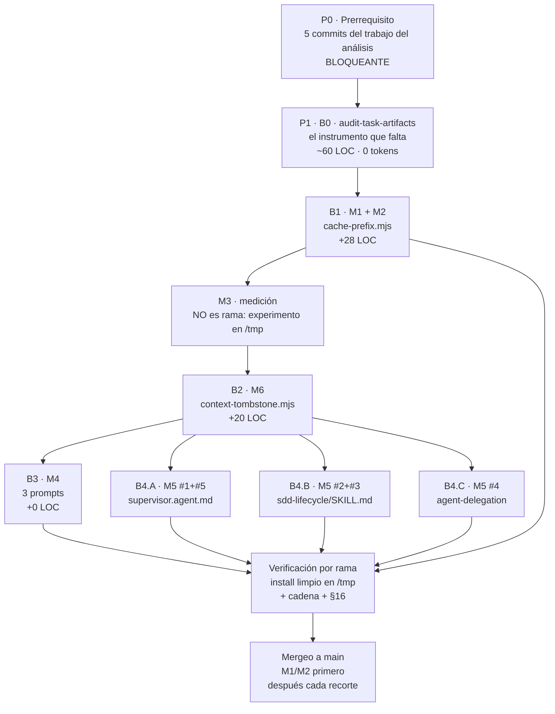

# AOI — Plan de Ejecución por Fases y Ramas Independientes

> **Document ID:** `AOI-EXEC-2026-09-19`
> **Tipo:** Protocolo de ejecución. Traduce el *qué* y el *por qué* del plan de gobernanza a
> *cómo se prueba cada paso sin contaminar a los demás*.
> **Estado:** **ABIERTO — es un documento, no una autorización.** Ninguna fase está aprobada.
> **Fecha:** 2026-09-19
> **Autor / Modelo:** GitHub Copilot · Deepseek v4 flash (Provider: Deepseek)
> **Basado en:** `AOI_CONTEXT_GOVERNANCE_IMPLEMENTATION_PLAN_2026-09-19.md` §8 (los movimientos)
> y §16 (la verificación por fase). Las referencias a esos puntos se citan como `[PLAN §X]`.
> **Sello:** `v2.5.2-103-gb1b6863` · HEAD `b1b6863` · rama `main`

---

## 1. Qué es esto y qué no

**Es** el procedimiento para ejecutar cada movimiento del plan en una rama propia, medirlo
aislado, y no mergear nada que no haya pasado la batería. Su unidad de trabajo es **la rama**, y
su producto por rama es **un número medido**, no una promesa.

**No es** una autorización para empezar, ni un reemplazo del plan. El plan dice qué recortar y
por qué; esto dice cómo probarlo. Y **no se adelanta nada de lo que describe**: este documento
tampoco abre ramas, ni toca archivos gobernados.

### 1.1. La regla que gobierna todo el protocolo

> **La unidad de independencia es el ARCHIVO, no el movimiento.**

Dos movimientos que editan el mismo archivo **no pueden vivir en ramas separadas**: no serían
independientes, serían un conflicto diferido. El plan `[PLAN §8.6]` proponía **cinco** ramas para
M5, una por bloque de prosa. **Es incorrecto:** dos pares de bloques comparten archivo.

| `[PLAN §8.6]` proponía | La medición dice | Corrección |
| :--- | :--- | :--- |
| M5 en 5 ramas, una por bloque | Bloques #1 y #5 → `supervisor.agent.md`. Bloques #2 y #3 → `sdd-lifecycle/SKILL.md` | **3 ramas, una por archivo** |
| M1 y M2 en ramas separadas | Ambos editan `cache-prefix.mjs` y `cache-prefix.test.mjs` | **1 rama**, dos movimientos |
| M4 y M6 en ramas separadas | Archivos distintos (`prompts` vs `context-tombstone.mjs`) | **Correcto**, pero con orden obligatorio |

**Consecuencia del recuento:** donde el plan veía 8 movimientos hay **6 ramas**. Menos ramas y
más aislamiento real, porque cada una toca exactamente un archivo de producto.

---

## 2. La forma de la ejecución



**Las dos reglas del orden:**

1. **M1 entra antes que cualquier recorte.** Sin el trinquete, cada recorte de B4 se erosiona solo
   y la medición de la rama siguiente ya no es comparable `[PLAN §5.2]`.
2. **M6 entra antes que M4.** M4 invoca `context-tombstone` en dos fases nuevas, y hoy esa
   herramienta **no tiene entrada CLI** `[PLAN §8.4]`. Invocar una librería sin ejecutable no
   cablea nada.

---

## 3. P0 · Prerrequisito bloqueante: los 5 commits del análisis

### 3.1. Por qué bloquea

**Hay 17 archivos modificados y 1 directorio sin commitear**, producto del análisis y de los
arreglos que ese análisis encontró. Si se abre una rama desde acá, **cada rama arrastra los 17**
y la independencia es una ilusión: el diff de la rama no distingue lo suyo de lo heredado, y
revertirla revertiría trabajo ajeno `[PLAN §3.7.4]`.

**No es una formalidad de proceso.** El repositorio ya pagó esta forma dos veces: el commit
`a0f162a` revirtió `mutation-probe.mjs` a una versión vieja y devolvió 44 archivos, y el
incidente del espejo dejó el árbol verde en apariencia. La regla vigente es explícita: **listar
los archivos explícitamente en cada `git add`, nunca `-A`**.

### 3.2. Los cinco commits

Cada uno con **una causa**, para que cada uno sea revertible sin arrastrar los otros.

| # | Área | Mensaje propuesto | Archivos (raíz + espejo) |
| :-: | :--- | :--- | :--- |
| **C1** | `mcp-gateway` | `fix(mcp-gateway): cinco firmas declaradas que no eran las de las herramientas` | `mcp-gateway.config.json` · `setup-mcp-gateway.mjs` · `setup-mcp-gateway.test.mjs` · `server-wrapping.test.mjs` |
| **C2** | `sdd-lifecycle` | `fix(sdd-lifecycle): el --help prometia exit 0 donde el gate bloquea` | `invariant-gate.mjs` · `gate-cli-surface.test.mjs` |
| **C3** | `multi-harness` | `fix(multi-harness): la tolerancia de prosa narrativa nombraba un fantasma` | `reference-integrity.mjs` |
| **C4** | `multi-harness` | `fix(multi-harness): el test dejaba un arbol temporal por corrida` | `install-git-guard.test.mjs` |
| **C5** | `installer` | `fix(installer): ningun trap cubria la salida anormal` | `setup.sh` (**sin espejo**: está en `FORBIDDEN_IN_SCAFFOLD`) |

**Convención de mensaje:** la que el repositorio ya usa — `fix(<area>): <descripción>`,
minúscula, en español, sin atribución. Los últimos seis commits siguen exactamente esa forma.

**Ninguno exige `[aoi-managed-ok]`.** Verificado: el guard de `commit-msg` cubre sólo
`.github/copilot-instructions.md`, `CLAUDE.md`, `AGENTS.md`, `.cursorrules`,
`.cursor/rules/aoi-rules.mdc`, `.clinerules`, `.agents/rules/aoi-rules.md` — y ninguno de los 17
está en esa lista.

### 3.3. Secuencia por commit

```text
1. git status --porcelain                        → confirmar la lista exacta
2. git add <los archivos de ESE commit, explícitos>   (nunca -A)
3. git diff --cached --stat                      → LEER el --stat ANTES de escribir el mensaje
4. el gate del área + parity                     → ver §3.4
5. git commit -m "<mensaje del cuadro>"
6. git show --stat | rg -c 'scaffold|CLAUDE|AGENTS'   → 0 en los no relacionados
```

El paso 3 existe por una lección medida: **un `--stat` con cientos de líneas en un fix de dos
cosas es la alarma**, y se lee antes del mensaje, no después del commit.

### 3.4. El gate por commit

| Commit | Gate antes de commitear |
| :--- | :--- |
| C1 | `node --test scripts/mcp-gateway/*.test.mjs` + `aoi:audit-protocol` |
| C2 | `node --test scripts/sdd-lifecycle/gate-cli-surface.test.mjs` + `aoi:invariant-gate` |
| C3 | `node --test scripts/multi-harness/reference-integrity.test.mjs` + `aoi:lint-refs` |
| C4 | `node --test scripts/multi-harness/install-git-guard.test.mjs` |
| C5 | `bash -n setup.sh` |
| **todos** | `node scripts/scaffold/validate-scaffold-parity.mjs` → **413 byte-for-byte, exit 0** |

### 3.5. Estado de partida, medido — y hay que declarar las DOS superficies

| Métrica | Repo de desarrollo | Instalación limpia |
| :--- | ---: | ---: |
| Doctor | **14 Passed · 1 Warning · 0 Failed** | **15 Passed · 0 Warning · 0 Failed** |
| Cadena | exit 0 · **1533 tests · 1532 pass · 0 fail · 1 skip** | exit 0 · **1395 · 1384 · 0 · 11** |
| Paridad | 413 gobernados byte-for-byte | modo instalado (Principio I no aplica) |
| Warning conocido | *"Sin repo instalado: guard de git informativo (`.git/hooks/commit-msg` ausente)"* | — |

> **El warning del repo es informativo y está declarado por el propio doctor**: en un repositorio
> que **no** es una instalación, el guard de `commit-msg` no bloquea nada. Y es un dato que
> importa para este protocolo: **el guard de archivos gestionados NO corre acá**, así que la
> regla de no tocar `CLAUDE.md` ni los dialectos depende de quien ejecuta, no de una compuerta.
>
> **Comparar contra la superficie equivocada produce un falso hallazgo.** El `15/0/0` que este
> análisis reportó antes era de la **instalación**; el repo da `14/1/0`. Los dos son correctos y
> no son intercambiables.

### 3.6. Criterio de salida de P0

- `git status --porcelain` → **sólo** `?? docs/internal/proposals/` (el directorio de documentos,
> deliberadamente sin trackear hasta que el Owner decida).
- Los cinco commits existen, cada uno con su causa.
- `pnpm test` exit **0** y paridad en **413**.

---

## 4. P1 · B0: el instrumento que falta

### 4.1. Qué falta, exactamente

`[PLAN §16.3]` identificó el hueco: **todos los instrumentos son estáticos.** Leen la prosa de los
prompts y los archivos en disco. **Ninguno mira la corrida que acaba de pasar.**

| Pregunta | ¿Hay instrumento? | Medido |
| :--- | :--- | :--- |
| ¿El **contrato** fase→artefacto es coherente? | Sí | `aoi:handoffs` (paso 5 de 26) |
| ¿El **registro** refleja las tareas? | Sí | `aoi:registry` (paso 9) |
| ¿El SBC está **cerrado**, con diagrama si aplica? | Sí | `aoi:blueprint-gate` (fuera de la cadena) |
| ¿Cada **herramienta** está cableada en prosa? | Sí | `aoi:tools` (paso 7) |
| ¿La fase N **produjo** su artefacto **en esta corrida**? | **NO** | — |
| ¿La fase N **invocó** sus herramientas **en esta corrida**? | **NO** | — |

Verificado buscando un auditor existente: `phase-handoffs.mjs` no tiene un solo `existsSync` sobre
artefactos de tarea; `registry-sync.mjs` usa `existsSync` sólo para enumerar tareas, no para exigir
productos; `blueprint-gate.mjs` valida la obligación de diagrama del SBC. **La fila que falta no
tiene dueño.**

### 4.2. Por qué va primero, y no al final

**Porque es el instrumento con el que se verifican TODAS las demás ramas.** Ponerlo al final
significa que B1, B2, B3 y B4 se verifican con el paso 7 de `[PLAN §16.4]` hecho **a mano**, y una
verificación manual por rama no es comparable entre ramas: depende de que quien mira se acuerde de
mirar lo mismo.

**Es también el movimiento de menor riesgo del conjunto:** archivo nuevo, lectura pura, 0 tokens
de inferencia, 0 superficie inyectada.

### 4.3. Forma

| Aspecto | Definición |
| :--- | :--- |
| Archivo | `scripts/sdd-lifecycle/audit-task-artifacts.mjs` (~60 LOC) más su test (~80 LOC) |
| Entrada | `HANDOFFS` de `phase-handoffs.mjs` (ya declara qué produce cada fase) + el `.tasks/` real |
| Qué hace | Para cada tarea, confronta los artefactos **declarados** contra los **presentes**, y reporta faltantes y vacíos |
| Salida | Lista de `fase → artefacto → presente/ausente/vacío`, y exit 1 si falta uno declarado |
| Costo | **0 tokens de inferencia.** Aritmética de filesystem |
| Entrada en `package.json` | `aoi:task-artifacts` |
| ¿En la cadena de `pnpm test`? | **No.** Necesita `.tasks/` real, y en el repo de desarrollo el ciclo no corre `[PLAN §16.4, paso 7]` |
| Espejo | `scaffold/scripts/sdd-lifecycle/` — ruta gobernada |
| Compuertas propias | `aoi:test-globs` (el glob ya existe) · `aoi:srp` (140 < 300) · `test:parity` · `aoi:reachability` |
| Precedente a copiar | `blueprint-gate.mjs`: misma forma (leer una obligación declarada y confrontarla contra el árbol) |

**Lo que este instrumento NO hace:** no juzga el **contenido** de un artefacto. Que `spec.md`
exista y no esté vacío es todo lo que afirma. Juzgar el contenido es del juez conductual
(`aoi:probes:judge`), no de una compuerta determinista.

---

## 5. El protocolo de rama: 12 pasos

Igual para **todas** las ramas. Lo que cambia por rama es el contenido de los pasos 5, 6 y 7.

| # | Paso | Comando / criterio |
| :-: | :--- | :--- |
| 1 | **Base limpia** | P0 cerrado. `git status --porcelain` sin modificados. HEAD registrado. |
| 2 | **Nombre de rama** | Convención del repo: `perf/ctx-m1-band-ratchet`, `fix/ctx-m6-tombstone-cli`, `docs/ctx-b4b-skill-trim`. Ver §6. |
| 3 | **Baseline ANTES** | El valor que la rama va a mover, medido **con el instrumento que lo va a juzgar**. Para las que tocan la banda: `node scripts/sdd-lifecycle/cache-prefix.mjs` y su huella. |
| 4 | **Rama desde `main`** | `git switch -c <nombre> main` |
| 5 | **El cambio** | Sólo los archivos de la rama. **Un archivo de producto por rama** (§1.1). |
| 6 | **Espejo** | `cp` a `scaffold/` en el mismo commit, si la ruta es gobernada. `setup.sh` y `scripts/conf/` **no** llevan. |
| 7 | **Compuertas mínimas** | Las tres que importan en toda rama: **el suite del área** + `test:parity` + `aoi:srp`. Más las específicas de §6. |
| 8 | **Control negativo** | §5.1. Es **criterio de aceptación**, no un extra. |
| 9 | **Cadena completa** | `pnpm test` → exit 0 en el repo. |
| 10 | **Install limpio en `/tmp`** | §5.2. Desde el árbol de la rama. |
| 11 | **§16 dentro de la instalación** | Los 7 pasos de `[PLAN §16.4]`, con `audit-task-artifacts` (B0) ya disponible. |
| 12 | **Ledger** | Anotar el ANTES y el DESPUÉS en la tabla de §9. Sin esa fila, el ahorro no es atribuible. |

### 5.1. El control negativo, con su forma exacta

Es la única prueba de que una guarda protege `[PLAN §10.3]`. **Cuatro pasos, en este orden, y los
cuatro son obligatorios:**

```text
1. MUTAR      aplicar la mutación al archivo
2. VERIFICAR  releer el archivo y confirmar que la mutación ESTÁ EN DISCO
3. SINTaxis   node --check <archivo>   (una mutación que rompe el parseo da un rojo falso)
4. MEDIR      correr el test y comparar el `fail` con el ESPERADO, leyendo el nombre del test caído
```

**Los tres falsos verdes ya medidos en este repositorio `[PLAN §15.2]`, y por qué cada paso existe:**

| Falso verde | Paso que lo caza |
| :--- | :--- |
| La mutación **no se aplicó** (regex multilínea en un `node -e`) → el test pasa y se lee como fallo de la guarda | **2** |
| La mutación **rompió la sintaxis** → todos los tests del archivo fallan, parece detección contundente | **3** |
| La mutación **se pasó de alcance** → `fail=2` cuando se esperaba 1, y el rojo se atribuye a la aserción equivocada | **4** |

**Restauración:** respaldar el archivo antes de mutar y restaurarlo después, **en un paso
separado**. Un comando que sale distinto de 0 **aborta el resto de la línea** en la terminal, así
que una restauración encadenada tras el test que se espera que falle **no corre** `[PLAN §15.2]`.

### 5.2. El install limpio por rama

**Política vigente: `/tmp`, creado desde cero en cada prueba.** No un directorio reutilizado.

```text
rm -rf /tmp/aoi-<rama>; mkdir -p /tmp/aoi-<rama>/ws
bash setup.sh -y --harness all /tmp/aoi-<rama>/ws
```

**Precondición del instalador, medida:** `setup.sh` **falla con `✗ Directory not found` y exit 1
si el destino no existe** (`setup.sh:455` y `:664`). **No lo crea.** El `mkdir` es obligatorio.

**Dos localizaciones distintas, y confundirlas invalida una auditoría de residuos:**

| Camino | Qué es |
| :--- | :--- |
| `/tmp/...` | Symlink a `/private/tmp`. Donde van **las instalaciones de prueba** |
| `os.tmpdir()` = `/var/folders/<hash>/T` | Donde las **suites** crean sus temporales. **No es lo mismo** |

**Esperado por rama, medido sobre el árbol actual:** `install_exit=0` · **758** archivos · doctor
**15/0/0** · cadena **exit 0** con ~**1395** tests y **0 fail**.

---

## 6. Las ramas, una por una

### B1 · M1 + M2 — el trinquete y la luz, en el instrumento que ya existe

| | |
| :--- | :--- |
| **Rama** | `perf/ctx-b1-band-ratchet` |
| **Archivos** | `scripts/sdd-lifecycle/cache-prefix.mjs` (**252 → ~280 de 300**) · `cache-prefix.test.mjs` (+~55 LOC) |
| **Por qué dos movimientos juntos** | M1 (`auditBandBudget`) y M2 (imprimir adaptadores) editan **el mismo archivo**. Separarlos no daría independencia, daría un conflicto |
| **LOC** | **+28** |
| **Qué cambia** | `BAND_BUDGET` + `BAND_CEILING` + `auditBandBudget()` pura + un término en el array `failures` que ya existe + `console.log(formatHarnessAdapters(...))` en `main()` |
| **Baseline ANTES** | Banda `9.457` tok/fase · ciclo `66.199` · huella `a48f43cd31f14b6f` · exit 0 |
| **Después esperado** | Los mismos números. **Esta rama no ahorra: protege.** Más una línea nueva con los adaptadores |
| **Compuertas específicas** | `aoi:cache-prefix` (exit 0 + `La masa repetida no muta`) · `aoi:audit-protocol` (`SYMBOL_CONTRACTS` intactos) · `cli-surface.test.mjs` · `cache-prefix.test.mjs` · `aoi:probes` (`never.3`, byte-identical en espejo) |
| **Control negativo** | **Cinco mutaciones, una por regla.** El caso que decide es `NEW IN BAND`: si el gate no lo detecta, el modo de falla más caro sigue abierto |
| **Riesgo principal** | `MUTATION_FLOOR['scripts/sdd-lifecycle']=68`. Sumar código a un archivo existente **agrega mutantes** y puede bajar el porcentaje. Mitigación: función pura y exportada; defaults ejercitados **omitiendo** el argumento |
| **Criterio de merge** | La cadena en 0, los cinco controles negativos demostrados, y el baseline de la banda **sin cambios** |

### B2 · M6 — el CLI de `context-tombstone`

| | |
| :--- | :--- |
| **Rama** | `fix/ctx-b2-tombstone-cli` |
| **Archivos** | `scripts/subagent-context/context-tombstone.mjs` (**143 → ~163**) |
| **LOC** | **+20** |
| **Qué cambia** | Bloque de entrada con `--file`, `--threshold`, `--dry-run`, `--output` |
| **Por qué antes que B3** | B3 invoca `context-tombstone` en dos fases nuevas. **Sin CLI, la invocación no tiene forma de ejecutarse**: hoy el módulo es una librería que sólo importa el stress-suite |
| **Compuertas específicas** | `test:subagent-payload` · `aoi:tools` (**el conteo por herramienta no baja**) · `gate-exit-codes.test.mjs` (muta el fuente reemplazando la cadena `context-tombstone`) · `token-tool-coverage.test.mjs` |
| **Control negativo** | Ejecutar `--file` apuntando a un JSON inválido → exit 1 con mensaje, **no** un stack de `node:fs`. Y omitir los flags → uso y exit 0 |
| **Riesgo principal** | `gate-exit-codes` muta este archivo. Correr esa suite **antes** de cerrar |
| **Criterio de merge** | Los 4 flags responden; ~163 LOC < 300; las dos suites de compuertas verdes |

### B3 · M4 — desplegar las herramientas donde faltan

| | |
| :--- | :--- |
| **Rama** | `perf/ctx-b3-deploy-tools` |
| **Archivos** | `.github/prompts/sdd-ff.prompt.md` · `.github/prompts/sdd-verify.prompt.md` · `.github/prompts/sdd-archive.prompt.md` |
| **LOC de código** | **0.** Son líneas de invocación en prosa, **×1** (los prompts son masa por fase) |
| **Dependencia** | **B2 mergeado.** `context-tombstone` sin CLI no es invocable |
| **Baseline ANTES** | `aoi:tools`: 12 obligatorias, **6 en una sola superficie** · `/sdd-ff` con **0** herramientas de proceso, 23.471 tok fijos, 25,9% de reducción |
| **Qué cambia** | `ast-skeletonizer` y `context-tombstone` en `/sdd-ff`; `ast-skeletonizer` en `/sdd-verify`; `context-tombstone` en `/sdd-archive` |
| **Después esperado** | El **conteo de superficies sube** para cada herramienta tocada. Un valor distinto a eso significa que la invocación **no cableó** |
| **Compuertas específicas** | `aoi:tools` (**el indicador principal de esta rama**) · `aoi:cache-guard` · `aoi:lint-refs` · `aoi:probes` de las 3 fases tocadas |
| **Control negativo** | **Escribir una invocación en prosa y confirmar que `aoi:tools` NO sube el conteo.** Sin eso, no se sabe si el conteo mide cableado o menciones |
| **La regla de escritura** | `invokesTool()` es **posicional**: la herramienta tiene que estar en un **code span**, en un **fence**, o al **inicio de una línea de shell**. Su antecedente documentado: un prompt que decía *"we removed context-tombstone"* pasaba el gate, y *"do not **use** it"* también |
| **Ahorro** | **NO MEDIDO.** El fixture de `/sdd-ff` no ejercita las herramientas que esa fase no tiene. Se mide con `[PLAN §8.4c]` antes de reclamarlo |
| **Criterio de merge** | El conteo sube para las 4 invocaciones, las 3 fases pasan sus sondas, y el ahorro queda medido **o declarado no medido** |

### B4.A · M5 #1 + #5 — `supervisor.agent.md`

| | |
| :--- | :--- |
| **Rama** | `perf/ctx-b4a-supervisor` |
| **Archivos** | `.github/agents/supervisor.agent.md` · `behavioral-scenarios-entry.mjs` (el escenario del corte) |
| **Por qué dos bloques juntos** | #1 (columnas derivables de la tabla de ruteo, ~500 tok) y #5 (`Session Start`, ~80 tok) **viven en el mismo archivo** |
| **Baseline ANTES** | 2.420 tok · ×7 = **16.940/ciclo** · cap G1 en 2.800 `[PLAN §3.5]` |
| **Qué NO se puede tocar** | **La tabla no admite puntero.** `lifecycle-wiring.test.mjs` la parsea con `slice(indexOf('## SDD Lifecycle — Phase Routing'), indexOf('## Hub-and-Spoke'))` y exige **una fila por fase** con `**Fase**` + `@agente`. Con un puntero ambas anclas dan `-1`, `slice(-1,-1)` da `''`, y **fallan siete aserciones** `[PLAN §3.8.2a]`. Lo que **sí** se puede: perder las columnas **derivables** (`Spec-Kit Command`, `Deliverable`, `Artifact Path` — `phase-handoffs.mjs` ya tiene los artefactos) |
| **Qué NO se puede tocar (2)** | El supervisor **debe conservar** `Intent Gate`, `Flexible Archive Gate`, `proposal.md`, `implementation-plan.md`. El bloque #4 del plan **está bloqueado** por esa razón, y **no entra en esta rama** |
| **Compuertas específicas** | `test:multi-harness` entero (6 aserciones de contenido + dedup + cap) · `aoi:routing` · `aoi:probes` de `Phase_4_Verify` y `Phase_0_Frame` |
| **Control negativo** | Sacar un literal de compuerta → `lifecycle-wiring` debe fallar **nombrándolo**. Y mover una fila de la tabla → deben fallar las **siete** |
| **Ahorro esperado** | ~500 tok/fase declarado como techo; **el valor real lo captura B1** y se lee del trinquete, no de esta tabla |
| **Criterio de merge** | Las 7 fases siguen ruteando; el escenario conductual del corte registrado y juzgado; G1 y el trinquete de B1 en verde |

### B4.B · M5 #2 + #3 — `sdd-lifecycle/SKILL.md`

| | |
| :--- | :--- |
| **Rama** | `perf/ctx-b4b-skill-trim` |
| **Archivos** | `.github/skills/sdd-lifecycle/SKILL.md` · `behavioral-scenarios-entry.mjs` |
| **Por qué juntos** | #2 (`Phase Gates`, ~450 tok) y #3 (`Before/During/After`, ~185 tok) comparten archivo |
| **Baseline ANTES** | 1.510 tok · ×7 = **10.570/ciclo** · **sin cap de tamaño** `[PLAN §3.5.1a]` |
| **Qué NO se puede tocar** | El test exige que el skill **mencione** `triage-specialist` y `sdd-frame`; y prohíbe que **vuelvan** la tabla de escenarios de triage y la guía de entrada (viven en `@triage-specialist` y en `sdd-entry`) `[PLAN §3.9]` |
| **Qué se pierde, y por qué es seguro** | El bloque #3 duplica el protocolo ICM por fase, que **está protegido en `icm-protocol.instructions.md` §8 y se queda**. La fuente no se pierde: es el único caso del plan donde un recorte tiene respaldo explícito en otro archivo |
| **Compuertas específicas** | `test:multi-harness` · `aoi:importance` · `aoi:audit-protocol` · `aoi:probes` de `Phase_1_New` y `Phase_4_Verify` |
| **Control negativo** | Reintroducir la tabla de triage → el test debe fallar por su nombre |
| **Criterio de merge** | Los dos contratos de contenido intactos, y el escenario conductual del corte registrado |

### B4.C · M5 #4 — `agent-delegation.instructions.md`

| | |
| :--- | :--- |
| **Rama** | `perf/ctx-b4c-delegation-trim` |
| **Archivos** | `.github/instructions/agent-delegation.instructions.md` · `behavioral-scenarios-entry.mjs` |
| **Baseline ANTES** | 2.031 tok · ×7 = **14.217/ciclo** · sin cap de tamaño |
| **Qué se va** | El bloque `Example: Invoking solution-architect` (~170 tok). Es **ilustrativo**: los pasos 1–4 y el registro lo definen |
| **Qué NO se puede tocar** | El **registro de los 27 agentes** con modelo y fallback, y el *picker cue* **exactamente una vez**. `aoi:routing` falla si un agente en disco no está en el registro `[PLAN §3.9]` |
| **Compuertas específicas** | `aoi:routing` (**el indicador principal**) · `test:multi-harness` |
| **Control negativo** | Sacar un agente del registro → `aoi:routing` debe nombrarlo |
| **Criterio de merge** | Los 27 agentes siguen registrados con modelo y fallback |

### M5 #6 y #7 — **no son ramas**

`[PLAN §7.2.2]` los marcó **BLOQUEADOS** por tests:

| Bloque | tok/fase | Por qué no es rama |
| :--- | ---: | :--- |
| #6 `Workflow Commands → Owner Gates` (supervisor) | 315 | El test exige que el supervisor conserve **literalmente** los 4 nombres de compuerta, y viven sólo ahí |
| #7 `icm-protocol` §8 | 338 | **Las 8 aserciones** de `icm-protocol-completeness` viven ahí: los triggers `` `nivel` → `` y las operaciones no-store. Borrarlo **rompe el contrato del protocolo** |

**No entran en ninguna rama.** Si el Owner quiere recuperarlos, es un movimiento propio que
**primero enmienda el contrato de los tests** — con su justificación, y no como efecto colateral
de un recorte.

### B5 · M3 — la medición: **no es una rama**

| | |
| :--- | :--- |
| **Dónde** | `/tmp`, en una instalación de prueba. **No en el repo** |
| **Producto** | Un dato, no un cambio: un reporte con los tres experimentos de `[PLAN §8.4]` |
| **Qué decide** | Si el esfuerzo va a la **banda universal** o a la **masa por fase**. Y si el ahorro de B3 se puede reclamar |
| **Control negativo obligatorio** | Dos corridas del mismo ciclo, una con el prefijo **deliberadamente roto**, comparando contadores y latencias del proveedor, con `surfaceDigest` **idéntico** entre las dos |
| **Estado** | **Pendiente y bloqueante del orden de B3/B4.** Hasta tenerlo, la elección entre trim universal y masa por fase es una apuesta `[PLAN §9.4]` |

---

## 7. Orden de mergeo, dependencias y conflictos

### 7.1. El orden

| Turno | Rama | Por qué en ese lugar |
| :-: | :--- | :--- |
| 1 | **B0** `audit-task-artifacts` | Es el instrumento con el que se verifican las demás. Sin él, el paso 7 de `[PLAN §16.4]` es manual |
| 2 | **B1** `M1+M2` | **Cambia el baseline que B4.A/B/C usan.** Mergearlo primero hace que cada recorte siguiente quede capturado al momento de mergear |
| 3 | **B2** `M6` | Prerrequisito de B3 |
| 4 | **B3** `M4` | Despliega herramientas. Su valor **no depende del régimen de caché**, así que puede entrar sin esperar a B5 |
| 5 | **B4.A · B4.B · B4.C** | Los recortes. **Cualquier orden entre ellos**: archivos distintos, sin conflicto |
| 6 | **B5** `M3` | La medición. Cierra el número y decide si queda algo por hacer del lado de la masa por fase |

### 7.2. Matriz de conflictos, por archivo

| Archivo | Ramas que lo tocan | Conflicto |
| :--- | :--- | :---: |
| `scripts/sdd-lifecycle/cache-prefix.mjs` | **B1** | ninguno |
| `scripts/subagent-context/context-tombstone.mjs` | **B2** | ninguno |
| `.github/prompts/sdd-*.prompt.md` | **B3** | ninguno |
| `.github/agents/supervisor.agent.md` | **B4.A** | ninguno |
| `.github/skills/sdd-lifecycle/SKILL.md` | **B4.B** | ninguno |
| `.github/instructions/agent-delegation.instructions.md` | **B4.C** | ninguno |
| `scripts/sdd-lifecycle/behavioral-scenarios-entry.mjs` | **B4.A · B4.B · B4.C** | **⚠️ los tres** |
| `scaffold/**` (espejos) | todas | sigue a su raíz |

**El único punto de conflicto es `behavioral-scenarios-entry.mjs`**, porque las tres ramas de
recorte agregan su escenario conductual al mismo registro. Tres opciones, y **la recomendación es
la tercera**:

1. **Serializar B4.A → B4.B → B4.C** y rebasar cada una sobre la anterior. Simple, pero pierde la
   independencia: si B4.B se rechaza, B4.C ya está rebasada sobre algo que no va a existir.
2. **Dejar los escenarios para un commit de cierre** después de las tres. Mantiene la
   independencia, pero el corte queda sin su prueba durante la rama — que es justo lo que
   `[PLAN §3.12]` prohíbe.
3. **Adoptar la regla del archivo único con una excepción declarada:** los escenarios viajan con
   su rama, y el conflicto **se resuelve a mano en el merge del segundo y el tercero**, sabiendo
   que es aditivo (cada rama agrega una entrada nueva, no modifica las existentes). **Un conflicto
   aditivo de tres entradas es trivial y predecible.** Se declara acá para que no sorprenda.

### 7.3. Si una rama se rechaza

**Las demás no se enteran.** Esa es la propiedad que este protocolo compra con la regla del archivo
único. Los únicos dos casos donde un rechazo arrastra a otro:

| Si se rechaza | Arrastra a | Por qué | Mitigación |
| :--- | :--- | :--- | :--- |
| **B1** | B4.A · B4.B · B4.C | Sin trinquete, los recortes no quedan capturados y su medición no es comparable | **B4 no arranca hasta que B1 esté mergeada.** No es opcional `[PLAN §2.3]` |
| **B2** | B3 | La invocación del tombstone en 2 fases nuevas no tiene ejecutable | B3 puede entrar **parcial**: con `ast-skeletonizer` solo, que sí tiene CLI |

---

## 8. Verificación por ciclo SDD: artefactos + herramientas

**Regla permanente `[PLAN §16]`, aplicada por rama.** En **cada** prueba del ciclo, en **cada** una
de sus 7 fases, se verifican **dos dimensiones**:

| # | Dimensión | La pregunta | Instrumento |
| :-: | :--- | :--- | :--- |
| **A** | **Artefactos** | ¿La fase **produjo** lo que su contrato declara, en la ruta declarada? | `aoi:handoffs` (contrato) + **B0** (existencia en la corrida) |
| **B** | **Herramientas** | ¿Invocó las que le corresponden, **con los nombres reales** y por el canal correcto? | `aoi:tools` + `aoi:lint-refs` + `aoi:probes:judge` |

### 8.1. La cobertura ya medida: 28 sondas por las 7 fases

`aoi:probes` emite **28 sondas**, **13 de artefactos y 15 de herramientas**, distribuidas así:

| Fase | Sondas | Artefactos | Herramientas |
| :--- | ---: | :--- | :--- |
| `Phase_-2_Genesis` | 3 | `genesis-zero-footprint`, `genesis-diagram-deferred` | `genesis-approval-meaning` |
| `Phase_0_Frame` | 3 | `zero-task-footprint`, `bic-persistence` | `entry-command` |
| `Phase_1_New` | 4 | `service-discovery-mandatory` | `service-discovery-method`, `facts-vs-memory`, `rtk-prefix` |
| `Phase_2_FF` | 4 | `bic-tag-in-test` | `model-parameter`, `specify-agent`, `plan-agent` |
| `Phase_3_Apply` | 5 | `missing-upstream-artifact`, `srp-limit` | `tdd-red-first`, `payload-sanitization`, `icm-importance` |
| `Phase_4_Verify` | 6 | `upstream-contract-source`, `invariant-gate-fail` | `verify-delegation`, `triage-routing`, `invariant-gap-routing`, `mechanical-union` |
| `Phase_5_Archive` | 3 | `registry-closure`, `archive-precondition` | `archive-agent` |
| **Total** | **28** | **13** | **15** |

**El `--emit` escribe en `/tmp/aoi-probes`** —literal en `behavioral-runner.mjs:111`, **no**
`os.tmpdir()`—. En macOS eso lo deja en el `/tmp` real, que es donde un operador lo busca.

### 8.2. La checklist, editable por rama

| # | Verificación | Comando | Esperado |
| :-: | :--- | :--- | :--- |
| 1 | Contrato de artefactos | `node scripts/sdd-lifecycle/phase-handoffs.mjs` | `✅ Cada artefacto exigido lo produce una fase anterior` |
| 2 | Registro consistente | `pnpm aoi:registry` | exit 0 |
| 3 | Herramientas cableadas | `node scripts/multi-harness/token-tool-coverage.mjs` | 12 ✅, y **el conteo sube** si la rama despliega |
| 4 | Nombres de tool resuelven | `node scripts/multi-harness/reference-integrity.mjs` | `✅ Every script, command, @agent and MCP tool reference resolves` |
| 5 | Invariantes del BIC aseridos | `node scripts/sdd-lifecycle/invariant-gate.mjs --entity "{WORKSPACE}" --tests-dir . --exit-code` | **exit 0**. **`--entity` es obligatorio** — ver §8.3 |
| 6 | Sondas por fase | `pnpm aoi:probes` → `pnpm aoi:probes:judge` | 28 emitidas · juicio sin fallos |
| 7 | Artefactos en la corrida real | `pnpm aoi:task-artifacts` (**B0**) | cada artefacto declarado **presente** y no vacío |

### 8.3. La trampa del paso 5, medida

`pnpm aoi:invariant-gate` **sale 2 en un workspace nuevo**, y no es un defecto: el alias de
`package.json` **no pasa `--entity`**, y una **entidad inferida** sin contrato bloquea a propósito
—*"una entidad INFERIDA no puede distinguir «la tarea nunca pasó por /sdd-frame» de «adiviné el
nombre»"*—, con dos tests propios que lo fijan `[PLAN §16.4]`.

**La forma correcta es la que usa `/sdd-verify`: `--entity "{WORKSPACE}"` explícito.** En la
checklist, el paso 5 sale **0** así y **2** sin eso. Una checklist que use el alias reporta un
bloqueo donde no lo hay.

---

## 9. El ledger de medición

**Sin esta tabla, ningún ahorro es atribuible.** El plan `[PLAN §7.2.3]` lo dejó dicho: la cifra de
cada bloque no se declara al escribir, se **mide** después de la edición y la captura el trinquete.

| Rama | Métrica ANTES | Qué cambia | DESPUÉS (medido) | Δ | Huella | Fecha |
| :--- | :--- | :--- | :--- | ---: | :--- | :--- |
| **B0** | ninguna compuerta miraba la corrida | `audit-task-artifacts.mjs` (225 LOC) + test (231) + `aoi:task-artifacts` | **18 tests nuevos** · paridad 413 → **415** · cadena 1533 → **1551** | **0 tokens** (instrumento) | — | 2026-09-19 |
| **B1** | banda `9.457`/fase · ciclo `66.199` · huella `a48f43cd31f14b6f` · 3.722 tok de adaptadores **invisibles** | trinquete (`band-budget.mjs`, 103 LOC) + adaptadores impresos | Banda **idéntica**: 8 archivos · `9.457` · `66.199` · huella `a48f43cd31f14b6f`. Adaptadores **visibles**: `3.722 tok = 3,57% del piso` | **0** — protege, no ahorra | `a48f43cd31f14b6f` (sin cambio) | 2026-09-19 |
| **B2** | `143` LOC · sin CLI · **la invocación del prompt no podía correr** | CLI en archivo propio (188 LOC) | **5 turnos → 2 tumbados · 185 → 31 tok (83,2%)** en el fixture. Módulo del algoritmo **intacto** en 144 LOC | 0 en banda | — | 2026-09-19 |
| **B3** | `ast-skeletonizer`: 1 superficie · ciclo `105.466` | la invocación al paso 5 de `/sdd-verify` | `ast-skeletonizer`: **2 superficies** · ciclo **`105.532` = +66 tok** (×1, medido) | **+66** de costo fijo | `a48f43cd31f14b6f` (sin cambio) | 2026-09-19 |
| **B4.A** | `2.420` tok · `16.940`/ciclo | quitar el padding de la tabla de ruteo | **`1.707` tok · `11.949`/ciclo** · banda `9.457 → 8.744`/fase · ciclo **`105.466 → 100.545`** | **−4.921/ciclo** | `a48f43cd31f14b6f` → **`1a990169267eb204`** | 2026-09-19 |
| **B4.B** | `1.510` tok · `10.570`/ciclo | padding + columna derivable + B/D/A redundante | **`1.155` tok · `8.085`/ciclo** · banda `8.744 → 8.389`/fase · ciclo **`100.545 → 98.060`** | **−2.485/ciclo** | `1a990169267eb204` → **`b09415441e545056`** | 2026-09-19 |
| **B4.C** | `2.031` tok · `14.217`/ciclo | el `Example`, redundante y equivocado | **`1.861` tok · `13.027`/ciclo** · banda `8.389 → 8.219`/fase · ciclo **`98.060 → 96.870`** | **−1.190/ciclo** | `b09415441e545056` → **`b189f6d1759e11ae`** | 2026-09-19 |
| **B5** | `105.466`/ciclo (modelo de Copilot) | medición | **(a) bloqueada** — necesita una corrida real por harness con contadores del proveedor · **(b) parcial** — se midió el defecto del control negativo, no el caché · **(c) medida** — `ast-skeletonizer`: **64,1%** sobre 241 archivos, **47,4%** sobre fuentes | (c) **ninguno**: es un dato | `4d1260941eb3392d` | 2026-09-19 |

**Las tres columnas que no se negocian:** el valor **medido** (no estimado), la **huella** de la
masa repetida (si cambia, cambió la entrada y el delta no es comparable), y la **fecha** (para
saber contra qué HEAD se midió).

**El ANTES de cada recorte se lee del trinquete de B1**, no del plan. Los números del plan son
órdenes de magnitud para priorizar `[PLAN §7.2.3]`.

### 9.10. La compuerta que faltaba: correr el script en vez de leer su nombre

En §9.9 rechacé la compuerta de punto de entrada **por regex**: sobre las 22 rutas que la prosa
invoca, daba **5 falsos positivos y 0 verdaderos**. El repositorio tiene cuatro idiomas de guarda
válidos, y uno de los archivos ya tenía el comentario que documentaba el problema.

Pero el rechazo era de la **forma de la compuerta**, no de la pregunta. Y hay otra forma de
contestarla: **correr el script**.

#### La firma, y por qué no puede tener idiomas

Un CLI de verdad, sin argumentos, o **imprime algo** o **falla**. La tercera opción —exit 0 con
salida vacía— es el módulo que sólo se lee como librería. Es exactamente lo que hacía
`synthesize-stubs.mjs` antes de tener `main`: la prosa lo invocaba y no pasaba nada.

Medido sobre las 21 rutas (los `*.test.mjs` se excluyen: varios se invocan en la prosa y no son CLIs):

| Resultado | Rutas | Veredicto |
| :--- | ---: | :--- |
| Falla con un mensaje | 8 | CLI con argumento obligatorio |
| Imprime algo | 12 | Responde |
| **Exit 0 con salida vacía** | **1** | **Falso positivo** — ver abajo |
| Exit 0 con salida vacía y sin stdin | **0** | La firma del defecto |

#### El único falso positivo, medido y no supuesto

`diagnostic-distiller.mjs` es un **filtro de tubería**: lee `process.stdin` y emite el resultado. Sin
stdin no tiene nada que imprimir, y eso es correcto — la prosa lo invoca con `Pipe it through`, no
con argumentos. Y funciona: medido con una falla realista de 65 líneas, **4.959 → 168 bytes (96,6%)**
conservando la aserción y la ubicación (`expected 100 to be 60`, `fiber.ts:15:9`).

Así que la firma necesita una cláusula: **exit 0 + salida vacía + NO lee stdin**. Es la única de las
22 que lee stdin, así que la cláusula tiene exactamente un destinatario y su razón es verificable.

**Falsos positivos con la cláusula: 0.** Verdaderos: 1, y era un defecto real (`synthesize-stubs`,
ya cerrado). Es el inverso exacto de la versión por regex.

#### Y por qué corre en una copia

**Seis de las 21 mutan el árbol al ejecutarse** —`compile-rules.mjs` recompila 75 archivos de harness,
`install-hooks.mjs` escribe `.claude/settings.json`, `write-base-project.mjs` escribe el mapa—.
Correrlas «para ver qué hacen» sobre el repositorio del Owner es el efecto que la compuerta no puede
tener. La copia desechable es el sandbox, con las mismas exclusiones que usa el probe de mutación
(`node_modules`, `.git`, `.nuxt`, `.output`, `coverage`, `scaffold`).

#### El costo, medido antes de meterlo en la cadena

```text
1,16 s  (copia + 21 subprocesos, en una máquina con carga)
```

Eso no es un instrumento de CI: contra una cadena que corre 1.613 tests, es ruido. Y hay una razón
de fondo para ponerlo **en** la cadena: una compuerta que no corre por defecto no evita la regresión,
que es para lo que existe. Las otras tres compuertas del contrato prosa↔script (`aoi:lint-refs`,
`aoi:tools`, `aoi:audit-protocol`) también están ahí. La propiedad «las compuertas de la cadena no
spawnean procesos» es cierta en 25 de 26 pasos, no una regla —`test:dashboard` ya spawnea—.

#### Los dos controles, porque uno solo no prueba nada

| Control | Resultado |
| :--- | :--- |
| **Sacar la guarda de entrada** de `registry-sync.mjs` | exit **1** nombrando `scripts/sdd-lifecycle/registry-sync.mjs — sale 0 sin imprimir nada` |
| **Borrar la rama del stdin** del módulo | los tests caen **2 casos**, y la compuerta sale 1 contra el repo por el falso positivo de `diagnostic-distiller` |

El segundo importa tanto como el primero: sin él, la cláusula del stdin podría estar de más y nadie
lo sabría. Un guard que no tiene su control negativo es una línea de código que se cree.

---
### 9.9. Los dos GAPs de punto de entrada: uno cerrado, uno más chico de lo que parecía

Los dos scripts que la prosa invocaba sin que respondieran **están cerrados**. `context-tombstone`
quedó arreglado al separarle el CLI (el módulo es librería por diseño, y el prompt ahora apunta al
archivo correcto). `synthesize-stubs` recibió el `main` que nunca se escribió — y el rastro estaba
a la vista: **`fileURLToPath` importado y sin usar**, esperando una guarda que no llegó.

#### Y el GAP traía un segundo defecto adentro

Al hacer funcionar el CLI apareció lo que el silencio tapaba: **las dos mitades del andamiaje no
se hablaban**. El stub definía `evaluateFiberHealth` y `resetMetrics`; el test importaba `handler`
de `./handler`. Un símbolo y una ruta que no existen, en la salida que el prompt promete como
"RED test suites".

| Mitad | De dónde tomaba el nombre |
| :--- | :--- |
| `implementationStub` | Del contrato, vía el regex de declaraciones |
| `testSuite` | Del **default** `handler`, porque `scaffoldTaskFromSpecs` nunca le pasaba el nombre |

El default no era un fallback inofensivo: **tapaba el hueco**. Un test RED que no puede pasar por
la razón correcta no es un test RED, es un test roto, y el agente que implementa recibía un import
inventado. Se corrigió compartiendo el patrón de declaración entre las dos mitades —con un solo
regex la divergencia deja de ser posible— y generando un bloque por función declarada.

`importPath` **no** se deriva: `design.md` declara firmas, nunca dónde viven. El default es un
placeholder visible (`./<module>`) y el CLI acepta `--import-path`, porque inventar la ruta era
exactamente el defecto que este arreglo elimina.

#### La compuerta de punto de entrada: medida y **rechazada**

El cuarto GAP era una compuerta que exigiera guarda de entrada a cada ruta invocada con `node` en
la prosa, sobre `reference-integrity.mjs`, que ya las parsea. La medí antes de construirla, y **no
se sostiene**:

```text
rutas .mjs invocadas con `node` en la prosa: 22
sin guarda de punto de entrada (regex naive): 5  →  5 falsos positivos, 0 verdaderos
```

Los cinco, verificados uno por uno **corriéndolos**:

| Archivo | Idioma de entrada | Correrlo sin args |
| :--- | :--- | :--- |
| `resolve-active-version.mjs` | `pathToFileURL(resolve(argv[1])).href === import.meta.url` | exit 1, *"workspace is required"* |
| `export-memory-bundle.mjs` | el mismo | exit 1, *"workspace is required"* |
| `rollback-version.mjs` | `refuseDirectExecution(...)`, **deliberado** | exit 1 con mensaje y la instrucción de import |
| `validate-manifest.mjs` | `main()` en top-level | exit 1 con usage |
| `bundle-contract.test.mjs` | es un **test**, no un CLI | — |

Con los cuatro idiomas reconocidos y los tests excluidos, el conteo da **0 de 22**. O sea: la
compuerta habría nacido con **23% de falsos positivos y ningún verdadero**, y —esto importa más—
**`export-memory-bundle.mjs` ya tenía el comentario que documenta este mismo defecto**: *"the
`file://${process.argv[1]}` guard never match, so the CLI exited 0 in silence"*. El repositorio ya
había aprendido que hay más de un idioma de guarda, y una compuerta que lo ignore repite el
aprendizaje al revés.

**Decisión: no se construye como estaba propuesta.** Un 23% de ruido es cómo se silencia una
compuerta, y su valor hoy sería **preventivo puro**: los dos defectos reales que habría atrapado ya
están cerrados. Si se construye, tiene que reconocer los cuatro idiomas y excluir los tests —y eso
es un diseño con su propio contrato de tests, no las ~20 LOC que estimé.

#### Y el GAP #2 escondía un tercer defecto: la forma de cada turno

`context-tombstone` lee un `turns.json` que ningún productor del ciclo genera, y el prompt lo
declara paso **MANDATORY** sin decir de dónde sale ni qué forma tiene. Al medirlo apareció algo más
concreto:

```text
$ node .../context-tombstone-cli.mjs --file bad.json      # [{"foo":"bar"}]
Turnos:         1
Tumbados:       0
Ahorro:         0 (0.0%)
exit=0                                  ← y devuelve el input como si fuera el resultado
```

Se validaba el **contenedor** (array, u objeto con `turns`) y **nunca los turnos**. Y `isTurnSuperseded`
ramifica sobre `tool`: un turno sin ese campo no puede tumbar ni ser tumbado por más vueltas que dé.
Así que **una corrida que no hizo nada era indistinguible de una que no encontró nada para tumbar**,
y el paso obligatorio del prompt podía reportar un `0%` tranquilizador sobre datos inservibles.

El arreglo marca la diferencia que el reporte no hacía:

| Entrada | Antes | Ahora |
| :--- | :--- | :--- |
| Todos los turnos sin `tool` | exit 0 · "Ahorro: 0 (0.0%)" | **exit 1** nombrando la forma esperada |
| Algunos sin `tool` | silencio | `Turnos sin "tool": 1 de 2` |
| Un solo turno | exit 0 | exit 0 *(correcto: no hay par posible)* |

Cierra el GAP #2 por donde se podía cerrar sin inventar una decisión de producto: el CLI no puede
producir el `turns.json` —los turnos viven en el harness—, pero ahora **dice qué espera de él**, y lo
dice en el punto de falla. Inventar un exportador de turnos es una feature, y necesita saber el
formato de cada harness; eso sigue siendo una decisión, no un pendiente.
> Vale registrar el patrón: **de los cuatro GAPs que reporté, uno era más chico de lo que dije
> (el CLI), dos eran el mismo defecto (CLI + docblock, vistos desde dos lados) y uno no debía
> existir** (la compuerta). Medir antes de construir dio la vuelta a dos de los cuatro.

---
### 9.8. El ratchet de mutación: B0 y B1 no diluyeron la cobertura

Era la única verificación que podía forzar rehacer trabajo después de mergear, y por eso se corrió
contra el árbol final y no contra las ramas: `scripts/sdd-lifecycle` es donde B0 y B1 agregaron
código, y **un archivo nuevo baja el porcentaje aunque no se toque nada viejo** — pasó con
`write-base-project.mjs`, que llevó `scripts/sandbox` de 88% a 82%.

```text
scripts/sdd-lifecycle ... 69% (piso 68) · 330 mutantes · 101 sobreviven
```

**El score subió con el conteo de mutantes.** De 249 a **330** mutantes, y de 68% a **69%**: el
código nuevo vino con sus propios casos, así que no diluyó lo que ya había. El piso pasó a 69.

#### El costo, medido por primera vez para esta área

La tabla de costos que existía decía `sandbox` ~1 min · `multi-harness` ~2,5 min · `scaffold`
~17 min. **`sdd-lifecycle` no estaba**, y es la más cara de todas: **~45 min**. Los factores,
todos medidos o leídos de la fuente:

| Factor | Valor | De dónde sale |
| :--- | ---: | :--- |
| Mutantes | **330** | `areaSources` + `mutationsFor` sobre 37 archivos |
| Tests por mutante | **32 archivos / 381 tests** | el glob es `scripts/sdd-lifecycle/*.test.mjs` |
| Procesos por corrida | ~44 | `--test-isolation=process` |
| Spawns totales | **~14.500** | 330 × 44 |
| Timeout por mutante | `min(120s, max(15s, baseline × 10))` | `mutationTimeout` |

Con una suite de ~3 s el timeout queda en **30 s**. Un mutante que cuelga —invertir un límite de
bucle no falla, gira— cuesta 10× lo que uno que falla. El piso teórico del área es 330 × 3 s ≈
**16,5 min**; los otros ~28 son cuelgues. El docblock del probe ya lo decía con estas palabras:
*"which is how a probe over a one-second suite ends up taking an hour"*.

Dos cosas que conviene no repetir:

1. **No hay progreso incremental.** Imprime el nombre del área y el número recién al final. 45
   minutos sin señal, y `ps` mostrando `%CPU 0.0` (es un promedio, no una señal de que se colgó —
   lo que lo confirma es que los hijos avanzan).
2. **Y yo lo empeoré**: corrí instalaciones limpias, la cadena entera y el doctor en paralelo. La
   carga llegó a 6,05. Además de estirar cada corrida, puede empujar mutantes de borde más allá
   del timeout — y esos se cuentan como **muertos**, así que contamina el número que se está
   midiendo. El probe es un instrumento de CI: no se lo corre con la máquina haciendo otra cosa.

#### Y la segunda área: `subagent-context`, donde el número recordado estaba mal

```text
scripts/subagent-context ... 71% (piso 69) · 105 mutantes · 30 sobreviven
```

B2 separó la superficie CLI de `context-tombstone.mjs` a su propio archivo (188 LOC) para que el
módulo no cruzara el Invariante 5. El archivo nuevo trajo **15 mutantes** —de 90 a 105— y el score
subió igual: **69% → 71%**, piso nuevo 71.

Los seis sobrevivientes que había al agregarlo se curaron uno por uno, y dos de ellos valen la pena
porque **no se matan con un test más**:

| Sobreviviente | Por qué sobrevivía | Cómo se mató |
| :--- | :--- | :--- |
| `[lt→lte]` en un índice de bucle | **Mutante equivalente**: `i < n` e `i <= n` no cambian el resultado de un bucle bien formado | Quitando el operador del código, no agregando un caso |
| default `dryRun = false` | Todos los tests lo pasaban explícito, así que el default nunca se ejercitaba | Un caso que **omite el argumento** |
| guarda de división por cero | Ningún test con `tokensBefore = 0` | Un caso con la entrada que la guarda existe para atrapar |

Queda **uno**: el par de la guardia de entrypoint (`argv[1] && path.resolve(...) === ...`). Es
coherente con la línea base —el mismo par sobrevive en `detect-base-project.mjs`— y no vale un test
de subproceso por un punto de porcentaje.

> **Acá el número recordado estaba mal, y eso importa más que la subida.** Yo tenía anotado 72% y
> la medición dio **71%**. Subir el piso con el valor de memoria lo habría dejado inalcanzable por
> un punto — que es el defecto de `scripts/memory-sync` en miniatura: allí el piso se había fijado
> en 93% cuando CI sólo podía llegar a 91%, y quedó rojo dos días. **Un piso se sube con la
> medición delante, nunca con la que uno recuerda.**

---
La primera corrida se descartó a los 40 minutos por una razón aparte: había arrancado **antes** de
B4.B y B4.C, así que su resultado habría sido sobre un árbol que ya no existía.

---
### 9.7. Dos compuertas que nombraban lo que no podían ver

Las dos salieron de B5 y son la misma forma: **un mecanismo que declara cubrir algo y no lo alcanza**, con
todas las suites en verde. Ninguna se encontró leyendo; las dos aparecieron midiendo.

#### (i) La compuerta de claims nombraba un claim que no podía detectar

El ledger retira `60–90%` como R-001 desde el 2026-09-16. La compuerta tiene un patrón para eso. Y sin
embargo el claim seguía vivo en `.github/instructions/rtk.instructions.md`, que se inyecta en **las siete**
fases. Dos capas de silencio:

| Capa | Qué pasaba | Prueba |
| :--- | :--- | :--- |
| El patrón | `/60%\s*(?:al\|to\|[-–])\s*90%/` exigía el `%` **pegado al 60**. El repositorio escribe `60–90%` | `unsupportedClaims("saving 60–90% tokens")` → `[]` |
| El alcance | El escaneo cubría 5 archivos: READMEs y el gateway. Las `instructions` y los prompts no | `scanned: 5` antes, **42** después |

El test que debía sostener el patrón **no lo ejercitaba**: probaba el rango MCP `85%` y el conteo de tests,
nunca el `60–90%`. Un patrón sin test se verifica a sí mismo.

**Lo que se hizo**: patrón corregido —acepta `60–90%`, `60%–90%` y `60% al 90%`, y sigue sin marcar
`60% y 70%`—; el escaneo se extendió a `.github/instructions/` y `.github/prompts/` **enteros, no a una
lista**, porque una lista se desactualiza cuando alguien agrega un archivo y la compuerta quedaría verde
sobre el nuevo; y los tres claims vivos se corrigieron: el `60–90%` de `rtk`, el `90%` de `sdd-apply`
(medido: 47% en fuentes, 76% en tests) y el `27 agentes` de `agent-delegation`, que R-003 retira.

El control negativo cierra el círculo: se reinyecta el claim en una `instruction`, la compuerta sale **1**
nombrando archivo y claim, y un número sin claim no la dispara. Antes del arreglo esa inyección pasaba
invisible.

#### (ii) La copia de antigravity de cada skill no la verificaba nadie

`compile-rules` no espeja las skills para antigravity: las **compila** a `.agents/skills/<n>/SKILL.md`. El
test de derivación cubría sólo las dos skills **registradas** como derivadas (`rtk`, `icm`). Para el resto
—`sdd-lifecycle`, `sdd-entry`, `memory-governance`, `spec-kit-integration`— no había una sola aserción:
buscar `agents/skills/sdd-lifecycle` en los tests devuelve **cero**.

**Y eso ya había mordido, en este mismo ciclo.** El recorte de B4.B (`skills/sdd-lifecycle/SKILL.md`,
1.510 → 1.155 tok) llegó a Copilot y **no a antigravity**. `pnpm test` dio verde dos veces seguidas con el
artefacto viejo, y la razón es la que el propio repo documenta para `CLAUDE.md`: `test:parity` compara root
contra `scaffold/`, y **las dos copias estaban igual de obsoletas**, así que coincidían entre sí. Se detectó
porque el recorte de `rtk` obligó a correr `pnpm aoi:sync-rules`, y el diff mostró dos archivos cambiados
en vez de uno.

Se corrigió de tres maneras: se regeneró lo que estaba viejo, se extrajo el helper que compila a un árbol
temporal (`compiledAntigravitySkills`) y se agregó una aserción **por skill** que compara la copia en disco
contra **lo que el compilador escribe**, no contra el espejo. El control negativo —tocar una sola copia— la
hace fallar nombrando el archivo.

> Esto corrige una afirmación mía: reporté B4.B como verificado end-to-end. La cadena estaba verde, pero
> verde **sobre un artefacto que no se había propagado**. El aprendizaje es el de siempre: una cadena en
> verde prueba que las aserciones que existen pasan, no que existan las aserciones que hacen falta.

---

### 9.6. B5: la medición que no se puede hacer acá, y lo que sí se midió

B5 no es una rama: es un dato. De los tres experimentos de `[PLAN §8.4]`, uno resultó ejecutable, uno
ejecutable a medias, y uno no ejecutable desde este entorno. Decirlo es parte del resultado.

#### (a) ¿Qué carga cada harness? — **BLOQUEADO**

Requiere una corrida real de `/sdd-ff` **por harness**, leyendo qué archivos el modelo reporta haber leído
y comparándolos contra los ocho de la banda. No hay instrumentación para esto en el repositorio:

```text
rg -l --no-ignore "cache_read_input_tokens|prompt_tokens" .
→ docs/internal/proposals/AOI_CONTEXT_GOVERNANCE_IMPLEMENTATION_PLAN_2026-09-19.md   (sólo el plan)
```

Y los contadores viven en la respuesta del proveedor, no en el árbol. **No puedo producir esta corrida**;
queda como el único experimento abierto de B5, y es el que decide si el premio es de uno o de los seis
harnesses. Conviene no inferirlo.

#### (b) ¿El prefijo se cachea? — **el control negativo tiene un defecto, medido**

El protocolo manda **inyectar un comentario con timestamp en la primera línea de un archivo de la banda** y
usar `surfaceDigest` «para probar que el contenido no cambió». Las dos instrucciones no pueden cumplirse
juntas, porque `surfaceDigest` hashea el contenido:

```js
for (const r of [...rows].sort(...)) {
  h.update(`${r.source}\n`)
  h.update(read(path.join(root, r.source)))   // ← el contenido entra al hash
  h.update('\n')
}
```

Medido en `/tmp` con dos archivos de prueba: digest `b8557ec6c10bc508` antes, `71d27be6ecbc5c3e` después de
inyectar el timestamp. **El digest detecta exactamente la variable que el control necesita mantener
constante.** Correrlo como está escrito daría dos corridas con digests distintos, y el investigador
tendría que elegir entre atribuir la diferencia al caché o al contenido — que es la ambigüedad que el
control existe para eliminar.

La corrección es acotada y queda **propuesta, no aplicada**: el digest tiene que ser invariante al buster
—calculado sobre una copia normalizada, o con el buster en una superficie que esté en el prompt y no en la
banda—. Cambiarlo es cambiar el instrumento, y el instrumento tiene tests propios.

La otra mitad de (b), los contadores `cache_read_input_tokens` y `cache_creation_input_tokens`, sí es
estrictamente inobtenible acá: son de la respuesta del proveedor.

#### (c) ¿Cuánto rinde `ast-skeletonizer`? — **MEDIDO**

Era el insumo que el propio plan declaraba faltante: el fixture de `/sdd-ff` del stress-suite es sintético
(`COMPLEX_TASKS_MD`, tres tareas) y no ejercita la herramienta. Se midió contra el corpus real del
repositorio con `skeletonizeCode` y el mismo estimador que usa la banda:

| Corpus | Archivos | Tokens completos | Esqueleto | Ahorro | Mediana |
| :--- | ---: | ---: | ---: | ---: | ---: |
| `scripts/` entero | 241 | 433.981 | 155.899 | **64,1%** | 68,1% |
| Sólo fuentes (sin `.test.mjs`) | 105 | 188.341 | 99.105 | **47,4%** | 47,7% |
| Sólo tests | 136 | 245.640 | 56.794 | **76,9%** | 75,7% |

Dos números importan tanto como el ahorro: **7 de 241 archivos no se reducen en absoluto**, y la diferencia
entre fuentes (47%) y tests (77%) es de treinta puntos. Un subagente implementando código inspecciona
**fuentes**, no tests: el número que le corresponde es el 47%, no el 64%.

Esto corrobora la medición que el propio módulo ya llevaba escrita en su docblock —mediana 70,6% sobre 239
archivos, 2026-09-12, con 199 de 239 fuera del rango 85-95% prometido— y es la que refuta el `saving 90%`
que sobrevivía en `sdd-apply.prompt.md` hasta el arreglo de §9.7. La herramienta rinde; el número que la
vendía no.

#### Lo que B5 decide, y lo que no

| Decisión | Estado |
| :--- | :--- |
| ¿El esfuerzo va a la banda universal o a la masa por fase? | **Sin decidir.** Depende de (b), que está bloqueado |
| ¿Se puede reclamar el ahorro de B3? | **Sí, con el número medido.** Vale ×1, así que no depende del régimen de caché |
| ¿Está listo M4? | **Parcialmente.** (c) da la tasa real; (a) decide si los harnesses que no reciben las `instructions` necesitan otra cosa |

---
### 9.5. B4.C: el bloque redundante que además enseñaba a fallar

Este archivo **no tenía padding** —primera vez en las tres ramas—, así que el ahorro tenía que
venir de otro lado. El bloque que el plan marcó, `Example: Invoking solution-architect`, tenía un
defecto que el plan no había visto.

#### El `Example` contradice al propio archivo

Dos secciones más arriba, la nota `[!IMPORTANT]` documenta un fallo medido el 2026-09-12:

> Pasar `"Deepseek v4 pro - Provider - Deepseek"` a `runSubagent` devuelve *"Requested model not
> found"*, y **falla para los 27 agentes de la misma forma**, porque el identificador real lleva el
> sufijo del transporte...

Y su tabla lista, entre los tres ejemplos, exactamente `Qwen 3.7 plus - Provider - Alibaba` →
`Qwen 3.7 plus - Provider - Alibaba (customendpoint)`.

El `Example`, 55 líneas más abajo, hacía esto:

```ts
runSubagent({
  agentName: "solution-architect",
  model: "Qwen 3.7 plus - Provider - Alibaba",   // ← sin el sufijo: falla
```

**El archivo documentaba el fallo, explicaba la causa y después mostraba la forma fallida como el
ejemplo canónico.** Un agente que copia el ejemplo rompe la delegación en el primer intento, que
es la misma clase de defecto que la nota denuncia.

#### Por qué se fue entero y no se corrigió

Lo primero que uno piensa es agregarle el sufijo. No hacía falta: el bloque es **redundante de
punta a punta**.

| Lo que muestra el `Example` | Dónde ya está |
| :--- | :--- |
| La forma de la llamada `runSubagent({agentName, model, description, prompt})` | **Step 3**, completa |
| El template del prompt (Workspace/Feature/ICM topic/FIRST/THEN/TDD/Contracts...) | **Step 2**, verbatim, mismos placeholders |
| El modelo de `solution-architect` | La tabla del **Registry** |

**No tenía una sola línea propia.** Corregirlo habría dejado 170 tokens de contenido que ya existe
en el mismo contexto, así que se fue: **2.031 → 1.861 tok**, −1.190 por ciclo.

#### Y la sonda que lo cubría tampoco discriminaba

Al buscar qué protegía ese comportamiento encontré la sonda `model-parameter`, que pregunta el
valor exacto para `@solution-architect`. Su patrón era:

```js
expected: /Qwen\s*3\.7\s*plus/i,
```

Ese patrón matchea **las dos formas** —la que funciona y la que falla—, así que la sonda dejaba
pasar la respuesta que rompe la delegación. Verificado con las dos cadenas antes de tocarla.

Se endureció a `/Qwen\s*3\.7\s*plus.*customendpoint/i`, que exige el sufijo. Sigue siendo
determinística: `customendpoint` está en el contexto ensamblado de `Phase_2_FF`, así que el gate de
evidencia la acepta sin necesidad de un modelo. Y **no subió el tripwire** de sondas prohibitorias,
porque pasó de aceptar de más a exigir de menos — nunca al revés.

#### Lo que se dejó, y por qué

| Bloque | tok | Decisión |
| :--- | ---: | :--- |
| Nota `[!IMPORTANT]` picker vs API | **252** | **Se queda.** Es el aviso que previene un fallo medido en los 27 agentes |
| `Anti-Patterns` | **153** | **Se queda.** Cubre lo mismo que los Steps, pero en negativo — y son correctos |
| Nota de la columna ausente | **68** | **Se queda.** Explica una ausencia; evita que alguien la reponga |
| `Step 2` con su template | **297** | **Se queda.** Es el protocolo que el archivo existe para dictar |

La línea que separó el recorte de la conservación no fue el tamaño: fue **si el bloque contradecía
al archivo**. El `Example` sí; los `Anti-Patterns` no. Recortar por tamaño habría borrado los dos.

---
### 9.4. B4.B: la skill repetía siete de sus ocho reglas, y las repetía en el mismo contexto

El bloque #3 (`Before/During/After`) parecía la parte escrita a mano que ningún agente lee. La
pregunta correcta no era esa: era **¿existe en otro lado, y en el mismo contexto?**

#### Los tres recortes, y el criterio de cada uno

| Recorte | Ahorro | Por qué es seguro |
| :--- | ---: | :--- |
| Padding de las dos tablas | **137 tok** | Markdown no necesita pipes alineados. Igual que en B4.A |
| Columna `From → To` | **83 tok** | La secuencia de fases está entera en la tabla de ruteo del supervisor, que carga en las mismas 7 fases. **Y el test ya afirmaba ese diseño**: «Routing and gates are the supervisor's responsibility and live nowhere else in one place» |
| Bloque `Before/During/After` | **128 tok** | 7 de sus 8 reglas están `verbatim` en el Hub-and-Spoke Protocol del supervisor (líneas 55-70), que carga en las mismas 7 fases |

**1.510 → 1.155 tok.** −355 por fase, **−2.485 por ciclo**, banda `8.744 → 8.389`.

#### La regla que se quedó, y por qué

De las ocho reglas del bloque, **siete** viven en el supervisor. La octava —`Read the
constitution`— no existía en **ninguna de las otras nueve fuentes**. Verificado por `rg` sobre el
conjunto exacto que `behavioral-probes.test.mjs` fija para la Fase 0, más `sdd-phases.mjs`.

Borrarla habría sido exactamente la falla que este repositorio documenta en `cost-of-compression`:
**comprimir es donde muere el contenido único**, porque una regla que sólo vive en un archivo se
ve idéntica a una redundancia hasta que el archivo se va.

Así que el bloque de 185 tokens quedó reducido a 57: la regla única, y un **puntero** a dónde
viven las otras siete. Un puntero no pierde contenido — el supervisor ya está cargado cuando se
lee esa línea.

#### El tripwire me corrigió, y tenía razón

Escribí una sonda para el claim único y la corrí. Falló:

```text
✖ declares which probes remain answer-shaped and therefore un-gated
  actual: 10   expected: 9
```

Yo había leído el gate como «la evidencia tiene que estar en el contexto» y me pareció correcto
—`constitution` **sí** está en las 7 fases, lo verifiqué. Pero el contador no mide `expected`:
mide `forbidden`. Una sonda que **prohíbe una respuesta equivocada** sólo se puede verificar con un
modelo, porque `forbidden` describe una **respuesta** y no el contexto del que se la saca.

Y el conteo está **hardcodeado a propósito**. El comentario del test lo dice:

> El conteo es un TRIPWIRE deliberado... sube cuando alguien agrega una sonda de este tipo, y
> obliga a reconocer que la cobertura conductual creció en la dirección **débil (prohibir)** y no
> en la **fuerte (exigir)**.

El tripwire funcionó: mi sonda era **más débil de lo necesario**. Le sobraba el `forbidden` porque
`constitution` es evidencia presente, así que la saqué y la sonda quedó **verificable
determinísticamente**. El número volvió a 9 sin bajarlo.

> Es la segunda vez en este ciclo que un gate existente rechaza un cambio mío y **tiene razón**.
> La primera fue el trinquete reclamando `STALE BUDGET`. Vale registrarlo: la infraestructura de
> verificación de AOI no es ceremonia, y un agente que la trata como obstáculo pierde el aviso.

#### Y un error mío que el reporte tapó

Mi script de depad reportó `−66 tok` en la tabla de topics. **Era falso**: el `slice` por rangos
dejó la última fila (`Archive`) fuera del rango, sin avisar, y el número salió *más grande* que el
real. La tabla quedó a medio depad — `| Archive   |` conservaba su padding — y yo lo reporté como
hecho. Es la misma clase de falla que los rangos de `sed` que ya me habían mordido.

Lo detectó leer el archivo después, no el script. La corrección fue reemplazar el `slice` por un
pase **idempotente sobre todas las filas**, con la idempotencia como prueba: correrlo dos veces y
confirmar que el segundo pase no cambia nada.

---
### 9.3. B4.A: el ahorro más grande estaba en espacios de alineación

El bloque que el plan marcó como **LIMITADO** —la tabla de ruteo del supervisor, donde un puntero
rompería siete aserciones— resultó ser el mayor ahorro individual de todo el conjunto. Y no por
quitar columnas.

#### La medición, antes de tocar nada

```text
TABLA DE RUTEO (lineas 35-50):
  con padding: 1195 tok
  sin padding:  484 tok
  → el padding solo cuesta 711 tok, en 2845 caracteres de espacios

ARCHIVO: 2420 tok · margen al cap G1 (2800): 380
```

**711 de los 1.195 tokens de esa tabla eran espacios de alineación.** El plan proyectaba ~500 tok
para todo el bloque quitando columnas derivables; el relleno solo valía más, **y no pierde una
sola palabra de información**: markdown no necesita que los pipes estén alineados.

| Candidato | Ahorro medido | Riesgo de contrato |
| :--- | ---: | :--- |
| **Padding de alineación** | **711 tok** | **Ninguno.** No hay información que perder |
| Columna `Artifact Path` | 118 tok | Medio: duplica `HANDOFFS`, pero el supervisor la usa para rutear |
| Columna `Spec-Kit Command` | 49 tok | Medio: cada prompt nombra su propio comando |
| Bloque `Session Start` completo | 134 tok | Alto: `supervisor-icm-dedup` fija su contenido |

#### Qué se hizo, y qué no

**Sólo el padding.** Es el mayor ahorro y el único con riesgo de contrato **cero**. Las columnas
quedan para después de medir, y `Session Start` puede no tocarse nunca: 134 tokens no justifican
arriesgar un contrato que tiene tres tests propios.

El script que lo aplicó **verifica los once contratos antes de escribir** —los siete pares
fase→agente de `lifecycle-wiring`, los dos `@agente (optional)`, `@project-expert` + `Domain Q&A`,
las dos compuertas— y **aborta sin tocar el archivo** si alguno falta. No es una edición a mano: es
una transformación con precondiciones.

**Resultado: 2.420 → 1.707 tok.** −713 por fase, **−4.921 por ciclo**, y la banda baja de 9.457 a
8.744 por fase.

#### El trinquete hizo su trabajo, en las dos direcciones

1. **Reclamó el recorte.** Al bajar el archivo y no el presupuesto, `cache-prefix.mjs` salió **1**:
   ```text
   ❌ STALE BUDGET  .github/agents/supervisor.agent.md bajó a 1707 — bajá el presupuesto en este commit
   ```
   Es la regla 2 del trinquete: **un ahorro que no se registra se puede volver a gastar.** El
   presupuesto se bajó en el mismo commit, y el techo de 9.457 → 8.744.

2. **La huella distinguió los dos casos.** En B1 —que no cambió contenido— la huella quedó
   idéntica (`a48f43cd31f14b6f`). En B4.A cambió a `1a990169267eb204`. Eso es exactamente para lo
   que el instrumento existe: distinguir **un reorden de un recorte**.

3. **Y un test falló por la razón correcta.** `band-budget.test.mjs` fijaba que los tres archivos
   más caros sumaban **69,5%** de la banda, con el número absoluto congelado. Al recortar, la
   proporción pasó a **67,0%** y el test falló.

   El test estaba mal escrito, no el recorte: **congelaba un número que un recorte legítimo
   cambia.** Se reescribió para expresar la **propiedad** —los tres más caros concentran más del
   60%— y para **nombrar** cuáles son, que es lo accionable. Sobrevive a un recorte que conserve la
   propiedad y falla si deja de valer.

   > **Y me corrigió a mí.** Escribí que `supervisor` había salido del top 3, y es falso: con
   > **1.707 sigue siendo el tercero**, porque el cuarto (`sdd-lifecycle/SKILL.md`) pesa 1.510.
   > Lo que se movió fue la **proporción**, no la membresía. Lo había afirmado sin calcular.

#### Por qué esto importa más allá del número

Las cuatro propuestas hermanas discutieron **qué archivos** recortar. Ninguna mencionó que el
mayor ahorro individual de la banda estaba en **espacios de alineación dentro de una tabla**.
No es una ironía: es el resultado de medir en vez de estimar — y de que la restricción real
(siete aserciones que parsean la tabla por rangos) **no bloqueaba el ahorro**, sólo bloqueaba la
forma obvia de conseguirlo.

---
### 9.2. El GAP que la revisión encontró, y que no estaba en el plan

La revisión previa a continuar con B4 buscó GAPs y encontró **un defecto estructural** que
ninguna de las 26 compuertas ve. Se documenta acá porque **no es del plan: es del andamiaje.**

#### El hallazgo, medido

> **Cuatro scripts invocados en prosa ejecutable no tienen entry point.** Sacarles la guarda de
> entrada los deja corriendo con **exit 0 y salida vacía**: la instrucción existe, la herramienta
> existe, y la invocación **no hace nada**.

Barrido: toda invocación `node scripts/….mjs` en `.github/prompts`, `.github/agents`, `.github/instructions` y `.github/skills` → **22 archivos**. Clasificados uno por uno:

| Archivo | Estado | Evidencia |
| :--- | :--- | :--- |
| `scripts/memory-sync/rollback-version.mjs` | ✅ **Deliberado y protegido** | Sale **1** con *"Este módulo es la API del ciclo de vida de memory-sync, no un ejecutable"* |
| `scripts/sandbox/validate-manifest.mjs` | ✅ Falso negativo del barrido | Usa `process.argv[2]` y sí imprime `usage:` |
| **`scripts/sdd-lifecycle/synthesize-stubs.mjs`** | 🔴 **Invocación rota** | `exit 0`, **salida vacía**. 134 LOC de exports, sin CLI |
| **`scripts/subagent-context/context-tombstone.mjs`** | 🔴 **Invocación rota** | `exit 0`, **salida vacía**. Era el objetivo declarado de M6 |

#### Por qué ninguna compuerta lo veía

| Compuerta | Qué verifica | Por qué pasa igual |
| :--- | :--- | :--- |
| `aoi:lint-refs` | Que la **ruta** del script exista | El archivo **existe**. Que sea ejecutable no es su pregunta |
| `aoi:tools` | Que el nombre de la herramienta esté **en un code span** | El nombre está. Su needle (`/context-tombstone/`) matchea el **texto**, no la capacidad de correr |
| `test:reachability` | Que **algún test** importe o nombre el archivo | El stress-suite lo importa. Un `import` no necesita CLI |
| `aoi:mutation` | Que los tests maten mutantes | Los tests importan las funciones puras. El CLI ausente no es un mutante |

**Ninguna de las cuatro hace la pregunta correcta:** *¿el archivo que esta prosa manda ejecutar
puede ejecutarse?* La ruta es válida, el nombre está cableado, hay tests, y los mutantes mueren.
La instrucción, mientras tanto, es ceremonia.

#### Y es exactamente el defecto que este esfuerzo persigue

El docstring de `token-tool-coverage.mjs` documenta el caso que lo originó:

> *"`context-tombstone` worked, was tested, and the benchmark credited it 1.085 tokens a cycle —
> but no prompt and no agent ever invoked it. **The benchmark counted a saving the real cycle
> could not obtain.**"*

La diferencia es la dirección, y es peor: **ahora la invocación existe en la prosa y no puede
correr.** En 2026-09-09 faltaba la línea; hoy la línea está y la herramienta no responde. La
compuerta quedó verde en los dos casos, porque mide **menciones cableadas**, no **capacidad de
ejecución**.

#### Lo que se corrigió, y lo que queda para el Owner

| | Estado |
| :--- | :--- |
| `sdd-apply` → `context-tombstone-cli.mjs --file <turns.json>` | **Corregido** (`119e923`). El archivo nombrado ahora **es** un CLI y responde `--help` |
| `context-tombstone` tiene CLI pero **no tiene insumo** | **Abierto.** El CLI lee un `turns.json` que **nada produce en el ciclo real**: los turnos viven en el harness. La invocación ahora nombra un ejecutable, pero sigue sin fuente de datos |
| `synthesize-stubs.mjs` sin CLI | **Abierto, y no se toca unilateralmente.** Escribir stubs significa **crear archivos en el directorio del Owner**; un CLI necesita una política de sobrescritura, y sobrescribir un test existente puede destruir trabajo. Es una decisión, no un arreglo |
| El docblock de `synthesize-stubs` **miente** | **Reportado.** Declara `@returns {{ stubPath, testPath, contractsFound, scenariosFound }}` y devuelve `{ contracts, scenarios, implementationStub, testSuite }`. Ninguno de los cuatro campos coincide |
| Una compuerta que exija entry point en las invocaciones de prosa | **Propuesto, no implementado.** ~20 LOC sobre `reference-integrity.mjs`, que ya parsea cada `node scripts/…`: para cada ruta, verificar que el archivo tenga una guarda de entrada. Cobraría los dos casos y el próximo |

**Nota de método.** Este GAP no salió de ninguna de las 26 compuertas ni del plan: salió de
**leer la prosa y ejecutar lo que dice**. Es la razón por la que `[PLAN §16.3]` insiste en que los
instrumentos estáticos no alcanzan — y el ejemplo más limpio es que el defecto estaba en la
mitad *dinámica* disfrazado de estático.

---
### 9.1. Las dos desviaciones del plan, medidas

Las dos son del mismo tipo: una estimación que no resistió la medición, y una compuerta que
tenía razón.

| # | El plan decía | La medición dijo | Qué se hizo |
| :-: | :--- | :--- | :--- |
| **1** | B1 = **+28 LOC** en `cache-prefix.mjs` (252 → ~280, margen 20) | **+89 líneas de implementación** → 340 LOC: `❌ NEW VIOLATION — 340 exceeds 300`. Composición: 182 de código y **137 de comentario** | **Split a `band-budget.mjs`** (103 LOC), siguiendo el precedente del propio repositorio: `instruction-scope.mjs` y `stress-report.mjs` nacieron igual. `cache-prefix.mjs` quedó en **261** (margen 39) |
| **2** | B1 son "0 archivos nuevos" | Invariant 5 es **constitucional**; `+28` era una estimación, no una restricción | **Invariant 5 gana.** La costura es real y no duplica nada: el módulo nuevo tiene el **baseline y las reglas**; la **derivación de la banda** sigue en un solo lugar, `cache-prefix.mjs`, que le pasa `part.universal` como argumento |

**Y el split no movió un solo número.** La banda derivada quedó idéntica —8 archivos, `9.457`
tok/fase, `66.199` por ciclo— y la **huella `a48f43cd31f14b6f` no cambió**. Eso es lo que
convierte *"esta rama no ahorra, protege"* en una afirmación verificada y no en una promesa.

---

## 10. Manejo de fallos, por rama

| Síntoma | Qué significa | Qué se hace |
| :--- | :--- | :--- |
| El control negativo **no da rojo** | La guarda **no protege**. El test pasa por la razón equivocada | **No se mergea.** Se arregla la aserción primero |
| El control negativo da `fail` **mayor al esperado** | La mutación se pasó de alcance | Leer **el nombre** del test caído antes de atribuir el rojo |
| La cadena falla pero el área está verde | El cambio rompió **otra** área | Correr el suite del área afectada, **no** la cadena: la cadena da un número, no una razón |
| `test:parity` falla | Espejo olvidado o divergente | `cp` de la raíz al espejo. **Verificar de quién es la violación antes de "arreglarla"** |
| `aoi:srp` falla por crecimiento | El archivo cruzó 300 LOC | Partir el archivo (precedente: `instruction-scope.mjs`, `sync-paths.mjs`, `stress-report.mjs`) |
| El trinquete reclama `STALE BUDGET` | La rama recortó y **no bajó el presupuesto** | Bajarlo en el **mismo commit**. Es el mecanismo funcionando |
| `aoi:tools` **no** sube el conteo | La invocación está en **prosa**, no en un code span | Reescribirla por la regla posicional de §6/B3 |
| Una rama toca un archivo de otra | Se violó la regla del archivo único | **Rebasar o fusionar las ramas.** Declarar el conflicto, no esconderlo |

---

## 11. Lo que NO se corre en cada rama

| No se corre | Por qué |
| :--- | :--- |
| `pnpm aoi:mutation` completo | ~40 min; `scaffold` solo son **~17 min** con 189 mutantes. Es un check **deliberado**, fuera de la cadena. Se corre **una vez por área tocada**, al cerrar |
| La suite de un área que la rama no toca | Verde no aporta; y su rojo previo es ajeno a la rama |
| `install-hooks.mjs` **sin** `--audit` | **Escribe** en `.claude/settings.json` y en las configs de harness. Siempre con `--audit` |
| Un `rmdir` o `rm` sobre el árbol de desarrollo | Los residuos van a `/tmp`. El repo no se limpia a mano |
| Cualquier comando con `git add -A` | Incidente documentado: barre trabajo ajeno junto con el propio |

---

## 12. Checklist pre-merge (una página, para pegar al lado del teclado)

```text
P0 — BASE
[ ] git status --porcelain        → sin modificados (sólo el dir de documentos)
[ ] HEAD registrado
[ ] baseline ANTES anotado en el ledger, con huella y fecha

POR RAMA
[ ] la rama toca UN archivo de producto (§1.1)
[ ] el espejo está copiado y byte-idéntico
[ ] el suite del área en 0
[ ] test:parity        → 413 byte-for-byte, exit 0
[ ] aoi:srp            → sin violaciones nuevas
[ ] el control negativo: mutación EN DISCO · node --check OK · rojo por NOMBRE
[ ] pnpm test          → exit 0 (repo)
[ ] rm -rf /tmp/aoi-<rama> && mkdir -p .../ws && setup.sh  → install_exit=0
[ ] doctor en la instalación → 15 / 0 / 0
[ ] cadena en la instalación → exit 0
[ ] los 7 pasos de §8.2, con --entity EXPLÍCITO en el paso 5
[ ] las sondas de las fases tocadas, juzgadas
[ ] el ledger tiene su fila con el DESPUÉS medido
[ ] git diff --cached --stat leído ANTES del mensaje
[ ] archivos listados explícitamente, nunca -A

LO QUE ABORTA EL MERGE
[ ] el control negativo no dio rojo
[ ] el conteo de aoi:tools no subió cuando la rama debía desplegar
[ ] el trinquete reclama STALE BUDGET y no se bajó el presupuesto
[ ] el delta de la banda no coincide con lo proyectado y no hay explicación medida
```

---

## Anexo A — Los números del punto de partida, medidos

| Métrica | Repo de desarrollo | Instalación limpia |
| :--- | ---: | ---: |
| Doctor | 14 / 1 / 0 | 15 / 0 / 0 |
| Cadena | 1533 tests · 1532 pass · 0 fail · 1 skip · exit 0 | 1395 · 1384 · 0 · 11 · exit 0 |
| Paridad | 413 gobernados byte-for-byte · exit 0 | no aplica (modo instalado) |
| Archivos instalados | — | 758 · 28 entradas en raíz · 27 en `scripts/` |
| Banda universal | 9.457 tok/fase · 66.199/ciclo · huella `a48f43cd31f14b6f` | igual |
| Payload literal | 105.466/ciclo · 62,8% repetido | igual |
| Facturado con caché a 0,1 | 54.398/ciclo *(derivado)* | igual |
| Herramientas obligatorias | 12, y **6 en una sola superficie** | igual |
| Sondas conductuales | 28 (13 artefactos · 15 herramientas) | igual |
| Guardas de tamaño de la banda | **4**, cubriendo **48%** (4.544 de 9.457) | igual |

## Anexo B — Los seis commits de P0, con su contenido exacto

```text
C1  fix(mcp-gateway): cinco firmas declaradas que no eran las de las herramientas
    scripts/mcp-gateway/mcp-gateway.config.json
    scripts/mcp-gateway/setup-mcp-gateway.mjs
    scripts/mcp-gateway/setup-mcp-gateway.test.mjs
    scripts/mcp-gateway/server-wrapping.test.mjs
    scaffold/scripts/mcp-gateway/<los cuatro>

C2  fix(sdd-lifecycle): el --help prometia exit 0 donde el gate bloquea
    scripts/sdd-lifecycle/invariant-gate.mjs
    scripts/sdd-lifecycle/gate-cli-surface.test.mjs
    scaffold/scripts/sdd-lifecycle/<los dos>

C3  fix(multi-harness): la tolerancia de prosa narrativa nombraba un fantasma
    scripts/multi-harness/reference-integrity.mjs
    scaffold/scripts/multi-harness/reference-integrity.mjs

C4  fix(multi-harness): el test dejaba un arbol temporal por corrida
    scripts/multi-harness/install-git-guard.test.mjs
    scaffold/scripts/multi-harness/install-git-guard.test.mjs

C5  fix(installer): ningun trap cubria la salida anormal
    setup.sh                      (sin espejo: FORBIDDEN_IN_SCAFFOLD)
```

**Nota de método sobre este documento.** Los archivos y comandos que **propone** crear se nombran
**sin** el prefijo `node`, porque `aoi:lint-refs` sólo reconoce una ruta de script cuando está
precedida por esa palabra, y una ruta que este documento propone **no es una invocación que deba
resolver** `[PLAN §1.3]`. Los `/sdd-*` y `/speckit.*` que se nombran sí existen en
`.github/prompts/`.

---

## Conclusión

El plan de gobernanza dice **qué** recortar y **por qué**. Este documento dice **cómo se prueba
cada paso sin contaminar a los demás** — y al medir el acoplamiento encontró que su propia
premisa de conteo estaba mal: **la unidad de independencia es el ARCHIVO, no el bloque de prosa**.
Donde el plan veía 8 movimientos, hay 6 ramas, y cada una toca exactamente un archivo de producto.

Las tres reglas que sostienen el protocolo:

1. **M1 antes que cualquier recorte.** Sin el trinquete, el ahorro de cada rama se erosiona y su
   medición no es comparable.
2. **Un archivo de producto por rama.** Dos movimientos en el mismo archivo no son dos ramas: son
   un conflicto diferido.
3. **El control negativo es criterio de aceptación.** Una guarda sin su mutación demostrada es una
   guarda que nadie probó.

Y la que evita el defecto de proceso que originó todo esto: **el entregable de este documento es el
documento.** No abre ramas, no toca archivos gobernados, no adelanta la parte que parezca
obviamente correcta.

---

**Fin del documento.**
