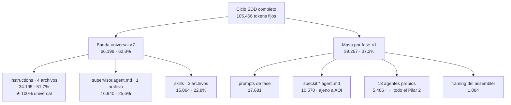
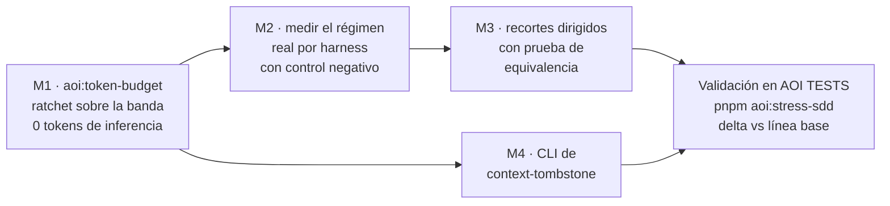

# Propuesta: Gobernanza de Tokens — instalar el termostato antes de bajar la calefacción

> **Document ID:** `AOI-PROP-2026-09-19-CO5`
> **Tipo:** Propuesta arquitectónica con auditoría previa de las tres propuestas hermanas
> **Estado:** Abierta — ninguna sección constituye aprobación
> **Fecha:** 2026-09-19
> **Autor / Modelo:** Claude Opus 5 (1M context) · `claude-opus-5[1m]`
> **Sello de versión:** `v2.5.2-103-gb1b6863-dirty` · HEAD `b1b6863` (2026-09-18)
> **Documentos auditados:**
> `AOI_ULTRA_LIGHT_ZERO_WASTE_PROPOSAL_GEMINI.md` (Gemini 3.8 Flash) ·
> `AOI_ULTRA_LIGHT_ZERO_WASTE_PROPOSAL_MINIMAX.md` (GitHub Copilot) ·
> `AOI_ULTRA_LIGHT_ZERO_WASTE_PROPOSAL_DEEPSEEK_V4_FLASH.md` (DeepSeek v4 Flash)

---

## Changelog

| Versión | Fecha | Autor | Cambio |
| :--- | :--- | :--- | :--- |
| v1.0.0 | 2026-09-19 | Claude Opus 5 | Propuesta inicial. Re-mide el árbol tras la reversión, corrige errores fácticos de las tres propuestas, y sustituye el debate "qué archivo recortar" por "qué compuerta falta". |

---

## 1. La tesis, en un párrafo

Las tres propuestas discuten **qué recortar**. Ninguna se preguntó **por qué el recorte
se va a mantener**. Y la respuesta, medida, es que no se mantiene: de las **26 compuertas**
que corre `pnpm test`, **ninguna mide tokens**. `context-budget.mjs` mide y sale 0.
`cache-prefix.mjs` sí está en la cadena, pero falla únicamente si la masa repetida
contiene un timestamp o si una fase reescribe una superficie que otra recarga — **nunca
por tamaño**. La banda universal puede pasar de 9.457 a 50.000 tokens por fase y las 26
compuertas siguen verdes.

El propio `context-budget.mjs` diagnosticó la enfermedad en su docstring y no instaló el
termostato:

> *"Worse, prose grows silently: nothing failed when a prompt gained four hundred tokens."*

Sigue sin fallar nada. Y AOI ya tiene el patrón resuelto en otro eje: `validate-srp.mjs`
gobierna las LOC con un **ratchet** —`LEGACY_BUDGET`, deuda registrada que *sólo puede
bajar*, con el mensaje `GREW … legacy debt may only shrink`. Es exactamente el mecanismo
que falta sobre la única métrica que es la razón de ser del producto.

> **Mi propuesta es invertir el orden: primero el ratchet, después el recorte.**
> Sin ratchet, cada recorte es un pago único que se erosiona con la próxima edición de un
> prompt. Con ratchet, cada recorte es permanente por construcción y la regresión es
> mecánicamente imposible.

---

## 2. Estado real del árbol — y por qué ese estado nunca debió existir

Antes que nada, lo que estos cuatro documentos son: **propuestas**. Describen cómo se
abordaría la simplificación de AOI, con sus observaciones y su análisis. Ninguna autoriza a
tocar el árbol, y ésta tampoco. El entregable es el documento; la decisión es del Owner.

Lo digo primero porque el episodio que sigue es exactamente lo que pasa cuando esa línea se
cruza.

La auditoría de DeepSeek abre con un hallazgo demoledor: `scaffold/` borrado, 541 archivos
en estado ` D`, `pnpm test` en rojo, un manifiesto huérfano, implementación en vuelo sin
plan aprobado. **Ese estado ya no existe. El árbol fue revertido.**

Y la lectura correcta de esa reversión no es "la propuesta perdió". Es que **ese código
nunca debió escribirse**, se aprobara o no el Pilar 1 después. El defecto fue de secuencia:
alguien ejecutó un pilar de una propuesta abierta mientras la propuesta todavía se discutía,
y dejó la cadena de compuertas en rojo durante la discusión. Que el remedio haya sido un
`git checkout` no vuelve el episodio menor — lo vuelve barato, que es distinto.

Esto también corrige mi propia lectura inicial de la auditoría de DeepSeek. Su §2 no estaba
informando el avance de un trabajo en curso: **estaba detectando una violación del proceso**,
y tenía razón en ponerla primero.

Medido hoy, en este árbol:

```bash
$ git status --porcelain
A  docs/internal/proposals/AOI_ULTRA_LIGHT_ZERO_WASTE_PROPOSAL_DEEPSEEK_V4_FLASH.md
A  docs/internal/proposals/AOI_ULTRA_LIGHT_ZERO_WASTE_PROPOSAL_GEMINI.md
A  docs/internal/proposals/AOI_ULTRA_LIGHT_ZERO_WASTE_PROPOSAL_MINIMAX.md

$ node scripts/scaffold/validate-scaffold-parity.mjs
✅ Scaffold Mirror Parity OK: 413 governed files verified byte-for-byte.
PARITY_EXIT=0

$ ls scripts/governance        → no existe
$ ls scripts/scaffold/resolve-install-files.mjs → no existe
$ rg -n 'SCAFFOLD_DIR=' setup.sh
16:SCAFFOLD_DIR="$SCRIPT_DIR/scaffold"
```

Consecuencias sobre lo que ya está escrito:

| Afirmación de DeepSeek §2 | Estado hoy |
| :--- | :--- |
| `/scaffold/` borrado del disco | ❌ **Presente**, 541 archivos trackeados |
| `test:parity` en exit 1 | ❌ **Exit 0**, 413 gobernados verificados byte a byte |
| `scripts/governance/manifest.json` huérfano | ❌ **El directorio no existe** |
| `setup.sh` con `SCAFFOLD_DIR="$SCRIPT_DIR"` | ❌ Apunta a `$SCRIPT_DIR/scaffold` |
| "La propuesta es la justificación a posteriori de un cambio ya empezado" | ❌ El cambio fue revertido |

Esto no desmerece esa auditoría: midió con precisión un momento que existió y acertó al
tratarlo como lo más urgente del documento. Pero **su recomendación número 1 —"estabilizar
el árbol"— ya está cumplida**, y su veredicto ejecutivo ("una parte del Pilar 1 ya está
aplicada, a medias, con `pnpm test` en rojo") debe leerse hoy como historia, no como estado.

El encuadre correcto hoy es más limpio y más favorable: **no hay nada que deshacer.
Cualquier decisión se toma sobre un árbol verde, desde cero, y sobre cuatro documentos que
son lo que deben ser — análisis, no cambios.**

---

## 3. Método y límites

### 3.1. Qué corrí

| Instrumento | Qué respondió |
| :--- | :--- |
| `node scripts/sdd-lifecycle/cache-prefix.mjs` | Banda universal, repetición, recuperable, huella |
| `assemblePhaseContext()` en bucle sobre `SDD_PHASES` | Payload por fase y desglose por categoría |
| `node scripts/scaffold/validate-scaffold-parity.mjs` | Estado de la compuerta de paridad |
| `git status --porcelain` / `git ls-tree` | Estado del árbol y del espejo |
| `fd -H -I` sobre `.github/agents`, `.github/instructions` | Inventario real de agentes e instrucciones |
| `rtk proxy rg --no-ignore` dirigido | Consumidores de `assemblePhaseContext`, `applyTo`, `process.argv` |
| `estimateTokens()` sobre los 8 archivos de la banda | Descomposición por categoría de la masa repetida |

Todo `rg` va con `--no-ignore` y todo `fd` con `-H -I`: en AOI casi todo el árbol está
gitignoreado, y una búsqueda sin esos flags devuelve vacío y produce la conclusión falsa
"no lo referencia nadie".

### 3.2. Qué NO medí

- **No medí facturación real de ningún proveedor.** Todo acá es aritmética estática sobre
  archivos en disco. Es lo que AOI puede medir y lo único que voy a afirmar.
- **No ejecuté `pnpm test` completo** (26 pasos). Corrí las compuertas que necesitaba.
- **No ejecuté el protocolo en `AOI TESTS`.** Ninguna cifra de esta propuesta sustituye una
  corrida real de `pnpm aoi:stress-sdd` allí, que es donde se establece la línea base del
  ciclo de benchmark.
- **No medí tokens de salida de un diagrama Archify.** Gemini afirma 3.000–5.000 sin
  fuente; no tengo una corrida instrumentada y no voy a inventar el número.

---

## 4. Auditoría cruzada: qué queda en pie de cada propuesta

### 4.1. Cifras que las tres comparten y que confirmo exactas

```text
- Payload literal fijo:                   105,466 tokens
- Universal, en las 7 fases: 8 archivos,  9,457 tok/fase = 66,199 por ciclo
- El 62.8% del payload literal es contenido repetido atribuible.
- Recuperable (cache a 0.1):              51,068 tokens por ciclo
```

Las tres midieron de verdad sobre este eje. Hay que decirlo antes de discutir el resto.

### 4.2. Errores que verifiqué, por documento

**Gemini (la propuesta original):**

| Error | Verificación |
| :--- | :--- |
| 14 agentes citados para consolidar | **0 de 14 existen.** Los reales son 14 `speckit.*` + 13 propios |
| Tabla 2.1 atribuida a `cache-prefix.mjs` | Ese instrumento **no imprime tabla por fase**; las 7 filas no coinciden con ninguna medición |
| `/speckit.* (promedio)` como fila de fase | `sdd-phases.mjs` define **7 fases**; `/speckit.*` no es una |
| Omite `/sdd-ff` | Es la fase **más cara**: 23.471 tok, 22,3% del ciclo |
| `7 × 66.199 = 463.393` | 66.199 **ya es** ×7. El ciclo son 105.466. Inflado 4,4x |
| `phase-runtime.instructions.md` como Tier 0 item 1 | **No existe en el repositorio** |
| "237+ archivos duplicados" | Son **541** trackeados (413 gobernados con paridad byte a byte) |
| Validación Zod | `package.json` sin `dependencies` ni `devDependencies`. Sería la primera |
| `.blueprints/templates/` | `.blueprints/` es namespace del WORKSPACE; dos prompts dicen "**nunca** en AOI" |
| "800–1.400 tokens de sintaxis Archify por prompt" | **15 menciones en 4 prompts**; ~1.076 tokens *en total* |

**MiniMax (revisión de Copilot):** el rechazo de los Pilares 1 y 2 está bien argumentado y
lo comparto en la dirección. Pero su contra-propuesta tiene tres defectos propios:

| Error | Verificación |
| :--- | :--- |
| **Acción 1** (su recomendación estrella) propone extraer narrativa a `phase-runtime.instructions.md`, *"que ya existe con ese propósito"* | **No existe.** `fd -H -I 'phase-runtime'` → vacío. Toda la acción cuelga de un archivo inventado |
| Y además: extraer las descripciones de fase de `supervisor.agent.md` | **Ya se hizo.** El archivo tiene el comentario explícito: *"Los pasos de cada fase viven en su propio prompt… Repetirlos aquí hacía que cada fase pagara la descripción de las otras seis"* |
| "15 agentes `speckit.*`" | Son **14** |
| Aprueba el Pilar 4 ("APROBADO CON OBSERVACIONES") | El Pilar 4 es teatro de medición. Ver §5.3 |
| §6.2: *"Ahorro neto: 463.393 − 105.918 = 357.475 ≈ 51.068"* | 357.475 no es ≈ 51.068. El párrafo mezcla el baseline inflado de Gemini con la cifra correcta y concluye ambas |

**DeepSeek (la mejor de las tres):** empíricamente es la más sólida — confirmé su desglose
por fase y por categoría **al token**. Tres reparos:

| Error | Verificación |
| :--- | :--- |
| Toda la §2 (repo rojo, trabajo en vuelo, manifiesto huérfano) | **Obsoleta**: el árbol fue revertido. Ver §2 |
| *"un token recortado en `icm-protocol` se multiplica por 7 × 6 superficies de harness"* | **Inflado.** `compile-rules.mjs` emite 6 **dialectos alternativos** (cursor, copilot, claude, cline, agents). Un operador corre uno. El ahorro es ×7, no ×42 — el mismo vicio aritmético que le señala a Gemini |
| Recomienda recortar `supervisor.agent.md` extrayendo tablas de fase | Esa extracción **ya ocurrió**; queda menos margen del que supone |
| Recomienda tres recortes sin proponer compuerta | Es el punto de esta propuesta. Ver §6 |

### 4.3. Veredicto consolidado por pilar

| Pilar de Gemini | Gemini | MiniMax | DeepSeek | **Mi veredicto** |
| :--- | :---: | :---: | :---: | :--- |
| 1 — Eliminar `/scaffold/` | Aprobar | Rechazar | Enmienda formal o revertir | **No ahora.** Diagnóstico real, cero ahorro de tokens |
| 2 — 27 → 3 agentes | Aprobar | Rechazar | Rechazar | **Rechazar.** Techo 5,2%, roster inventado |
| 3 — Archify first-class | Aprobar | Auditar | No construir aún | **No construir.** Archify se queda; el motor no |
| 4 — Invertir prefijo Tier 0 | Aprobar | Aprobar c/obs. | Rechazar | **Rechazar.** Cambia un reporte, no un request |
| 5 — CLI de `context-tombstone` | Aprobar | Aprobar | Aprobar | **Aprobar.** Unánime y verificado |

---

## 5. Los tres hallazgos que ninguna propuesta nombró

### 5.1. La banda universal es, por mitad, cuatro archivos de `instructions`

Las tres discuten archivos sueltos. Medida por categoría, la masa repetida se descompone así:

```text
 tok/fase   ×7/ciclo   archivo
    2420      16940    .github/agents/supervisor.agent.md
    2124      14868    .github/instructions/icm-protocol.instructions.md
    2031      14217    .github/instructions/agent-delegation.instructions.md
     396       2772    .github/instructions/model-selection.instructions.md
     334       2338    .github/instructions/rtk.instructions.md
    1510      10570    .github/skills/sdd-lifecycle/SKILL.md
     414       2898    .github/skills/icm/SKILL.md
     228       1596    .github/skills/rtk/SKILL.md
    ─────────────────
    9457      66199
```

| Categoría | Archivos | tok/ciclo | % de la masa repetida |
| :--- | :---: | ---: | ---: |
| **`instructions`** | **4** | **34.195** | **51,7%** |
| `supervisor.agent.md` | 1 | 16.940 | 25,6% |
| `skills` | 3 | 15.064 | 22,8% |

Y el dato que cierra el argumento: **la categoría `instructions` del ciclo completo pesa
34.195 tokens, y los cuatro archivos universales suman exactamente 34.195.** O sea:
`instructions` no tiene *nada* de masa por fase. **Es 100% banda universal.** Cada token
que sobra ahí se paga siete veces, sin excepción y sin depender de ningún proveedor.



El Pilar 2 de Gemini —el cambio más invasivo de los cinco— persigue el rectángulo más
chico del diagrama. Cuatro archivos de instrucciones valen **6,3 veces** más que todo su
alcance, y editarlos no toca ninguna arquitectura.

### 5.2. Ninguna de las 26 compuertas mide tokens

Éste es el hallazgo estructural, y es el que justifica esta propuesta.

```text
pnpm test = aoi:test-globs · aoi:srp · aoi:reachability · aoi:routing · aoi:handoffs
          · aoi:cache-prefix · aoi:tools · aoi:hooks · aoi:registry · test:parity
          · test:doctor · test:multi-harness · test:sandbox · test:memory-sync
          · test:subagent-payload · test:conf · test:sdd-lifecycle · test:spatiotemporal
          · test:mcp-gateway · test:code-lens · aoi:cache-guard · aoi:lint-refs
          · aoi:audit-protocol · aoi:claims · aoi:importance · test:dashboard
```

Veintiséis pasos. El repositorio gobierna LOC, paridad de espejo, alcanzabilidad, globs de
test, referencias en prosa, invariantes del BIC, cierre de blueprints, cableado de hooks,
volatilidad de caché, protocolo, afirmaciones e importancia de memorias.

**No gobierna tokens.**

Los dos instrumentos que los miden no bloquean por tamaño:

| Instrumento | ¿Está en `pnpm test`? | ¿Falla por crecimiento? |
| :--- | :---: | :--- |
| `context-budget.mjs` | **No está en ningún script de `package.json`** | **No.** Cero `process.exit` en todo el archivo. Sin umbral, sin baseline. Sólo se consume como librería desde `cache-prefix.mjs` |
| `cache-prefix.mjs` | Sí, paso 6 | **No.** `auditRepeatedMass` falla sólo por `CACHE_BUSTER_PATTERNS` (timestamps, UUIDs) y `auditMidCycleRewrites` por reescritura mid-ciclo |

El caso de `context-budget.mjs` es más agudo de lo que parece: **no es que mida y no
bloquee — es que no se puede ni invocar.** No hay `pnpm aoi:context-budget`. El módulo más
completo que AOI tiene sobre su propia economía de tokens sólo existe como dependencia
interna de otro script.

Verificado en el código:

```javascript
// cache-prefix.mjs:239
const failures = [...auditRepeatedMass(root, reloaded), ...auditMidCycleRewrites(root, all)]
if (failures.length > 0) { /* … */ process.exit(1) }
```

`auditRepeatedMass` recorre la masa repetida buscando **patrones volátiles**. Nunca compara
un tamaño contra nada. Es una compuerta de *estabilidad*, no de *economía*.

Esto tiene una consecuencia directa sobre las tres propuestas: **cualquiera de sus recortes
se revierte solo.** Un recorte de 500 tokens en `icm-protocol.instructions.md` vale 3.500
por ciclo el día que se hace, y vale cero el día que alguien agrega dos párrafos al
protocolo — porque nada va a fallar. Es el patrón exacto que `validate-srp.mjs` documenta
en su propio docstring como la razón de existir del ratchet.

Y encaja con lo que ya es doctrina en este repositorio: preferir un script
determinista sobre una instrucción al modelo, porque el `.mjs` cuesta cero tokens de
inferencia y la prosa se paga en cada ejecución.

### 5.3. `assemblePhaseContext` no construye ningún request — y el modelo es de Copilot

Dos límites del alcance que hay que fijar antes de prometer ahorros.

**(a) El Pilar 4 reordena un instrumento de medición.** Los consumidores de
`assemblePhaseContext`, medidos:

| Consumidor | Para qué |
| :--- | :--- |
| `context-budget.mjs` | `payloadTokens` → presupuesto |
| `cache-prefix.mjs` | Mapa de bandas |
| `behavioral-probes.mjs` | Materializa el texto que juzga el probe |
| `aoi:context` (CLI) | Reporte |

**Ninguno arma una request.** El propio docstring lo dice: *"Materialises the EXACT prose a
phase loads… The budget counts that prose; **nothing ever produced it**."* Reordenar cambia
lo que el reporte dice, no lo que el modelo recibe. Y además colisiona con
`BIC-2026-001:never.2`, que fija el orden como invariante con el mensaje *"a
measurement-only change must not select, omit, or reorder Frame context"*.

**(b) El modelo de 105.466 se apoya en una semántica de Copilot.** Esto no lo dijo ninguna
de las tres propuestas y acota el tamaño del premio. El piso se deriva de `applyTo`, que es
la convención de instruction-files de VS Code / Copilot:

```text
icm-protocol.instructions.md:      applyTo: "**"
rtk.instructions.md:               applyTo: "**"
agent-delegation.instructions.md:  applyTo: ".github/{agents,prompts}/**,**/*.agent.md,**/*.prompt.md"
model-selection.instructions.md:   applyTo: ".github/{agents,prompts}/**,**/*.agent.md,**/*.prompt.md"
```

En Claude Code el camino es distinto: `.claude/commands/sdd-apply.md` es un **puntero** de
~12 líneas que dice *"Read `.github/prompts/sdd-apply.prompt.md` … and execute it"*, y la
superficie siempre-presente es `CLAUDE.md` (**2.241 tokens**), no la banda de 9.457.

| Harness | Superficie siempre-on | Multiplicador de la banda |
| :--- | ---: | :--- |
| GitHub Copilot Chat | 9.457 tok/fase vía `applyTo` | ×7 confirmado por el modelo |
| Claude Code | `CLAUDE.md` = 2.241 tok/sesión | **No verificado** — los `.github/instructions/` no se auto-inyectan |
| Cursor / Cline / Agents | dialecto propio, 88–591 tok | **No verificado** |

**Hay que darle crédito al repositorio en la mitad de esto:** `context-budget.mjs` ya
modela los adaptadores de harness en `HARNESS_ADAPTERS` (los 7 dialectos, 1.930 tokens
medidos) y los deja **deliberadamente fuera del piso**, con una razón bien escrita —
*"Sumarlo cambiaría la definición del piso y volvería incomparable cada línea base
histórica"*, y el renglón de alcance *"el piso real de un Copilot es de piso+N"*.

Lo que ese modelo **no** cubre es la pregunta inversa, y es la que importa: da por sentado
que el piso se paga en todos lados y que lo único que varía es el adaptador que se le suma.
Pero el piso mismo **es** la derivación de `applyTo`. Si Claude Code no inyecta las
`.github/instructions/`, ahí no hay piso al cual sumarle nada: hay `CLAUDE.md` y nada más.

Y el modelo de adaptadores tampoco se usa: `harnessAdapterCost` y `formatHarnessAdapters`
son consumidos **únicamente por su propio test**. Nadie los imprime.

Esto no invalida nada: AOI se declara *harness-agnostic* y `cache-prefix.mjs` ya advierte
que *"AOI does not build the API request"*. Pero sí significa que **el ahorro de 51.068
tokens por ciclo es, hasta que se mida, una cifra de Copilot.** Y AOI instala a seis.

---

## 6. La propuesta: cuatro movimientos, en este orden



El orden no es negociable y es el aporte central: **M1 antes que M3.** Recortar sin ratchet
es pagar dos veces la misma factura.

### M1 — `aoi:token-budget`: el ratchet que falta

**Qué es.** Un script determinista, ~80 LOC, modelado literalmente sobre
`validate-srp.mjs`: un presupuesto registrado por archivo de la banda universal, que **sólo
puede bajar**.

**Forma, copiando el patrón ya probado en el repositorio:**

```javascript
// scripts/sdd-lifecycle/validate-token-budget.mjs
//
// La banda universal se recarga en las 7 fases: un token de más se paga siete
// veces. Nada fallaba cuando crecía — cache-prefix audita volatilidad, no
// tamaño, y context-budget mide y sale 0. Este archivo cierra ese hueco con la
// misma forma que validate-srp usa para las LOC: deuda registrada que sólo baja.
export const BAND_BUDGET = {
  '.github/agents/supervisor.agent.md':                     2420,
  '.github/instructions/icm-protocol.instructions.md':      2124,
  '.github/instructions/agent-delegation.instructions.md':  2031,
  '.github/skills/sdd-lifecycle/SKILL.md':                  1510,
  '.github/skills/icm/SKILL.md':                             414,
  '.github/instructions/model-selection.instructions.md':    396,
  '.github/instructions/rtk.instructions.md':                334,
  '.github/skills/rtk/SKILL.md':                             228,
}
// GREW  <archivo> — N tok, era M; la banda universal sólo puede encogerse
```

**Reglas:**

1. Un archivo de la banda que **crece** → exit 1, con el costo ×7 en el mensaje.
2. Un archivo de la banda que **encoge** → exit 1 pidiendo bajar el presupuesto en el mismo
   commit. Así el ahorro queda capturado y no se puede volver a gastar.
3. Un archivo **nuevo** que entra a la banda (porque su `applyTo` pasa a matchear `**`) →
   exit 1. Hoy eso ocurre en silencio y es el modo de falla más caro que existe.
4. El techo total de la banda se declara y se ratchetea igual: `9457` hoy.

**Por qué es lo primero.** Cuesta cero tokens de inferencia, no toca ninguna superficie que
se inyecte, no rompe ningún invariante, es reversible en un commit, y **convierte cada
recorte futuro en permanente**. Es la diferencia entre bajar la calefacción y ponerle
termostato.

**Cableado:** entra en `pnpm test` justo después de `aoi:srp`, su gemelo conceptual. Espejo
en `scaffold/` en el mismo cambio (Principio I) y test propio con **control negativo
demostrablemente fallido** — un fixture donde un archivo de la banda crece y la compuerta
debe salir 1.

**Corolario barato que va en el mismo cambio:** exponer `context-budget.mjs` como
`pnpm aoi:context-budget`, imprimiendo el piso, la banda y —ahora sí— la masa de
adaptadores que `harnessAdapterCost` ya calcula y que hoy nadie ve. Son dos líneas en
`package.json` más un `main()`, cero tokens de inferencia, y convierte el módulo más
completo que AOI tiene sobre su economía en algo que el Owner puede consultar.

### M2 — Medir el régimen real antes de recortar

Es el paso que DeepSeek pidió y ninguna propuesta instrumentó. Dos preguntas, ambas
baratas, ambas decisivas:

**(a) ¿Qué carga cada harness realmente?** Comparar, en una corrida real de `/sdd-apply`:
los archivos que el modelo reporta haber leído contra los 8 de la banda. Si en Claude Code
no se inyectan las `.github/instructions/`, el premio de recortarlas es cero ahí y el
esfuerzo debe ir a `CLAUDE.md`, que sí es siempre-on.

**(b) ¿El prefijo se cachea?** Dos corridas del mismo ciclo, una con prefijo estable y otra
con el prefijo deliberadamente roto (un comentario con timestamp al inicio), comparando
latencia y contadores del proveedor. Es exactamente el **control negativo** que este
proyecto exige para cualquier verificación.

**Dónde:** `/Users/equinox/Desktop/AOI TESTS`, con el protocolo actualizado. No en este
repositorio.

**Qué decide:** si hay caché efectivo, la banda universal se lee a 0,1 y el esfuerzo debe
ir a la masa por fase (17.681 de prompts + 10.570 de speckit). Si no hay caché, la banda
universal es la mina. **Hoy las tres propuestas apuestan sin ese dato.**

### M3 — Recortes dirigidos, con prueba de equivalencia

Sólo después de M1 y M2, y sólo con equivalencia demostrada — el ahorro nunca justifica una
pérdida de capacidad no verificada.

| # | Archivo | tok/ciclo | Qué recortar | Prueba de equivalencia |
| :---: | :--- | ---: | :--- | :--- |
| 1 | `icm-protocol.instructions.md` | 14.868 | Prosa operativa que duplica lo que los comandos `icm` ya imprimen; tabla en vez de narrativa | `aoi:audit-protocol` verde + los 6 dialectos recompilan idénticos en semántica |
| 2 | `agent-delegation.instructions.md` | 14.217 | Columnas derivables: `aoi:routing` ya deriva la ruta del archivo desde el nombre | `pnpm aoi:routing` sigue verificando los 27 agentes |
| 3 | `supervisor.agent.md` | 16.940 | Las dos tablas se solapan: "Phase Routing" (12 filas) y "Workflow Commands → Owner Gates" (8 filas) cubren el mismo eje. Fundir en una | **Probe conductual**: el supervisor debe rutear las 7 fases correctamente con el texto recortado |
| 4 | `sdd-lifecycle/SKILL.md` | 10.570 | Verificar solapamiento con los prompts de fase | `behavioral-probes` verde |

**Nota sobre el #3:** `supervisor.agent.md` **ya fue recortado una vez** —los pasos de cada
fase se movieron a sus prompts, y el archivo lo documenta. El margen que queda es menor que
el 30% que suponen MiniMax y DeepSeek. Prefiero no cifrar el ahorro antes de intentarlo:
el ratchet de M1 lo va a capturar exactamente, sea el que sea.

**Lo que NO haría, con su razón medida:**

| Descartado | Razón |
| :--- | :--- |
| Eliminar `/scaffold/` | Deroga el Principio I, deja 4 compuertas vacías, y **ahorra 0 tokens de inferencia**. El árbol está verde; no hay urgencia que lo justifique |
| Fusionar 27 → 3 agentes | Techo 5,2% del payload, 7 archivos con compuertas encima, roster mal identificado, y `speckit.*` no es de AOI |
| Reordenar `assemble-phase-context.mjs` | Cambia un reporte, no un request; colisiona con `BIC-2026-001:never.2` |
| Construir `render-diagram.mjs` + esqueletos + Zod | Ahorro real ~1.076 tok totales; introduciría la primera dependencia de un repositorio con `deps: undefined`; duplica el esquema de un skill externo |
| Plantillas en `.blueprints/` | Namespace del WORKSPACE; dos prompts dicen "**nunca** en AOI" |

**Archify se queda, sin discusión.** Es pilar core y la diagramación interactiva es
esencial. Lo que descarto no es Archify: es construirle un motor de fusión paralelo para
capturar 1.076 tokens, cuando su propia política de bloqueo ya está mejor resuelta en
`blueprint-diagram.mjs` de lo que la propuesta le atribuye.

### M4 — CLI de `context-tombstone.mjs`

El único punto unánime, verificado: **143 LOC**, **cero** `process.argv`, exporta
`isTurnSuperseded`, `createTombstone`, `shrinkTurns`, `buildTombstoneIcmRecord`. Un runner
de ~20 LOC lo deja en ~165, holgado bajo el Invariante 5.

Detalle operativo que sólo DeepSeek marcó y confirmo que importa:
`gate-exit-codes.test.mjs` muta el fuente reemplazando la cadena `context-tombstone`, y
`token-tool-coverage.test.mjs` verifica su cableado. Correr ambas antes de cerrar.

---

## 7. Costo, beneficio y superficie de cambio

| Movimiento | Archivos tocados | Tokens de inferencia | Ahorro directo | Ahorro que **protege** | Reversión |
| :--- | :---: | :---: | ---: | ---: | :---: |
| **M1** ratchet | 3 (script + test + espejo) | **0** | 0 | **66.199/ciclo, a perpetuidad** | 1 commit |
| **M2** medición | 0 (sólo lectura) | ~1 ciclo | 0 | decide toda la estrategia | n/a |
| **M3** recortes | 4 + espejos | 0 | a determinar por medición | — | 1 commit c/u |
| **M4** CLI tombstone | 2 + espejo | 0 | ~19% en turnos largos | — | 1 commit |

Comparado con lo que proponen las otras:

| | Gemini v1.0.0 | MiniMax "Trim Selectivo" | **Esta propuesta** |
| :--- | :--- | :--- | :--- |
| Archivos eliminados | 541+ | 0 | **0** |
| Violaciones constitucionales | 2 | 0 | **0** |
| Invariantes del BIC rotos | 1 | 1 (aprueba el Pilar 4) | **0** |
| Dependencias nuevas | 1 (Zod) | 0 | **0** |
| Depende de un archivo inexistente | sí (`phase-runtime`) | sí (`phase-runtime`) | **no** |
| Compuerta nueva que sostiene el ahorro | ninguna | ninguna | **`aoi:token-budget`** |
| Ahorro cifrado antes de medir | 70–85% | 13.650/ciclo | **ninguno — se cifra al medirlo** |

Que la última fila esté vacía es deliberado. Las tres propuestas prometen un número antes
de tener el dato que lo determina. **Prefiero entregar el mecanismo que hace el número
verificable y permanente, y recién después el número.**

---

## 8. Riesgos

| Riesgo | Severidad | Mitigación |
| :--- | :---: | :--- |
| El ratchet bloquea trabajo legítimo que necesita agregar prosa universal | Media | Bajar el presupuesto de otro archivo en el mismo commit, igual que la deuda SRP. El mensaje de error lo dice explícitamente |
| El presupuesto se sella con un valor ya inflado | Baja | Es precisamente el patrón `LEGACY_BUDGET`: se registra la deuda de hoy y sólo puede bajar. No premia el estado actual, lo congela |
| M2 revela que Claude Code no carga la banda → el premio se achica | **Alta** | Es el objetivo de M2: descubrirlo **antes** de invertir en M3, no después. Si ocurre, el objetivo se reorienta a `CLAUDE.md` |
| El recorte de `supervisor.agent.md` degrada el ruteo | Media | Probe conductual sobre las 7 fases antes de mergear; el archivo es el hub del patrón Hub-and-Spoke |
| `estimateTokens` es una estimación, no un tokenizador real | Baja | El ratchet compara la misma métrica contra sí misma; la precisión absoluta no afecta la detección de crecimiento |

---

## 9. Decisiones que requieren al Owner

**1. ¿Se instala el ratchet antes de recortar?** Es la única decisión que cambia la
estructura de la propuesta. Mi recomendación es sí: sin él, el debate de las tres
propuestas se va a repetir en tres meses sobre los mismos archivos.

**2. ¿Se corre M2 en `AOI TESTS` antes de M3?** Mi recomendación es sí. Decide si el
esfuerzo va a la banda universal o a la masa por fase, y hoy nadie tiene ese dato.

**3. ¿`/scaffold/` queda como está?** Mi recomendación es sí, por ahora. El diagnóstico de
deriva es real y está documentado en `sync-paths.mjs` con nombre y apellido — pero
eliminarlo **no ahorra un solo token de inferencia**, y el árbol está verde. Si se decide
abordarlo, es una enmienda constitucional con reemplazo de las cuatro compuertas que quedan
huérfanas, no un refactor de build.

**4. ¿Qué modelo fijan los agentes?** Fuera del alcance de esta propuesta, pero sigue
abierto: 27 agentes fijan `Deepseek v4 pro` y el fallback declarado
`deepseek-ai/deepseek-v4-pro` merece una verificación aparte.

---

## Anexo A — Comandos de reproducción

```bash
cd "/Users/equinox/Desktop/GITHUB MIGRATION/AOI"

# Estado del árbol
git status --porcelain
git ls-tree -r HEAD --name-only scaffold | wc -l                    # 541
node scripts/scaffold/validate-scaffold-parity.mjs; echo "EXIT=$?"  # 0

# Banda universal y repetición
node scripts/sdd-lifecycle/cache-prefix.mjs

# Payload por fase y por categoría
node -e '
const m = await import("./scripts/sdd-lifecycle/assemble-phase-context.mjs");
const { SDD_PHASES } = await import("./scripts/sdd-lifecycle/sdd-phases.mjs");
let t = 0;
for (const [k, rel] of SDD_PHASES) {
  const a = m.assemblePhaseContext(process.cwd(), rel, k);
  t += a.payloadTokens; console.log(k, a.payloadTokens);
}
console.log("TOTAL", t);'

# Inventario real
fd -H -I '\.agent\.md$' .github/agents | wc -l                       # 27
fd -H -I '^speckit.*\.agent\.md$' .github/agents | wc -l             # 14
fd -H -I . .github/instructions --type f                             # 6, sin phase-runtime
fd -H -I 'phase-runtime' .                                           # vacío

# Ausencia de compuerta de tamaño
rtk proxy rg --no-ignore -n 'process\.exit' scripts/sdd-lifecycle/context-budget.mjs   # sin hits
rtk proxy rg --no-ignore -n -A18 'function auditRepeatedMass' scripts/sdd-lifecycle/cache-prefix.mjs

# Consumidores del assembler
rtk proxy rg --no-ignore -l 'assemblePhaseContext' scripts/

# Dependencias
node -e "const p=require('./package.json');console.log(p.dependencies, p.devDependencies)"  # undefined undefined
```

## Anexo B — Payload medido por fase

| Fase | Tokens | % del ciclo |
| :--- | ---: | ---: |
| `Phase_-2_Genesis` | 12.822 | 12,2% |
| `Phase_0_Frame` | 12.861 | 12,2% |
| `Phase_1_New` | 12.669 | 12,0% |
| **`Phase_2_FF`** | **23.471** | **22,3%** |
| `Phase_3_Apply` | 16.849 | 16,0% |
| `Phase_4_Verify` | 14.853 | 14,1% |
| `Phase_5_Archive` | 11.941 | 11,3% |
| **Total** | **105.466** | 100% |

## Anexo C — Fuentes del repositorio citadas

| Archivo | Qué aporta |
| :--- | :--- |
| `scripts/sdd-lifecycle/cache-prefix.mjs` | Banda universal; y que su compuerta audita volatilidad, no tamaño |
| `scripts/sdd-lifecycle/context-budget.mjs` | Mide el costo fijo; su docstring diagnostica el crecimiento silencioso. Cero `process.exit`, y no está en ningún script de `package.json`. `HARNESS_ADAPTERS` modela los 7 dialectos (1.930 tok) y sólo lo consume su propio test |
| `scripts/sdd-lifecycle/assemble-phase-context.mjs` | Es instrumento de medición, no constructor de request |
| `scripts/sdd-lifecycle/instruction-scope.mjs` | El mecanismo `applyTo` y por qué el modelo es de Copilot |
| `scripts/sdd-lifecycle/behavioral-probes.test.mjs` | `BIC-2026-001:never.2` — el orden es invariante |
| `scripts/scaffold/validate-srp.mjs` | El patrón ratchet (`LEGACY_BUDGET`, `GREW … may only shrink`) que M1 copia |
| `scripts/scaffold/validate-scaffold-parity.mjs` | Paridad verde; `FORBIDDEN_IN_SCAFFOLD` |
| `scripts/scaffold/sync-paths.mjs` | El historial documentado de deriva del espejo |
| `scripts/multi-harness/compile-rules.mjs` | Los 6 dialectos son alternativos, no aditivos |
| `scripts/subagent-context/context-tombstone.mjs` | 143 LOC, sin CLI |
| `.github/agents/supervisor.agent.md` | Ya fue recortado una vez; lo documenta en su propio texto |
| `.claude/commands/sdd-apply.md` | Puntero al prompt: el camino de Claude Code no es `applyTo` |
| `.specify/memory/constitution.md:28` | Principio I — Scaffold Mirror Integrity |
| `package.json` | 26 pasos en `pnpm test`, ninguno sobre tokens; cero dependencias |

---

## Conclusión

Las tres propuestas hermanas comparten una virtud y un punto ciego. La virtud es que las
tres midieron: los 105.466 tokens, los 9.457 por fase, el 62,8% repetido son reales y los
confirmé al token. El punto ciego es que las tres tratan el problema como una lista de
archivos a recortar, cuando el problema es que **el repositorio que existe para ahorrar
tokens no tiene ni una compuerta que los gobierne.**

Veintiséis pasos en `pnpm test`. Ninguno falla porque un archivo de la banda universal
creció. AOI se auto-diagnosticó esto en el docstring de `context-budget.mjs` y nunca
instaló el remedio, teniéndolo ya escrito y probado en `validate-srp.mjs` para las LOC.

Por eso mi propuesta es deliberadamente más chica en superficie y más grande en duración:
**cero archivos eliminados, cero violaciones constitucionales, cero invariantes rotos, cero
dependencias nuevas — y una compuerta determinista de ~80 LOC que hace que todo recorte
futuro sea permanente y toda regresión, imposible.** Después de eso, medir. Y recién
después, recortar, con el ratchet capturando cada token que se gana.

Bajar la calefacción una vez es un gesto. Poner el termostato es arquitectura.
