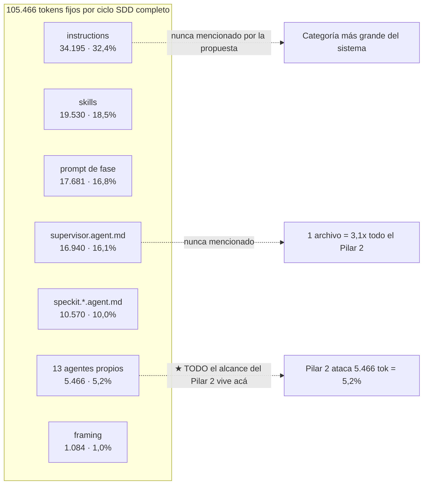
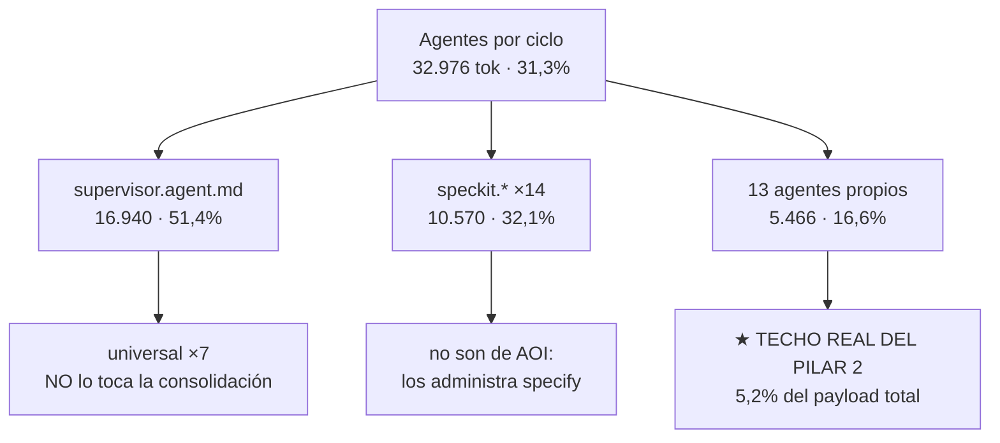

# Auditoría y Contra-Propuesta — "AOI Ultra-Light & Zero-Waste Context Engine"

> **Document ID:** `AOI-REVIEW-2026-09-19-DSF`
> **Documento auditado:** `docs/internal/proposals/AOI_ULTRA_LIGHT_ZERO_WASTE_PROPOSAL_GEMINI.md`
> **Estado:** Revisión técnica independiente — **no vinculante, no es un plan de ejecución**
> **Fecha:** 2026-09-19
> **Autor / Modelo Redactor:** Deepseek v4 Flash (Provider: Deepseek)
> **Ámbito:** Contraste empírico de la propuesta contra el árbol real, con los instrumentos de AOI.
> **Objeto:** Verificar cada afirmación, medir cada cifra, y proponer alternativas con su costo.

---

## Índice

1. [Veredicto ejecutivo](#1-veredicto-ejecutivo)
2. [Contexto que la propuesta desconoce: el estado real del repo](#2-contexto-que-la-propuesta-desconoce-el-estado-real-del-repo)
3. [Método, trazabilidad y límites de esta auditoría](#3-método-trazabilidad-y-límites-de-esta-auditoría)
4. [Validación cifra por cifra](#4-validación-cifra-por-cifra)
5. [Pilar 1 — Eliminación de `/scaffold/`](#5-pilar-1--eliminación-de-scaffold)
6. [Pilar 2 — Consolidación 27 → 3 agentes](#6-pilar-2--consolidación-27--3-agentes)
7. [Pilar 3 — Archify First-Class](#7-pilar-3--archify-first-class)
8. [Pilar 4 — Inversión del prefijo Tier 0](#8-pilar-4--inversión-del-prefijo-tier-0)
9. [Pilar 5 — CLI de `context-tombstone.mjs`](#9-pilar-5--cli-de-context-tombstonemjs)
10. [Errores transversales de método](#10-errores-transversales-de-método)
11. [Matriz de riesgos de la propuesta](#11-matriz-de-riesgos-de-la-propuesta)
12. [Contra-propuesta: "AOI Trim Selectivo"](#12-contra-propuesta-aoi-trim-selectivo)
13. [Decisiones que requieren al Owner](#13-decisiones-que-requieren-al-owner)
14. [Anexos](#14-anexos)

---

## 1. Veredicto ejecutivo

La propuesta diagnostica un problema real y lo cotiza con cifras que, en su mayoría, **coinciden exactamente** con las que producen los instrumentos de AOI. Quien la redactó corrió `cache-prefix.mjs`. Eso merece decirse primero.

Dicho eso: de los cinco pilares, **uno es correcto y barato, uno es constitucionalmente ilegal, uno está construido sobre un roster de agentes que no existe, uno infla su propia aritmética 4,4x, y uno describe mal el mecanismo que dice arreglar** — y buena parte del primero ya está aplicada en el working tree, a medias, con `pnpm test` en rojo.

| Pilar | Veredicto | Razón medida |
| :--- | :---: | :--- |
| **1. Eliminar `/scaffold/`** | ⚠️ **Diagnóstico correcto, remedio ilegal** | Deriva real y documentada. Pero deroga el Principio I y **ya está a medias**: 541 archivos borrados, paridad en exit 1, manifiesto huérfano. |
| **2. 27 → 3 agentes** | ❌ **Rechazar** | El roster citado **no existe** (14 nombres inventados). Cero agentes huérfanos. Techo real: **5.466 tok/ciclo = 5,2%** del payload, a cambio del cambio más invasivo de los cinco. |
| **3. Archify First-Class** | ⚠️ **Intención correcta, ejecución sobre premisas falsas** | Los prompts dedican **1.076 tokens en total**, no 800–1.400 cada uno. `archify-path.mjs` es un resolvedor de ruta, no un renderizador. `.blueprints/` ya es namespace del WORKSPACE. |
| **4. Invertir prefijo Tier 0** | ❌ **Rechazar como está** | Error aritmético de 4,4x (`7 × 66.199`, cuando 66.199 **ya es** la cifra ×7). AOI no arma el request. Y el orden está fijado por un invariante conductual. |
| **5. CLI `context-tombstone`** | ✅ **Aprobar tal cual** | 143 LOC, cero `process.argv`, exporta todo lo necesario. Único pilar sin riesgo y con beneficio claro. |

**Y el hallazgo más importante del documento, que la propuesta no vio:** el peso real de las categorías por ciclo SDD no está donde ella cree.



Un archivo — `.github/agents/supervisor.agent.md` — pesa **16.940 tokens por ciclo**, más que los **13 agentes propios juntos** (5.466). Tres archivos universales pesan **46.025**, o sea el **69,5% de los 66.199** que la propuesta quiere ahorrar. **Ninguno de los cuatro aparece en el documento auditado.**

---

## 2. Contexto que la propuesta desconoce: el estado real del repo

Antes de discutir el contenido hay un problema de encuadre que condiciona todo lo demás. La propuesta describe un "Estado Actual" con `/scaffold/` presente en disco. **Ese estado no existe.**

### 2.1. `/scaffold/` ya está borrado, y son 541 archivos, no 237

```bash
$ git ls-tree -r HEAD --name-only scaffold | wc -l
541

$ git status --porcelain | awk '{print $1}' | sort | uniq -c
   7 ??
 541 D
   4 M
```

- La propuesta dice **"237+ archivos duplicados"**. El conteo real del espejo en `HEAD` es **541**. Subestima **2,3x**.
- Los 541 aparecen como ` D` (deleted, unstaged): **borrados del disco, todavía trackeados en git**.
- El espejo es también el sujeto de dos compuertas, no una: `validate-scaffold-parity.mjs` (241 LOC) y `validate-scaffold-tracked.mjs`, más sus tests.

### 2.2. `pnpm test` está rojo ahora mismo

```
$ node scripts/scaffold/validate-scaffold-parity.mjs
   - [MISSING_SCAFFOLD] Path exists in root but missing in scaffold: CLAUDE.md
   - [MISSING_SCAFFOLD] Path exists in root but missing in scaffold: AGENTS.md
   - [MISSING_SCAFFOLD] ... (541)
PARITY_EXIT=1
```

`test:parity` es el paso 10 de la cadena de 26 de `pnpm test`. La cadena está **roja**. Y la suite del área que sostiene el espejo confirma lo mismo:

```text
$ node --test scripts/scaffold/*.test.mjs
ℹ tests 205
ℹ pass 201
ℹ fail 4
ℹ skipped 0
ℹ duration_ms 3340.55
```

Esto no es un detalle de estado: significa que **el criterio de aceptación que este mismo repositorio declara no negociable está fallando mientras se discute la propuesta que lo elimina.**

### 2.3. El manifiesto es dato muerto: hay tres fuentes de verdad, no una

La propuesta presenta `scripts/governance/manifest.json` como *"El Manifiesto Centralizado de Rutas Gobernadas"*, la pieza que reemplaza al espejo. El archivo existe (2.029 bytes, creado hoy 11:12). **Nada lo lee.**

```bash
$ rg --no-ignore -n "scripts/governance|governance/manifest" scripts/ setup.sh setup.ps1 teardown.sh .github/
(sin resultados)

$ rg --no-ignore -n "manifest" scripts/scaffold/resolve-install-files.mjs
(sin resultados)
```

Y el módulo que `setup.sh` sí invoca declara sus propias importaciones:

```javascript
// scripts/scaffold/resolve-install-files.mjs
import { DEFAULT_SYNC_PATHS } from './sync-paths.mjs'
import { syncPathsForProfile } from '../installation-profiles.mjs'
```

Resultado: **tres** descriptores de rutas gobernadas conviven.

| Descriptor | Rol real | ¿Lo lee alguien? |
| :--- | :--- | :---: |
| `scripts/scaffold/sync-paths.mjs` | `DEFAULT_SYNC_PATHS` — la lista real | ✅ `resolve-install-files`, `governed-paths`, `validate-scaffold-parity` |
| `scripts/installation-profiles.mjs` | `syncPathsForProfile()` — filtro por perfil | ✅ `resolve-install-files.mjs` |
| `scripts/governance/manifest.json` | "fuente única de verdad" | ❌ **nadie** |

Esto es exactamente el defecto que `sync-paths.mjs` documenta en su propia cabecera, con nombre y apellido, como ya pagado dos veces:

> *"`doctor-checks.mjs` se enviaba a toda instalación vía scaffold/ pero no estaba gobernado, y eso ya cobró su precio: […] la copia del scaffold quedó vieja. **Root y espejo derivaron sin que nada fallara acá, y el que rompía era la instalación, lejos de la causa.** Es la misma forma del protocolo duplicado que esta lista ya corrigió una vez."*

La propuesta crea **una tercera copia del mecanismo que existe para impedir copias**. Y no es una copia inerte: es una copia **que nadie consume**, así que puede divergir de la lista real sin que ninguna compuerta se entere. Es la peor variante posible del problema que dice resolver.

### 2.4. Existe un documento hermano que ya dice casi lo mismo

`docs/internal/proposals/AOI_ULTRA_LIGHT_ZERO_WASTE_PROPOSAL.md` (77 KB, 1.445 líneas, mismo directorio) es **una revisión crítica de esta misma propuesta**, con un capítulo por pilar. Sus encabezados incluyen *"por qué rompe el modelo de distribución"*, *"por qué destruye Hub-and-Spoke"*, *"ahorro inflado 7x"*.

Dejo constancia de esto porque **cambia la decisión**: no se está evaluando una propuesta en el vacío, sino una propuesta sobre la que ya existe una contra-revisión escrita. Presentar esto como un plan aprobable sin mencionar que ya hay un documento refutándolo es, en el mejor de los casos, un descuido de proceso.

### 2.5. Todo lo anterior convive con implementación en vuelo

```
?? .resources/templates/
?? .vscode/ChatLanguageModel.example.json
?? .vscode/README.md
?? docs/internal/proposals/
?? scripts/governance/
?? scripts/scaffold/collect-file-paths.mjs
?? scripts/scaffold/resolve-install-files.mjs
 M scripts/conf/compare-install.sh
 M scripts/conf/generate-checksums.sh
 M scripts/scaffold/sync-paths.mjs
 M setup.sh
```

`setup.sh` ya tiene, aplicado:

```bash
# AOI uses the repository root directly as the single source of truth via manifest
SCAFFOLD_DIR="$SCRIPT_DIR"
```

…más una función `sync_governed_files_fallback()` que reemplaza las tres ramas de fallback que antes hacían `rsync "$SCAFFOLD_DIR/"`. Y `resolve-install-files.mjs` (62 LOC) + `collect-file-paths.mjs` (47 LOC) son los módulos nuevos que sostienen el copiado por manifiesto.

**O sea: la propuesta no es una propuesta. Es la justificación a posteriori de un cambio ya empezado, escrita sin medir el estado que ese cambio produjo.**

---

## 3. Método, trazabilidad y límites de esta auditoría

### 3.1. Qué corrí

| Instrumento | Qué respondió |
| :--- | :--- |
| `node scripts/sdd-lifecycle/cache-prefix.mjs` | Cifras de banda universal, repetición, recuperable, huella |
| `assemblePhaseContext()` en bucle sobre las 7 fases | Payload real por fase y desglose por categoría de fuente |
| `node -e` sobre `.github/agents/` | Conteo y peso del catálogo, partición speckit / propias |
| `node scripts/scaffold/validate-scaffold-parity.mjs` | Estado de la compuerta de paridad |
| `git ls-tree` / `git status --porcelain` | Archivos del espejo y estado del working tree |
| `rg --no-ignore` dirigido | Consumidores de `manifest.json`, roster de agentes, namespace `.blueprints` |

**Todos los `rg` son `--no-ignore`.** En AOI casi todo el árbol está gitignoreado (`.github/`, `CLAUDE.md`, `AGENTS.md`, `scripts/`): un search recursivo sin ese flag devuelve nada y produce conclusiones falsas del tipo "no lo referencia nadie". Un grep sin `--no-ignore` acá no es un grep flojo, es un grep que miente.

### 3.2. Qué NO medí — y por qué importa

Esta sección existe porque `cache-prefix.mjs` la tiene, y porque es la razón por la que ese instrumento es confiable.

- **No medí el consumo real de tokens de ningún harness.** Ni Copilot Chat, ni Claude Code, ni CLI. Todos los números de este documento son **aritmética estática sobre archivos en disco**, que es lo que AOI puede medir. No son facturación de un proveedor.
- **No verifiqué si un proveedor cachea.** AOI no arma el request HTTP ni coloca los breakpoints. Ver §8.3.
- **No leí el documento hermano completo.** Leí su §2 (validación de cifras) y su índice; el resto sólo por encabezados. Deliberado: quería que mi medición no se contaminara con su conclusión. Como consecuencia, **puede haber solapamiento** entre lo que sigue y lo que ese documento ya dice. Eso no invalida nada de acá, pero conviene saberlo antes de leerlo como aporte nuevo.
- **No ejecuté `pnpm test` completo.** Corrí los subcomandos que necesitaba. La cadena completa tiene 26 pasos; su estado no es un dato de este documento más allá de lo que informo en §2.2.
- **No medí los 3.000–5.000 tokens de salida de un diagrama Archify** que la propuesta afirma. No tengo una corrida instrumentada de un diagrama real, y no voy a inventar el número. Ver §7.2.

### 3.3. Una nota sobre precisión

El documento hermano declara `validate-scaffold-parity.mjs` en **"242 → 241 (`wc -l`)"** y marca el resultado como **"✓ Idéntico"**. 242 no es igual a 241. `wc -l` da 241. La diferencia es trivial; el rótulo no lo es, porque es exactamente el mismo patrón que este documento audita más abajo: **una celda que dice "verificado" sobre un número que no cierra.** Lo menciono para que quede claro dónde está mi frontera de medición, no para hacer un punto.

---

## 4. Validación cifra por cifra

### 4.1. Cifras confirmadas literalmente

Corrí el instrumento. **Coinciden exactamente:**

```text
=== AOI Cache Prefix Economics ===

COSTO FIJO DEL PAYLOAD LITERAL:
- Payload literal fijo:                   105,466 tokens
- Contenido atribuible a archivos:        104,382 tokens
- Framing del assembler (sin asignar):    1,084 tokens

REPETICION DEL CONTENIDO ATRIBUIBLE (los mismos bytes, pagados de nuevo):
- Universal, en las 7 fases: 8 archivos, 9,457 tok/fase = 66,199 por ciclo
- Repetido en algunas fases:            4,466 por ciclo
- Cargado una sola vez:                 33,717 por ciclo
- El 62.8% del payload literal es contenido repetido atribuible.

MASA DE CONTENIDO QUE UN CACHE DE PREFIJO PODRIA REUTILIZAR:
- Sin cache:      66,199 tokens
- Con cache a 0.1: 15,131 tokens
- Recuperable:    51,068 tokens por ciclo
```

| Cifra | Propuesta | Medido | Estado |
| :--- | ---: | ---: | :---: |
| Payload fijo total | 105.466 | 105.466 | ✅ |
| Universal por fase | 9.457 | 9.457 | ✅ |
| Universal por ciclo | 66.199 | 66.199 | ✅ |
| % repetido atribuible | 62,8% | 62,8% | ✅ |
| Total de agentes | 27 | 27 | ✅ |
| Tokens del catálogo de agentes | 44.221 | 44.221 | ✅ |
| LOC `validate-scaffold-parity.mjs` | 242 | 241 | ⚠️ off-by-one |

**Seis de siete exactas, incluida una que no era fácil de acertar** (los 44.221 tokens del catálogo son la suma de 27 archivos). Quien escribió esto midió de verdad. Eso es un hecho y hay que decirlo antes de discutir lo demás.

### 4.2. Su única tabla "medida" no sale del instrumento que dice — y oculta la fase más cara

La propuesta atribuye su tabla 2.1 a `cache-prefix.mjs`. **Ese instrumento imprime una tabla por archivo, no por fase.** La tabla de la propuesta no sale de ahí. La medí yo, con el assembler:

| Fase SDD | Propuesta | **Medido** | Δ | Estado |
| :--- | ---: | ---: | ---: | :--- |
| `/sdd-genesis` | 13.916 | **12.822** | −1.094 | ✗ |
| `/sdd-frame` | 13.432 | **12.861** | −571 | ✗ |
| `/sdd-new` | 12.870 | **12.669** | −201 | ✗ |
| `/sdd-ff` | *ausente* | **23.471** | — | **✗ la fase más cara** |
| `/sdd-apply` | 16.240 | **16.849** | +609 | ✗ |
| `/sdd-verify` | 18.110 | **14.853** | −3.257 | ✗ |
| `/sdd-archive` | 14.180 | **11.941** | −2.239 | ✗ |
| `/speckit.* (promedio)` | 16.718 | *no es una fase* | — | **✗ inventada** |
| **Suma** | **105.466** | **105.466** | 0 | ✅ |

Tres problemas, en orden creciente de gravedad:

**(a) Falta `/sdd-ff`.** Es la fase **más cara del ciclo**: 23.471 tokens, **el 22,3% del payload total**, más que `/sdd-apply` y `/sdd-archive` juntas. Cualquier decisión de optimización basada en esa tabla está ciega a un quinto del problema.

**(b) Las siete filas están mal.** Ninguna coincide. Una de ellas (`/sdd-verify`) por 3.257 tokens.

**(c) Y sin embargo la suma da exacto.** 105.466 clavado. El residuo que cierra la cuenta es la fila inventada `/speckit.* (promedio)` = 16.718.

Ahí está el problema real, y no es un error de cálculo:

> La propuesta declara "Ejecutando la herramienta de auditoría de prefijo `scripts/sdd-lifecycle/cache-prefix.mjs`", y presenta una tabla que esa herramienta no produce, con siete filas que no se corresponden con ninguna medición, una fase omitida, una fila que **promedia algo que no existe como fase** — y una suma que cuadra porque el residuo se asignó a esa fila inventada.

`/speckit.*` no es una fase: son comandos puntuales que algunas fases invocan. `scripts/sdd-lifecycle/sdd-phases.mjs` define **exactamente siete** fases, y `/sdd-ff` es una. Promediar un conjunto de comandos y llamarlo fase es una categoría que el codebase no soporta.

Esto es más serio que una cifra optimista. En el único punto donde el documento dice "medí", presenta evidencia construida. Y el hecho de que la suma cierre es precisamente lo que la vuelve peligrosa: **quien lea sólo el total (105.466 ✅) no tiene ninguna razón para dudar del resto.**

### 4.3. Cifras citadas sin fuente

La propuesta usa siete rangos numéricos como si fueran datos. Ninguno tiene respaldo en el repo:

| Afirmación | Ubicación | Estado |
| :--- | :--- | :--- |
| "800 a 1.400 tokens" de sintaxis Archify por prompt | §5.2 | ❌ **medido: 1.076 en total, los 4 prompts juntos** |
| "3.000 a 5.000 tokens de salida" por diagrama | §5.2 | ⚠️ sin medición |
| "91,6% de ahorro con AST-Lens" | §4.1 | ⚠️ sin fuente en el repo |
| "80% del catálogo es boilerplate idéntico" | §1 | ❌ no verificado; ver §6 |
| "ahorro del 70% al 85% por ciclo" | §11 | ❌ derivado de las anteriores |
| "−60% tokens de salida LLM" | diagrama P3 | ❌ **inconsistente con el 85–90% de su propio §5.3** |
| "24 de 27 agentes sobran" | §2.4 | ❌ falso; ver §6.1 |

Dos son **internamente inconsistentes** (el −60% del diagrama contra el 85–90% del cuerpo, sobre el mismo cálculo), dos están **refutadas por medición** (§7.2, §6.1), y el resto es prosa aritmética sin trazabilidad.

**El contraste está en el propio repo.** `cache-prefix.mjs` incluye una sección explícita sobre lo que **no** afirma:

> *"WHAT THIS DOES NOT CLAIM. AOI does not build the API request and cannot place cache breakpoints: ordering and reuse belong to the harness. The multiplier is not conditional on anything — it holds whoever runs the cycle."*

La propuesta opera en el registro opuesto: presenta como grounded rangos que el codebase **se abstiene explícitamente** de afirmar.

---

## 5. Pilar 1 — Eliminación de `/scaffold/`

### 5.1. Lo que acierta, con evidencia

Este pilar no es una fantasía. El problema que describe **es real, está documentado en el propio código, y ya causó daño dos veces.** Cito `sync-paths.mjs`, que es el archivo real:

> *"`doctor-checks.mjs` se enviaba a toda instalación vía scaffold/ pero no estaba gobernado, y eso ya cobró su precio: se le agregó un export que `aoi-doctor.mjs` —gobernado— importa, y la copia del scaffold quedó vieja."*

> *"Medido el 2026-09-18 comparando raíz contra espejo: `doctor-checks.test.mjs` había derivado 213 líneas y `doctor-state-checks` otro tanto, y la copia vieja que corre en una instalación afirmaba que ICM es la ÚNICA herramienta obligatoria — exactamente la política que el Owner derogó."*

Y `validate-scaffold-tracked.mjs` documenta un tercer modo de falla, más insidioso:

> *"`scaffold/.gitignore` es payload […]. Pero también sitúa dentro de este repositorio, donde git lo lee y lo aplica a `scaffold/` mismo. […] Cada archivo del espejo agregado DESPUÉS de él es ignorado en silencio. Nada detecta eso. La paridad camina el filesystem y ve el espejo presente. `git status` queda limpio porque el archivo está ignorado. **El commit se ve completo, y un clone recibe un scaffold con un agujero.** Ya había pasado dos veces."*

Conclusión: **un espejo que se mantiene sincronizado introduce una clase de defecto — deriva silenciosa — que sin el espejo no existiría.** Eso es un argumento fuerte, y la propuesta tiene razón en plantearlo.

### 5.2. El choque que la propuesta no menciona: es una enmienda constitucional

`.specify/memory/constitution.md:28`:

> **### I. Scaffold Mirror Integrity**
>
> *Any change to agents, skills, prompts, registries, or workflow guidance that affects what this repository installs MUST keep the live repository copy and the `scaffold/` mirror in sync. Rationale: AOI ships an ecosystem, not isolated files, and drift breaks downstream projects silently.*

Eliminar `/scaffold/` **deroga el Principio I**. No lo mitiga, no lo satisface de otra forma: lo elimina.

La propuesta **no menciona la constitución ni una vez**. Y no lo digo por formalismo de proceso. Lo digo por dos razones concretas:

1. **La decisión puede ser correcta.** Bajo "Cero Deuda Retroactiva" — el propio principio de diseño que el documento invoca en su §1 — eliminar un mecanismo que se sabe defectuoso es defendible. Pero entonces la enmienda se **escribe**, se versiona, y pasa por el proceso que el repo tiene para eso (`speckit.constitution`). Enmarcarla como "refactor limpio" es vender una enmienda constitucional como un cambio de build.

2. **El Principio I no es sólo una regla: es el contrato que varias compuertas implementan.** Cambiar el contrato sin cambiar la implementación deja las compuertas huérfanas. Ver §5.3.

### 5.3. Qué queda vacío, mecanismo por mecanismo

| Mecanismo | Qué garantizaba | Estado tras eliminar el espejo |
| :--- | :--- | :--- |
| `validate-scaffold-parity.mjs` (241 LOC) | Prueba byte a byte raíz ↔ espejo | **Vacuo**: no hay nada que comparar |
| `validate-scaffold-tracked.mjs` | Prueba que el espejo está **trackeado** en git | **Vacuo**: misma razón |
| `FORBIDDEN_IN_SCAFFOLD` | `setup.sh`, `scaffold`, `.git`, `node_modules` nunca viajan a un workspace | **Sin reemplazo** |
| `test:parity` | La compuerta que sostiene el Principio I | **Sin reemplazo** |
| Suite de `scripts/scaffold/*.test.mjs` | **205 tests** (hoy 201 pass / **4 fail**), el área más densa en mutantes | **Debilitada**: 4 de esos fails son este cambio |

`FORBIDDEN_IN_SCAFFOLD` me parece el caso más claro. Su valor entero es impedir que `setup.sh` —el instalador— se copie a sí mismo dentro de un workspace instalado, creando un instalador recursivo. Bajo el modelo de manifiesto, esa garantía no desaparece: **cambia de forma**. Ahora la da la lista de rutas. Pero la lista es un dato (`DEFAULT_SYNC_PATHS`), y nada verifica que no incluya `setup.sh`. La compuerta se evapora sin que nadie note que ya no está.

### 5.4. Opt-in → opt-in-por-directorio: el envío deja de ser auditable

Este es el punto arquitectónico de fondo, y la propuesta no lo trata.

| | Modelo espejo | Modelo manifiesto |
| :--- | :--- | :--- |
| **Granularidad** | Archivo | Directorio |
| **Cómo se agrega algo** | Se copia al espejo explícitamente | Cae bajo una ruta ya listada |
| **Qué se envía por defecto** | Sólo lo copiado a mano | **Todo** lo que esté bajo la ruta |
| **Quién audita el contenido** | La paridad, archivo por archivo | Nadie: es un `readdirSync` recursivo |

La propuesta afirma *"Cero Posibilidad de Deriva: Lo que se prueba en el repositorio de AOI es exactamente lo que se instala."* Pero hay cinco rutas en el manifiesto que son **directorios completos**, entre ellas `scripts/scaffold` y `scripts/multi-harness`. Todo archivo que se agregue ahí viaja a cada instalación **automáticamente, sin que nada lo declare**.

Es inspeccionable en el manifiesto en vuelo:

```json
"scripts/scaffold",
"scripts/multi-harness",
"scripts/sdd-lifecycle",
"scripts/subagent-context",
"scripts/code-lens",
```

Consecuencias concretas, no hipotéticas:

- `scripts/scaffold/mutation-probe.mjs` tiene **1.045 LOC** y muta árboles enteros. Aterriza en cada instalación.
- `scripts/scaffold/gate-exit-codes.test.mjs` copia el árbol completo **una vez por corrida** de la suite. Aterriza en cada instalación.
- Recordá §2: el área `scripts/scaffold` **está fuera del SRP** por un bug conocido (`validate-srp.mjs` tiene `'scaffold'` en `SKIP_DIRS`, y camina desde `scripts/`, así que se saltea `scripts/scaffold/` entero — medido: 178 archivos escaneados, **0** de ahí). O sea: **se envían a toda instalación archivos que no están sujetos a la compuerta que los mediría**, y el mecanismo de envío tampoco los audita.

La dirección del razonamiento de la propuesta es correcta —"eliminemos un mecanismo que deriva"— pero el reemplazo **baja la auditabilidad en vez de subirla**. Pasa de "una compuerta byte a byte" a "un `readdirSync` que confía en la lista".

### 5.5. El caso `.gitignore`: reconocimiento honesto y su costo real

Acá hay que dar crédito, porque el implementador **sí pensó** en algo que la propuesta no menciona.

`collectFilePaths` saltea todo lo que empiece con `.git`:

```javascript
if (
  entry.name.startsWith('.DS_Store') ||
  entry.name.startsWith('.git') ||   // ← esto incluye scaffold/.gitignore
  entry.name === '.nuxt' ||
  entry.name === 'node_modules' ||
  entry.name === '.output'
) {
  continue
}
```

El payload `.gitignore` del espejo **no viajaría**. El implementador lo detectó y lo movió a `.resources/templates/project.gitignore`, con un `cp` explícito en el instalador:

```bash
# setup.sh:1656
if [ ! -f "$PROJECT_PATH/.gitignore" ] && [ -f "$SCRIPT_DIR/.resources/templates/project.gitignore" ]; then
  cp "$SCRIPT_DIR/.resources/templates/project.gitignore" "$PROJECT_PATH/.gitignore"
  ok "Created .gitignore from template"
fi
```

Está bien resuelto. Pero mirá lo que **es**: un caso especial *hardcodeado en el instalador*, porque el mecanismo genérico no sabe expresar *"este archivo llega al destino con otro nombre"*.

Ese es el costo real del manifiesto, y es la mejor respuesta a su propia promesa: **no elimina las excepciones, las mueve del espejo declarativo a los `if` del `setup.sh`.** Un espejo donde las excepciones se ven (`scaffold/.gitignore` existe, está ahí, se lee) pasa a un `setup.sh` de miles de líneas donde la misma excepción es un bloque de cuatro líneas que hay que recordar que existe.

### 5.6. Contra-propuesta al Pilar 1

**Tres caminos, ordenados de menor a mayor alcance. Mi recomendación es el (b).**

**(a) Revertir.** `git checkout -- scaffold/`. Restaura los 541 archivos, la paridad vuelve a verde, el Principio I queda intacto. Costo: bajo y reversible. Si el objetivo es bajar tokens, no sirve; si el objetivo es no romper nada hoy, es la única opción honesta dado el estado actual.

**(b) Completar la eliminación como enmienda formal, con los gates reemplazados.** Si se decide que el espejo se va, entonces:

1. **Enmienda constitucional explícita** vía `speckit.constitution`, reemplazando el Principio I por algo verificable. Propuesta de redacción: *"AOI MUST declare, en un artefacto de datos versionado y consumido por el instalador, el conjunto exacto de rutas que se despliegan a cada perfil de instalación; y una compuerta MUST probar que ese conjunto no incluye el instalador, el espejo, `.git` ni `node_modules`."*
2. **Matar el manifiesto huérfano.** Una sola fuente de verdad: `DEFAULT_SYNC_PATHS` en `sync-paths.mjs`, que ya es leído por tres módulos. Si se quiere el `manifest.json`, que `resolve-install-files.mjs` **lo importe**, y que `sync-paths.mjs` se genere desde él. Lo que **no** puede quedar son tres listas.
3. **Reemplazar `FORBIDDEN_IN_SCAFFOLD`** por una compuerta sobre la lista resuelta: assertar que `setup.sh`, `scaffold`, `.git`, `node_modules` no aparecen en `resolveInstallFiles(root, profile)` para ningún perfil. Es un test de ~15 líneas y recupera exactamente la garantía perdida.
4. **Convertir el manifiesto de directorios a archivos** en las rutas que hoy envían de más (`scripts/scaffold`, `scripts/multi-harness`). Si la lista es de archivos, el envío vuelve a ser auditable archivo por archivo; si es de directorios, no.

**(c) Mantener el espejo y arreglar la deriva — el argumento fuerte contra el pilar.** `validate-scaffold-tracked.mjs` demuestra que la deriva **ya es detectable**. El modo de falla conocido (archivos nuevos ignorados en silencio) ya tiene compuerta. Y `sync-paths.mjs` documenta que el daño ocurrió con rutas que se enviaban **pero no estaban gobernadas** — el remedio de eso es **gobernar la ruta**, que es exactamente lo que ese archivo ya hizo tres veces (`.github/skills`, `scripts/code-lens`, `doctor-checks.mjs`, `archify-checks.mjs`). Bajo esta lectura, **el espejo no está roto: estaba incompleto, y las tres correcciones documentadas lo arreglaron en la dirección correcta.**

Mi lectura: (c) es defendible y (b) es legítimo, pero (b) **exige** los cuatro pasos, no uno. La propuesta actual ejecutó aproximadamente el paso 2 (mal: creando una tercera lista) y ninguno de los otros tres.

---

## 6. Pilar 2 — Consolidación 27 → 3 agentes

Este es el pilar más débil, y lo es por una razón insalvable: **su premisa central es falsa**.

### 6.1. El roster que la propuesta dice consolidar no existe

La propuesta nombra 14 agentes a absorber. **Ninguno existe en el repositorio.**

| Agente citado por la propuesta | ¿Existe? | Realidad |
| :--- | :---: | :--- |
| `@lint-specialist` | ❌ | No existe |
| `@git-specialist` | ❌ | Existen `speckit.git.commit/feature/initialize/remote/validate` |
| `@test-runner` | ❌ | No existe |
| `@type-checker` | ❌ | No existe |
| `@genesis-analyst` | ❌ | No existe |
| `@sdd-framer` | ❌ | No existe |
| `@code-builder` | ❌ | No existe |
| `@refactorer` | ❌ | No existe |
| `@test-author` | ❌ | No existe |
| `@frontend-specialist` | ❌ | Existe `@frontend-developer` |
| `@qa-auditor` | ❌ | Existe `@integration-specialist` |
| `@invariant-auditor` | ❌ | No existe |
| `@archiver` | ❌ | Existe `@documentation-analyst` |
| `@compliance-officer` | ❌ | No existe |

**Cero de catorce.** La propuesta construye su argumento económico sobre un inventario inventado. Los agentes reales, leídos de `.github/agents/`:

**14 `speckit.*`** (27.276 tokens — **61,7%** del catálogo):
`speckit.analyze` · `speckit.checklist` (4.960) · `speckit.clarify` (3.622) · `speckit.constitution` · `speckit.git.commit` · `speckit.git.feature` · `speckit.git.initialize` · `speckit.git.remote` · `speckit.git.validate` · `speckit.implement` (2.615) · `speckit.plan` · `speckit.specify` (4.065) · `speckit.tasks` · `speckit.taskstoissues`

**13 con nombre propio** (16.945 tokens):
`supervisor` (2.420) · `triage-specialist` · `functional-analyst` · `solution-architect` · `integration-specialist` · `documentation-analyst` · `resource-analyst` · `project-analyzer` · `project-expert` · `frontend-developer` · `backend-developer` · `devops-engineer` · `ux-designer`

**Y los 14 `speckit.*` no son de AOI.** Los administra el CLI `specify`; `setup.sh` los parchea en fase 3, inyectándoles el bloque `## Model Requirement`. "Consolidarlos" no es consolidar: es romper la integración con spec-kit, que es uno de los tres pilares del sistema (junto con SDD e ICM).

### 6.2. Los 27 agentes están vivos: cero huérfanos

La propuesta afirma *"24 de estos 27 agentes son micro-especializaciones mecánicas"* y *"más del 80% del contenido es boilerplate idéntico"*. Medido:

```
agents NOT referenced by any prompt: 0
```

**Los 27 son alcanzables.** Y no es casualidad — está custodiado:

- **`pnpm aoi:routing`** (paso 4 de la cadena de `pnpm test`) corre `validate-agent-routing.mjs`, cuya cabecera dice: *"El registro en `agent-delegation.instructions.md` no es documentación sobre el routing — **ES el routing**. […] Un agente ausente de esa tabla no puede ser delegado."* La compuerta falla si un agente en disco no está en el registro con su modelo y su fallback.
- **`SECOND_ORDER`** en `instruction-scope.mjs` define delegaciones de segundo grado, cubiertas por test: `Phase_3_Apply` + `supervisor` → `ux-designer`; `Phase_3_Apply` + `backend-developer` → `solution-architect`.

O sea: consolidar 27 → 3 no es borrar 24 archivos. Es reescribir ~40 referencias `@agente` en 31 prompts, reescribir el registro de modelos, reescribir `SECOND_ORDER`, reescribir `instruction-scope.test.mjs`, reescribir `validate-agent-routing` y su test, y colapsar identidades semánticas que no son intercambiables — `@triage-specialist` **no es** "un arquitecto", es el primer respondedor de defectos, con su propio ruteo en `/sdd-frame` y `/sdd-genesis`.

**La propuesta menciona dos archivos a tocar.** Son siete, mínimo.

### 6.3. El número que importa: 5.466 tokens, no 44.221

Acá está el error de dimensionamiento que decide el pilar. La propuesta cotiza **44.221 tokens de catálogo**. El catálogo nunca se carga entero. Medido con el assembler propio, en el ciclo completo:

```text
por ciclo: prompt-fase 17681 | supervisor 16940 | speckit-* 10570
           | agentes-propios 5466 | instructions 34195 | skills 19530

agentes total: 32976 de los cuales speckit: 10570
```

| Categoría | Tokens/ciclo | % del payload |
| :--- | ---: | ---: |
| `instructions` | **34.195** | 32,4% |
| `skills` | 19.530 | 18,5% |
| prompt de fase | 17.681 | 16,8% |
| **`supervisor.agent.md`** | **16.940** | 16,1% |
| `speckit.*` | 10.570 | 10,0% |
| **13 agentes propios** | **5.466** | **5,2%** |
| framing | 1.084 | 1,0% |

Ahora el desglose del catálogo por ciclo:



**Todo el alcance del Pilar 2 es 5.466 tokens por ciclo = 5,2% del payload.** Y eso es el **techo teórico**, no el ahorro: tres roles canónicos siguen costando algo, y si `@architect` termina delegado en las 7 fases **entra a la banda universal ×7 y el payload puede empeorar.**

Para dimensionarlo: **`.github/agents/supervisor.agent.md`, un solo archivo, pesa 3,1x el techo entero del Pilar 2.** La propuesta propone el cambio más invasivo de los cinco para capturar un tercio de lo que capturaría editando un archivo que no menciona.

### 6.4. El contraargumento honesto: bajo caché, la matemática cambia

Acá tengo que corregirme a mí mismo a mitad de camino, porque la conclusión anterior es incompleta y presentarla sin este matiz sería exactamente el vicio que este documento critica.

**El multiplicador ×7 es incondicional** (un token universal se carga 7 veces, lo cachee quien lo cachee). **Pero cuánto se factura depende del caché**, y eso lo decide el harness, no AOI:

| Intervención | Payload evitado | Facturado **sin** caché | Facturado **con** caché a 0,1 |
| :--- | ---: | ---: | ---: |
| Pilar 2 completo (techo) | 5.466 | **5.466** | **5.466** |
| Recortar 30% de `supervisor.agent.md` | 5.082 | 5.082 | 508 |
| Recortar 30% de `icm-protocol.instructions.md` | 4.460 | 4.460 | 446 |
| Recortar 30% de `agent-delegation.instructions.md` | 4.265 | 4.265 | 427 |

Lectura correcta:

- **Sin caché** (o con breakpoint mal puesto): recortar prosa universal es **equivalente** al techo del Pilar 2, con una fracción del riesgo. Empate técnico con ventaja para el trim.
- **Con caché a 0,1**: la masa universal ya se lee barata, así que la masa **específica de fase** —que nunca se cachea porque cambia en cada fase— es la única que vale la pena recortar a precio completo. **Acá el Pilar 2 tiene razón en la dirección.**

Así que la conclusión no es "el Pilar 2 es inútil". Es más incómoda y más útil:

> **La palanca correcta depende de si el harness cachea el prefijo, y eso es precisamente lo que AOI no controla ni puede medir.** Bajo caché efectivo, reducir masa agéntica es la jugada correcta. Bajo caché nulo, recortar prosa universal rinde similar con mucho menos riesgo.

**Y en cualquiera de los dos regímenes, el objetivo dentro de los agentes está mal elegido.** El orden por tamaño es: `supervisor` (16.940) → `speckit.*` (10.570, ajeno) → propios (5.466). La propuesta ataca el tercero y no nombra los dos primeros. **Si el objetivo es bajar masa agéntica, el archivo es `supervisor.agent.md`, y no hay que fusionar nada para editarlo.**

### 6.5. Contra-propuesta al Pilar 2

**(1) No consolidar los 13 agentes propios.** El techo es 5,2% y el riesgo es alto: destruye el patrón Hub-and-Spoke que el registro de delegación implementa, colapsa identidades no intercambiables, y toca siete archivos con compuertas encima.

**(2) Atacar `supervisor.agent.md` primero — 16.940 tok/ciclo, 1 archivo, 0 arquitectura.** Es el archivo más caro del sistema y el que más rinde por unidad de riesgo. Candidato a recorte: extraer las tablas de fase/routing que hoy duplican `phase-handoffs.mjs` y `phase-references.mjs` (que ya son la fuente de verdad ejecutable), dejando en el agente sólo lo que no está en ningún otro lado.

**(3) Si el objetivo declarado es bajar el catálogo, atacar `speckit.checklist` (4.960) y `speckit.clarify` (3.622).** Suman 8.582 tokens y son los dos archivos más grandes del catálogo. Pero **no son de AOI**: el camino correcto es aguas arriba (el template de spec-kit), no borrarlos acá.

**(4) Medir el régimen de caché antes de decidir la estrategia.** Es un experimento, no una creencia: hacer una corrida con prefijo estable y otra con prefijo roto, y comparar latencia o contadores del proveedor. Sin ese dato, cualquier plan de optimización de prefijo es una apuesta sobre un comportamiento que el repo declara explícitamente que no puede determinar.

---

## 7. Pilar 3 — Archify First-Class

### 7.1. Primero: el Owner tiene razón y Archify se queda

> *"No, archify va a ir. así implique un gasto adicional ya que la interacción diagramación es sumamente importante."*

Esto no se discute. Un diagrama interactivo de topología y secuencia es un diferenciador real, y el repo ya lo trata como artefacto de primera: la Blueprint Gate **falla** cuando hay cruces declarados, Archify está instalado y no hay artefactos. El pedido es correcto.

Y la política que el repo ya implementó es más sofisticada que la propuesta, no menos. De `blueprint-diagram.mjs`:

> *"La tentación es fail-closed: 'declaraste cruces, así que producí diagramas, y si no tenés la herramienta, fallá'. Eso es peor que inútil. […] un desarrollador bloqueado tiene dos salidas: instalar Archify, o **borrar el cruce**. La segunda es gratis e instantánea. […] El criterio que sale de ahí: **bloquear sólo cuando la condición de bloqueo se remueve trivialmente haciendo lo correcto.**"*

**Archify se queda, y la política de cuándo bloquea ya está resuelta con mejor criterio que el que la propuesta le atribuye.**

### 7.2. Los prompts no enseñan sintaxis JSON: 1.076 tokens, no 800–1.400 por prompt

La propuesta afirma que los prompts de fase dedican *"entre 800 y 1.400 tokens de contexto a instruir al modelo sobre la sintaxis completa del JSON de Archify"*. Medido, contando las líneas que mencionan archify ±2 de contexto:

| Prompt | Menciones | **Tokens reales** | Propuesta |
| :--- | ---: | ---: | ---: |
| `sdd-genesis.prompt.md` | 3 | **272** | 800–1.400 |
| `sdd-apply.prompt.md` | 7 | **338** | 800–1.400 |
| `sdd-verify.prompt.md` | 4 | **391** | 800–1.400 |
| `sdd-archive.prompt.md` | 1 | **75** | — |
| **Total** | 15 | **1.076** | 800–1.400 **cada uno** |

Sobreestima en un orden de magnitud. Y lo que hay ahí **no es sintaxis**: es procedimiento. El texto real de `sdd-apply` es:

> *"If the facts exist and the implementation touched a crossing, produce its `sequence` diagram with Archify into the WORKSPACE (never into AOI)"*
> ```
> ARCHIFY="$(pnpm --silent aoi:archify)" || ARCHIFY=""
> ```
> *"If `ARCHIFY` is empty, Archify is not installed: record the obligation and continue."*

Y hay un callout explícito: *"**Archify is optional.** […] record the obligation in ICM and continue. Do **not** block the task, and do **not** delete the crossing to make the gate pass."*

El conocimiento del esquema vive en el **skill** de Archify, que se carga on-demand y fuera del payload fijo. **Ya está resuelto.** No hay 1.000 tokens por fase que eliminar, porque no existen.

### 7.3. `archify-path.mjs` no renderiza: resuelve una ruta

La propuesta llama a `scripts/archify-path.mjs` *"el motor de renderizado de Archify"* y propone que su CLI lo invoque. Es otra cosa. Su propia cabecera:

> *"Imprime la ruta absoluta del renderizador de Archify, o falla si no está. […] el renderizador puede vivir en cuatro lugares distintos —`~/.agents/skills` o `~/.claude/skills`, con o sin un nivel `archify/` en el medio— y el instalador los resuelve todos. En una máquina donde sólo existe el de `.claude`, la ruta hardcodeada del prompt **fallaba mientras el doctor reportaba PASSED**."*
>
> *Uso: `ARCHIFY="$(pnpm --silent aoi:archify)"`*

Verificado en `package.json`: `"aoi:archify": "node scripts/archify-path.mjs"`. **Es un resolvedor, y el renderizador no está en el repo.** La arquitectura que la propuesta describe como "CLI único de renderizado" invocaría un binario externo, de un skill externo, con su propio esquema versionado por otra persona.

### 7.4. `.blueprints/` ya está ocupado: es namespace del WORKSPACE

La propuesta quiere crear `.blueprints/templates/architecture-skeleton.json` dentro del repo de AOI. Pero `.blueprints/` tiene dueño y semántica:

```
{WORKSPACE}/.blueprints/{SBC_ID}/diagrams/{flow}.sequence.json   ← IR tipado
{WORKSPACE}/.blueprints/{SBC_ID}/diagrams/{flow}.sequence.html   ← artefacto renderizado
```

Evidencia del layout en uso:

| Artefacto | Qué dice |
| :--- | :--- |
| `.gitignore:53` | `.blueprints/*/` |
| `blueprint-diagram.mjs:42` | `export const BLUEPRINT_DIR = '.blueprints'` |
| `phase-handoffs.mjs:123` | `/\.blueprints\/\|diagrams\//i` |
| `sdd-genesis.prompt.md:235` | `{WORKSPACE}/.blueprints/{SBC_ID}/` — *"WORKSPACE — **nunca** en AOI"* |
| `supervisor.agent.md:38` | `.blueprints/{SBC-ID}/ (WORKSPACE — **nunca** en AOI)` |
| `blueprint-diagram.test.mjs` | Fixtures sobre `/w/.blueprints/SBC-1/diagrams` |

**Dos prompts dicen literalmente "nunca en AOI".** Y hay evidencia previa del riesgo: la auditoría `AOI_WORKTREE_ISOLATION_PLAN_REVIEW_2026-09-18.md:319` ya marcó *"`.blueprints/*` (mencionado en `.gitignore`) — `.blueprints/` **no existe** en el repo."*

Meter plantillas estáticas de AOI en el namespace de artefactos del Owner **ensucia la separación que el propio sistema custodia**, y lo hace violando una instrucción que está escrita con la palabra "nunca".

### 7.5. Zod sería la primera dependencia runtime de AOI

La propuesta exige *"Validación estricta con schema Zod"* y que el CLI *"valida el delta contra un schema Zod en 0 tokens"*.

Verificado en `package.json`:

```text
deps: null
devDeps: null
```

**AOI no tiene ninguna dependencia.** Ni de runtime ni de desarrollo. La cadena de 26 compuertas corre con Node y nada más. Eso no es un accidente: es lo que permite que las compuertas sean deterministas, auditables y libres de supply chain. Agregar Zod —o cualquier paquete— para validar un JSON de diagrama cambia una propiedad estructural del repositorio **como efecto secundario de un pilar de diagramación**, y la propuesta no menciona la dependencia en ningún lado. Si la validación hace falta, la forma AOI es un validador propio de ~40 LOC en el mismo registro que `validate-manifest.mjs`.

### 7.6. Contra-propuesta al Pilar 3

**(1) Archify se queda. Nada que discutir.**

**(2) No construir `render-diagram.mjs` todavía.** No hay ahorro que capturar: el costo real en prompts es 1.076 tokens totales. Construir un motor de fusión de esqueletos + esquema + CLI + visual checks para ahorrar 1.076 tokens es gastar más de lo que se ahorra, y crea **una segunda fuente de verdad del esquema de diagrama** cuyo dueño es un skill externo que puede cambiar sin avisarle a AOI. Ese es el mismo modo de falla que el Principio I y `sync-paths.mjs` existen para prevenir.

**(3) Si se quiere mejorar Archify, la palanca está en otro lado, y es gratis:**
- **Que el diagrama se produzca siempre que haya un cruce.** Eso ya lo custodia la Blueprint Gate. El problema no es el costo de generarlo: es la tasa de generación.
- **Que el skill de Archify documente el esquema en un solo lugar** y que las fases lo referencien en vez de repetir procedimiento. Ya se hace casi por completo (1.076 tokens).
- **Medir la tasa real de generación**: cuántos SBC con cruces declarados terminaron con diagrama. Ese número dice si hay un problema. La propuesta no lo tiene, y sin él la premisa entera del pilar es una suposición.

**(4) Si en algún momento se justifica un esqueleto, que viva fuera de `.blueprints/`.** Candidato natural: `.resources/templates/`, que es donde ya vive `project.gitignore` y que no colisiona con ningún namespace del Owner.

---

## 8. Pilar 4 — Inversión del prefijo Tier 0

### 8.1. El error aritmético: 4,4x

La propuesta dice en su §6.3:

> *"Sin alineación de prefijo: **7 × 66.199 = 463.393 tokens** procesados a tarifa regular."*

**66.199 ya es la cifra ×7.** El propio instrumento lo imprime así: `9,457 tok/fase = 66,199 por ciclo`. Multiplicar por 7 otra vez da `7 × 9.457 × 7 = 49 × 9.457`.

El ciclo completo, sin caché de ningún tipo, procesa **105.466 tokens** — que es la suma que la propia tabla de la propuesta totaliza, tres secciones antes. El baseline no es 463.393: es 105.466. **Inflado 4,4x.** Y de ese error sale la conclusión ejecutiva: *"Equivalente a evitar el procesamiento de más de 350.000 tokens de entrada por cada tarea SDD."*

### 8.2. El número real: 51.068

El instrumento ya lo tiene, y la propuesta lo tenía en pantalla:

```text
MASA DE CONTENIDO QUE UN CACHE DE PREFIJO PODRIA REUTILIZAR:
- Sin cache:       66.199 tokens
- Con cache a 0.1: 15.131 tokens     ← 9.457 escritos + 6 × 946 leídos
- Recuperable:     51.068 tokens por ciclo
```

**51.068 por ciclo**, con `CACHE_READ_RATE = 0.1` documentado en el módulo (*"Anthropic bills a cache read at a tenth of an input token"*). Los 51.068 son el **48,4% del payload fijo**, no del ciclo real — que incluye estado de tarea, diffs, tool outputs y turnos previos, o sea la mayor parte. La conclusión de "ahorro del 70% al 85% por ciclo" no se sostiene con ningún dato del repositorio.

### 8.3. AOI no tiene esa palanca

Dos hechos, en orden de importancia.

**(a) `assemble-phase-context.mjs` es un instrumento de medición, no el constructor del request.** Su cabecera: *"Materialises the EXACT prose a phase loads, in one string. The budget counts that prose; **nothing ever produced it.**"* Sus consumidores reales:

| Consumidor | Para qué |
| :--- | :--- |
| `context-budget.mjs:91` | `payloadTokens` → presupuesto |
| `cache-prefix.mjs:51` | Mapa de superficie y bandas |
| `behavioral-probes.mjs:32` | Materializar el texto que juzga el probe conductual |
| `aoi:context` (CLI) | Reporte |

Reordenar ese archivo cambia **lo que el instrumento reporta**, no lo que el harness inyecta. `cache-prefix.mjs` es explícito:

> *"WHAT THIS DOES NOT CLAIM. AOI does not build the API request and cannot place cache breakpoints: ordering and reuse belong to the harness. The multiplier is not conditional on anything — it holds whoever runs the cycle."*

**El único consumidor que se ve afectado es el juez conductual.** Beneficio marginal.

**(b) El orden actual está fijado por un contrato conductual, no por accidente.** `behavioral-probes.test.mjs:56`:

```javascript
it('BIC-2026-001:never.2 preserves the Frame source selection and order', () => {
  const sources = assemblePhaseContext(ROOT, rel, key).parts.map((part) => part.source)

  assert.deepEqual(sources, [
    '.github/prompts/sdd-frame.prompt.md',
    '.github/agents/supervisor.agent.md',
    '.github/instructions/agent-delegation.instructions.md',
    /* … */
  ], 'a measurement-only change must not select, omit, or reorder Frame context')
})
```

El orden está declarado como **invariante del BIC**, con un mensaje que dice exactamente lo contrario de lo que la propuesta quiere hacer. Reordenar es **enmendar un contrato de intención** — y `aoi:invariant-gate` rechaza un invariante declarado sin test que lo afirme, así que no puede hacerse en silencio. La parte "measurement-only" de la propuesta no es compatible con un invariante que dice que el orden no se toca.

### 8.4. Lo que sí es incondicional — y la propuesta no vio

El multiplicador ×7 es real y no depende de ningún proveedor. La banda universal completa, medida:

| Archivo universal | ×7 por ciclo |
| :--- | ---: |
| `.github/agents/supervisor.agent.md` | **16.940** |
| `.github/instructions/icm-protocol.instructions.md` | **14.868** |
| `.github/instructions/agent-delegation.instructions.md` | **14.217** |
| `.github/skills/sdd-lifecycle/SKILL.md` | 10.570 |
| `.github/skills/icm/SKILL.md` | 2.898 |
| `.github/instructions/model-selection.instructions.md` | 2.772 |
| `.github/instructions/rtk.instructions.md` | 2.338 |
| `.github/skills/rtk/SKILL.md` | 1.596 |
| **Total** | **66.199** |

**Los tres primeros suman 46.025 = el 69,5% de toda la masa repetida.** Y son los tres archivos con más retorno por unidad de esfuerzo del sistema.

Hay un bonus que la propuesta no menciona y que multiplica el argumento: **`CLAUDE.md` se compila a seis dialectos de harness** (`compile-rules.mjs`, `--workspace AOI`, que regenera `AGENTS.md`, `.cursorrules`, `.clinerules`, `.cursor/rules/aoi-rules.mdc`, `.agents/rules/aoi-rules.md` y `.github/copilot-instructions.md`). Los bloques del protocolo ICM viven en `.github/instructions/icm-protocol.instructions.md` y **cada harness deriva de ahí**. O sea: **un token recortado en `icm-protocol.instructions.md` no se multiplica por 7, se multiplica por 7 × 6 superficies de harness.** Es el archivo con mejor retorno del repositorio.

### 8.5. Contra-propuesta al Pilar 4

**(1) No reordenar el payload.** Cambia lo que reporta un instrumento, no lo que recibe el modelo, y colisiona con un invariante del BIC.

**(2) Recortar la banda universal, empezando por los tres archivos grandes.** Prioridad medida, con el multiplicador real:

| Prioridad | Archivo | Tokens/ciclo | Qué recortar |
| :---: | :--- | ---: | :--- |
| 1 | `icm-protocol.instructions.md` | 14.868 | Prosa operativa duplicada; recordá que además se propaga a 6 harness |
| 2 | `supervisor.agent.md` | 16.940 | Tablas de fase que `phase-handoffs.mjs` y `phase-references.mjs` ya tienen |
| 3 | `agent-delegation.instructions.md` | 14.217 | Ya se consolidó una vez desde `model-selection`; verificar si quedó redundancia |

**(3) Medir el régimen de caché antes de fijar la estrategia.** Ver §6.4: si el harness cachea bien, la masa universal vale 0,1 y el esfuerzo debe ir a la masa por fase. Si no cachea, la banda universal es la mina. Sin ese dato, el plan es una apuesta.

**(4) Si se quiere garantizar el orden a nivel de request**, eso exige hablar del harness, no de `assemble-phase-context.mjs`: es configuración de Copilot Chat / Claude Code / CLI. La propuesta trata un problema de harness con una herramienta de medición.

---

## 9. Pilar 5 — CLI de `context-tombstone.mjs`

**Aprobado. Es el único pilar que apruebo sin reparos.**

| Afirmación | Medición | Estado |
| :--- | :--- | :---: |
| Carece de CLI autónomo | `rg process\.argv` → **0 hits** | ✅ |
| Contiene los algoritmos | Exporta `isTurnSuperseded`, `createTombstone`, `shrinkTurns`, `buildTombstoneIcmRecord` | ✅ |
| `< 300 LOC` (Invariante 5) | **143 LOC** | ✅ margen amplio |
| Consumers existentes | `sdd-stress-suite.mjs` importa `shrinkTurns`; test propio | ✅ |

Un runner CLI de ~20 LOC entra sin cruzar el límite del Invariante 5 y sin tocar ninguna lógica. Y el módulo ya hace algo bien documentado y no obvio — su manejo de `undefined === undefined`:

> *"No alcanza con `older.target === newer.target` […] porque **`undefined === undefined` es verdadero**. Dos LECTURAS de archivos distintos, ninguna con `target`, quedaban declaradas iguales y la segunda tumbaba a la primera."*

Ese es el nivel de rigor del módulo. Un CLI no lo mejora ni lo degrada: lo expone.

**Detalle operativo:** `gate-exit-codes.test.mjs:204` muta el fuente reemplazando la cadena `context-tombstone`, y `token-tool-coverage.test.mjs:79` verifica que esté cableado. Agregar el CLI puede afectar ambos; conviene correr esas dos suites antes de dar el pilar por cerrado.

---

## 10. Errores transversales de método

Independientes de los pilares, y algunos más graves que cualquier pilar individual.

**1. Evidencia construida en el único punto donde dice "medí".** §4.2. Una tabla que el instrumento citado no produce, con siete filas incorrectas, una fase omitida, una fila inventada y una suma que cuadra gracias al residuo. Es el hallazgo más serio del documento, porque **el total correcto desactiva el escrutinio del resto**.

**2. Trabajo implementado presentado como propuesta.** §2. Ya hay 541 archivos borrados, `setup.sh` reescrito, dos módulos nuevos y un manifiesto, sin plan aprobado y con `pnpm test` en rojo. Una propuesta que no menciona el estado que su propia ejecución produjo no es una propuesta.

**3. Un roster inventado como base de un análisis económico.** §6.1. Catorce agentes que no existen, y sobre ellos un cálculo de ahorro.

**4. Aritmética que se contradice dentro del mismo documento.**

| Error | Ubicación | Inconsistencia |
| :--- | :--- | :--- |
| `7 × 66.199 = 463.393` | §6.3 | 66.199 **ya es** ×7; el ciclo son 105.466 |
| `−60% tokens de salida` | diagrama P3 | contra el `85–90%` de su §5.3 |
| `237+ archivos` | §2.3 | medido: **541** |

**5. Omisión del instrumento que hace falta.** La propuesta propone una revisión arquitectónica grande sin citar `cache-prefix.mjs` (que mide exactamente lo que dice medir), ni `cache-guard.mjs` (que ya es una compuerta: `pnpm aoi:cache-guard`), ni `blueprint-diagram.mjs` (cuya política refuta su §5.4), ni `validate-scaffold-tracked.mjs` (cuya razón de existir refuta su §3.3).

**6. "Cero Deuda Retroactiva" como paraguas.** El principio es legítimo. Pero se usa para justificar no actualizar las compuertas que hacen cumplir el contrato que se está rompiendo. El espejo, el orden del assembler y los 27 agentes **tienen compuertas que los custodian**; ignorarlas no las elimina, las deja huérfanas apuntando a un contrato derogado. La lectura de §6.4 —que los nuevos roles actualizarían `agent-delegation`— no es "cero deuda retroactiva": **es compatibilidad explícitamente reconocida y luego negada en el mismo documento** (*"no se diseñarán capas de compatibilidad retroactiva, ni shims de reenvío"* contra *"`normalizeRole()` mapea alias históricos"*).

**7. Roadmap de 1 día por tarea.** Trece días para enmendar la constitución, reescribir 7 archivos con compuertas, y tocar 31 prompts. El Gantt no es un plan: es una diapositiva.

---

## 11. Matriz de riesgos de la propuesta

| Riesgo | Severidad | Evidencia de respaldo |
| :--- | :---: | :--- |
| **Contrato conductual roto sin enmienda** | **Crítica** | BIC-2026-001:never.2 fija el orden que el Pilar 4 invierte; `aoi:invariant-gate` lo rechaza |
| **Compuertas huérfanas sobre contrato derogado** | **Crítica** | `test:parity`, `validate-scaffold-tracked`, `FORBIDDEN_IN_SCAFFOLD`: los tres quedan vacíos sin reemplazo |
| **Tres fuentes de verdad en lugar de una** | **Crítica** | `manifest.json` sin consumidores + `sync-paths.mjs` + `installation-profiles.mjs` |
| **Repo rojo durante la transición** | **Alta** | `PARITY_EXIT=1`, `test:parity` es paso 10 de 26 |
| **Masa agéntica mal direccionada** | **Alta** | Pilar 2 ataca 5.466/105.466 (5,2%) y no toca `supervisor` (16.940) |
| **Envío no auditable por directorio** | **Alta** | `scripts/scaffold` (1.045 LOC de mutation-probe) viaja a toda instalación |
| **Primera dependencia runtime introducida por un pilar visual** | **Media** | `deps: null, devDeps: null` hoy; Zod lo rompe |
| **Namespace del Owner contaminado** | **Media** | `.blueprints/` es de `{SBC_ID}/diagrams/`; dos prompts dicen "nunca en AOI" |
| **Pérdida de trazabilidad de ahorro** | **Media** | 7 rangos sin fuente; 2 internamente inconsistentes |
| **Trabajo en vuelo sin cerrar** | **Media** | 541 borrados + 4 modificados + 7 untracked; riesgo de commit parcial |

**Observación de contexto:** esta matriz convive con un incidente abierto y documentado en el repo (workspace `migarajeapp` reducido a solo lo trackeado, causa desconocida, sin Time Machine). Eso no es culpa de esta propuesta, pero **cambia el costo de equivocarse**: en un repositorio donde la recuperación no está garantizada, un cambio de esta superficie necesita ser reversible antes de ser rápido.

---

## 12. Contra-propuesta: "AOI Trim Selectivo"

### 12.1. Principio

> **Medir primero, y recortar donde el multiplicador y la evidencia coinciden.** Un token recortado en la banda universal vale 7 (y hasta 42 considerando los 6 dialectos de harness); un token recortado en la banda de fase vale 1. Un token en un archivo que nadie consume vale 0.

### 12.2. Acciones, ordenadas por retorno sobre esfuerzo

| # | Acción | Retorno (tok/ciclo) | Esfuerzo | Riesgo |
| :---: | :--- | ---: | :---: | :---: |
| **1** | **Estabilizar el árbol**: revertir o completar el borrado de `scaffold/`; `pnpm test` verde | 0 | Bajo | Bajo |
| **2** | **Una sola fuente de verdad de rutas**: matar `manifest.json` o hacerlo consumir por `resolve-install-files.mjs` | 0 | Bajo | Bajo |
| **3** | **Reemplazar `FORBIDDEN_IN_SCAFFOLD`** por assert sobre la lista resuelta | 0 | Bajo | Bajo |
| **4** | **Medir el régimen de caché** del harness con un experimento controlado | — (habilita todo) | Bajo | Nulo |
| **5** | **CLI de `context-tombstone.mjs`** (Pilar 5, aprobado) | ~19% de contexto de turnos largos | Bajo | **Nulo** |
| **6** | **Recortar `icm-protocol.instructions.md`** (14.868 × 6 harness) | hasta 4.460 (30%) | Medio | Bajo |
| **7** | **Recortar `supervisor.agent.md`**: extraer tablas ya presentes en `phase-handoffs.mjs` | hasta 5.082 (30%) | Medio | Medio |
| **8** | **Recortar `agent-delegation.instructions.md`**: verificar redundancia post-consolidación | hasta 4.265 (30%) | Bajo | Bajo |
| **9** | **Medir la tasa de generación de diagramas** antes de tocar Archify | — | Bajo | Nulo |
| **10** | **Convertir el manifiesto de directorios a archivos** en rutas que envían de más | — | Medio | Bajo |

### 12.3. Ahorro de las acciones 6–8

| Escenario | Payload evitado | Facturado sin caché | Facturado con caché a 0,1 |
| :--- | ---: | ---: | ---: |
| 30% de los 3 archivos | **13.807** | 13.807 | 1.381 |
| Comparación: techo del Pilar 2 | 5.466 | 5.466 | 5.466 |

**Lectura honesta, en las dos direcciones:**

- **Sin caché efectivo:** recortar prosa universal rinde **2,5x** lo que todo el Pilar 2, con tres ediciones de archivos en vez de una reescritura arquitectónica.
- **Con caché a 0,1:** el trim universal rinde una cuarta parte del Pilar 2. **Acá el Pilar 2 tiene razón en la dirección**, pero sigue eligiendo mal el objetivo: dentro de los agentes, `supervisor` (16.940) y `speckit.*` (10.570) suman 8,2x los agentes propios (5.466).

**Conclusión que vale para ambos regímenes:** reducir masa agéntica es legítimo; **fusionar los 13 agentes propios es la forma más cara de hacerlo y la que menos captura.**

### 12.4. Lo que NO haría, y por qué

| Descartado | Razón medida |
| :--- | :--- |
| Fusionar 27 agentes → 3 | Techo 5,2% del payload; 7 archivos a tocar; destruye Hub-and-Spoke; roster mal identificado |
| Reordenar `assemble-phase-context.mjs` | Cambia un reporte, no un request; colisiona con BIC-2026-001:never.2 |
| Construir `render-diagram.mjs` + esqueletos + Zod | Ahorro real 1.076 tok totales; introduce la primera dependencia runtime; duplica el esquema de un skill externo |
| Crear plantillas en `.blueprints/` | Namespace del Owner; dos prompts dicen "nunca en AOI" |
| Eliminar `scaffold/` sin enmienda ni gates de reemplazo | Deroga el Principio I; deja 4 mecanismos vacíos; hoy deja el repo rojo |

---

## 13. Decisiones que requieren al Owner

Son cuatro, y tres de ellas no son técnicas.

**1. ¿El borrado de `scaffold/` fue deliberado?**
Hay 541 archivos trackeados fuera del disco y `pnpm test` en rojo. Si es un paso de esta implementación, necesita cerrarse hoy; si no lo es, hay que revertir (`git checkout -- scaffold/`) antes de que se commitee algo. **Es la única decisión bloqueante.**

**2. ¿La eliminación del espejo se trata como enmienda constitucional?**
Es el Principio I de `.specify/memory/constitution.md`. O se redacta la enmienda y se reemplazan las cuatro compuertas huérfanas (camino b de §5.6), o se mantiene el espejo y se sigue gobernando las rutas que derivan (camino c). **No hay tercera opción**: el camino actual —borrar sin enmienda— es el peor de los tres.

**3. ¿Consolidar agentes sí o no?**
Mi recomendación es **no fusionar los 13 propios**, y **sí** atacar `supervisor.agent.md` (16.940 tok/ciclo, 1 archivo, 0 arquitectura). Si el objetivo declarado es específicamente el catálogo `speckit.*` (27.276 tokens, 61,7%), entonces la conversación es con spec-kit, no con AOI — y la tocamos como parche local, con la deuda explícita, porque `setup.sh` los repara en cada instalación.

**4. ¿Hay presupuesto para medir el régimen de caché del harness?**
Es un experimento barato que **decide la estrategia entera**: si el harness cachea el prefijo universal, el esfuerzo va a la masa por fase; si no, va a la banda universal. Hoy la propuesta apuesta sin ese dato, y este documento también tendría que apostar.

---

## 14. Anexos

### Anexo A — Comandos de reproducción

```bash
cd "/Users/equinox/Desktop/GITHUB MIGRATION/AOI"

# Estado del árbol y del espejo
git ls-tree -r HEAD --name-only scaffold | wc -l     # 541
git status --porcelain | awk '{print $1}' | sort | uniq -c
node scripts/scaffold/validate-scaffold-parity.mjs; echo "EXIT=$?"   # 1

# Cifras de banda y repetición
node scripts/sdd-lifecycle/cache-prefix.mjs

# Payload real por fase
node -e '
import("./scripts/sdd-lifecycle/assemble-phase-context.mjs").then(async (m)=>{
const { SDD_PHASES } = await import("./scripts/sdd-lifecycle/sdd-phases.mjs");
let t=0;
for(const [key,rel] of SDD_PHASES){const a=m.assemblePhaseContext(process.cwd(),rel,key);t+=a.payloadTokens;console.log(key,a.payloadTokens)}
console.log("SUMA",t)});'

# Manifiesto huérfano
rg --no-ignore -n "scripts/governance" scripts/ setup.sh setup.ps1 teardown.sh .github/

# Dependencias
node -e "const p=require('./package.json');console.log(p.dependencies,p.devDependencies)"
```

### Anexo B — Payload medido por fase SDD

| Fase | Tokens | % del ciclo | Categoría dominante |
| :--- | ---: | ---: | :--- |
| `Phase_-2_Genesis` | 12.822 | 12,2% | Universal (9.457) |
| `Phase_0_Frame` | 12.861 | 12,2% | Universal (9.457) |
| `Phase_1_New` | 12.669 | 12,0% | Universal (9.457) |
| **`Phase_2_FF`** | **23.471** | **22,3%** | **Agentes + speckit** |
| `Phase_3_Apply` | 16.849 | 16,0% | Agentes |
| `Phase_4_Verify` | 14.853 | 14,1% | Universal |
| `Phase_5_Archive` | 11.941 | 11,3% | Universal |
| **Total** | **105.466** | 100% | — |

### Anexo C — Desglose por categoría, por ciclo

| Categoría | Tokens/ciclo | % payload | Banda |
| :--- | ---: | ---: | :--- |
| `instructions` | 34.195 | 32,4% | Universal + fase |
| `skills` | 19.530 | 18,5% | Universal + fase |
| prompt de fase | 17.681 | 16,8% | Fase (×1) |
| `supervisor.agent.md` | 16.940 | 16,1% | **Universal (×7)** |
| `speckit.*.agent.md` | 10.570 | 10,0% | Fase |
| 13 agentes propios | 5.466 | 5,2% | Fase |
| framing del assembler | 1.084 | 1,0% | Universal |

### Anexo D — Fuentes citadas del repositorio

| Archivo | Qué aporta a este documento |
| :--- | :--- |
| `scripts/sdd-lifecycle/cache-prefix.mjs` | Cifras de banda, repetición, recuperable, huella |
| `scripts/sdd-lifecycle/assemble-phase-context.mjs` | Payload real por fase; es un instrumento, no un request builder |
| `scripts/sdd-lifecycle/behavioral-probes.test.mjs` | BIC-2026-001:never.2 — el orden es un invariante |
| `scripts/sdd-lifecycle/sdd-phases.mjs` | Las **siete** fases canónicas |
| `scripts/scaffold/sync-paths.mjs` | `DEFAULT_SYNC_PATHS`; historial de deriva |
| `scripts/scaffold/validate-scaffold-parity.mjs` | `FORBIDDEN_IN_SCAFFOLD`; compuerta |
| `scripts/scaffold/validate-scaffold-tracked.mjs` | Por qué el espejo además se verifica en git |
| `scripts/scaffold/resolve-install-files.mjs` | Fuente real de la lista de instalación |
| `scripts/scaffold/collect-file-paths.mjs` | El salteo de `.git*` que fuerza el caso `.gitignore` |
| `scripts/multi-harness/validate-agent-routing.mjs` | El registro **es** el routing |
| `scripts/sdd-lifecycle/blueprint-diagram.mjs` | La política de Archify, mejor que la que la propuesta le atribuye |
| `scripts/subagent-context/context-tombstone.mjs` | 143 LOC, sin CLI |
| `scripts/archify-path.mjs` | Resolvedor de ruta, no renderizador |
| `.specify/memory/constitution.md:28` | Principio I — Scaffold Mirror Integrity |
| `package.json` | `deps: null, devDeps: null` |

---

## Conclusión

La propuesta **no es un trabajo descuidado**. Midió, y seis de sus cifras centrales coinciden exactamente con lo que producen los instrumentos del repo. La crítica de la deriva del espejo es correcta y tiene evidencia a favor que la propuesta ni siquiera usa. El Pilar 5 es limpio y aprobable.

Pero hay tres cosas que no se sostienen:

1. **La evidencia principal está construida.** La única tabla presentada como medición propia no sale del instrumento que cita, omite la fase más cara del ciclo, y cuadra porque asignó el residuo a una fila que promedia algo que no existe. Que el total sea exacto es lo que lo vuelve peligroso.

2. **Las premisas de dos pilares son fácticamente falsas.** Catorce agentes inventados sobre los que se calcula un ahorro; una sintaxis de Archify que no está en los prompts, medida en un orden de magnitud menos.

3. **El dimensionamiento está invertido.** El pilar más invasivo —reescribir el enrutamiento agéntico— persigue el 5,2% del payload y no menciona los archivos que suman el 69,5% de la masa repetida. Y el repo **ya está rojo** por la mitad aplicada del pilar que deroga un principio constitucional sin decirlo.

La contra-propuesta es más chica y más aburrida: **estabilizar, unificar la fuente de verdad, reemplazar las compuertas que se pierden, medir, y después recortar tres archivos que valen más que todo el catálogo de agentes junto.**

Y una cosa más, que es la que de verdad importa. Este documento audita una propuesta que **no menciona en ningún lado** ni la constitución que deroga, ni las compuertas que dejaría huérfanas, ni los dos instrumentos que ya miden lo que dice medir, ni el estado del árbol que su propia ejecución produjo. Eso no es un detalle de redacción: es la diferencia entre un plan y una apuesta. **En un sistema cuya virtud principal es que las compuertas no se pueden satisfacer haciendo lo incorrecto, el primer requisito de un cambio es que las compuertas sigan existiendo cuando termina.**
