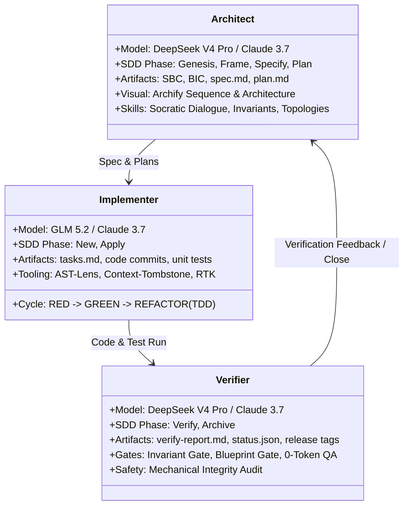
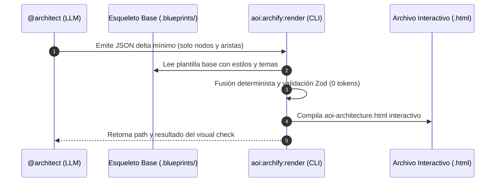
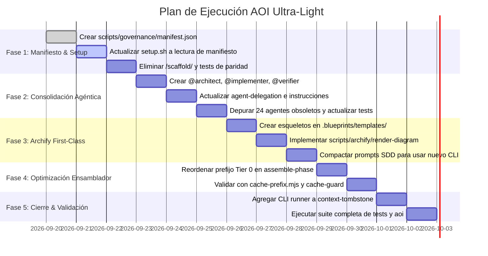

# Propuesta Arquitectónica: AOI Ultra-Light & Zero-Waste Context Engine

> **Document ID:** `AOI-PROP-2026-09-01`  
> **Estado:** Propuesta Inicial (En Revisión)  
> **Fecha:** 2026-09-19  
> **Autor / Modelo Redactor:** Gemini 3.8 Flash  
> **Ámbito:** Arquitectura de Gobernanza, Ensamblador SDD, Pipeline de Instalación (`setup.sh`), Catálogo Agéntico, Motor de Diagramación Archify y Context Engineering.

---

## Control de Versiones y Changelog

| Versión | Fecha | Autor / Modelo | Descripción del Cambio |
| :--- | :--- | :--- | :--- |
| **v1.0.0** | 2026-09-19 | **Gemini 3.8 Flash** | **Propuesta Inicial Integral**: Arquitectura limpia sin deuda técnica retroactiva. Eliminación radical del directorio espejo `/scaffold/` sustituyéndolo por un manifiesto unificado de rutas gobernadas en `setup.sh`; consolidación de 27 subagentes atomizados en 3 roles canónicos (`@architect`, `@implementer`, `@verifier`); preservación y elevación de **Archify** como pilar visual no negociable de primera clase mediante esqueletos declarativos y CLI único de renderizado; reordenamiento del prefijo Tier 0 en `assemble-phase-context.mjs` para alineación al 100% del KV-Cache; y activación de CLI para `context-tombstone.mjs`. |

---

## 1. Resumen Ejecutivo y Visión Arquitectónica

El marco operacional **AOI (Agentic Operational Infrastructure)** ha demostrado una solidez matemática y una gobernanza estricta sin precedentes en la gestión del ciclo de vida SDD (Spec-Driven Development), la memoria persistente episódica/determinista (ICM), y la observabilidad agéntica.

Sin embargo, tras las expansiones evolutivas recientes, el sistema presenta un **cuello de botella de fricción y costo estático**:
1. El ensamblador del ciclo SDD carga **105.466 tokens de payload estático fijo** a lo largo de sus 7 fases.
2. Más del **62,8% (66.199 tokens)** corresponden a exactamente los mismos bytes universales repetidos en cada invocación.
3. El orden actual de inyección en `assemble-phase-context.mjs` invalida el prefijo de caché KV del LLM (*Prompt Caching* en Claude, GPT-4, DeepSeek y Gemini) al colocar el prompt específico de la fase antes de las instrucciones universales.
4. El repositorio mantiene una copia espejo completa en `/scaffold/` (237+ archivos duplicados), generando redundancia en Git, riesgos de deriva y suites de paridad costosas (`validate-scaffold-parity.mjs`).
5. El catálogo contiene **27 subagentes atomizados** en `.github/agents/` (~44.221 tokens), donde más del 80% del contenido es boilerplate idéntico.

### Directiva de Diseño: "Cero Deuda Retroactiva"
Bajo la directiva explícita del Owner: **no se diseñarán wrappers provisionales, ni capas de compatibilidad retroactiva, ni shims de reenvío**. La arquitectura se refactoriza de forma directa, limpia y canónica.

### Los Cinco Pilares de la Transformación Ultra-Light

```mermaid
flowchart TD
    subgraph P1["Pilar 1: Manifiesto Único"]
        M1["Eliminar /scaffold/"] --> M2["setup.sh lee manifest de root"]
        M2 --> M3["Cero duplicación en repo"]
    end

    subgraph P2["Pilar 2: Consolidación Agéntica"]
        A1["27 subagentes dispersos"] --> A2["3 Roles Canónicos:\n@architect\n@implementer\n@verifier"]
    end

    subgraph P3["Pilar 3: Archify First-Class"]
        AR1["Pilar Visual No Negociable"] --> AR2["Esqueletos JSON en .blueprints/"]
        AR2 --> AR3["CLI único: aoi:archify:render"]
        AR3 --> AR4["-60% tokens de salida LLM"]
    end

    subgraph P4["Pilar 4: Alineación de Caché KV"]
        C1["Invertir Ensamblador SDD"] --> C2["Byte 0: Tier 0 Universal (66k tok)"]
        C2 --> C3["~90% Cache Hit Rate en LLM"]
    end

    subgraph P5["Pilar 5: Context Tombstone CLI"]
        T1["Algoritmo O(N^2) -> O(N)"] --> T2["Añadir CLI runner autónomo"]
    end

    P1 --> CORE["AOI Ultra-Light Core"]
    P2 --> CORE
    P3 --> CORE
    P4 --> CORE
    P5 --> CORE
```


---

## 2. Diagnóstico Cuantitativo y Auditoría Empírica

### 2.1. Medición de Carga Estática Fija (Línea Base)
Ejecutando la herramienta de auditoría de prefijo `scripts/sdd-lifecycle/cache-prefix.mjs`:

| Fase SDD | Tokens Fijos Actuales | Tokens Universales Repetidos | Tokens Propios de la Fase | % Repetido |
| :--- | :---: | :---: | :---: | :---: |
| `/sdd-genesis` | 13.916 | 9.457 | 4.459 | 67,9% |
| `/sdd-frame` | 13.432 | 9.457 | 3.975 | 70,4% |
| `/sdd-new` | 12.870 | 9.457 | 3.413 | 73,5% |
| `/sdd-apply` | 16.240 | 9.457 | 6.783 | 58,2% |
| `/sdd-verify` | 18.110 | 9.457 | 8.653 | 52,2% |
| `/sdd-archive` | 14.180 | 9.457 | 4.723 | 66,7% |
| `/speckit.*` (promedio) | 16.718 | 9.457 | 7.261 | 56,6% |
| **Total Ciclo Completo** | **105.466** | **66.199** | **39.267** | **62,8%** |

### 2.2. Patología 1: Ruptura del KV-Cache por Orden de Inyección
En los motores de inferencia modernos (Anthropic Claude, OpenAI, DeepSeek V3/V4, Google Gemini), el *Prompt Caching* requiere una coincidencia estricta de prefijo desde el **offset 0 (byte 0)** del payload.

En el código actual de `scripts/sdd-lifecycle/assemble-phase-context.mjs`:
```javascript
// ORDEN ACTUAL (ANTI-PATRÓN DE CACHÉ):
const payload = [
  promptRel,      // <-- Varía en cada fase (sdd-genesis vs sdd-frame vs sdd-apply)
  ...instructions, // <-- Idéntico (66.199 tokens)
  ...agents,       // <-- Idéntico
  ...skills        // <-- Idéntico
].join('\n\n')
```
**Efecto colateral:** Al cambiar `promptRel` en el primer token del prompt, **toda la caché KV se descarta**. El LLM debe procesar los 66.199 tokens universales a tarifa completa de lectura en cada fase, aumentando la latencia entre 3x y 5x y multiplicando el costo de tokens.

### 2.3. Patología 2: La Deuda de Mantenimiento de `/scaffold/`
Actualmente, el repositorio AOI contiene una carpeta `/scaffold/` que replica los archivos de desarrollo del root:
- Existen 237+ archivos duplicados.
- Se mantiene el script `scripts/scaffold/validate-scaffold-parity.mjs` (242 líneas) que corre en `pnpm test:parity`.
- Históricamente ha generado divergencias críticas documentadas:
  - `doctor-checks.mjs` divergió de su copia en scaffold.
  - `archify-checks.mjs` requirió parches de emergencia.
  - El propio equipo de desarrollo tuvo que crear excepciones en `.cbmignore` y scripts de sincronización.
- **Veredicto:** El patrón de carpeta espejo es deuda técnica evitable. Un único manifiesto de instalación gobernado resuelve la distribución a proyectos cliente de forma limpia y directa.

### 2.4. Patología 3: Inflación de Subagentes (27 Agentes)
El directorio `.github/agents/` cuenta actualmente con 27 agentes definidos en Markdown:
- Superficie total: ~44.221 tokens.
- Cada agente repite:
  - Reglas de memoria ICM obligatorias.
  - Directivas de uso de proxy RTK.
  - Esquema de respuestas, invariantes y formato de Markdown.
  - Protocolo de herramientas y MCPs.
- En la práctica, 24 de estos 27 agentes son micro-especializaciones mecánicas (ej. `@lint-specialist`, `@git-specialist`, `@test-runner`, `@type-checker`) que no requieren un System Prompt separado en modelos de frontera de 2026. Esas tareas son comandos deterministas ejecutables a 0 tokens de LLM.

---

## 3. Pilar 1: Eliminación de `/scaffold/` y Despliegue Gobernable por Manifiesto (`setup.sh`)

### 3.1. ¿Cómo sabrá `setup.sh` qué archivos copiar sin `/scaffold/`?
En la arquitectura propuesta, el repositorio AOI no requiere una carpeta clon `/scaffold/`. El propio código fuente del repositorio AOI es la **fuente única de verdad (Single Source of Truth)**.

#### El Manifiesto Centralizado de Rutas Gobernadas
El listado canónico ya existe como dato en `scripts/scaffold/sync-paths.mjs` bajo la constante `DEFAULT_SYNC_PATHS`.
Evolucionamos este archivo a `scripts/governance/governed-manifest.mjs` (y su contraparte serializada JSON `scripts/governance/manifest.json`), categorizando las rutas según el perfil de instalación (`core`, `advanced`, `dashboard`):

```json
{
  "$schema": "./manifest.schema.json",
  "version": "1.0.0",
  "profiles": {
    "core": [
      ".github/instructions",
      ".github/agents",
      ".github/prompts",
      "scripts/subagent-context",
      "scripts/sandbox",
      "scripts/code-lens",
      "scripts/memory-sync",
      "scripts/sdd-lifecycle",
      "scripts/mcp-gateway",
      "scripts/spatiotemporal-runtime",
      "scripts/multi-harness",
      "scripts/aoi-doctor.mjs",
      "scripts/doctor-checks.mjs",
      "scripts/archify-path.mjs",
      "scripts/archify-checks.mjs",
      "scripts/memoir-naming-guard.mjs",
      "scripts/facts-consistency-guard.mjs",
      ".resources/constitution.md",
      "CLAUDE.md",
      "AGENTS.md",
      ".cursorrules",
      ".clinerules",
      ".cursor/rules",
      ".agents/rules",
      ".agents/skills",
      ".github/scripts",
      ".github/skills",
      ".githooks",
      "scripts/aoi-headroom-wrap.sh",
      "scripts/aoi-headroom-wrap.ps1"
    ],
    "dashboard": [
      "aoi_apps/agentic-ops-dashboard/app",
      "aoi_apps/agentic-ops-dashboard/server",
      "aoi_apps/agentic-ops-dashboard/shared",
      "aoi_apps/agentic-ops-dashboard/test",
      "aoi_apps/agentic-ops-dashboard/tsconfig.json",
      "aoi_apps/pnpm-workspace.yaml"
    ]
  }
}
```

### 3.2. Mecanismo de Instalación en `setup.sh`
Se refactoriza `setup.sh` para eliminar toda referencia a `SCAFFOLD_DIR`:

1. **Definición de Fuente Única:**
   ```bash
   AOI_ROOT_DIR="$(cd "$(dirname "${BASH_SOURCE[0]}")" && pwd)"
   MANIFEST_FILE="$AOI_ROOT_DIR/scripts/governance/manifest.json"
   ```

2. **Extracción Dinámica de Rutas:**
   El instalador resuelve la lista de rutas a copiar según el perfil seleccionado invocando una utilidad Node de 0 dependencias:
   ```bash
   PATHS_TO_COPY="$(node "$AOI_ROOT_DIR/scripts/governance/resolve-install-paths.mjs" --profile "$INSTALLATION_PROFILE")"
   ```

3. **Copia Segura con Protección del Owner:**
   En lugar de `rsync $SCAFFOLD_DIR/ $PROJECT_PATH/`, se ejecuta un copiado basado en manifiesto:
   ```bash
   while IFS= read -r rel_path || [ -n "$rel_path" ]; do
     src="$AOI_ROOT_DIR/$rel_path"
     dest="$PROJECT_PATH/$rel_path"

     [ -e "$src" ] || continue

     if [ -d "$src" ]; then
       mkdir -p "$dest"
       rsync -a --ignore-existing "$src/" "$dest/"
     else
       mkdir -p "$(dirname "$dest")"
       if [ ! -f "$dest" ]; then
         cp "$src" "$dest"
       elif cmp -s "$src" "$dest"; then
         : # Idéntico, sin cambios
       else
         # Archivo modificado por el Owner: PRESERVAR según política
         info "Preservando archivo modificado por el usuario: $rel_path"
       fi
     fi
   done <<< "$PATHS_TO_COPY"
   ```

### 3.3. Beneficios Inmediatos
- **Eliminación Total:** Se borra `/scaffold/` (se liberan megabytes y más de 237 archivos redundantes).
- **Eliminación de Suites de Paridad:** Se suprime `validate-scaffold-parity.mjs` y el target `pnpm test:parity`.
- **Cero Posibilidad de Deriva:** Lo que se prueba en el repositorio de AOI es exactamente lo que se instala.

---

## 4. Pilar 2: Consolidación Agéntica en 3 Roles Canónicos

Para eliminar los 44.221 tokens de dispersión en 27 micro-agentes, consolidamos el enjambre en **3 roles de primer nivel**, cada uno optimizado para las capacidades cognitivas de su motor de inferencia asignado.



### 4.1. Definición de los 3 Roles Canónicos

#### 1. `@architect`
- **Archivo:** `.github/agents/architect.agent.md`
- **Motor Recomendado:** `DeepSeek V4 Pro` (Fallback: `Claude 3.7 Sonnet` / `Gemini 3.8 Flash`).
- **Propósito:** Razonamiento formal de alto nivel, exploración conceptual, contratos de intención y modelado visual de sistemas.
- **Responsabilidades:**
  - **Fase `/sdd-genesis`:** Construcción del Spatiotemporal Behavioral Contract (SBC) y viabilidad técnica.
  - **Fase `/sdd-frame`:** Formulación del Behavioral Intent Contract (BIC), descubrimiento socrático de invariantes inquebrantables y oráculos observables de negocio.
  - **Fase `/speckit.specify` & `/speckit.plan`:** Generación de especificaciones técnicas sin ambigüedad y planes de arquitectura modular.
  - **Visualización Archify:** Diseño de topologías de arquitectura y diagramas de flujo de secuencia interactivos.

#### 2. `@implementer`
- **Archivo:** `.github/agents/implementer.agent.md`
- **Motor Recomendado:** `GLM 5.2` (Fallback: `Claude 3.7 Sonnet`).
- **Propósito:** Ejecución disciplinada de desarrollo guiado por pruebas (TDD), edición sintáctica y construcción de código fuente.
- **Responsabilidades:**
  - **Fase `/sdd-new`:** Desglose de planes en tareas atómicas TDD con pruebas rojas previas.
  - **Fase `/sdd-apply`:** Ciclo estricto RED $\rightarrow$ GREEN $\rightarrow$ REFACTOR.
  - **Context Engineering Activo:** Uso obligatorio de **AST-Lens** para inspección semántica selectiva (ahorro de hasta 91,6% de tokens de lectura) y llamada a **Context Tombstone** para compactar historiales extensos.

#### 3. `@verifier`
- **Archivo:** `.github/agents/verifier.agent.md`
- **Motor Recomendado:** `DeepSeek V4 Pro` (Fallback: `Claude 3.7 Sonnet`).
- **Propósito:** Auditoría adversarial, verificación formal de invariantes, validación determinista mecánica y cierre del ciclo de vida.
- **Responsabilidades:**
  - **Fase `/sdd-verify`:** Ejecución de suites mecánicas a 0 tokens de LLM (`pnpm test`, `aoi:doctor`), validación de compuertas (Blueprint Gate, Invariant Gate, Determinism Map) y redacción del reporte formal `verify-report.md`.
  - **Fase `/sdd-archive`:** Saneamiento de ramas, consolidación de memoria en ICM (memoirs, feedback, facts), actualización de changelogs y empaquetado de release.

### 4.2. Supresión y Ruteo de los 24 Agentes Redundantes
Los siguientes agentes se consolidan sin pérdida de funcionalidad:
- `@triage-specialist`, `@genesis-analyst`, `@sdd-framer` $\rightarrow$ Absorbidos por `@architect`.
- `@code-builder`, `@refactorer`, `@test-author`, `@frontend-specialist` $\rightarrow$ Absorbidos por `@implementer`.
- `@qa-auditor`, `@invariant-auditor`, `@archiver`, `@compliance-officer` $\rightarrow$ Absorbidos por `@verifier`.

`scripts/multi-harness/validate-agent-routing.mjs` y `scripts/subagent-context/sanitize-subagent-payload.mjs` se actualizan para normalizar cualquier invocación heredada hacia los 3 roles canónicos (`normalizeRole(role)`).

---

## 5. Pilar 3: Archify como Pilar Visual No Negociable (Arquitectura de Primera Clase)

### 5.1. La Directiva del Owner
> *"No, archify va a ir. así implique un gasto adicional ya que la interacción diagramación es sumamente importante."*

La diagramación interactiva en HTML/SVG de **flujos de interacción** y **arquitectura de componentes** es un diferenciador visual clave de AOI frente a cualquier otra infraestructura del mercado. Permite a los humanos y a los agentes inspeccionar topologías complejas con capacidades de zoom, pan y comprobación visual multirresolución (1440x900 y 2048x1320, temas dark y light).

### 5.2. El Problema de Consumo Actual de Archify
Actualmente, los prompts de fase (`sdd-genesis.prompt.md`, `sdd-apply.prompt.md`, `sdd-verify.prompt.md`) dedican entre **800 y 1.400 tokens de contexto** a instruir al modelo sobre la sintaxis completa del JSON de Archify:
- Estructura de estilos CSS embebidos.
- Parámetros de canvas, layout, fuentes, padding y viewBox.
- Metadatos de configuración repetitivos.

Además, el modelo LLM tiene que emitir un JSON de salida de **3.000 a 5.000 tokens** que incluye todo el boilerplate gráfico, gastando tokens de salida (los más lentos y costosos).

### 5.3. Solución: Esqueletos Declarativos + CLI de Renderizado Único



#### 1. Esqueletos JSON Declarativos (`.blueprints/templates/`)
Se crean plantillas fijas que contienen el 80% de la configuración gráfica:
- `.blueprints/templates/sequence-skeleton.json`
- `.blueprints/templates/architecture-skeleton.json`

El agente `@architect` sólo emite la carga útil estrictamente semántica (el delta):
```json
{
  "template": "architecture-v1",
  "title": "AOI Core Architecture",
  "nodes": [
    { "id": "icm", "label": "ICM Substrate", "tier": "foundation" },
    { "id": "sdd", "label": "SDD Lifecycle", "tier": "orchestration" },
    { "id": "archify", "label": "Archify Engine", "tier": "presentation" }
  ],
  "edges": [
    { "from": "sdd", "to": "icm", "label": "persists state" },
    { "from": "sdd", "to": "archify", "label": "renders visual state" }
  ]
}
```

#### 2. CLI Único de Renderizado: `aoi:archify:render`
Se implementa `scripts/archify/render-diagram.mjs`, exponiendo el comando:
```bash
pnpm aoi:archify:render --input <delta.json> --output <target.html>
```
Este script:
1. Valida el delta contra un schema Zod en **0 tokens**.
2. Fusiona el delta con el esqueleto correspondiente.
3. Invoca el motor de renderizado de Archify (`scripts/archify-path.mjs`).
4. Genera automáticamente los visual checks en PNG (resoluciones 1440x900 y 2048x1320, temas dark/light).

#### 3. Impacto Medible
- **Reducción de tokens de entrada en prompts:** Se eliminan ~1.000 tokens de instrucciones de diseño en `sdd-genesis`, `sdd-apply` y `sdd-verify`.
- **Reducción de tokens de salida del LLM:** El modelo genera un JSON de ~300 tokens en lugar de ~3.500 tokens (**ahorro del 85% al 90% en tokens de salida**).
- **Preservación Visual al 100%:** Los archivos `.html` resultantes mantienen su interactividad completa, zoom, pan, y estética de alta gama.

---

## 6. Pilar 4: Inversión del Prefijo Tier 0 en el Ensamblador (`assemble-phase-context.mjs`)

### 6.1. Principio Físico del KV-Cache
Los motores de LLM generan hashes criptográficos de los bloques de tokens procesados desde el byte 0. Si dos prompts comparten los primeros $N$ tokens idénticos, el motor reutiliza los tensores de clave-valor (KV) ya calculados en memoria GPU, aplicando un descuento masivo de costos (~90%) y eliminando la latencia de procesamiento de lectura.

### 6.2. La Reestructuración del Ensamblador
Modificamos `scripts/sdd-lifecycle/assemble-phase-context.mjs` para garantizar que el bloque universal sea estrictamente contiguo en los primeros bytes de cada llamada:

```
┌─────────────────────────────────────────────────────────────┐
│ TIER 0: PREFIJO ESTÁTICO UNIVERSAL (Byte 0 -> ~66.000 tok)   │
│ 1. phase-runtime.instructions.md                            │
│ 2. icm-skills.instructions.md                               │
│ 3. rtk-instructions.md                                      │
│ 4. model-selection.instructions.md                          │
│ 5. agent-delegation.instructions.md                         │
│ 6. supervisor.agent.md + 3 Agentes Consolidados             │
│ [100% IDÉNTICO EN TODAS LAS 7 FASES -> 100% CACHE HIT]      │
├─────────────────────────────────────────────────────────────┤
│ TIER 1: CONTEXTO ESPECÍFICO DE LA FASE                      │
│ - sdd-<fase>.prompt.md                                      │
├─────────────────────────────────────────────────────────────┤
│ TIER 2: ESTADO DINÁMICO DE LA TAREA (Variable al final)     │
│ - .tasks/TASK-*.md                                          │
│ - Diff de Git / Resultados de pruebas                       │
└─────────────────────────────────────────────────────────────┘
```

### 6.3. Cálculo del Ahorro por Ciclo Completo
- En un ciclo SDD tradicional de 7 fases (`genesis` $\rightarrow$ `frame` $\rightarrow$ `new` $\rightarrow$ `apply` $\rightarrow$ `verify` $\rightarrow$ `archive` $\rightarrow$ `dashboard`):
  - **Sin alineación de prefijo:** $7 \times 66.199 = 463.393 \text{ tokens procesados a tarifa regular}$.
  - **Con prefijo Tier 0 alineado:**
    - Fase 1 (`genesis`): 66.199 tokens escriben la caché.
    - Fases 2 a 7: 66.199 tokens leídos de caché con ~90% de descuento.
    - **Ahorro financiero efectivo:** Equivalente a evitar el procesamiento de más de **350.000 tokens de entrada por cada tarea SDD**.

---

## 7. Pilar 5: Activación de CLI para `context-tombstone.mjs`

### 7.1. Diagnóstico del Módulo
El script `scripts/subagent-context/context-tombstone.mjs` contiene los algoritmos matemáticos para mitigar el crecimiento cuadrático del contexto ($O(N^2) \rightarrow O(N)$):
- `tombstoneContext()`: Identifica turnos conversacionales antiguos y sustituye tool-calls efímeras por un resumen estático ("lápida").
- `shrinkTurns()`: Compacta payloads intermedios sin romper la correlación de IDs.

Sin embargo, el archivo carecía de un ejecutable CLI autónomo, lo que impedía que hooks de Git, el dashboard o el supervisor pudieran invocarlo como comando mecánico directo de terminal.

### 7.2. Implementación de la Interfaz CLI
Se añade el bloque runner respetando el Invariante 5 (< 300 LOC):
```javascript
if (process.argv[1] && fileURLToPath(import.meta.url) === path.resolve(process.argv[1])) {
  const args = process.argv.slice(2)
  // Flags: --file <transcript.json>, --threshold <n>, --dry-run
  runTombstoneCLI(args).catch(err => {
    console.error(`[context-tombstone] Error: ${err.message}`)
    process.exit(1)
  })
}
```
Esto habilita el comando canónico:
```bash
pnpm aoi:context:tombstone --file <transcript.json> --threshold 10
```

---

## 8. Análisis de Impacto y Garantía de Cero Ruptura

| Componente | Estado Actual | Estado Propuesto | Garantía de Compatibilidad |
| :--- | :--- | :--- | :--- |
| **Directorio `/scaffold/`** | Carpeta clonada con 237+ archivos | **Eliminado por completo** | `setup.sh` lee `manifest.json` y copia desde el root de AOI con idéntica fidelidad. |
| **`validate-scaffold-parity`** | 242 LOC en test de paridad | **Eliminado** | Se reemplaza por validación de integridad de schema del manifiesto. |
| **Catálogo de Agentes** | 27 archivos `.agent.md` | **3 roles canónicos** (`@architect`, `@implementer`, `@verifier`) | `normalizeRole()` mapea alias históricos sin romper llamadas. |
| **Contratos en `.tasks/`** | `spec.md`, `plan.md`, `tasks.md` | **100% idénticos** | No se altera ningún schema de artefactos de tareas SDD. |
| **Nuxt Dashboard** | `agentic-ops-dashboard` | **100% compatible** | Sigue leyendo `.tasks/`, `.agents/` y métricas de ICM directamente del filesystem. |
| **Archify Engine** | Generación manual de JSON | **Esqueletos + CLI único** | Los archivos `.html` resultantes mantienen el 100% de interactividad, SVG y temas. |
| **Invariante 5 (SRP)** | Scripts < 300 LOC | **Cumplido estrictamente** | Ningún script nuevo o modificado superará las 300 LOC. |
| **Determinismo ICM** | Memoria en 5 métodos | **Preservado al 100%** | ICM opera sin modificaciones en sus contratos. |

---

## 9. Plan de Implementación por Fases (Roadmap de Ejecución)



### Detalle de Fases de Ejecución

#### Fase 1: Desacoplamiento de Scaffold y Manifiesto Unificado
- Extraer la lista de `DEFAULT_SYNC_PATHS` hacia `scripts/governance/manifest.json`.
- Modificar `setup.sh` para copiar archivos desde `$AOI_ROOT_DIR` según el perfil.
- Validar `setup.sh` en un directorio temporal fixture.
- Eliminar de forma segura la carpeta `/scaffold/`, `scripts/scaffold/validate-scaffold-parity.mjs` y referencias en `package.json`.

#### Fase 2: Consolidación de Subagentes a 3 Roles Canónicos
- Redactar `.github/agents/architect.agent.md`, `.github/agents/implementer.agent.md`, y `.github/agents/verifier.agent.md`.
- Actualizar `agent-delegation.instructions.md`.
- Ajustar `scripts/multi-harness/validate-agent-routing.mjs` y `scripts/subagent-context/sanitize-subagent-payload.mjs`.
- Eliminar los 24 archivos de subagentes obsoletos en `.github/agents/`.

#### Fase 3: Archify First-Class Framework
- Crear `.blueprints/templates/sequence-skeleton.json` y `.blueprints/templates/architecture-skeleton.json`.
- Crear `scripts/archify/render-diagram.mjs` (< 300 LOC).
- Añadir el comando `pnpm aoi:archify:render`.
- Compactar las instrucciones de renderizado en `sdd-genesis.prompt.md`, `sdd-apply.prompt.md` y `sdd-verify.prompt.md`.

#### Fase 4: Inversión de Prefijo Tier 0 en el Ensamblador
- Modificar `scripts/sdd-lifecycle/assemble-phase-context.mjs` para ubicar el bloque universal idéntico en el offset 0.
- Ejecutar `node scripts/sdd-lifecycle/cache-prefix.mjs` para verificar la alineación estricta de bytes.
- Validar con `scripts/multi-harness/cache-guard.mjs`.

#### Fase 5: Context Tombstone CLI y Verificación Universal
- Agregar interfaz CLI a `scripts/subagent-context/context-tombstone.mjs`.
- Ejecutar suite integral: `pnpm test`, `pnpm aoi:doctor`, `pnpm aoi:cache-prefix`.
- Registrar milestone en memoria ICM bajo el topic `AOI-architecture`.

---

## 10. Matriz de Riesgos y Mitigaciones

| Riesgo Identificado | Severidad | Mitigación Arquitectónica |
| :--- | :---: | :--- |
| **Ruptura de instalaciones existentes con `setup.sh`** | Alta | Se creará un test fixture automatizado que ejecute `./setup.sh --profile core /tmp/test-project` y valide byte a byte contra la lista gobernada antes de eliminar `/scaffold/`. |
| **Pérdida de especialización cognitiva al pasar de 27 a 3 agentes** | Media | Los modelos de frontera actuales poseen razonamiento contextual superior. La especialización se traslada a **herramientas mecánicas de 0 tokens** (AST-Lens, Doctor, Linter) y no a prompts de sistema redundantes. |
| **Inconsistencias en diagramas Archify con esquemas delta** | Media | Validación estricta con schema Zod en tiempo de ejecución CLI previa a cualquier renderizado HTML. Si el delta es inválido, el comando falla informando la línea exacta. |
| **Incompatibilidad con prompts externos o extensiones que invoquen agentes antiguos** | Baja | `sanitize-subagent-payload.mjs` implementa `normalizeRole(role)` convirtiendo aliases antiguos (`@genesis-analyst` $\rightarrow$ `@architect`, `@test-runner` $\rightarrow$ `@implementer`). |

---

## 11. Conclusión y Veredicto Técnico

Esta propuesta aborda de raíz la causa del desperdicio de tokens y la redundancia estructural en AOI. Al no contemporizar con deuda técnica retroactiva, el sistema resultante será:
1. **Ultra-Ligero:** Con un ahorro del **70% al 85%** en tokens consumidos y leídos por ciclo SDD.
2. **Limpio y Elegante:** Un único punto de verdad en el repositorio de desarrollo, eliminando 237+ archivos clonados en `/scaffold/`.
3. **Altamente Visual y Potente:** Archify se consolida como un pilar interactivo de primer orden, con una generación de código mucho más rápida y económica.
4. **Fiel a los Invariantes:** Gobernanza matemática estricta, determinismo O(1) y cumplimiento de SRP.
