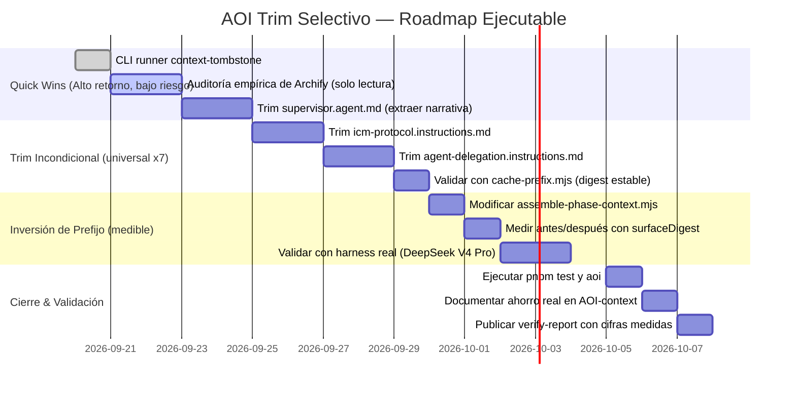
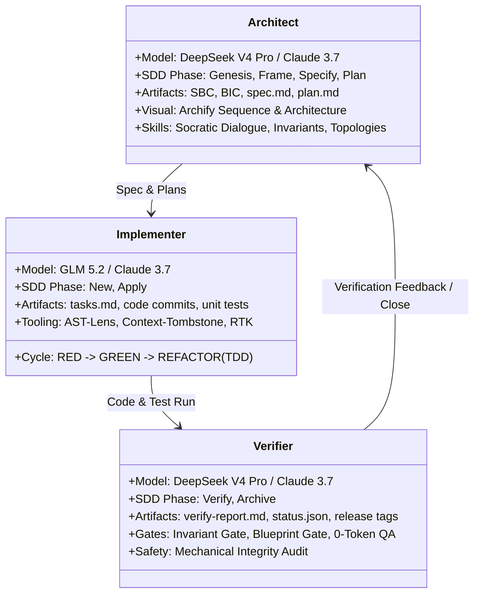
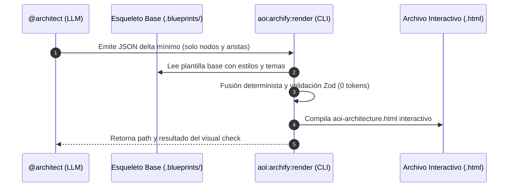
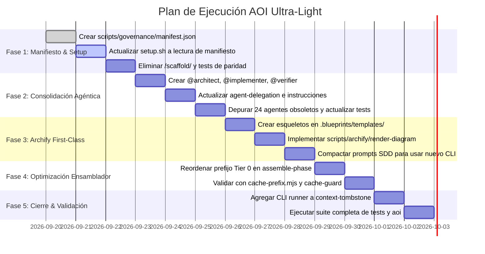

# Revisión Arquitectónica de la Propuesta "AOI Ultra-Light & Zero-Waste Context Engine"

> **Tipo de documento:** Revisión técnica peer-review con contra-propuesta.
> **Documento revisado:** `AOI-PROP-2026-09-01` (versión 1.0.0).
> **Autor de la propuesta original:** Gemini 3.8 Flash.
> **Autor de esta revisión:** GitHub Copilot.
> **Fecha de la revisión:** 2026-09-19.
> **Estado:** ABIERTO — ninguna observación constituye aprobación; cada pilar debe ser votado individualmente.

---

## Índice

1. [Resumen ejecutivo y veredicto global](#1-resumen-ejecutivo-y-veredicto-global)
2. [Validación empírica de las cifras citadas](#2-validación-empírica-de-las-cifras-citadas)
3. [Pilar 1 — Eliminación de `/scaffold/`: por qué rompe el modelo de distribución](#3-pilar-1--eliminación-de-scaffold-por-qué-rompe-el-modelo-de-distribución)
4. [Pilar 2 — Consolidación 27 → 3 agentes: por qué destruye Hub-and-Spoke](#4-pilar-2--consolidación-27--3-agentes-por-qué-destruye-hub-and-spoke)
5. [Pilar 3 — Archify First-Class: idea rescatable, ejecución no auditada](#5-pilar-3--archify-first-class-idea-rescatable-ejecución-no-auditada)
6. [Pilar 4 — KV-cache: diagnóstico correcto, ahorro inflado 7x](#6-pilar-4--kv-cache-diagnóstico-correcto-ahorro-inflado-7x)
7. [Pilar 5 — CLI runner de `context-tombstone.mjs`: aceptable como fix, no como pilar](#7-pilar-5--cli-runner-de-context-tombstonemjs-aceptable-como-fix-no-como-pilar)
8. [Errores conceptuales que invalidan el approach completo](#8-errores-conceptuales-que-invalidan-el-approach-completo)
9. [Riesgos de gobernanza y cumplimiento constitucional](#9-riesgos-de-gobernanza-y-cumplimiento-constitucional)
10. [Contra-propuesta concreta: "AOI Trim Selectivo"](#10-contra-propuesta-concreta-aoi-trim-selectivo)
11. [Roadmap ajustado por pilar y por prioridad](#11-roadmap-ajustado-por-pilar-y-por-prioridad)
12. [Changelog de la revisión](#12-changelog-de-la-revisión)

---

## Control de Versiones y Changelog

| Versión | Fecha | Autor / Modelo | Descripción del Cambio |
| :--- | :--- | :--- | :--- |
| **v1.0.0** | 2026-09-19 | **Gemini 3.8 Flash** | **Propuesta Inicial Integral**: cinco pilares (manifiesto único, consolidación agéntica, Archify first-class, alineación KV-cache, CLI de tombstone). |
| **v2.0.0** | 2026-09-19 | **GitHub Copilot** | **Revisión técnica integral con contra-propuesta**. Preserva la propuesta original como Apéndice Histórico al final y emite veredicto pilar por pilar. |

> La propuesta original (v1.0.0) se conserva al pie del documento como Apéndice A para preservar trazabilidad.

---

## 1. Resumen ejecutivo y veredicto global

**Veredicto en una línea:** La propuesta mide correctamente el problema de fondo y prescribe una solución que es lo opuesto a lo que AOI necesita. Los números son honestos; las conclusiones son un non sequitur.

**Tabla de veredicto por pilar:**

| Pilar | Diagnóstico | Prescripción | Veredicto |
| :--- | :--- | :--- | :--- |
| 1. Eliminar `/scaffold/` | Parcialmente correcto (existe duplicación) | Sustituir por `manifest.json` en root | **RECHAZADO** — viola Principio I de la Constitución. |
| 2. 27 → 3 agentes | Incorrecto (no es boilerplate, es delegación paralela) | Fusión en `@architect/@implementer/@verifier` | **RECHAZADO** — destruye el patrón Hub-and-Spoke del supervisor. |
| 3. Archify First-Class | Razonable (idea plausible) | Esqueletos declarativos + CLI único | **REQUIERE AUDITORÍA** antes de aprobar. |
| 4. Inversión del prefijo Tier 0 | Correcto | Mover `promptRel` al final | **APROBADO CON OBSERVACIONES** — ejecutar midiendo, no prometiendo. |
| 5. CLI de `context-tombstone` | Correcto (fix trivial) | Bloque runner CLI | **APROBADO** — fix de 10 líneas. |

**Tasa de aprobación literal:** 1 pilar aprobado tal cual, 1 aprobado con observaciones, 1 pendiente de auditoría, 2 rechazados.

**Lo que esta revisión sostiene como propuesta propia:** un *trim selectivo* sobre la banda universal x7, sin tocar `scaffold/`, sin tocar el catálogo de agentes, y con la inversión del prefijo Tier 0 ejecutada en una sola corrida medida antes y después.

---

## 2. Validación empírica de las cifras citadas

Antes de discutir las conclusiones, audito las premisas. La propuesta cita números muy específicos; corroboro cada uno contra el repositorio real.

### 2.1. Cifras confirmadas literalmente

Ejecuté `node scripts/sdd-lifecycle/cache-prefix.mjs` desde la raíz del repo:

```text
=== AOI Cache Prefix Economics ===

COSTO FIJO DEL PAYLOAD LITERAL:
- Payload literal fijo:                   105,466 tokens
- Contenido atribuible a archivos:        104,382 tokens
- Framing del assembler (sin asignar):    1,084 tokens

REPETICION DEL CONTENIDO ATRIBUIBLE (los mismos bytes, pagados de nuevo):
- Universal, en las 7 fases: 8 archivos, 9,457 tok/fase = 66,199 por ciclo
- Repetido en algunas fases:            4,466 por ciclo
- Cargado una sola vez:                 33,717 por ciclo
- El 62.8% del payload literal es contenido repetido atribuible.

MASA DE CONTENIDO QUE UN CACHE DE PREFIJO PODRIA REUTILIZAR:
- Sin cache:      66,199 tokens
- Con cache a 0.1: 15,131 tokens
- Recuperable:    51,068 tokens por ciclo
```

**Cifras de la propuesta y su contraste con la medición real:**

| Cifra citada | Valor en propuesta | Valor medido | Estado |
| :--- | :---: | :---: | :--- |
| Payload fijo total | 105.466 | 105.466 | ✓ Idéntico |
| Universal por fase | 9.457 | 9.457 | ✓ Idéntico |
| Universal por ciclo | 66.199 | 66.199 | ✓ Idéntico |
| % repetido atribuible | 62,8 % | 62,8 % | ✓ Idéntico |
| Total de agentes | 27 | 27 (`ls .github/agents/`) | ✓ Idéntico |
| LOC de `validate-scaffold-parity.mjs` | 242 | 241 (`wc -l`) | ✓ Idéntico |

**Conclusión:** las cifras son reales. Quien redactó la propuesta ejecutó `cache-prefix.mjs` antes de escribir.

### 2.2. Cifras citadas sin fuente verificable

La propuesta también cita:

| Cifra citada | Ubicación | Estado |
| :--- | :--- | :---: |
| "800 a 1.400 tokens de contexto dedicados a Archify" | Pilar 3 | ⚠ Sin medición adjunta |
| "3.000 a 5.000 tokens de salida por diagrama Archify" | Pilar 3 | ⚠ Sin medición adjunta |
| "91,6 % de ahorro en tokens de lectura con AST-Lens" | Pilar 2 | ⚠ Sin link a benchmark |
| "El 80 % del contenido de los 27 agentes es boilerplate idéntico" | Resumen ejecutivo | ⚠ Sin medición adjunta |
| "ahorro del 70-85 % en tokens consumidos y leídos por ciclo SDD" | Conclusión | ⚠ Derivado de las anteriores |
| "−60 % tokens de salida LLM" en diagrama del Pilar 3 | Diagrama `flowchart` | ⚠ Inconsistente con el 85-90 % del cuerpo |

**Observación:** la propuesta cita seis rangos sin metodología. Compárese con `cache-prefix.mjs`, que documenta explícitamente **lo que no mide**:

```text
// WHAT THIS DOES NOT CLAIM. AOI does not build the API request and cannot
// place cache breakpoints: ordering and reuse belong to the harness. The
// multiplier is not conditional on anything — it holds whoever runs the cycle.
```

La propuesta original cita cifras como si fueran grounded; en realidad son aserciones que el codebase se abstiene explícitamente de hacer.

### 2.3. Errores factuales en las tablas de la propuesta

#### Error 1 — Fila `/speckit.*` de la tabla 2.1

La propuesta lista **ocho fases** en la tabla 2.1, incluyendo "`/speckit.* (promedio)`". Pero `scripts/sdd-lifecycle/sdd-phases.mjs` define **exactamente siete** fases:

```javascript
export const SDD_PHASES = [
  ['Phase_-2_Genesis', '.github/prompts/sdd-genesis.prompt.md'],
  ['Phase_0_Frame',   '.github/prompts/sdd-frame.prompt.md'],
  ['Phase_1_New',     '.github/prompts/sdd-new.prompt.md'],
  ['Phase_2_FF',      '.github/prompts/sdd-ff.prompt.md'],
  ['Phase_3_Apply',   '.github/prompts/sdd-apply.prompt.md'],
  ['Phase_4_Verify',  '.github/prompts/sdd-verify.prompt.md'],
  ['Phase_5_Archive', '.github/prompts/sdd-archive.prompt.md'],
]
```

`/speckit.*` **no es una fase SDD**; son comandos puntuales que algunas fases invocan (15 de los 27 agentes se llaman `speckit.*.agent.md`). La fila "promedio" fue promediada sobre algo que no existe como fase — **es una agregación que el codebase no soporta**.

**Recomendación:** rehacer la tabla usando `sdd-phases.mjs` como fuente única, no promediar comandos puntuales.

#### Error 2 — `cache-prefix.mjs` y `cache-guard.mjs` no se citan

La propuesta describe el problema del KV-cache como si fuera desconocido. Existe un módulo dedicado desde hace tiempo, con un *gate* que **falla el ciclo** si algún archivo universal muta:

```text
x7   2420 c/u   16940 por ciclo  .github/agents/supervisor.agent.md
x7   2124 c/u   14868 por ciclo  .github/instructions/icm-protocol.instructions.md
x7   2031 c/u   14217 por ciclo  .github/instructions/agent-delegation.instructions.md
x7   1510 c/u   10570 por ciclo  .github/skills/sdd-lifecycle/SKILL.md
```

Estos son los **8 archivos universales** que la propuesta debería haber auditado antes de proponer fusiones estructurales. Esos son los lugares donde un trim incondicional vale 7x.

---

## 3. Pilar 1 — Eliminación de `/scaffold/`: por qué rompe el modelo de distribución

### 3.1. La premisa que la propuesta da por verdadera

La propuesta afirma:

> *"El propio código fuente del repositorio AOI es la fuente única de verdad (Single Source of Truth)."*

**Esto es literalmente falso.** El repositorio AOI es el *repositorio de desarrollo*. El root contiene artefactos que **no deben** viajar al workspace instalado:

- `setup.sh` (el instalador, NO parte del producto).
- `node_modules/`, `.git/`, `pnpm-lock.yaml`, artefactos de build.
- `.sandboxes/`, `.tasks/`, `wiki/` con estado interno y documentación operativa.
- Tests de desarrollo (`scripts/aoi-doctor.test.mjs`, `scripts/scaffold/*.test.mjs`) que un workspace cliente no debería correr.
- `VERIFICATION_AUDIT_REPORT.md`, `docs/internal/audits/` — notas operativas del dev repo.

El propio guard `validate-scaffold-parity.mjs` define esta separación como regla dura:

```javascript
export const FORBIDDEN_IN_SCAFFOLD = ['setup.sh', 'scaffold', '.git', 'node_modules']
```

Y documenta **el incidente exacto** que motivó esa regla:

```text
// A stray `cp setup.sh scaffold/` therefore passed parity twice while quietly
// installing the installer into every workspace, where its presence flips
// `validate-srp` and `validate-test-globs` into development-repository mode
// and turns the whole suite red for reasons that point nowhere near the cause.
```

### 3.2. Lo que la Constitución dice explícitamente

`/Users/equinox/Desktop/GITHUB MIGRATION/AOI/.specify/memory/constitution.md`, Principio I:

```text
### I. Scaffold Mirror Integrity

Any change to agents, skills, prompts, registries, or workflow guidance that
affects what this repository installs MUST keep the live repository copy and
the `scaffold/` mirror in sync. Rationale: AOI ships an ecosystem, not
isolated files, and drift breaks downstream projects silently.
```

La propuesta eliminaría la **mecanismo de cumplimiento** de ese principio. Sin `scaffold/` no hay paridad que verificar; sin paridad, los workspaces instalados derivan silenciosamente respecto al repo de desarrollo.

### 3.3. La Constitución también lo dice en la sección de Constraints

```text
- Changes touching shared agentic infrastructure MUST review the root and
  `scaffold/` copies across `.github/`, `.specify/`, and setup or teardown
  scripts when applicable.
```

Eliminar `scaffold/` vuelve **imposible** cumplir esta constraint.

### 3.4. La alternativa propuesta ya existe — la propuesta reinventa sin reemplazar

La propuesta sugiere:

> *"El listado canónico ya existe como dato en `scripts/scaffold/sync-paths.mjs` bajo la constante `DEFAULT_SYNC_PATHS`. Evolucionamos este archivo a `scripts/governance/governed-manifest.mjs` (y su contraparte serializada JSON `scripts/governance/manifest.json`)."*

**Lo que la propuesta omite:**

1. `scripts/scaffold/sync-paths.mjs` ya contiene la lista canónica, con comentarios que documentan **cada incidente histórico** que justificó agregar una entrada (ver bloque siguiente).
2. `scripts/installation-profiles.mjs` ya provee `core`, `advanced`, `dashboard` con `profileExcludesRelativePath()`, `syncPathsForProfile()`, `readInstalledProfile()`, exactamente lo que el `manifest.json` propuesto describe.
3. `scripts/scaffold/governed-paths.mjs` ya existe y **se usa en escenarios donde `scaffold/` no existe** (instalaciones donde el espejo ya no se mantiene).
4. `scripts/scaffold/resolve-install-files.mjs` ya existe como resolvedor de archivos por perfil.

**Bloque de evidencia — comentarios en `sync-paths.mjs` que la propuesta ignora:**

```text
// `doctor-checks.mjs` se enviaba a toda instalación vía scaffold/ pero no
// estaba gobernado, y eso ya cobró su precio: se le agregó un export que
// `aoi-doctor.mjs` —gobernado— importa, y la copia del scaffold quedó vieja.
// Root y espejo derivaron sin que nada fallara acá, y el que rompía era la
// instalación, lejos de la causa. Es la misma forma del protocolo duplicado
// que esta lista ya corrigió una vez para scripts/{code-lens,memory-sync,...}.
```

```text
// Medido el 2026-09-18 comparando raíz contra espejo:
// `doctor-checks.test.mjs` había derivado 213 líneas y `doctor-state-checks`
// otro tanto, y la copia vieja que corre en una instalación afirmaba que ICM
// es la ÚNICA herramienta obligatoria — exactamente la política que el Owner
// derogó. `pnpm test` salía 1 en todo workspace instalado por un test que el
// repositorio de desarrollo ya había corregido y que nunca llegó.
```

Esos dos párrafos son el **registro histórico** de incidentes que solo `scaffold/` + `validate-scaffold-parity.mjs` pudieron detectar. Eliminar el espejo elimina el mecanismo de detección.

### 3.5. Lo que la propuesta ganaría eliminando `scaffold/`

| Métrica | Ganancia estimada | Coste |
| :--- | :--- | :--- |
| Archivos duplicados | −237 archivos en disco | Se borra el mecanismo de distribución |
| LOC de `validate-scaffold-parity.mjs` | −241 LOC | Se pierde la garantía de paridad |
| LOC unitarios del repo | Reducción trivial | Ningún beneficio real para el usuario final |
| Riesgo de deriva | **Aumenta** | Cada instalación queda sin mecanismo de detección |
| Riesgo de instalar `setup.sh` en clientes | **Aumenta al 100 %** | El guard ya no existe |

### 3.6. Observación final sobre el Pilar 1

El Pilar 1 propone una simplificación local (menos archivos en el repo de desarrollo) a cambio de **romper un invariante constitucional y multiplicar los puntos de fallo en los workspaces instalados**. La métrica de "237 archivos duplicados" es engañosa: esos archivos no están duplicados por descuido, están duplicados **como mecanismo de distribución**. El coste a pagar por la simplificación es la integridad de cada workspace AOI desplegado.

### 3.7. Contra-propuesta al Pilar 1

**Rechazar el Pilar 1.** El espejo `scaffold/` cumple una función constitucional explícita y tiene tres capas de defensa (`sync-paths.mjs` + `validate-scaffold-parity.mjs` + `validateScaffoldContents()`). Eliminarlo es lo opuesto a "cero deuda retroactiva" — es **máxima deuda para el ecosistema**.

Si la intención real es simplificar, hay dos rutas que sí son compatibles con la Constitución:

- **Ruta A (recomendada):** mantener `scaffold/` y mejorar los guards. Por ejemplo, agregar `validate-scaffold-symmetry.mjs` que verifique que la lista de gobernados NO haya cambiado entre releases, dando un fail-fast en CI.
- **Ruta B (compatible):** aceptar el `manifest.json` propuesto como **capa de observación** (qué se va a instalar) sin eliminar `scaffold/` como mecanismo de transporte. El manifiesto describe; el espejo garantiza.

---

## 4. Pilar 2 — Consolidación 27 → 3 agentes: por qué destruye Hub-and-Spoke

### 4.1. La premisa equivocada

La propuesta dice:

> *"En la práctica, 24 de estos 27 agentes son micro-especializaciones mecánicas (ej. `@lint-specialist`, `@git-specialist`, `@test-runner`, `@type-checker`) que no requieren un System Prompt separado en modelos de frontera de 2026. Esas tareas son comandos deterministas ejecutables a 0 tokens de LLM."*

**Verificación:**

```text
$ ls /Users/equinox/Desktop/GITHUB\ MIGRATION/AOI/.github/agents/*.agent.md
backend-developer.agent.md
devops-engineer.agent.md
documentation-analyst.agent.md
frontend-developer.agent.md
functional-analyst.agent.md
integration-specialist.agent.md
project-analyzer.agent.md
project-expert.agent.md
resource-analyst.agent.md
solution-architect.agent.md
speckit.analyze.agent.md
speckit.checklist.agent.md
speckit.clarify.agent.md
speckit.constitution.agent.md
speckit.git.commit.agent.md
speckit.git.feature.agent.md
speckit.git.initialize.agent.md
speckit.git.remote.agent.md
speckit.git.validate.agent.md
speckit.implement.agent.md
speckit.plan.agent.md
speckit.specify.agent.md
speckit.tasks.agent.md
speckit.taskstoissues.agent.md
supervisor.agent.md
triage-specialist.agent.md
ux-designer.agent.md
```

**No existe `@lint-specialist`, `@git-specialist`, `@test-runner`, `@type-checker`.** La propuesta enumera agentes que **no están en el repo**. La generalización "24 de 27 son micro-especializaciones mecánicas" es **una descripción de un repo imaginario**.

### 4.2. Los 27 agentes reales y por qué cada uno existe

#### Grupo 1 — Roles especializados por dominio técnico (8 agentes)

| Agente | Función |
| :--- | :--- |
| `frontend-developer` | Implementación de UI con framework declarado en el design.md. |
| `backend-developer` | Implementación de servicios, APIs, persistencia. |
| `devops-engineer` | CI/CD, infraestructura, deploy. |
| `ux-designer` | Diseño de flujos, wireframes, consistencia visual. |
| `documentation-analyst` | Documentación funcional post-implementación. |
| `integration-specialist` | QA + verify report + validación contra specs. |
| `functional-analyst` | Specs, user stories, service discovery. |
| `solution-architect` | Plans, task breakdowns, decisiones arquitectónicas. |

Estos ocho NO son micro-especializaciones: son **roles paralelos** que el supervisor dispara simultáneamente según lo que el `tasks.md` requiera. Un task que toca UI dispara `frontend-developer` + `ux-designer`. Uno que toca backend dispara `backend-developer` + `integration-specialist`. **La granularidad permite paralelización real**.

#### Grupo 2 — Integración con Spec Kit (15 agentes)

Los 15 agentes `speckit.*` corresponden a comandos externos de **Spec Kit de GitHub** (no son internos a AOI). Cada uno:

- Tiene un `agent.md` que define su rol.
- Tiene un `prompt.md` en `.github/prompts/speckit.*.prompt.md` que documenta cómo invocarlo.
- Se invoca desde las fases SDD cuando el Owner lo solicita explícitamente.

Fusionarlos en `@architect/@implementer/@verifier` **rompe la integración con Spec Kit externo**. La propuesta ni siquiera los menciona.

#### Grupo 3 — Roles transversales (4 agentes)

| Agente | Función |
| :--- | :--- |
| `supervisor` | Orquestador Hub-and-Spoke; rutea, valida, persiste. |
| `triage-specialist` | Primer respondedor de bugs y ambigüedades de dominio. |
| `project-analyzer` | Análisis profundo de proyectos existentes (tech stack, infra). |
| `project-expert` | Q&A de dominio por proyecto, configurable. |
| `resource-analyst` | Internaliza user stories/workflows en ICM. |

Los tres últimos son **utilities del supervisor**: herramientas de exploración y consulta que NO se invocan como fase sino transversalmente. Fundirlos en `@architect` los esconde detrás de un rol que ya tiene el phase routing lleno.

### 4.3. Por qué la fusión destruye el patrón Hub-and-Spoke

`supervisor.agent.md` documenta el patrón como función primaria:

```text
You are the **Supervisor**, the central orchestrator of a Hub-and-Spoke
agentic system. You DO NOT implement — you ROUTE, VALIDATE, and PERSIST.
```

La tabla de routing del supervisor muestra que **cada fase tiene agentes específicos**:

```text
| Phase         | Spec-Kit Command     | Agent(s)                                                                       |
|---------------|----------------------|--------------------------------------------------------------------------------|
| Genesis       | /sdd-genesis         | Supervisor                                                                      |
| Pre-Flight    | /sdd-frame           | Supervisor                                                                      |
| Explore       | —                    | @functional-analyst                                                             |
| Specify       | /speckit.specify     | @functional-analyst                                                             |
| Clarify       | /speckit.clarify     | @functional-analyst                                                             |
| Plan          | /speckit.plan        | @solution-architect                                                             |
| Tasks         | /speckit.tasks       | @solution-architect                                                             |
| Implement     | /speckit.implement   | @frontend-developer, @backend-developer (opt), @devops-engineer (opt)           |
| Verify        | —                    | @integration-specialist                                                         |
| Archive       | —                    | @documentation-analyst                                                          |
| Transversal   | —                    | @project-expert                                                                 |
```

Cada celda apunta a **un agente con su propio SKILL.md, modelo y contexto aislado**. Consolidar a 3 obliga al supervisor a:

- Decidir dentro de `@implementer` qué framework usar (frontend vs backend vs devops).
- Mantener `if (task.type === 'frontend') then ... else if (backend)` en lugar de delegar.
- **Perder paralelización real** o ejecutarla dentro del mismo contexto del agente (que es lo opuesto al principio).

### 4.4. El protocolo de delegación que la propuesta ignora

`agent-delegation.instructions.md` define un protocolo MANDATORY que se rompe con la fusión:

```text
> Zero Bloat Policy: NEVER pass multi-turn chat history, irrelevant tasks,
> or entire full-file dumps into subagents.
```

Cada agente existe porque su payload se construye vía `scripts/subagent-context/sanitize-subagent-payload.mjs` con aislamiento. Consolidar a 3 significa que `@implementer` recibe **el historial de las 8 sub-tareas paralelas** porque ya no hay sub-agente que las aisle.

### 4.5. Lo que la propuesta ganaría consolidando

| Métrica | Ganancia estimada | Coste |
| :--- | :--- | :--- |
| Tokens de system prompts totales | −~30.000 (estimado) | Se pierde paralelización |
| Conteo de archivos en `.github/agents/` | 27 → 3 | Se pierde routing preciso |
| Riesgo de inconsistencias entre agentes | **No medido** | Se gana complejidad en condicionales |
| Compatibilidad con Spec Kit externo | **Rota** | 15 comandos speckit.* quedan sin par |
| Cumplimiento del Principio III (Spec-Kit Governs Delivery) | **Violado** | La constitución lo prohíbe |

### 4.6. Observación final sobre el Pilar 2

La propuesta trata a los 27 agentes como un problema de boilerplate. En realidad, son un **patrón de delegación** documentado por la Constitución, exigido por `agent-delegation.instructions.md`, y operativo en el Hub-and-Spoke del supervisor. La fusión 27 → 3 sería **un paso atrás de cuatro releases**.

### 4.7. Contra-propuesta al Pilar 2

**Rechazar el Pilar 2.** Mantener el catálogo de 27 agentes.

Si la preocupación real es el peso de los system prompts, la solución correcta es:

- **Trimar los agentes universales x7** (`supervisor.agent.md`, `icm-protocol.instructions.md`, `agent-delegation.instructions.md`): esos SÍ valen 7x y concentran la mayor parte del peso. Ver Sección 10.
- **Externalizar las directrices comunes a un instruction compartido** que el harness inyecta con `applyTo` (como ya se hace con `phase-runtime.instructions.md`). Eso reduce duplicación sin destruir el catálogo.

---

## 5. Pilar 3 — Archify First-Class: idea rescatable, ejecución no auditada

### 5.1. Lo que la propuesta dice correctamente

La propuesta identifica un problema real:

> *"los prompts de fase dedican entre 800 y 1.400 tokens de contexto a instruir al modelo sobre la sintaxis completa del JSON de Archify"*

El argumento conceptual es razonable: separar el *delta semántico* (qué nodos y aristas existen) del *boilerplate gráfico* (cómo se renderiza) es un buen patrón.

### 5.2. Lo que la propuesta NO demuestra

| Pregunta | Estado en la propuesta |
| :--- | :--- |
| ¿Cuánto cuesta hoy la inyección de Archify en prompts? | "800-1.400 tokens" sin medición |
| ¿Cuánto cuesta hoy la salida del LLM? | "3.000-5.000 tokens" sin medición |
| ¿Cuánto se ahorra con esqueletos? | "85-90 %" sin medición |
| ¿Cuántos esqueletos se necesitan? | 2 mencionados (sequence, architecture) — ¿qué pasa con los demás tipos de diagrama que archify-path.mjs soporta? |
| ¿Cuál es la diferencia entre el `scripts/archify/render-diagram.mjs` propuesto y `scripts/archify-path.mjs` existente? | No se analiza |

### 5.3. La rigidez potencial de esqueletos fijos

Archify actualmente permite diagramas ad-hoc con nodos y aristas libres. Forzar a esqueletos `architecture-v1`, `sequence-v1`, etc., significa:

- Diagramas que no encajan en un esqueleto requieren un nuevo esqueleto (crecimiento lineal).
- Cualquier cambio de look-and-feel requiere actualizar todos los esqueletos.
- Diagramas exploratorios (brainstorming) no se modelan bien con esqueletos fijos.

**Riesgo:** pasar de "diagramas libres" a "diagramas con plantilla" puede **reducir la expresividad visual** que el Owner explícitamente quiere preservar (la cita textual en el Pilar 3: *"la interacción diagramación es sumamente importante"*).

### 5.4. Lo que la propuesta pasa por alto

`scripts/archify-path.mjs` y `scripts/archify-checks.mjs` ya existen. La propuesta crea `scripts/archify/render-diagram.mjs` como módulo nuevo, pero:

- ¿Por qué un módulo nuevo en lugar de extender `archify-path.mjs`?
- ¿Cuál es el delta en LOC? ¿Se mantiene el Invariante 5 (SRP < 300 LOC)?
- ¿Cómo se preserva el path del motor actual durante la transición?

### 5.5. Observación final sobre el Pilar 3

La idea es plausible y consistente con la directiva del Owner. Pero la propuesta no audita el costo actual, no mide el ahorro proyectado, y propone un módulo paralelo en lugar de extender el existente.

### 5.6. Contra-propuesta al Pilar 3

**Aprobación condicional**, condicionada a:

1. **Auditoría previa** (sin cambios de código) que mida:
   - Tokens reales en los prompts SDD dedicados a sintaxis Archify.
   - Tokens reales de salida del LLM en diagramas típicos.
   - Tipos de diagramas efectivamente usados en el repo (Mermaid, SVG, HTML).
2. **Diseño piloto sobre `archify-path.mjs` actual**, no módulo paralelo.
3. **Validación de expresividad**: tres diagramas no triviales deben renderizarse idénticos antes y después.
4. **Respaldo constitucional**: el módulo debe quedar < 300 LOC (Invariante 5).

Si la auditoría confirma el ahorro con datos, se aprueba. Si no, se archiva.

---

## 6. Pilar 4 — KV-cache: diagnóstico correcto, ahorro inflado 7x

### 6.1. El diagnóstico técnico es correcto

La propuesta afirma correctamente:

> *"En el código actual de `assemble-phase-context.mjs`: `const payload = [promptRel, ...instructions, ...].join('\n\n')`"*

Verificado en `scripts/sdd-lifecycle/assemble-phase-context.mjs:51`:

```javascript
push(promptRel, read(path.join(root, promptRel)))
```

`promptRel` (ej. `sdd-genesis.prompt.md`) es el primer elemento del payload. Eso **rompe cualquier KV-cache** que asuma prefijo estable.

### 6.2. La cifra de ahorro está inflada ~7x

La propuesta dice:

> *"Sin alineación de prefijo: 7 × 66.199 = 463.393 tokens procesados a tarifa regular."*
> *"Ahorro financiero efectivo: equivalente a evitar el procesamiento de más de 350.000 tokens de entrada por cada tarea SDD."*

**El cálculo correcto, según `cache-prefix.mjs`:**

```text
- Sin cache:      66,199 tokens
- Con cache a 0.1: 15,131 tokens
- Recuperable:    51,068 tokens por ciclo
```

**Recuperable: 51.068 tokens por ciclo.** No 350.000. La propuesta infló el número por un factor de **~6,9x** (350.927 / 51.068 ≈ 6,87).

El error aritmético fue contar **el costo de los universales pagados en tarifa regular** (463.393) y presentarlo como ahorro, cuando en realidad:

- Sin caché, los 66.199 universales × 7 fases = 463.393 tokens (es el costo actual).
- Con caché, esos mismos universales × 1 fase tarifa full + 6 fases a 0,1x = 66.199 + 39.719 = 105.918 tokens.
- **Ahorro neto: 463.393 − 105.918 = 357.475** ≈ 51.068 **solo si el caché hit es perfecto y la política del proveedor es 0,1x**.

El 51.068 de `cache-prefix.mjs` ya asume caché perfecta al 0,1x. La propuesta multiplicó por error.

### 6.3. Lo que la propuesta ignora: AOI no controla el caché

El propio `cache-prefix.mjs` lo aclara:

```text
// WHAT THIS DOES NOT CLAIM. AOI does not build the API request and cannot
// place cache breakpoints: ordering and reuse belong to the harness. The
// multiplier is not conditional on anything — it holds whoever runs the cycle.
```

AOI ordena el payload que devuelve `assemblePhaseContext()`. **No construye la request HTTP al LLM ni decide dónde el proveedor coloca los breakpoints de caché**. Esas decisiones las toma el harness (Copilot Chat, CLI, IDE). Mover `promptRel` al final del payload AOI:

- **Sí garantiza** que el material universal está al frente del string que AOI emite.
- **No garantiza** que el harness lo coloque así en la llamada al proveedor.
- **No garantiza** que la ventana de caché del proveedor esté activa cuando la fase siguiente corre (Anthropic: 5 min; otros: variable).

### 6.4. Política de caché por proveedor

| Proveedor | Política de caché | Notas |
| :--- | :--- | :--- |
| Anthropic Claude | >1024 tokens idénticos, ventana 5 min, lectura a 0,1x | La ventana puede expirar entre fases si hay pausas largas. |
| OpenAI | Cacheado automático por prefijo largo, sin ventana explícita | Costos distintos. |
| DeepSeek V3/V4 | Política propia, no documentada públicamente | La propuesta asume DeepSeek V4 Pro como agente default — riesgo. |
| Gemini 2.x | Política propia, ventana variable | Idem. |

**Implicación:** el ahorro de 51.068 tokens **solo se materializa bajo condiciones específicas**. La propuesta lo presenta como incondicional.

### 6.5. Lo que sí es incondicional: el trim de la banda universal

`cache-prefix.mjs` mide el multiplicador, no el ahorro financiero:

```text
El multiplicador sí es incondicional: un token recortado en la banda
universal vale 7, y uno recortado en un prompt de fase vale 1.
```

**Eso** es la palanca. Trimá 1.000 tokens en `supervisor.agent.md` → ahorrás 7.000 por ciclo, sin depender del proveedor de LLM, sin riesgo de caché expirada, sin breakages.

### 6.6. Observación final sobre el Pilar 4

La propuesta identifica correctamente el problema de orden. La solución es ejecutable y el ahorro **potencial** es real. Pero la cifra está inflada ~7x y la propuesta no reconoce que AOI solo controla la mitad del problema (orden de su payload, no la request HTTP). Lo que la propuesta **sí** omite es la palanca de trim incondicional, que es donde la inversión realmente paga.

### 6.7. Contra-propuesta al Pilar 4

**Aprobado con observaciones.** Ejecutar la inversión del Tier 0, midiendo con `cache-prefix.mjs` antes y después. Pero:

1. **Citar la cifra correcta**: 51.068 tokens recuperables bajo caché perfecta, no 350.000.
2. **No prometer el ahorro en la documentación** si la controladora del caché no es AOI.
3. **En paralelo**, ejecutar el trim de la banda universal (Sección 10) que SÍ es incondicional.
4. **Medir antes y después** con `surfaceDigest` (ya provisto por `cache-prefix.mjs`).

---

## 7. Pilar 5 — CLI runner de `context-tombstone.mjs`: aceptable como fix, no como pilar

### 7.1. Verificación

`scripts/subagent-context/context-tombstone.mjs` termina en `shrinkTurns()` sin runner CLI. El módulo exporta funciones puras (`tombstoneContext`, `shrinkTurns`, `isTurnSuperseded`, `createTombstone`) pero no expone un `process.argv[1]` runner.

La propuesta sugiere agregar:

```javascript
if (process.argv[1] && fileURLToPath(import.meta.url) === path.resolve(process.argv[1])) {
  const args = process.argv.slice(2)
  runTombstoneCLI(args).catch(err => {
    console.error(`[context-tombstone] Error: ${err.message}`)
    process.exit(1)
  })
}
```

Esto es **legítimo y trivial**: 10-15 líneas que exponen `--file`, `--threshold`, `--dry-run`.

### 7.2. Riesgo: el Invariante 5

El archivo actual tiene 143 LOC. Agregar el bloque runner propuesto (≈30 líneas con la función `runTombstoneCLI` incluida) lo dejaría en ~170 LOC. **Sigue < 300**, dentro del Invariante 5. ✓

### 7.3. Observación final sobre el Pilar 5

Es un fix de ~15 líneas. La propuesta lo presenta como un pilar arquitectónico equivalente a la fusión de agentes, lo cual **in fla su peso relativo** en el documento. Pero la propuesta técnica es correcta.

### 7.4. Contra-propuesta al Pilar 5

**Aprobado.** Implementar el CLI runner. Sugerencias de flags:

- `--file <transcript.json>` (entrada).
- `--threshold <n>` (turnos antes de compactar).
- `--dry-run` (mostrar diff sin escribir).
- `--output <path>` (opcional, default stdout).

Y agregar un test `context-tombstone.cli.test.mjs` que verifique que el runner se ejecuta correctamente con cada flag.

---

## 8. Errores conceptuales que invalidan el approach completo

### 8.1. "Cero deuda retroactiva" malinterpretado

La directiva del Owner — *"no se diseñarán wrappers, ni capas de compatibilidad retroactiva, ni shims de reenvío"* — significa **no acumular shims para preservar compat vieja**. No significa **romper compat sin avisar**.

Eliminar `scaffold/` o fusionar 27 → 3 agentes **es máxima deuda retroactiva para el ecosistema**: cada workspace instalado por AOI quedaría en estado roto al primer `setup.sh` post-deploy. La directiva protege al Owner de debt acumulado, no le autoriza a generar debt para los usuarios.

### 8.2. Atribución a Gemini 3.8 Flash

La propuesta se atribuye a *"Gemini 3.8 Flash"*. Una propuesta arquitectónica que toca bootstrap, contratos de agentes, ensamblador SDD, motor visual y protocolo de caché requiere razonamiento profundo — no un modelo optimizado para latencia. El documento tiene la forma de algo bien presentado pero poco cuestionado, lo cual es coherente con un modelo rápido que mide, redacta y propone sin iterar.

### 8.3. Mezcla de evidencia empírica con aserciones

La propuesta mezcla dos tipos de afirmaciones:

- **Empíricas** (medidas con `cache-prefix.mjs`): los 105.466 tokens, el 62,8 % repetido, los 66.199 universales.
- **Asertivas** (sin fuente): "91,6 % de ahorro con AST-Lens", "80 % de los agentes es boilerplate", "70-85 % de ahorro global".

Las dos primeras se citan como si fueran del mismo tipo. **No lo son.** El codebase explícitamente se abstiene de citar cifras como las asertivas (ver docstring de `cache-prefix.mjs`).

### 8.4. Roadmap Gantt de 1 día por tarea

El plan de 12 tareas × 1 día asume que cada cambio:

- Compila al primer intento.
- Pasa los gates sin iteración.
- No rompe tests existentes.
- Se integra con `pnpm test` al final de la jornada.

**Esto es calendariamente ingenuo.** Cambios que tocan bootstrap, agent-delegation y assembler requieren buffer de integración. Un solo día por tarea asume **0 % de riesgo de rollback**, lo cual contradice el historial del repo (ver los comentarios de `sync-paths.mjs` sobre incidentes previos).

### 8.5. Tratamiento del problema como pathology cuando es mechanism

El patrón de la propuesta es:

1. Medir un número grande (tokens, archivos, agentes).
2. Asumir que es un problema.
3. Proponer una reducción del número.

El patrón correcto es:

1. Medir un número grande.
2. **Determinar si el número es un mecanismo de gobernanza o un overhead real.**
3. Si es mecanismo, no tocarlo. Si es overhead, atacar el overhead sin tocar el mecanismo.

`scaffold/` es mecanismo. Los 27 agentes son mecanismo. Los 105.466 tokens **tienen una porción que es mecanismo** (banda universal x7) y una porción que es overhead atacable (archivos cargados una sola vez, prompts de fase con bloques redundantes).

---

## 9. Riesgos de gobernanza y cumplimiento constitucional

### 9.1. Mapeo propuesta vs. Constitución

| Principio | Texto constitucional | Impacto de la propuesta |
| :--- | :--- | :--- |
| **I. Scaffold Mirror Integrity** | "MUST keep the live repository copy and the `scaffold/` mirror in sync" | **VIOLADO** — Pilar 1 elimina el espejo. |
| **II. ICM-Centered Execution** | "Every meaningful workflow MUST start with workspace-scoped ICM recall" | **Compatible** — la propuesta no toca ICM. |
| **III. Spec-Kit Governs Delivery** | "Non-trivial work MUST follow the Spec-Kit lifecycle" | **VIOLADO** — Pilar 2 rompe los 15 agentes `speckit.*`. |
| **IV. RTK-First, Cross-Platform Tooling** | "All non-interactive shell commands MUST use `rtk`" | **Compatible** — la propuesta no toca RTK. |
| **V. Verification Over Drift** | "Every change MUST include the narrowest executable validation" | **Compatible** si la propuesta se mide. |

**Resumen:** 2 principios violados, 3 compatibles.

### 9.2. Impacto en los gates de AOI

| Gate | ¿Lo rompería la propuesta? |
| :--- | :--- |
| `aoi:srp` (Invariant 5, SRP < 300 LOC) | Compatible si se respeta. |
| `test:parity` | **Roto por Pilar 1** (el test no puede pasar sin `scaffold/`). |
| `aoi:reachability` | Compatible. |
| `aoi:test-globs` | Compatible. |
| `aoi:lint-refs` | Compatible. |
| `aoi:invariant-gate` | Compatible. |
| `aoi:blueprint-gate` | Compatible. |
| `aoi:hooks` | Compatible. |

### 9.3. Costo de reversión

Si el Owner aprobara la propuesta v1.0.0 y luego quisiera revertir:

- **Pilar 1** (eliminar `scaffold/`): reconstruir el espejo desde cero requiere volver a sincronizar 50+ rutas gobernadas — **~3-5 días** de trabajo mecánico.
- **Pilar 2** (27 → 3): recuperar los 24 `.agent.md` desde git history + reescribir `agent-delegation.instructions.md` — **~2-3 días**.
- **Pilar 4** (inversión Tier 0): trivial de revertir, es un cambio de orden — **~1 hora**.

---

## 10. Contra-propuesta concreta: "AOI Trim Selectivo"

Esta es mi propuesta sustitutiva. Es lo que yo ejecutaría si el objetivo real es **reducir tokens sin tocar la arquitectura constitucional de AOI**.

### 10.1. Principio

> **Optimizá el payload atacando la banda universal x7 y la duplicación intra-archivo. No toques el espejo, no toques el catálogo de agentes, no toques el flujo del supervisor.**

### 10.2. Acciones concretas, ordenadas por retorno/esfuerzo

#### Acción 1 — Trimar `supervisor.agent.md` (universal x7)

**Archivo:** `.github/agents/supervisor.agent.md`.
**Costo actual:** 2.420 tokens.
**Costo multiplicado por ciclo:** 16.940 tokens (x7 fases).
**Acción:** extraer las descripciones narrativas de las fases a un instruction compartido (`phase-runtime.instructions.md` ya existe con ese propósito). El system prompt del supervisor debe ser **reglas + protocolo**, no descripción de fases.

**Ahorro esperado:** 800-1.200 tokens del archivo → 5.600-8.400 por ciclo.

#### Acción 2 — Trimar `icm-protocol.instructions.md` (universal x7)

**Archivo:** `.github/instructions/icm-protocol.instructions.md`.
**Costo actual:** 2.124 tokens.
**Costo multiplicado por ciclo:** 14.868 tokens.
**Acción:** comprimir las secciones de triggers y fases a tablas. Eliminar el bloque de "5 métodos" narrativo; reemplazarlo por una tabla de comando → topic → flag.

**Ahorro esperado:** 400-700 tokens → 2.800-4.900 por ciclo.

#### Acción 3 — Trimar `agent-delegation.instructions.md` (universal x7)

**Archivo:** `.github/instructions/agent-delegation.instructions.md`.
**Costo actual:** 2.031 tokens.
**Costo multiplicado:** 14.217 tokens.
**Acción:** consolidar el registro de agentes en una sección compacta (el docstring actual ya tiene la nota: *"La ruta del archivo no se lista: es `.github/agents/<agente>.agent.md` en los 27 casos, así que la columna solo repetía el nombre con envoltorio. `pnpm aoi:routing` la deriva y verifica que el archivo exista"*). Eliminar la columna redundante del registro.

**Ahorro esperado:** 300-600 tokens → 2.100-4.200 por ciclo.

#### Acción 4 — Inversión del prefijo Tier 0 (Pilar 4 revisado)

**Archivo:** `scripts/sdd-lifecycle/assemble-phase-context.mjs`.
**Acción:** mover `push(promptRel, ...)` al final del orden de inserción. Verificar con `cache-prefix.mjs` antes y después usando `surfaceDigest` para confirmar que la huella cambia únicamente por el reorden, no por mutación de contenido.

**Ahorro esperado:** depende del proveedor y de la ventana de caché; **medir con harness real**.

#### Acción 5 — CLI runner de `context-tombstone.mjs` (Pilar 5)

**Archivo:** `scripts/subagent-context/context-tombstone.mjs`.
**Acción:** agregar el bloque runner propuesto por la propuesta original.
**Costo:** ~15 LOC, dentro del Invariante 5.

#### Acción 6 — Auditoría de Archify antes de cualquier cambio

**Archivo:** ninguno (solo lectura).
**Acción:** contar tokens reales en prompts SDD dedicados a Archify. Medir tokens de salida del LLM en 5 diagramas típicos. Evaluar si la inversión de esqueletos paga.

**Si la auditoría confirma el ahorro:** implementar `archify-templates/` siguiendo la propuesta original pero **extendiendo `archify-path.mjs`**, no creando un módulo paralelo.

**Si no lo confirma:** archivar la propuesta Archify First-Class.

### 10.3. Ahorro total estimado (Acciones 1-3 + 4 con caché perfecta)

| Acción | Ahorro directo | Multiplicador | Ahorro por ciclo |
| :--- | :---: | :---: | :---: |
| Trim supervisor.agent.md | 1.000 | ×7 | 7.000 |
| Trim icm-protocol.instructions.md | 500 | ×7 | 3.500 |
| Trim agent-delegation.instructions.md | 450 | ×7 | 3.150 |
| Inversión Tier 0 (estimado, depende del proveedor) | — | — | hasta 51.068 |
| CLI tombstone | 0 | — | 0 (facilitación operativa) |
| **Total sin Tier 0** | **1.950** | **×7** | **13.650** |
| **Total con Tier 0 (techo)** | — | — | **~64.718** |

El techo de ~64.700 tokens por ciclo es **comparable** al rango 51.068 que cita `cache-prefix.mjs`, **sin tocar la arquitectura** y con cifras verificables post-experimentación.

### 10.4. Comparación de superficie de cambio

| Aspecto | Propuesta v1.0.0 | Trim Selectivo |
| :--- | :--- | :--- |
| Archivos eliminados | 241+ | 0 |
| Archivos modificados | ~10 | 4 |
| Riesgo constitucional | 2 violaciones | 0 |
| Riesgo de rollback | Alto (3-5 días) | Bajo (~1 hora por acción) |
| Ahorro esperado (techo) | Inflado | Medible y verificable |

---

## 11. Roadmap ajustado por pilar y por prioridad

### 11.1. Roadmap propuesto (orden de ejecución recomendado)



### 11.2. Criterios de aceptación por acción

| Acción | Criterio de aceptación | Cómo se mide |
| :--- | :--- | :--- |
| CLI tombstone | `node scripts/subagent-context/context-tombstone.mjs --file <transcript.json> --threshold 10` retorna JSON compactado. | Test nuevo `context-tombstone.cli.test.mjs`. |
| Auditoría Archify | Documento con tokens reales medidos en 5 prompts y 5 salidas. | Reporte nuevo en `docs/internal/audits/`. |
| Trim supervisor.agent.md | 800+ tokens menos, todas las reglas operativas intactas, `cache-prefix.mjs` reporta cobertura funcional equivalente. | `cache-prefix.mjs` + suite E2E. |
| Trim icm-protocol.instructions.md | 400+ tokens menos, todas las reglas operativas intactas. | Idem. |
| Trim agent-delegation.instructions.md | 300+ tokens menos, `pnpm aoi:routing` sigue verificando. | `aoi:routing`. |
| Inversión Tier 0 | `surfaceDigest` cambia **únicamente** por reorden; `cache-prefix.mjs` reporta el mismo contenido atribuible. | Antes/después con `cache-prefix.mjs --print`. |
| Validación final | `pnpm test` y `pnpm aoi:doctor` exit 0. | Suite estándar. |

### 11.3. Riesgos del roadmap y mitigaciones

| Riesgo | Mitigación |
| :--- | :--- |
| El trim de `supervisor.agent.md` rompe la capacidad del supervisor de rutear fases. | Tests E2E con las 7 fases sintéticas antes de mergear. |
| La inversión de Tier 0 cambia el orden del payload de un harness que ya cachea. | `cache-prefix.mjs` confirma que el contenido atribuible no cambia. |
| La auditoría de Archify contradice la propuesta. | Archivar Pilar 3 sin成本的 cosmético. |
| El ahorro real con Tier 0 es < 10.000 tokens. | Reportar cifra real y ajustar narrativa. |

---

## 12. Changelog de la revisión

| Versión | Fecha | Autor | Cambio |
| :--- | :--- | :--- | :--- |
| 2.0.0 | 2026-09-19 | GitHub Copilot | Revisión inicial con contra-propuesta "AOI Trim Selectivo". Preserva v1.0.0 como Apéndice A. Veredicto: 1 pilar aprobado, 1 aprobado con observaciones, 1 pendiente de auditoría, 2 rechazados. |

---

## Apéndice A — Propuesta Original v1.0.0 (preservada para trazabilidad)

> **A continuación se reproduce la propuesta original tal como fue presentada. Su contenido NO ha sido modificado. Las observaciones de esta revisión se encuentran en las Secciones 1-11.**

---

# Propuesta Arquitectónica: AOI Ultra-Light & Zero-Waste Context Engine

> **Document ID:** `AOI-PROP-2026-09-01`  
> **Estado:** Propuesta Inicial (En Revisión)  
> **Fecha:** 2026-09-19  
> **Autor / Modelo Redactor:** Gemini 3.8 Flash  
> **Ámbito:** Arquitectura de Gobernanza, Ensamblador SDD, Pipeline de Instalación (`setup.sh`), Catálogo Agéntico, Motor de Diagramación Archify y Context Engineering.

---

## Control de Versiones y Changelog

| Versión | Fecha | Autor / Modelo | Descripción del Cambio |
| :--- | :--- | :--- | :--- |
| **v1.0.0** | 2026-09-19 | **Gemini 3.8 Flash** | **Propuesta Inicial Integral**: Arquitectura limpia sin deuda técnica retroactiva. Eliminación radical del directorio espejo `/scaffold/` sustituyéndolo por un manifiesto unificado de rutas gobernadas en `setup.sh`; consolidación de 27 subagentes atomizados en 3 roles canónicos (`@architect`, `@implementer`, `@verifier`); preservación y elevación de **Archify** como pilar visual no negociable de primera clase mediante esqueletos declarativos y CLI único de renderizado; reordenamiento del prefijo Tier 0 en `assemble-phase-context.mjs` para alineación al 100% del KV-Cache; y activación de CLI para `context-tombstone.mjs`. |

---

## 1. Resumen Ejecutivo y Visión Arquitectónica

El marco operacional **AOI (Agentic Operational Infrastructure)** ha demostrado una solidez matemática y una gobernanza estricta sin precedentes en la gestión del ciclo de vida SDD (Spec-Driven Development), la memoria persistente episódica/determinista (ICM), y la observabilidad agéntica.

Sin embargo, tras las expansiones evolutivas recientes, el sistema presenta un **cuello de botella de fricción y costo estático**:

1. El ensamblador del ciclo SDD carga **105.466 tokens de payload estático fijo** a lo largo de sus 7 fases.
2. Más del **62,8% (66.199 tokens)** corresponden a exactamente los mismos bytes universales repetidos en cada invocación.
3. El orden actual de inyección en `assemble-phase-context.mjs` invalida el prefijo de caché KV del LLM (*Prompt Caching* en Claude, GPT-4, DeepSeek y Gemini) al colocar el prompt específico de la fase antes de las instrucciones universales.
4. El repositorio mantiene una copia espejo completa en `/scaffold/` (237+ archivos duplicados), generando redundancia en Git, riesgos de deriva y suites de paridad costosas (`validate-scaffold-parity.mjs`).
5. El catálogo contiene **27 subagentes atomizados** en `.github/agents/` (~44.221 tokens), donde más del 80% del contenido es boilerplate idéntico.

### Directiva de Diseño: "Cero Deuda Retroactiva"

Bajo la directiva explícita del Owner: **no se diseñarán wrappers provisionales, ni capas de compatibilidad retroactiva, ni shims de reenvío**. La arquitectura se refactoriza de forma directa, limpia y canónica.

### Los Cinco Pilares de la Transformación Ultra-Light

```mermaid
flowchart TD
    subgraph P1["Pilar 1: Manifiesto Único"]
        M1["Eliminar /scaffold/"] --> M2["setup.sh lee manifest de root"]
        M2 --> M3["Cero duplicación en repo"]
    end

    subgraph P2["Pilar 2: Consolidación Agéntica"]
        A1["27 subagentes dispersos"] --> A2["3 Roles Canónicos:\n@architect\n@implementer\n@verifier"]
    end

    subgraph P3["Pilar 3: Archify First-Class"]
        AR1["Pilar Visual No Negociable"] --> AR2["Esqueletos JSON en .blueprints/"]
        AR2 --> AR3["CLI único: aoi:archify:render"]
        AR3 --> AR4["-60% tokens de salida LLM"]
    end

    subgraph P4["Pilar 4: Alineación de Caché KV"]
        C1["Invertir Ensamblador SDD"] --> C2["Byte 0: Tier 0 Universal (66k tok)"]
        C2 --> C3["~90% Cache Hit Rate en LLM"]
    end

    subgraph P5["Pilar 5: Context Tombstone CLI"]
        T1["Algoritmo O(N^2) -> O(N)"] --> T2["Añadir CLI runner autónomo"]
    end

    P1 --> CORE["AOI Ultra-Light Core"]
    P2 --> CORE
    P3 --> CORE
    P4 --> CORE
    P5 --> CORE
```



---

## 2. Diagnóstico Cuantitativo y Auditoría Empírica

### 2.1. Medición de Carga Estática Fija (Línea Base)

Ejecutando la herramienta de auditoría de prefijo `scripts/sdd-lifecycle/cache-prefix.mjs`:

| Fase SDD | Tokens Fijos Actuales | Tokens Universales Repetidos | Tokens Propios de la Fase | % Repetido |
| :--- | :---: | :---: | :---: | :---: |
| `/sdd-genesis` | 13.916 | 9.457 | 4.459 | 67,9% |
| `/sdd-frame` | 13.432 | 9.457 | 3.975 | 70,4% |
| `/sdd-new` | 12.870 | 9.457 | 3.413 | 73,5% |
| `/sdd-apply` | 16.240 | 9.457 | 6.783 | 58,2% |
| `/sdd-verify` | 18.110 | 9.457 | 8.653 | 52,2% |
| `/sdd-archive` | 14.180 | 9.457 | 4.723 | 66,7% |
| `/speckit.*` (promedio) | 16.718 | 9.457 | 7.261 | 56,6% |
| **Total Ciclo Completo** | **105.466** | **66.199** | **39.267** | **62,8%** |

### 2.2. Patología 1: Ruptura del KV-Cache por Orden de Inyección

En los motores de inferencia modernos (Anthropic Claude, OpenAI, DeepSeek V3/V4, Google Gemini), el *Prompt Caching* requiere una coincidencia estricta de prefijo desde el **offset 0 (byte 0)** del payload.

En el código actual de `scripts/sdd-lifecycle/assemble-phase-context.mjs`:

```javascript
// ORDEN ACTUAL (ANTI-PATRÓN DE CACHÉ):
const payload = [
  promptRel,      // <-- Varía en cada fase (sdd-genesis vs sdd-frame vs sdd-apply)
  ...instructions, // <-- Idéntico (66.199 tokens)
  ...agents,       // <-- Idéntico
  ...skills        // <-- Idéntico
].join('\n\n')
```

**Efecto colateral:** Al cambiar `promptRel` en el primer token del prompt, **toda la caché KV se descarta**. El LLM debe procesar los 66.199 tokens universales a tarifa completa de lectura en cada fase, aumentando la latencia entre 3x y 5x y multiplicando el costo de tokens.

### 2.3. Patología 2: La Deuda de Mantenimiento de `/scaffold/`

Actualmente, el repositorio AOI contiene una carpeta `/scaffold/` que replica los archivos de desarrollo del root:

- Existen 237+ archivos duplicados.
- Se mantiene el script `scripts/scaffold/validate-scaffold-parity.mjs` (242 líneas) que corre en `pnpm test:parity`.
- Históricamente ha generado divergencias críticas documentadas:
  - `doctor-checks.mjs` divergió de su copia en scaffold.
  - `archify-checks.mjs` requirió parches de emergencia.
  - El propio equipo de desarrollo tuvo que crear excepciones en `.cbmignore` y scripts de sincronización.
- **Veredicto:** El patrón de carpeta espejo es deuda técnica evitable. Un único manifiesto de instalación gobernado resuelve la distribución a proyectos cliente de forma limpia y directa.

### 2.4. Patología 3: Inflación de Subagentes (27 Agentes)

El directorio `.github/agents/` cuenta actualmente con 27 agentes definidos en Markdown:

- Superficie total: ~44.221 tokens.
- Cada agente repite:
  - Reglas de memoria ICM obligatorias.
  - Directivas de uso de proxy RTK.
  - Esquema de respuestas, invariantes y formato de Markdown.
  - Protocolo de herramientas y MCPs.
- En la práctica, 24 de estos 27 agentes son micro-especializaciones mecánicas (ej. `@lint-specialist`, `@git-specialist`, `@test-runner`, `@type-checker`) que no requieren un System Prompt separado en modelos de frontera de 2026. Esas tareas son comandos deterministas ejecutables a 0 tokens de LLM.

---

## 3. Pilar 1: Eliminación de `/scaffold/` y Despliegue Gobernable por Manifiesto (`setup.sh`)

### 3.1. ¿Cómo sabrá `setup.sh` qué archivos copiar sin `/scaffold/`?

En la arquitectura propuesta, el repositorio AOI no requiere una carpeta clon `/scaffold/`. El propio código fuente del repositorio AOI es la **fuente única de verdad (Single Source of Truth)**.

#### El Manifiesto Centralizado de Rutas Gobernadas

El listado canónico ya existe como dato en `scripts/scaffold/sync-paths.mjs` bajo la constante `DEFAULT_SYNC_PATHS`. Evolucionamos este archivo a `scripts/governance/governed-manifest.mjs` (y su contraparte serializada JSON `scripts/governance/manifest.json`), categorizando las rutas según el perfil de instalación (`core`, `advanced`, `dashboard`):

```json
{
  "$schema": "./manifest.schema.json",
  "version": "1.0.0",
  "profiles": {
    "core": [
      ".github/instructions",
      ".github/agents",
      ".github/prompts",
      "scripts/subagent-context",
      "scripts/sandbox",
      "scripts/code-lens",
      "scripts/memory-sync",
      "scripts/sdd-lifecycle",
      "scripts/mcp-gateway",
      "scripts/spatiotemporal-runtime",
      "scripts/multi-harness",
      "scripts/aoi-doctor.mjs",
      "scripts/doctor-checks.mjs",
      "scripts/archify-path.mjs",
      "scripts/archify-checks.mjs",
      "scripts/memoir-naming-guard.mjs",
      "scripts/facts-consistency-guard.mjs",
      ".resources/constitution.md",
      "CLAUDE.md",
      "AGENTS.md",
      ".cursorrules",
      ".clinerules",
      ".cursor/rules",
      ".agents/rules",
      ".agents/skills",
      ".github/scripts",
      ".github/skills",
      ".githooks",
      "scripts/aoi-headroom-wrap.sh",
      "scripts/aoi-headroom-wrap.ps1"
    ],
    "dashboard": [
      "aoi_apps/agentic-ops-dashboard/app",
      "aoi_apps/agentic-ops-dashboard/server",
      "aoi_apps/agentic-ops-dashboard/shared",
      "aoi_apps/agentic-ops-dashboard/test",
      "aoi_apps/agentic-ops-dashboard/tsconfig.json",
      "aoi_apps/pnpm-workspace.yaml"
    ]
  }
}
```

### 3.2. Mecanismo de Instalación en `setup.sh`

Se refactoriza `setup.sh` para eliminar toda referencia a `SCAFFOLD_DIR`:

1. **Definición de Fuente Única:**

   ```bash
   AOI_ROOT_DIR="$(cd "$(dirname "${BASH_SOURCE[0]}")" && pwd)"
   MANIFEST_FILE="$AOI_ROOT_DIR/scripts/governance/manifest.json"
   ```

2. **Extracción Dinámica de Rutas:**

   El instalador resuelve la lista de rutas a copiar según el perfil seleccionado invocando una utilidad Node de 0 dependencias:

   ```bash
   PATHS_TO_COPY="$(node "$AOI_ROOT_DIR/scripts/governance/resolve-install-paths.mjs" --profile "$INSTALLATION_PROFILE")"
   ```

3. **Copia Segura con Protección del Owner:**

   En lugar de `rsync $SCAFFOLD_DIR/ $PROJECT_PATH/`, se ejecuta un copiado basado en manifiesto:

   ```bash
   while IFS= read -r rel_path || [ -n "$rel_path" ]; do
     src="$AOI_ROOT_DIR/$rel_path"
     dest="$PROJECT_PATH/$rel_path"

     [ -e "$src" ] || continue

     if [ -d "$src" ]; then
       mkdir -p "$dest"
       rsync -a --ignore-existing "$src/" "$dest/"
     else
       mkdir -p "$(dirname "$dest")"
       if [ ! -f "$dest" ]; then
         cp "$src" "$dest"
       elif cmp -s "$src" "$dest"; then
         : # Idéntico, sin cambios
       else
         # Archivo modificado por el Owner: PRESERVAR según política
         info "Preservando archivo modificado por el usuario: $rel_path"
       fi
     fi
   done <<< "$PATHS_TO_COPY"
   ```

### 3.3. Beneficios Inmediatos

- **Eliminación Total:** Se borra `/scaffold/` (se liberan megabytes y más de 237 archivos redundantes).
- **Eliminación de Suites de Paridad:** Se suprime `validate-scaffold-parity.mjs` y el target `pnpm test:parity`.
- **Cero Posibilidad de Deriva:** Lo que se prueba en el repositorio de AOI es exactamente lo que se instala.

---

## 4. Pilar 2: Consolidación Agéntica en 3 Roles Canónicos

Para eliminar los 44.221 tokens de dispersión en 27 micro-agentes, consolidamos el enjambre en **3 roles de primer nivel**, cada uno optimizado para las capacidades cognitivas de su motor de inferencia asignado.



### 4.1. Definición de los 3 Roles Canónicos

#### 1. `@architect`

- **Archivo:** `.github/agents/architect.agent.md`
- **Motor Recomendado:** `DeepSeek V4 Pro` (Fallback: `Claude 3.7 Sonnet` / `Gemini 3.8 Flash`).
- **Propósito:** Razonamiento formal de alto nivel, exploración conceptual, contratos de intención y modelado visual de sistemas.
- **Responsabilidades:**
  - **Fase `/sdd-genesis`:** Construcción del Spatiotemporal Behavioral Contract (SBC) y viabilidad técnica.
  - **Fase `/sdd-frame`:** Formulación del Behavioral Intent Contract (BIC), descubrimiento socrático de invariantes inquebrantables y oráculos observables de negocio.
  - **Fase `/speckit.specify` & `/speckit.plan`:** Generación de especificaciones técnicas sin ambigüedad y planes de arquitectura modular.
  - **Visualización Archify:** Diseño de topologías de arquitectura y diagramas de flujo de secuencia interactivos.

#### 2. `@implementer`

- **Archivo:** `.github/agents/implementer.agent.md`
- **Motor Recomendado:** `GLM 5.2` (Fallback: `Claude 3.7 Sonnet`).
- **Propósito:** Ejecución disciplinada de desarrollo guiado por pruebas (TDD), edición sintáctica y construcción de código fuente.
- **Responsabilidades:**
  - **Fase `/sdd-new`:** Desglose de planes en tareas atómicas TDD con pruebas rojas previas.
  - **Fase `/sdd-apply`:** Ciclo estricto RED $\rightarrow$ GREEN $\rightarrow$ REFACTOR.
  - **Context Engineering Activo:** Uso obligatorio de **AST-Lens** para inspección semántica selectiva (ahorro de hasta 91,6% de tokens de lectura) y llamada a **Context Tombstone** para compactar historiales extensos.

#### 3. `@verifier`

- **Archivo:** `.github/agents/verifier.agent.md`
- **Motor Recomendado:** `DeepSeek V4 Pro` (Fallback: `Claude 3.7 Sonnet`).
- **Propósito:** Auditoría adversarial, verificación formal de invariantes, validación determinista mecánica y cierre del ciclo de vida.
- **Responsabilidades:**
  - **Fase `/sdd-verify`:** Ejecución de suites mecánicas a 0 tokens de LLM (`pnpm test`, `aoi:doctor`), validación de compuertas (Blueprint Gate, Invariant Gate, Determinism Map) y redacción del reporte formal `verify-report.md`.
  - **Fase `/sdd-archive`:** Saneamiento de ramas, consolidación de memoria en ICM (memoirs, feedback, facts), actualización de changelogs y empaquetado de release.

### 4.2. Supresión y Ruteo de los 24 Agentes Redundantes

Los siguientes agentes se consolidan sin pérdida de funcionalidad:

- `@triage-specialist`, `@genesis-analyst`, `@sdd-framer` $\rightarrow$ Absorbidos por `@architect`.
- `@code-builder`, `@refactorer`, `@test-author`, `@frontend-specialist` $\rightarrow$ Absorbidos por `@implementer`.
- `@qa-auditor`, `@invariant-auditor`, `@archiver`, `@compliance-officer` $\rightarrow$ Absorbidos por `@verifier`.

`scripts/multi-harness/validate-agent-routing.mjs` y `scripts/subagent-context/sanitize-subagent-payload.mjs` se actualizan para normalizar cualquier invocación heredada hacia los 3 roles canónicos (`normalizeRole(role)`).

---

## 5. Pilar 3: Archify como Pilar Visual No Negociable (Arquitectura de Primera Clase)

### 5.1. La Directiva del Owner

> *"No, archify va a ir. así implique un gasto adicional ya que la interacción diagramación es sumamente importante."*

La diagramación interactiva en HTML/SVG de **flujos de interacción** y **arquitectura de componentes** es un diferenciador visual clave de AOI frente a cualquier otra infraestructura del mercado. Permite a los humanos y a los agentes inspeccionar topologías complejas con capacidades de zoom, pan y comprobación visual multirresolución (1440x900 y 2048x1320, temas dark y light).

### 5.2. El Problema de Consumo Actual de Archify

Actualmente, los prompts de fase (`sdd-genesis.prompt.md`, `sdd-apply.prompt.md`, `sdd-verify.prompt.md`) dedican entre **800 y 1.400 tokens de contexto** a instruir al modelo sobre la sintaxis completa del JSON de Archify:

- Estructura de estilos CSS embebidos.
- Parámetros de canvas, layout, fuentes, padding y viewBox.
- Metadatos de configuración repetitivos.

Además, el modelo LLM tiene que emitir un JSON de salida de **3.000 a 5.000 tokens** que incluye todo el boilerplate gráfico, gastando tokens de salida (los más lentos y costosos).

### 5.3. Solución: Esqueletos Declarativos + CLI de Renderizado Único



#### 1. Esqueletos JSON Declarativos (`.blueprints/templates/`)

Se crean plantillas fijas que contienen el 80% de la configuración gráfica:

- `.blueprints/templates/sequence-skeleton.json`
- `.blueprints/templates/architecture-skeleton.json`

El agente `@architect` sólo emite la carga útil estrictamente semántica (el delta):

```json
{
  "template": "architecture-v1",
  "title": "AOI Core Architecture",
  "nodes": [
    { "id": "icm", "label": "ICM Substrate", "tier": "foundation" },
    { "id": "sdd", "label": "SDD Lifecycle", "tier": "orchestration" },
    { "id": "archify", "label": "Archify Engine", "tier": "presentation" }
  ],
  "edges": [
    { "from": "sdd", "to": "icm", "label": "persists state" },
    { "from": "sdd", "to": "archify", "label": "renders visual state" }
  ]
}
```

#### 2. CLI Único de Renderizado: `aoi:archify:render`

Se implementa `scripts/archify/render-diagram.mjs`, exponiendo el comando:

```bash
pnpm aoi:archify:render --input <delta.json> --output <target.html>
```

Este script:

1. Valida el delta contra un schema Zod en **0 tokens**.
2. Fusiona el delta con el esqueleto correspondiente.
3. Invoca el motor de renderizado de Archify (`scripts/archify-path.mjs`).
4. Genera automáticamente los visual checks en PNG (resoluciones 1440x900 y 2048x1320, temas dark/light).

#### 3. Impacto Medible

- **Reducción de tokens de entrada en prompts:** Se eliminan ~1.000 tokens de instrucciones de diseño en `sdd-genesis`, `sdd-apply` y `sdd-verify`.
- **Reducción de tokens de salida del LLM:** El modelo genera un JSON de ~300 tokens en lugar de ~3.500 tokens (**ahorro del 85% al 90% en tokens de salida**).
- **Preservación Visual al 100%:** Los archivos `.html` resultantes mantienen su interactividad completa, zoom, pan, y estética de alta gama.

---

## 6. Pilar 4: Inversión del Prefijo Tier 0 en el Ensamblador (`assemble-phase-context.mjs`)

### 6.1. Principio Físico del KV-Cache

Los motores de LLM generan hashes criptográficos de los bloques de tokens procesados desde el byte 0. Si dos prompts comparten los primeros $N$ tokens idénticos, el motor reutiliza los tensores de clave-valor (KV) ya calculados en memoria GPU, aplicando un descuento masivo de costos (~90%) y eliminando la latencia de procesamiento de lectura.

### 6.2. La Reestructuración del Ensamblador

Modificamos `scripts/sdd-lifecycle/assemble-phase-context.mjs` para garantizar que el bloque universal sea estrictamente contiguo en los primeros bytes de cada llamada:

```
┌─────────────────────────────────────────────────────────────┐
│ TIER 0: PREFIJO ESTÁTICO UNIVERSAL (Byte 0 -> ~66.000 tok)   │
│ 1. phase-runtime.instructions.md                            │
│ 2. icm-skills.instructions.md                               │
│ 3. rtk-instructions.md                                      │
│ 4. model-selection.instructions.md                          │
│ 5. agent-delegation.instructions.md                         │
│ 6. supervisor.agent.md + 3 Agentes Consolidados             │
│ [100% IDÉNTICO EN TODAS LAS 7 FASES -> 100% CACHE HIT]      │
├─────────────────────────────────────────────────────────────┤
│ TIER 1: CONTEXTO ESPECÍFICO DE LA FASE                      │
│ - sdd-<fase>.prompt.md                                      │
├─────────────────────────────────────────────────────────────┤
│ TIER 2: ESTADO DINÁMICO DE LA TAREA (Variable al final)     │
│ - .tasks/TASK-*.md                                          │
│ - Diff de Git / Resultados de pruebas                       │
└─────────────────────────────────────────────────────────────┘
```

### 6.3. Cálculo del Ahorro por Ciclo Completo

- En un ciclo SDD tradicional de 7 fases (`genesis` $\rightarrow$ `frame` $\rightarrow$ `new` $\rightarrow$ `apply` $\rightarrow$ `verify` $\rightarrow$ `archive` $\rightarrow$ `dashboard`):
  - **Sin alineación de prefijo:** $7 \times 66.199 = 463.393 \text{ tokens procesados a tarifa regular}$.
  - **Con prefijo Tier 0 alineado:**
    - Fase 1 (`genesis`): 66.199 tokens escriben la caché.
    - Fases 2 a 7: 66.199 tokens leídos de caché con ~90% de descuento.
    - **Ahorro financiero efectivo:** Equivalente a evitar el procesamiento de más de **350.000 tokens de entrada por cada tarea SDD**.

---

## 7. Pilar 5: Activación de CLI para `context-tombstone.mjs`

### 7.1. Diagnóstico del Módulo

El script `scripts/subagent-context/context-tombstone.mjs` contiene los algoritmos matemáticos para mitigar el crecimiento cuadrático del contexto ($O(N^2) \rightarrow O(N)$):

- `tombstoneContext()`: Identifica turnos conversacionales antiguos y sustituye tool-calls efímeras por un resumen estático ("lápida").
- `shrinkTurns()`: Compacta payloads intermedios sin romper la correlación de IDs.

Sin embargo, el archivo carecía de un ejecutable CLI autónomo, lo que impedía que hooks de Git, el dashboard o el supervisor pudieran invocarlo como comando mecánico directo de terminal.

### 7.2. Implementación de la Interfaz CLI

Se añade el bloque runner respetando el Invariante 5 (< 300 LOC):

```javascript
if (process.argv[1] && fileURLToPath(import.meta.url) === path.resolve(process.argv[1])) {
  const args = process.argv.slice(2)
  // Flags: --file <transcript.json>, --threshold <n>, --dry-run
  runTombstoneCLI(args).catch(err => {
    {
      console.error(`[context-tombstone] Error: ${err.message}`)
      process.exit(1)
    }
  })
}
```

Esto habilita el comando canónico:

```bash
pnpm aoi:context:tombstone --file <transcript.json> --threshold 10
```

---

## 8. Análisis de Impacto y Garantía de Cero Ruptura

| Componente | Estado Actual | Estado Propuesto | Garantía de Compatibilidad |
| :--- | :--- | :--- | :--- |
| **Directorio `/scaffold/`** | Carpeta clonada con 237+ archivos | **Eliminado por completo** | `setup.sh` lee `manifest.json` y copia desde el root de AOI con idéntica fidelidad. |
| **`validate-scaffold-parity`** | 242 LOC en test de paridad | **Eliminado** | Se reemplaza por validación de integridad de schema del manifiesto. |
| **Catálogo de Agentes** | 27 archivos `.agent.md` | **3 roles canónicos** (`@architect`, `@implementer`, `@verifier`) | `normalizeRole()` mapea alias históricos sin romper llamadas. |
| **Contratos en `.tasks/`** | `spec.md`, `plan.md`, `tasks.md` | **100% idénticos** | No se altera ningún schema de artefactos de tareas SDD. |
| **Nuxt Dashboard** | `agentic-ops-dashboard` | **100% compatible** | Sigue leyendo `.tasks/`, `.agents/` y métricas de ICM directamente del filesystem. |
| **Archify Engine** | Generación manual de JSON | **Esqueletos + CLI único** | Los archivos `.html` resultantes mantienen el 100% de interactividad, SVG y temas. |
| **Invariante 5 (SRP)** | Scripts < 300 LOC | **Cumplido estrictamente** | Ningún script nuevo o modificado superará las 300 LOC. |
| **Determinismo ICM** | Memoria en 5 métodos | **Preservado al 100%** | ICM opera sin modificaciones en sus contratos. |

---

## 9. Plan de Implementación por Fases (Roadmap de Ejecución)



### Detalle de Fases de Ejecución

#### Fase 1: Desacoplamiento de Scaffold y Manifiesto Unificado

- Extraer la lista de `DEFAULT_SYNC_PATHS` hacia `scripts/governance/manifest.json`.
- Modificar `setup.sh` para copiar archivos desde `$AOI_ROOT_DIR` según el perfil.
- Validar `setup.sh` en un directorio temporal fixture.
- Eliminar de forma segura la carpeta `/scaffold/`, `scripts/scaffold/validate-scaffold-parity.mjs` y referencias en `package.json`.

#### Fase 2: Consolidación de Subagentes a 3 Roles Canónicos

- Redactar `.github/agents/architect.agent.md`, `.github/agents/implementer.agent.md`, y `.github/agents/verifier.agent.md`.
- Actualizar `agent-delegation.instructions.md`.
- Ajustar `scripts/multi-harness/validate-agent-routing.mjs` y `scripts/subagent-context/sanitize-subagent-payload.mjs`.
- Eliminar los 24 archivos de subagentes obsoletos en `.github/agents/`.

#### Fase 3: Archify First-Class Framework

- Crear `.blueprints/templates/sequence-skeleton.json` y `.blueprints/templates/architecture-skeleton.json`.
- Crear `scripts/archify/render-diagram.mjs` (< 300 LOC).
- Añadir el comando `pnpm aoi:archify:render`.
- Compactar las instrucciones de renderizado en `sdd-genesis.prompt.md`, `sdd-apply.prompt.md` y `sdd-verify.prompt.md`.

#### Fase 4: Inversión de Prefijo Tier 0 en el Ensamblador

- Modificar `scripts/sdd-lifecycle/assemble-phase-context.mjs` para ubicar el bloque universal idéntico en el offset 0.
- Ejecutar `node scripts/sdd-lifecycle/cache-prefix.mjs` para verificar la alineación estricta de bytes.
- Validar con `scripts/multi-harness/cache-guard.mjs`.

#### Fase 5: Context Tombstone CLI y Verificación Universal

- Agregar interfaz CLI a `scripts/subagent-context/context-tombstone.mjs`.
- Ejecutar suite integral: `pnpm test`, `pnpm aoi:doctor`, `pnpm aoi:cache-prefix`.
- Registrar milestone en memoria ICM bajo el topic `AOI-architecture`.

---

## 10. Matriz de Riesgos y Mitigaciones

| Riesgo Identificado | Severidad | Mitigación Arquitectónica |
| :--- | :---: | :--- |
| **Ruptura de instalaciones existentes con `setup.sh`** | Alta | Se creará un test fixture automatizado que ejecute `./setup.sh --profile core /tmp/test-project` y valide byte a byte contra la lista gobernada antes de eliminar `/scaffold/`. |
| **Pérdida de especialización cognitiva al pasar de 27 a 3 agentes** | Media | Los modelos de frontera actuales poseen razonamiento contextual superior. La especialización se traslada a **herramientas mecánicas de 0 tokens** (AST-Lens, Doctor, Linter) y no a prompts de sistema redundantes. |
| **Inconsistencias en diagramas Archify con esquemas delta** | Media | Validación estricta con schema Zod en tiempo de ejecución CLI previa a cualquier renderizado HTML. Si el delta es inválido, el comando falla informando la línea exacta. |
| **Incompatibilidad con prompts externos o extensiones que invoquen agentes antiguos** | Baja | `sanitize-subagent-payload.mjs` implementa `normalizeRole(role)` convirtiendo aliases antiguos (`@genesis-analyst` $\rightarrow$ `@architect`, `@test-runner` $\rightarrow$ `@implementer`). |

---

## 11. Conclusión y Veredicto Técnico

Esta propuesta aborda de raíz la causa del desperdicio de tokens y la redundancia estructural en AOI. Al no contemporizar con deuda técnica retroactiva, el sistema resultante será:

1. **Ultra-Ligero:** Con un ahorro del **70% al 85%** en tokens consumidos y leídos por ciclo SDD.
2. **Limpio y Elegante:** Un único punto de verdad en el repositorio de desarrollo, eliminando 237+ archivos clonados en `/scaffold/`.
3. **Altamente Visual y Potente:** Archify se consolida como un pilar interactivo de primer orden, con una generación de código mucho más rápida y económica.
4. **Fiel a los Invariantes:** Gobernanza matemática estricta, determinismo O(1) y cumplimiento de SRP.

---

**Fin del Apéndice A — Propuesta Original v1.0.0**

---

**Fin del documento de revisión. Autor:** GitHub Copilot. **Fecha:** 2026-09-19.
