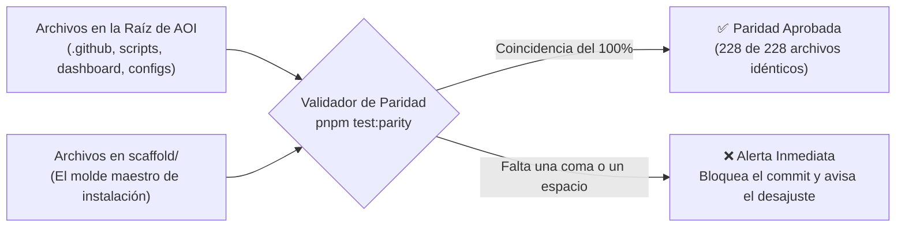
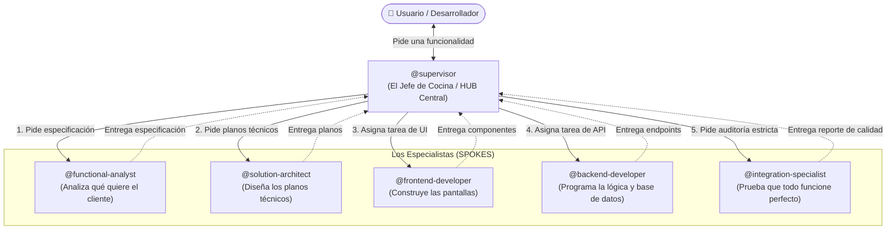

# 01. Estructura y Arquitectura del Sistema

> **Visión clara y accesible de la anatomía del repositorio, el Principio I de Paridad Espejo (Scaffold Mirror Parity) y el modelo de orquestación Hub-and-Spoke.**

---

## 💡 En palabras simples: ¿Cómo está organizado AOI?

Imagina que AOI es un **edificio corporativo de ingeniería de alta precisión**. Para que los agentes de inteligencia artificial no se choquen entre sí ni rompan nada, cada piso del edificio tiene una función única:

| Carpeta | Analogía del Mundo Real | ¿Qué hay adentro en cristiano? |
| :--- | :--- | :--- |
| **`.github/`** | **La Oficina de Recursos Humanos y Normas** | Aquí viven los perfiles de los 27 agentes (`agents/`), las 6 reglas sagradas del proyecto (`instructions/`) y los comandos de trabajo (`prompts/`). |
| **`.resources/`** | **La Biblioteca de Negocio** | Documentos que explican qué quiere el cliente (historias de usuario y flujos de negocio). No es código ejecutable; es contexto para leer. |
| **`.specify/`** | **El Estudio de Arquitectura y Archivo** | Guarda las plantillas de diseño técnico y el historial de versiones de la memoria del proyecto (`memory/versions/`). |
| **`.tasks/`** | **El Tablero de Órdenes de Trabajo** | La lista oficial de tareas (`registry.md`) y las carpetas con los planes de cada funcionalidad individual. |
| **`.sandboxes/`** | **Los Laboratorios Acolchonados de Prueba** | Espacios aislados donde los agentes pueden probar ideas o código riesgoso sin peligro de tocar tu código real. |
| **`aoi_apps/`** | **La Sala de Control con Pantallas (Dashboard)** | La aplicación web moderna (Nuxt 4) donde ves las tareas en tarjetas Kanban y gráficos en tiempo real. |
| **`scripts/`** | **La Caja de Herramientas Mecánicas** | Pequeños programas en JavaScript puro que auditan el código, limpian errores y hacen rollback. **Consumen 0 tokens.** |
| **`scaffold/`** | **El Molde Maestro de la Fábrica** | Una copia exacta y limpia de todo el sistema lista para ser instalada en cualquier proyecto nuevo con `setup.sh`. |

---

## 🏛️ Árbol Físico Detallado del Repositorio

```text
AOI/
├── .github/                      # Recursos Humanos: agentes, reglas y comandos slash
│   ├── agents/                   # 27 Agentes especializados (Frontend, Backend, QA, etc.)
│   ├── instructions/             # 6 Reglas canónicas (fuente de verdad inviolable)
│   ├── prompts/                  # 30 Comandos slash (/sdd-frame, /sdd-new, /init, etc.)
│   └── workflows/                # Acciones automáticas de GitHub Actions (CI/CD)
├── .resources/                   # Biblioteca: historias de usuario y flujos de negocio
│   ├── constitution.md           # Reglas de gobierno del subárbol de recursos
│   ├── userstories/              # Requerimientos y necesidades del usuario final
│   └── workflows/                # Cómo interactúan los módulos del sistema
├── .specify/                     # Motor Spec-Kit y control de versiones de memoria
│   ├── extensions/git/           # Automatización de ramas y git workflows
│   └── memory/versions/          # active.json y copias históricas de memoria
├── .tasks/                       # Registro de tareas del ciclo SDD
│   ├── registry.md               # Tabla autoritativa del estado de cada tarea
│   └── {feature}/TASK-YYYY-NNN/  # Carpeta de trabajo aislada por cada funcionalidad
├── .sandboxes/                   # Laboratorios aislados para pruebas seguras
│   └── registry.md               # Registro de cuotas y sandboxes activas
├── aoi_apps/                     # Aplicaciones de usuario
│   └── agentic-ops-dashboard/    # Dashboard C2 web en tiempo real (Nuxt 4 + NuxtUI)
├── scripts/                      # Herramientas mecánicas deterministas (0 tokens)
│   ├── aoi-doctor.mjs            # Chequeo médico 360° en 0 tokens
│   ├── mcp-gateway/              # Compresor de herramientas MCP (84.4% de ahorro)
│   ├── memory-sync/              # Exportador e importador de copias de memoria
│   ├── multi-harness/            # Sincronizador de reglas para Copilot, Claude, Cursor, etc.
│   ├── sandbox/                  # Creación de reinos de prueba herméticos
│   ├── scaffold/                 # Validador de paridad byte-a-byte
│   ├── sdd-lifecycle/            # Validador mecánico de QA sin usar LLMs
│   └── spatiotemporal-runtime/   # Motor de deshacer automático (Ctrl+Z en 0 tokens)
├── scaffold/                     # Plantilla espejo completa para nuevos proyectos
├── wiki/                         # Wiki oficial de GitHub sincronizable
├── setup.sh / setup.ps1          # Instalador universal de 1 línea para cualquier repo
└── package.json                  # Definición de dependencias y scripts de terminal
```

---

## 🪞 El Principio I: Paridad Espejo de Scaffold (Explicado Simple)

### ¿Qué problema resuelve?
En muchos proyectos de software, cuando los desarrolladores mejoran el código principal, **se olvidan de actualizar la plantilla de instalación**. El resultado es frustrante: cuando alguien nuevo intenta instalar el proyecto en una computadora limpia, la instalación falla porque el instalador tiene archivos viejos o desactualizados.

### ¿Cómo lo soluciona AOI?
AOI inventó el **Principio I de Paridad Espejo**:
> *"El molde maestro (`scaffold/`) debe ser una copia fotográfica 100% idéntica, byte por byte, a los archivos correspondientes en la raíz del proyecto."*



Cada vez que ejecutas `pnpm test:parity`, un programa revisa **228 archivos gobernados**. Si modificaste una regla en `.github/` pero olvidaste actualizarla en `scaffold/`, las pruebas fallan de inmediato. Gracias a esto, el instalador `setup.sh` **siempre funciona perfecto a la primera**.

---

## 🐝 La Arquitectura Hub-and-Spoke: La Analogía del Restaurante

Imagina una cocina de un restaurante concurrido:
* Si los cocineros, los pasteleros, los parrilleros y los mozos se gritaran órdenes unos a otros sin orden ni concierto (*red desordenada o mesh*), los platos saldrían crudos, repetidos o quemados.
* En cambio, un restaurante de primer nivel tiene un **Jefe de Cocina (Chef Ejecutivo)** que recibe las comandas de los clientes, asigna cada plato al especialista indicado y revisa la calidad antes de que salga al salón.



En AOI:
* **El `@supervisor` es el HUB central:** Es el único que desglosa los pedidos grandes en tareas pequeñas y las asigna.
* **Los especialistas son los SPOKES:** Trabajan con anteojeras puestas, enfocados al 100% en lo suyo (el frontend solo toca frontend, el backend solo toca backend). Nadie hace tareas cruzadas sin autorización.

---

> ➡️ Continúa leyendo en [**02. Componentes del Sistema**](02-Componentes-del-Sistema) para conocer los 6 bloques tecnológicos explicados de forma ultra-simple.
