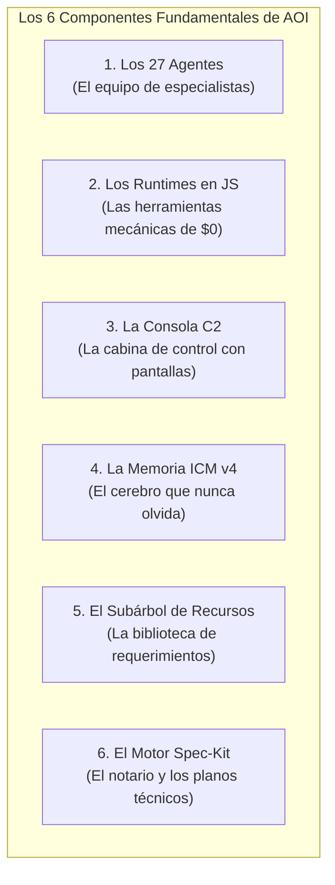
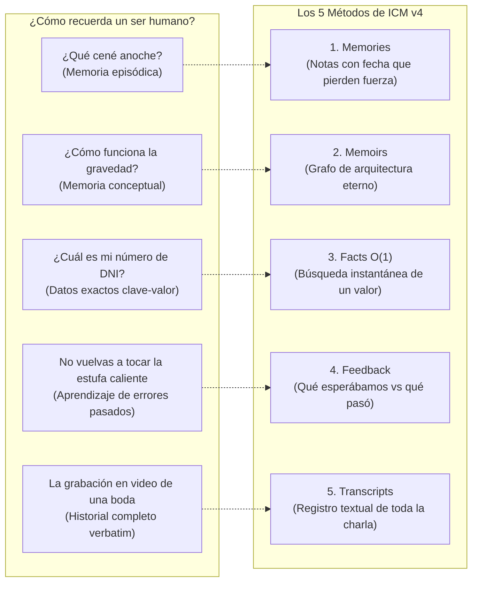

# 02. Componentes del Sistema

> **Explicación clara, sencilla y sin rodeos de los 6 pilares tecnológicos que componen la infraestructura operativa de AOI.**

---

## 💡 En palabras simples: Los 6 Bloques de AOI

Imagina que estás construyendo una fábrica automatizada. No pondrías una sola máquina gigante para hacer todo; tendrías estaciones especializadas:

| Componente | ¿Qué es para humanos? | ¿Por qué es fundamental? |
| :--- | :--- | :--- |
| **1. Enjambre de 27 Agentes** | Un equipo de 27 trabajadores digitales con roles delimitados (uno diseña, otro programa el backend, otro hace tests). | Evita que una sola IA intente hacer todo mal. Cada agente es un experto en su disciplina. |
| **2. Runtimes Deterministas** | Pequeños programas en JavaScript puro que limpian, auditan y verifican archivos en milisegundos. | **Cuestan $0 y consumen 0 tokens.** No le pedimos a una IA que haga matemáticas o revise carpetas; lo hace un script exacto. |
| **3. Consola Operativa C2** | Un sitio web moderno (`localhost:3000`) con tarjetas tipo Trello/Jira y visualizador 3D. | Ves el estado de las tareas, la salud del proyecto y el dinero ahorrado en tiempo real. |
| **4. Memoria ICM v4** | Una base de datos SQLite en tu computadora que actúa como el cerebro a largo plazo. | Tu asistente de IA no olvida nada aunque reinicies la computadora o abras un chat nuevo. |
| **5. Recursos Gobernados** | Una carpeta ordenada (`.resources/`) con historias de usuario y flujos de negocio explicados en texto. | Los agentes pueden leer qué necesita el cliente sin mezclarlo con el código fuente. |
| **6. Motor Spec-Kit** | Un conjunto de plantillas y reglas formales para diseñar planos de software antes de picar código. | Obliga a planificar primero y programar después, eliminando el 90% de los errores de diseño. |

---

## 🤖 1. El Enjambre de 27 Agentes (Dividido por Misiones)

Para entender a los 27 agentes, piensa en una productora de cine o un estudio de desarrollo de software:

### Los 13 Roles de Ingeniería (Los Creativos y Constructores):
1. **`@supervisor` (El Director de Orquesta):** Recibe tu pedido, lo divide en partes y le da trabajo a cada especialista.
2. **`@functional-analyst` (El Intérprete de Negocio):** Habla contigo para entender exactamente qué quieres y escribe el documento de requerimientos (`spec.md`).
3. **`@solution-architect` (El Diseñador de Planos):** Dibuja los diagramas y define cómo se van a conectar las bases de datos y las APIs (`plan.md`).
4. **`@frontend-developer` (El Diseñador de Pantallas):** Construye la interfaz visual que ven los usuarios (botones, formularios, tablas, colores).
5. **`@backend-developer` (El Motor Oculto):** Programa la lógica de negocio, las bases de datos y la seguridad que corre en los servidores.
6. **`@devops-engineer` (El Instalador de Infraestructura):** Prepara los scripts para que el software se instale y funcione en la nube o en contenedores.
7. **`@ux-designer` (El Defensor del Usuario):** Revisa que las pantallas sean fáciles de usar, accesibles para personas con discapacidades visuales y legibles.
8. **`@integration-specialist` (El Inspector de Calidad / QA):** Ejecuta todas las pruebas. Si una sola prueba falla, no deja pasar el código.
9. **`@documentation-analyst` (El Escritor de Manuales):** Mantiene la documentación al día y anota lo aprendido en la memoria permanente del sistema.
10. **`@triage-specialist` (El Médico de Emergencias):** Cuando hay un bug o error en producción, lo aísla y descubre por qué ocurrió.
11. **`@resource-analyst` (El Bibliotecario):** Lee los documentos de negocio en `.resources/` y los resume en la memoria del proyecto.
12. **`@project-analyzer` (El Auditor Técnico):** Revisa que el código no esté desordenado ni tenga partes duplicadas o peligrosas.
13. **`@project-expert` (El Sabio del Proyecto):** Responde cualquier pregunta sobre cómo funciona el proyecto y por qué se hicieron las cosas así.

### Los 14 Micro-Agentes Spec-Kit (Los Asistentes Rápidos):
Son pequeños robots especializados en tareas automáticas puntuales: crear una rama de git (`speckit.git.feature`), hacer un commit con formato estándar (`speckit.git.commit`), generar una lista de chequeo (`speckit.checklist`) o desglosar tareas (`speckit.tasks`).

---

## 🧠 2. La Memoria ICM v4: Las 5 Formas de Recordar del Cerebro Humano

¿Cómo funciona la memoria de un humano? No tenemos una sola forma de recordar: tenemos varios tipos de memoria. ICM v4 replica exactamente eso en tu computadora:

1. **Memories (`icm store`, `icm recall`):** Recuerdos de las tareas del día. Si le dices al asistente *"estoy refactorizando el módulo de pagos"*, lo guarda aquí para que lo recuerde durante la semana.
2. **Memoirs (`icm memoir`):** Conocimiento permanente. Aquí se guarda la arquitectura sagrada (ej. *"este proyecto usa arquitectura hexagonal y no se pueden mezclar capas"*). Nunca se borra.
3. **Facts (`icm facts set`, `icm facts get`):** Datos directos y exactos tipo clave-valor. Por ejemplo: `"puerto": "3000"` o `"servicio_auth": "Keycloak"`. La IA lo consulta en **1 milisegundo sin buscar en archivos**.
4. **Feedback (`icm feedback`):** El registro de lecciones aprendidas. Si una asunción falló (ej. *"pensamos que la librería soportaba Node 18 pero requería Node 20"*), queda guardado para **nunca más tropezar con la misma piedra**.
5. **Transcripts (`icm transcript`):** La grabación en texto de todo lo conversado para auditorías de seguridad o trazabilidad.

---

## ⚙️ 3. Runtimes Deterministas: La Caja de Herramientas sin LLM

¿Por qué gastar dinero haciéndole preguntas a un LLM sobre cosas que un simple script de 10 líneas de código puede hacer mejor, más rápido y gratis?

AOI incluye herramientas programadas en Node.js que corren en tu máquina local:
* **AOI Doctor (`scripts/aoi-doctor.mjs`):** Como llevar el auto al taller y que le conecten el escáner computarizado: en 1 segundo revisa 6 áreas clave de tu proyecto y te dice si está todo en verde.
* **Compresor TOON (`scripts/subagent-context/`):** Toma un texto gigante y lo convierte en una tabla ultra-chica. Ahorra más del **85% de tokens**.
* **Proxy de Herramientas MCP (`scripts/mcp-gateway/`):** En lugar de cargar manuales gigantescos de cada herramienta, les da a los modelos un resumen de 1 línea. Ahorra un **84.4% de tokens**.
* **Motor Espaciotemporal (`scripts/spatiotemporal-runtime/`):** Un botón de Ctrl+Z automático que vigila el disco duro. Si un test se rompe, deshace los cambios al instante en **0 milisegundos**.

---

## 🖥️ 4. El Dashboard C2: La Pantalla de Control

No necesitas ser un experto en terminal para ver qué está pasando en tu proyecto. Al ejecutar `pnpm dev:dashboard`, abres una consola web con:
* **Tablero Kanban:** Tarjetas que se mueven solas cuando una IA empieza a trabajar, pasa a pruebas o termina una tarea.
* **Matriz de Auditoría:** Una tabla para ver qué archivos tocó cada tarea y cuántos tokens consumió.
* **Grafo 3D:** Un mapa visual e interactivo de todo tu código que puedes rotar y hacer zoom con el mouse.
* **Semáforo de Salud:** Una luz verde en la esquina que certifica que el repositorio está 100% sano.

---

> ➡️ Continúa leyendo en [**03. Paradigmas Fundamentales**](03-Paradigmas-Fundamentales) para descubrir por qué la clásica "Historia de Usuario" quedó obsoleta.
