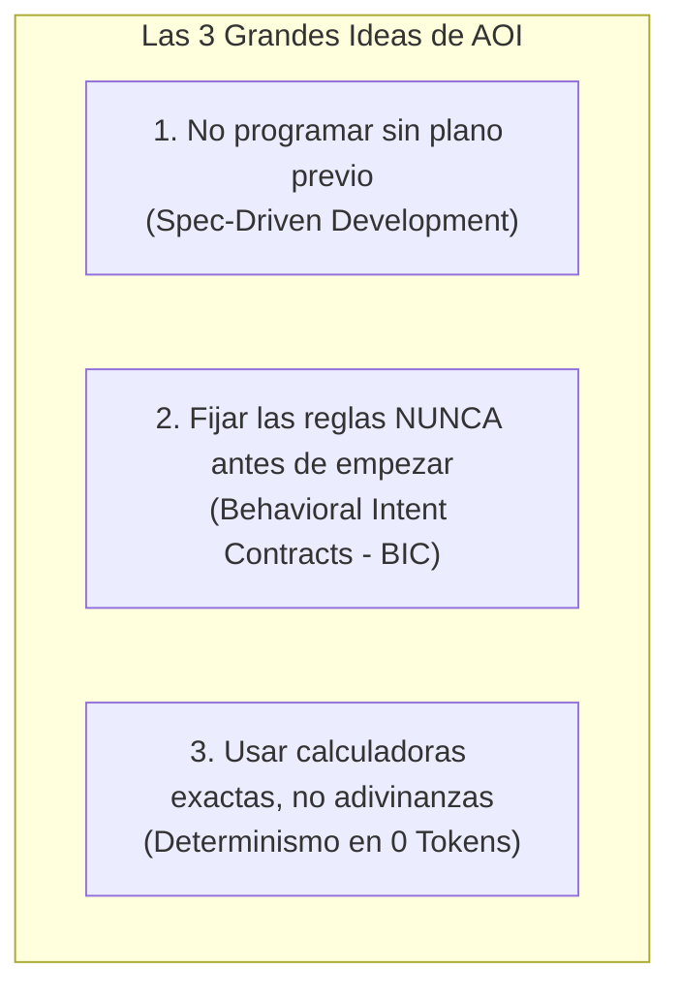
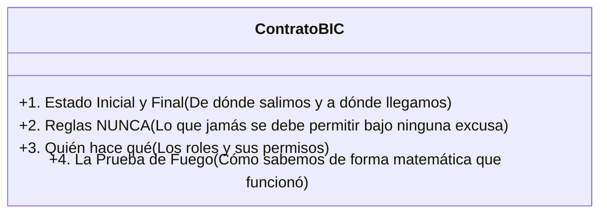

# 03. Paradigmas Fundamentales de AOI

> **Los conceptos revolucionarios explicados de forma simple: Spec-Driven Development (SDD), Contratos Conductuales (BIC) y el poder del Determinismo.**

---

## 💡 En palabras simples: ¿Por qué cambiar la forma de trabajar con IA?

Durante los últimos 20 años, la industria del software usó el método ágil (Scrum) basado en **Historias de Usuario**:
$$\text{"Como } [Rol], \text{ quiero } [Acción], \text{ para } [Beneficio]\text{"}$$

Por ejemplo: *"Como cliente, quiero poder pagar con tarjeta para comprar más rápido"*.

### La Analogía de la Casa y la Columna Maestra:
Imagina que contratas a un albañil humano y le dices: *"Quiero una ventana grande en el living para que entre más luz"*.  
Un albañil humano tiene **sentido común**: antes de tirar una pared, revisa si por ahí pasa una columna maestra o caños de gas.

Pero un asistente de Inteligencia Artificial **no tiene sentido común físico**. Si le dices *"quiero una ventana aquí"*, toma la maza virtual, rompe la pared que sostiene el techo y te tira la casa abajo. Para empeorar las cosas, cuando le dices *"¡mira lo que hiciste!"*, se pone a pedir disculpas gastando miles de tokens y agregando parches improvisados.

**AOI cambia las reglas del juego con tres ideas fundamentales:**



---

## 📜 1. El Paradigma de la Intención (BIC vs Historia de Usuario)

En lugar de escribir historias de usuario vagas en un ticket de Jira, AOI utiliza el **Behavioral Intent Contract (BIC)** (Contrato de Intención Conductual).

### ¿Qué hace la persona humana ahora?
La persona de negocio o product manager **ya no tiene que adivinar nombres de bases de datos ni escribir cómo debe ser la pantalla**. Su trabajo es mucho más valioso y estratégico: **Definir el resultado deseado y las reglas prohibidas**.

### Las 4 Dimensiones de un Contrato BIC (Explicadas para Niños):



| Dimensión | En cristiano | Ejemplo real de la vida cotidiana |
| :--- | :--- | :--- |
| **1. Transición de Estado ($\Delta S$)** | ¿Cómo estaba el sistema antes y cómo debe quedar después? | Antes la cuenta estaba cancelada inmediatamente; ahora tiene 3 días de gracia. |
| **2. Reglas NUNCA (Invariantes)** | ¿Qué cosas están **estrictamente prohibidas** que la IA jamás debe romper? | Una cuenta en periodo de gracia **NUNCA** puede solicitar préstamos nuevos ni subir de plan. |
| **3. Topología de Actores** | ¿Quién tiene la llave para autorizar excepciones? | Solo un agente de soporte de nivel 2 puede extender el plazo; un usuario común no puede. |
| **4. Oráculo Observable** | ¿Cuál es la prueba matemática irrefutable de que todo salió bien? | Si consulto la base de datos, la fecha de vencimiento debe marcar exactamente 72 horas más que la fecha actual. |

---

## 🗣️ 2. La Fase Pre-Flight (`/sdd-frame`): Hablar en Lenguaje Humano

Para crear este contrato, **la persona no necesita aprender ninguna sintaxis rara**. Simplemente escribe en el chat como hablaría con un colega por WhatsApp o nota de voz:

> *"Hola, quiero que si a un usuario le fallan 3 cobros seguidos, no le cancelemos la cuenta de golpe. Démosle unos días de gracia, pero que no pueda pedir préstamos mientras deba plata."*

### ¿Qué hace la IA en ese momento?
1. **Consulta la memoria local en 1 milisegundo:** Revisa qué servicios de cobro ya están programados para no hacer preguntas tontas.
2. **Te hace preguntas socráticas de límites:**  
   - *"¿Cuántos días de gracia exactos: 3 o 5 días?"*  
   - *"¿Qué hacemos si el usuario intenta hacer compras en esos días? ¿Se pausan o se rechazan?"*  
   - *"¿Quién puede extender la gracia si el usuario llama por teléfono?"*
3. **Compila el contrato BIC:** Una vez que respondes esas preguntas simples, la IA arma el contrato formal por ti.
4. **Te muestra el espejo:** Te dice: *"Esto es lo que entendí. ¿Es correcto?"*. Si le dices *"Aprobado"*, recién ahí se pasa a programar.

---

## 🎯 3. Spec-Driven Development (SDD): El Camino Seguro

Una vez aprobado el contrato de intención, AOI avanza por fases ordenadas donde cada paso tiene una **puerta de control (Quality Gate)**:

```text
[Tu idea en lenguaje natural]
       ↓
   /sdd-frame   → Diálogo socrático y Contrato BIC (Sin tocar código todavía)
       ↓ (Compuerta: ¿Está clara la intención?)
   /sdd-new     → El analista escribe las historias formales
       ↓ (Compuerta: ¿La especificación es completa?)
   /sdd-ff      → El arquitecto dibuja los diagramas y define los tipos de datos
       ↓ (Compuerta: ¿Los planos técnicos son sólidos?)
   /sdd-apply   → Los desarrolladores programan con tests que fallan primero (TDD)
       ↓ (Compuerta: ¿Pasan todas las pruebas automáticas?)
   /sdd-verify  → El inspector de calidad ejecuta verificaciones mecánicas en 0 tokens
       ↓ (Compuerta: ¿El oráculo y las reglas NUNCA están intactos?)
   /sdd-archive → Se documenta lo aprendido y se guarda en la memoria permanente
```

---

## ⚖️ 4. Determinismo vs. Estocasticidad: La Calculadora vs La Adivinanza

Hay cosas para las que la inteligencia artificial es maravillosa (redactar código, entender lenguaje natural, sugerir arquitecturas), pero hay cosas para las que **la IA es pésima y carísima**:
* Sumar listas de números.
* Comparar si dos archivos son idénticos byte por byte.
* Decidir qué archivos restaurar cuando falló un test.

| Enfoque | ¿Cómo funciona? | ¿Cuánto cuesta? | ¿Qué confiabilidad tiene? |
| :--- | :--- | :--- | :--- |
| **Estocástico (Pedirle a un LLM)** | Le mandas un error de 500 líneas y le dices *"por favor arréglalo"*. | Cuesta miles de tokens, tarda 20 segundos y puede alucinar o romper otra cosa. | 70% (con suerte). |
| **Determinista (Un script en código puro)** | Un pequeño programa en JavaScript que revisa el error o borra el archivo roto. | **Cuesta $0, consume 0 tokens y tarda 2 milisegundos.** | **100% matemática exacta.** |

**La regla de oro de AOI:**  
> *"Si una tarea puede ser resuelta de forma determinista mediante código tradicional, **NUNCA** se gastará un token de LLM para resolverla."*

---

> ➡️ Continúa leyendo en [**04. Estudios y Fundamentos Científicos**](04-Estudios-y-Fundamentos-Cientificos) para entender las bases matemáticas del botón de deshacer en 0 tokens.
