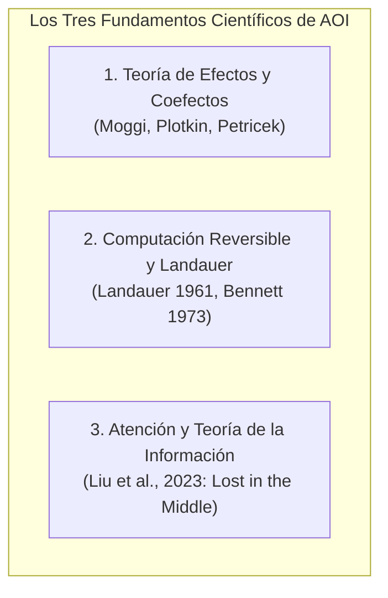
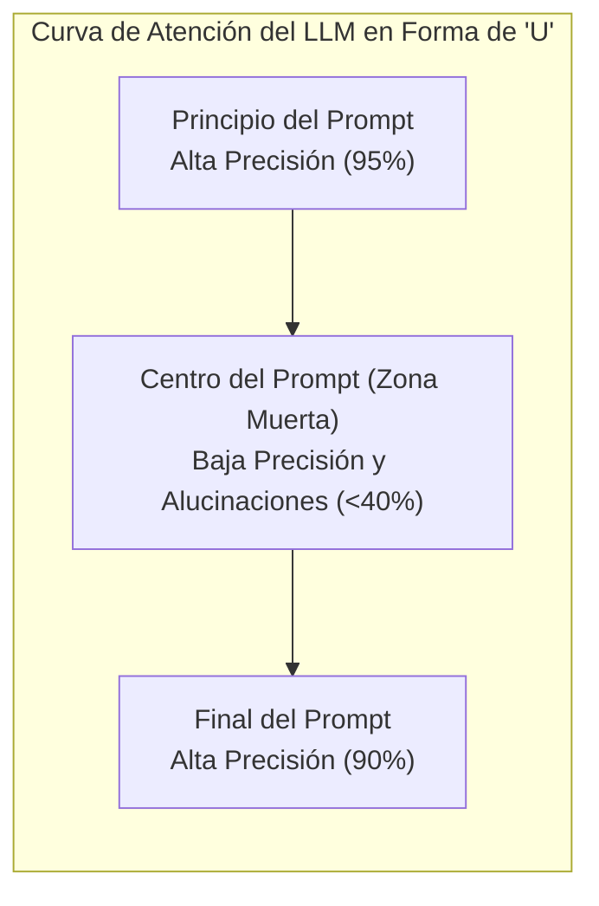

# 04. Estudios y Fundamentos Científicos

> **Los fundamentos matemáticos y físicos explicados con claridad: el botón de deshacer atómico ($\partial\Gamma$), la computación reversible y la ciencia cognitiva de los tokens.**

---

## 💡 En palabras simples: ¿Por qué hay matemáticas en AOI?

Imagina que estás usando un procesador de textos como Microsoft Word o Photoshop. Cuando cometes un error y presionas **`Ctrl + Z` (Deshacer)**:
* El programa **no llama a una inteligencia artificial** a internet para preguntarle: *"Oye, ¿qué crees que había escrito el usuario hace 5 segundos?"*.
* El programa simplemente tiene una lista exacta de reversiones: si escribiste una letra, el reverso es borrarla; si pegaste una foto, el reverso es removerla. Es **instantáneo, exacto y gratis**.

En el desarrollo tradicional asistido por IA, cuando el bot rompe un archivo de código, no existe un `Ctrl + Z` automático. El bot entra en pánico, intenta adivinar qué rompió, escribe código peor y te cobra cientos de miles de tokens en el proceso.

**El Runtime Espaciotemporal de AOI es el `Ctrl + Z` matemático y perfecto para agentes de IA:**  
Cada vez que un agente escribe una línea de código o crea un archivo, el sistema guarda automáticamente su "morfismo inverso" (la función exacta para deshacer ese cambio). Si los tests fallan en QA, el sistema presiona el botón `Ctrl + Z` en **0 milisegundos y con exactamente 0 tokens consumidos**.

---

## 🔤 Nomenclatura Explicada para Humanos

| Símbolo | Nombre Técnico | ¿Qué significa en la vida real? |
| :---: | :--- | :--- |
| **$\Gamma$** | **El Entorno (Contexto)** | Es tu proyecto tal como está en este segundo: todos tus archivos, carpetas y configuraciones. |
| **$\partial\Gamma$** | **Efecto Reversible** | Cada cambio que hace el agente (ej. crear un archivo) junto con su ticket de devolución (la orden de borrarlo si algo sale mal). |
| **$\diamond$** | **Composición Monoidal** | El orden de las acciones: si primero abres la puerta y luego prendes la luz, para deshacer debes primero apagar la luz y luego cerrar la puerta (orden inverso LIFO). |
| **$\text{recover}_\Gamma$** | **El Operador de Rollback** | El botón de pánico que ejecuta todos los tickets de devolución en orden inverso. Devuelve tu proyecto a su estado original limpio en **0 ms y $0**. |
| **$\Sigma$** | **Coefectos** | La lista de cosas que el agente necesita para poder trabajar (ej. tener la base de datos encendida o tener permisos de escritura). Si falta algo, el sistema no lo deja arrancar. |
| **$\Sigma^{\text{iso}}$** | **Reino Aislado (Sandbox)** | Una habitación sellada para el subagente, para que juegue ahí adentro sin tocar el código principal hasta que demuestre que funciona. |

---

## 🔬 Las 3 Leyes Científicas en las que se Basa AOI

### 1. Teoría de Efectos y Coefectos (Matemática Funcional)
* **¿Qué descubrieron los científicos (Plotkin, Moggi)?**  
  Que en programación, cualquier acción que modifique el mundo exterior (escribir un archivo, imprimir en pantalla) puede modelarse como una operación matemática rigurosa con su propia inversa.
* **¿Qué descubrió Petricek sobre los Coefectos?**  
  Que antes de hacer una acción, debes medir **los requisitos del entorno**. Si vas a salir a la ruta en auto, primero revisas si tienes gasolina. Si no hay gasolina, no arrancas. En AOI, si una herramienta MCP no está disponible, el agente no se ejecuta, evitando fallos tontos a mitad de camino.

---

### 2. El Principio de Landauer y la Computación Reversible (Física)
* **¿Qué demostró Rolf Landauer en 1961?**  
  Que en la física, **borrar información de forma desordenada genera calor y disipa energía**.
* **¿Qué probó Charles Bennett en 1973?**  
  Que es posible ejecutar cualquier programa de computación sin perder energía siempre y cuando **cada paso sea reversible**.
* **¿Cómo se aplica esto en AOI?**  
  Cuando un agente convencional de IA sobrescribe archivos y los rompe, genera "calor cognitivo" (pérdida de contexto, alucinaciones, gasto disparatado de tokens). AOI aplica el principio de Bennett: **ningún cambio es destructivo**; todo cambio porta su inversa simétrica. Revertir no cuesta nada.

---

### 3. Teorema 7 de Solidez (Garantía de Cero Fuga de Recursos)
El Teorema 7 formulado en la arquitectura de AOI demuestra matemáticamente que:
$$\text{recover}(\Gamma_n) = (e_1^{-1} \circ e_2^{-1} \circ \dots \circ e_n^{-1})(\Gamma_n) \equiv \Gamma_0$$

> **En palabras simples:**  
> No importa si el agente creó 10 archivos temporales, modificó 3 módulos y tocó variables de entorno: si la prueba de calidad falla, el operador `recover` deshace absolutamente todo en orden inverso. Tu computadora queda **tan limpia como si nunca hubiera pasado nada**. Cero residuos. Cero archivos basura olvidados. Cero tokens gastados.

---

## 🧠 Por qué atiborrar de texto a una IA la vuelve torpe

Existe la tentación ingenua de pensar: *"Si los modelos tienen ventanas de contexto de 1 millón de tokens, metámosle todo el repositorio adentro en cada pregunta"*.

La ciencia de los transformadores (Liu et al., 2023) demostró el fenómeno **"Lost in the Middle" (Perdido en el Medio)**:

* Si le pasas 100.000 palabras a un modelo, el modelo recuerda muy bien lo que le dijiste al principio y al final, pero **ignora y confunde el 60% que está en el medio**.
* Por eso, enviar especificaciones gigantes en Markdown hace que la IA alucine y olvide reglas críticas.

### La Solución de AOI: Payloads TOON de 400 Tokens
En lugar de pasarle 100.000 palabras, AOI filtra todo el ruido y le envía al agente una ficha técnica en formato **TOON**: una tabla diminuta de solo **400 tokens (1.600 bytes)** con lo indispensable para su tarea.

El resultado es inmediato:
1. La atención del modelo se concentra al 100%.
2. La IA no alucina.
3. El costo por consulta cae más de un **85%**.

---

> ➡️ Continúa leyendo en [**05. Ecosistema de Agentes y Roles**](05-Ecosistema-de-Agentes-y-Roles) para conocer la función exacta de cada uno de los 27 agentes.
