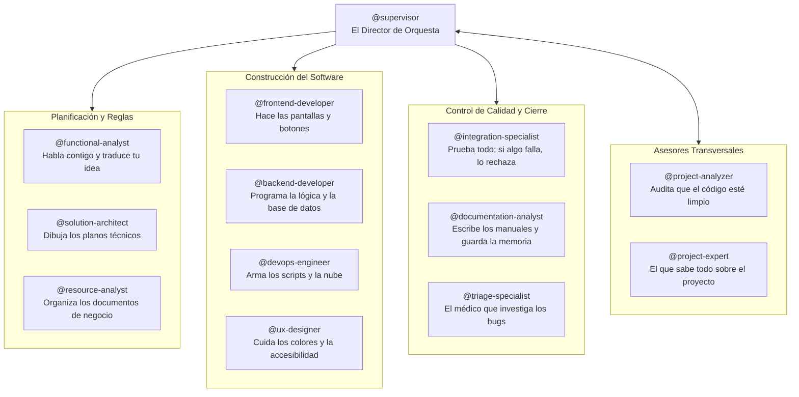

# 05. Ecosistema de Agentes y Roles

> **Catálogo completo de los 27 agentes especializados de AOI explicado de forma directa: qué hace cada uno, cómo se coordinan y cómo se comunican.**

---

## 💡 En palabras simples: ¿Por qué 27 agentes y no uno solo?

Si tienes que remodelar tu casa, no contratas a una sola persona para que haga de arquitecto, electricista, plomero, pintor, abogado y decorador. Terminarías con cables cerca del agua y un desastre de permisos.

En la programación asistida por IA pasa lo mismo:
* Cuando le pides a un único bot generalista que diseñe la base de datos, escriba los estilos CSS, configure Docker y ejecute las pruebas, el bot se satura, comete errores de seguridad y escribe código desordenado.
* **AOI divide el trabajo entre 27 especialistas con límites estrictos**. Cada agente tiene una sola misión y no puede meterse en el terreno de los demás sin permiso.

---

## 🛠️ Los 13 Roles de Ingeniería (Explicados en 1 Sola Frase)



| Agente | ¿Qué hace en cristiano? (Frase resumen) |
| :--- | :--- |
| **`@supervisor`** | **El Capataz:** Recibe tus pedidos, los divide en tareas chicas y vigila que nadie rompa las reglas. |
| **`@functional-analyst`** | **El Traductor:** Escucha tu idea en lenguaje normal y escribe el documento de requerimientos formales. |
| **`@solution-architect`** | **El Arquitecto:** Diseña los planos técnicos, las interfaces y cómo se van a conectar las partes del sistema. |
| **`@frontend-developer`** | **El Pintor y Diseñador:** Construye los componentes visuales, menús y botones que el usuario ve y toca. |
| **`@backend-developer`** | **El Mecánico del Motor:** Programa los servicios, la base de datos y la seguridad que corre detrás de escena. |
| **`@devops-engineer`** | **El Electricista y Redes:** Configura servidores, contenedores y los scripts que suben el código a internet. |
| **`@ux-designer`** | **El Defensor del Usuario:** Verifica que el texto se lea bien, que haya buen contraste y que funcione con teclado. |
| **`@integration-specialist`** | **El Inspector de Calidad:** Corre todas las pruebas automáticas. Si una sola falla, frena todo de inmediato. |
| **`@documentation-analyst`** | **El Notario y Escritor:** Actualiza la documentación del proyecto y guarda lo aprendido en la memoria ICM. |
| **`@triage-specialist`** | **El Detective de Emergencias:** Cuando algo explota o hay un bug difícil, investiga la causa exacta de la falla. |
| **`@resource-analyst`** | **El Bibliotecario:** Clasifica y cataloga las historias de usuario de la carpeta `.resources/`. |
| **`@project-analyzer`** | **El Auditor:** Escanea todo el proyecto buscando código duplicado, dependencias viejas o desorden. |
| **`@project-expert`** | **El Sabio Residente:** Le puedes preguntar cualquier duda sobre la historia y arquitectura del código. |

---

## ⚡ Los 14 Micro-Agentes Spec-Kit (Tus Robots Automatizados)

Son pequeñas herramientas automáticas para no tener que escribir comandos largos a mano:

* **Para planificar:** `speckit.specify` (crear especificación), `speckit.plan` (armar el plan), `speckit.tasks` (desglosar tareas), `speckit.checklist` (crear lista de chequeo).
* **Para programar:** `speckit.implement` (programar una tarea puntual), `speckit.analyze` (revisar qué falta hacer), `speckit.clarify` (hacer preguntas de dudas).
* **Para Git:** `speckit.git.feature` (crear rama nueva), `speckit.git.commit` (hacer commit prolijo), `speckit.git.validate` (revisar si la rama está limpia), `speckit.git.initialize` (iniciar git).
* **Para GitHub:** `speckit.taskstoissues` (convertir tareas locales en issues de GitHub).

---

## 📋 La Matriz RACI Explicada para Humanos

¿Quién manda y quién hace cada cosa en las distintas fases del trabajo?

> **R (Responsable):** El que se pone a trabajar y hace la tarea con sus manos.  
> **A (Aprobador):** El jefe que revisa y da el visto bueno (solo hay uno por fase).  
> **C (Consultor):** Al que se le pide consejo o contexto.  
> **I (Informado):** Al que se le avisa cuando todo terminó.

| Fase del Trabajo | ¿Quién lo hace? (R) | ¿Quién lo aprueba? (A) | ¿Quién ayuda? (C) |
| :--- | :--- | :--- | :--- |
| **0. Pre-Flight (`/sdd-frame`)** | `@functional-analyst` | **Tú (Humano) + `@supervisor`** | `@solution-architect` |
| **1. Especificar (`/sdd-new`)** | `@functional-analyst` | `@supervisor` | `@solution-architect` |
| **2. Diseñar planos (`/sdd-ff`)**| `@solution-architect` | `@supervisor` | `@functional-analyst`, `@backend` |
| **3. Programar (`/sdd-apply`)** | `@frontend` o `@backend` | `@supervisor` | `@solution-architect` |
| **4. Verificar (`/sdd-verify`)** | `@integration-specialist` | `@supervisor` | Desarrolladores |
| **5. Archivar (`/sdd-archive`)** | `@documentation-analyst` | `@supervisor` | Todo el equipo |

---

## 📦 El Protocolo TOON: La Analogía del Post-it vs La Enciclopedia

Cuando el `@supervisor` le da una tarea al `@backend-developer`:
* **El método malo tradicional:** Le pasa una enciclopedia de 50 páginas con todo el historial de conversaciones desde que se abrió el chat hace tres semanas. El agente se marea, gasta 10.000 tokens y no sabe qué leer.
* **El método TOON de AOI:** Le pega un **post-it conciso** con 6 renglones exactos:

```text
::AOI_SUBAGENT_PAYLOAD[v2]::
TAREA        : TASK-2026-004 (Periodo de gracia en cobros)
ROL          : @backend-developer
LIMITE_LINEAS: Máximo 300 líneas por archivo
REGLA_NUNCA  : Una cuenta en gracia NUNCA puede pedir créditos
ARCHIVOS     : src/services/billing-grace.ts y su test unitario
RESULTADO    : Escribir el test que falle primero y luego el código
::END_PAYLOAD::
```

### ¿Por qué esto es genial?
* Pasa de **~2.700 tokens a solo ~400 tokens** (un ahorro de más del **85%**).
* El subagente sabe exactamente qué tiene que hacer en 1 segundo y **no tiene forma de equivocarse**.

---

> ➡️ Continúa leyendo en [**06. Funcionalidades y Herramientas**](06-Funcionalidades-y-Herramientas) para conocer los scripts de terminal que corren gratis en tu máquina.
