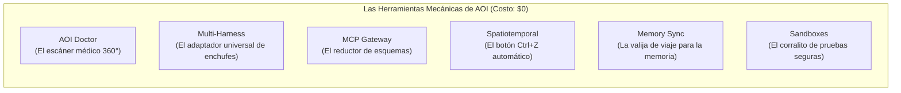

# 06. Funcionalidades y Herramientas Operativas

> **Las herramientas y utilidades de AOI explicadas de forma sencilla: qué hace cada comando en tu computadora, cuánto tarda y por qué cuesta $0.**

---

## 💡 En palabras simples: Las Herramientas Mecánicas de AOI

Imagina que tienes un taller mecánico moderno. Hay trabajos creativos donde necesitas a un ingeniero pensando, pero hay tareas repetitivas donde lo mejor es usar una herramienta mecánica calibrada: un medidor de presión, una llave dinamométrica o un escáner de diagnóstico.

En AOI, todas las herramientas que viven en la carpeta `scripts/` son **programas en JavaScript puro**:
* **No usan Inteligencia Artificial:** Son código directo y exacto.
* **Son instantáneas:** Tardan entre 10 milisegundos y 1 segundo.
* **Cuestan exactamente $0:** No consumen un solo token de tu saldo.



---

## 🩺 1. AOI Doctor: El Chequeo Médico del Auto en 1 Segundo

```bash
pnpm aoi:doctor
```

### ¿Qué hace en cristiano?
Es el equivalente a llevar tu auto al taller y que le conecten la computadora de diagnóstico. En menos de un segundo, revisa **6 partes vitales** de tu proyecto:
1. **Herramientas de terminal:** Revisa que tengas instalados los programas necesarios (`icm`, `rtk`, `specify`).
2. **Base de datos de memoria:** Se asegura de que el archivo SQLite donde la IA guarda sus recuerdos no esté roto ni bloqueado.
3. **Pizarra de tareas:** Comprueba que cada tarea anotada en `.tasks/registry.md` tenga su carpeta y sus archivos al día.
4. **Punteros de memoria:** Revisa que la versión activa de memoria sea válida.
5. **Sincronización de asistentes:** Verifica que las reglas de Copilot, Claude, Cursor, Antigravity y Cline coincidan.
6. **Paridad de plantilla (Principio I):** Certifica que los 228 archivos del molde de instalación estén intactos.

*Si todo está en orden, te muestra un mensaje verde:*  
`✨ AOI Workspace is fully operational and healthy (11 Passed, 0 Warnings, 0 Failed).`

---

## 🔌 2. Compilador Multi-Harness: El Adaptador Universal de Enchufes

```bash
pnpm aoi:sync-rules
```

### ¿Qué problema resuelve?
Cada asistente de IA lee sus reglas en un archivo distinto:
* GitHub Copilot lee `.github/copilot-instructions.md`.
* Claude Code lee `CLAUDE.md`.
* Cursor lee `.cursorrules`.
* Antigravity / Gemini lee `AGENTS.md`.
* Cline lee `.clinerules`.

Si tuvieras que editar los 5 archivos a mano cada vez que agregas una regla, sería un dolor de cabeza y siempre te olvidarías de alguno.

### ¿Cómo lo soluciona AOI?
Escribes la regla **una sola vez** en la carpeta `.github/instructions/`. Luego ejecutas `pnpm aoi:sync-rules` y el script actualiza automáticamente los 5 archivos en 10 milisegundos.

---

## 🗜️ 3. MCP Gateway: El Resumen Ejecutivo (Ahorro del 84.4%)

### ¿Qué problema resuelve?
Cuando conectas herramientas externas a una IA (como buscar en Google, consultar la base de datos o leer el código), el sistema convencional le envía a la IA manuales técnicos gigantescos en formato JSON con cientos de parámetros. **Eso consume más de 18.000 tokens antes de que siquiera digas "Hola".**

### ¿Cómo lo soluciona AOI?
El Gateway de AOI actúa como un filtro inteligente:
* En lugar de mandarle el manual entero, le manda una lista compacta de 1 renglón por herramienta (*"Herramienta X: guarda un recuerdo"*).
* Solo si la IA decide usar la herramienta, el sistema le muestra los detalles finos.
* **El resultado:** El consumo inicial cae de 18.000 tokens a solo **2.800 tokens** (un **84.4% de ahorro directo**).

---

## 🛡️ 4. Runtime Espaciotemporal: El Botón de Deshacer en 0 Tokens

```javascript
// La magia del botón Ctrl+Z en código:
ctx.effect(() => {
  crearArchivo('/app/nuevo-servicio.ts');
  return () => borrarArchivo('/app/nuevo-servicio.ts'); // La función de reversión
});

// Si los tests fallan:
ctx.recover(); // ¡Puf! El archivo desaparece y tu disco queda como antes en 0 ms.
```

### ¿Qué hace en cristiano?
Cada vez que un subagente de IA crea o modifica un archivo en tu computadora, el motor espaciotemporal anota en una lista secreta la orden exacta para deshacer ese cambio.

Si las pruebas de calidad (`/sdd-verify`) detectan que el agente rompió algo:
* **No le pide a la IA que intente arreglarlo.**
* El sistema activa automáticamente la lista de reversión.
* Todos los cambios rotos se deshacen en **0 milisegundos y con $0 de gasto**.

---

## 🧳 5. Sincronización de Memoria: La Valija para Viajar

¿Qué pasa si tienes que cambiar de computadora o quieres que un compañero de equipo tenga los mismos recuerdos y arquitectura que ya aprendió tu IA?

* **Para empacar la memoria:**
  ```text
  /export-memory-bundle
  ```
  Guarda todo el cerebro de la IA en un archivo comprimido `.tar.gz`.
* **Para desembalarla en otra máquina:**
  ```text
  /import-memory-bundle mi-archivo.tar.gz
  ```
  La otra computadora ahora sabe exactamente lo mismo que la tuya.

---

## 🏖️ 6. Sandboxes: El Corralito de Juegos Seguro

```text
/sandbox-new
```

### ¿Qué hace?
Crea una "sala de juegos acolchonada" en `.sandboxes/` con límites estrictos de tiempo y memoria.  
Si quieres que una IA pruebe una librería experimental o una idea loca, la mandas a la sandbox. Si la idea no funciona, simplemente borras la sandbox y tu código principal jamás se enteró de lo que pasó.

---

## ⚡ 7. RTK: El Filtro de Purificación de la Terminal

Cuando ejecutas pruebas o compilas código, la terminal suele escupir cientos de líneas de texto repetitivo (*"Compilando paquete 1/50... OK"*).

**RTK (Rust ToolKit)** es un filtro inteligente ultrarrápido que se pone en medio de la terminal y la IA:
* Atrapa la salida de comandos como `git`, `pnpm` y `cargo`.
* Elimina el 80% del texto decorativo o inútil.
* Le entrega a la IA únicamente lo que le importa (si pasó la prueba o cuál fue el error exacto).
* **Ahorra entre un 60% y un 90% de tokens en cada comando.**

---

> ➡️ Continúa leyendo en [**07. Ciclo de Vida SDD y Flujo Operativo**](07-Ciclo-de-Vida-SDD-y-Flujo-Operativo) para ver el recorrido paso a paso de una tarea.
