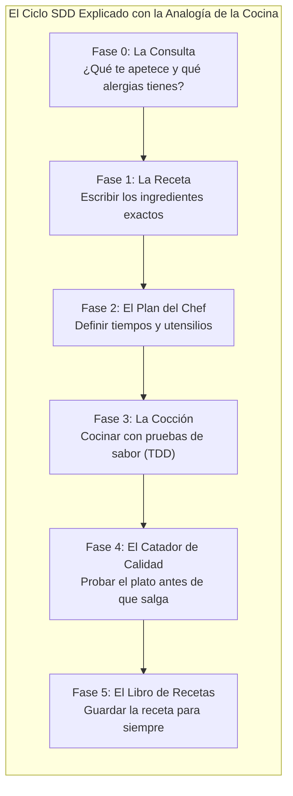
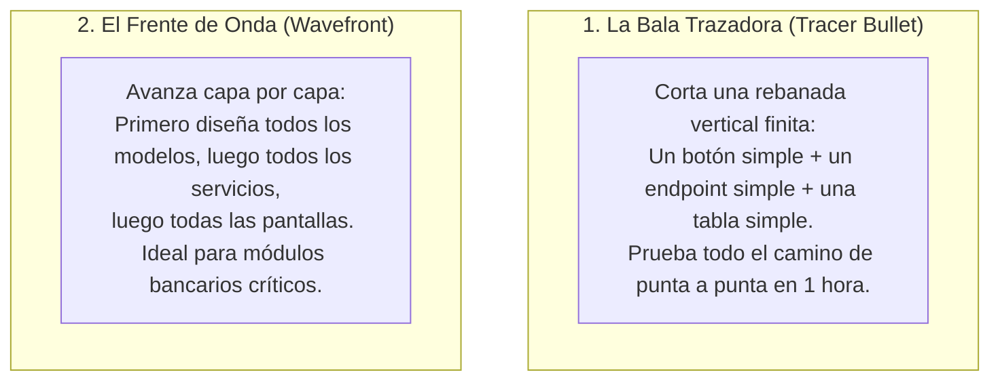

# 07. Ciclo de Vida SDD y Flujo Operativo

> **El recorrido completo de una funcionalidad explicado paso a paso: cómo una idea en tu cabeza se convierte en software probado y en producción sin sorpresas.**

---

## 💡 En palabras simples: La Analogía del Restaurante Gourmet

Imagina que entras a un restaurante de alta cocina. El proceso para preparar un plato perfecto no es improvisar; sigue una secuencia rigurosa:

En el desarrollo de software agéntico con AOI, el **ciclo SDD (Spec-Driven Development)** funciona exactamente igual: nadie toca una sartén ni escribe una línea de código hasta que todos los pasos previos están aprobados.

---

## 📋 Las 6 Fases Explicadas una por una

### 🛫 Fase 0: Pre-Flight Frame (`/sdd-frame`)
* **¿Qué se hace en cristiano?**  
  Te sientas a charlar con el asistente en lenguaje normal. Le cuentas qué quieres lograr.
* **El detalle importante:**  
  La IA te hace preguntas sobre **límites y cosas prohibidas** (ej. *"¿Qué pasa si el cliente no tiene saldo? ¿Le cobramos igual o frenamos?"*).
* **El resultado:**  
  Se crea el **Contrato BIC** con las reglas NUNCA.
* **La compuerta (Intent Gate):**  
  Tú lees el resumen en español claro. Si dices *"Aprobado"*, pasamos a la siguiente fase. **Cero basura en el disco duro.**

---

### 📝 Fase 1: Explore & Specify (`/sdd-new`)
* **¿Qué se hace en cristiano?**  
  El analista funcional (`@functional-analyst`) toma el contrato de la fase anterior y redacta el documento formal de requerimientos (`spec.md`).
* **El detalle importante:**  
  Escribe los casos de uso en formato claro: *"Dado que el cliente debe dinero, cuando intente pedir un crédito, entonces el sistema debe mostrar un mensaje de error"*.
* **La compuerta (Proposal Gate):**  
  Se anota la tarea en la pizarra `.tasks/registry.md` en estado `draft`.

---

### 📐 Fase 2: Architecture & Tasks (`/sdd-ff`)
* **¿Qué se hace en cristiano?**  
  El arquitecto de software (`@solution-architect`) toma la receta y dibuja los planos de ingeniería (`plan.md` y `tasks.md`).
* **El detalle importante:**  
  Define cómo se van a llamar las funciones, qué tipo de datos van a devolver y divide el trabajo en 2 o 3 micro-tareas independientes.
* **La compuerta (Design Gate):**  
  Los planos quedan sellados. La tarea pasa a estado `planned`.

---

### 💻 Fase 3: Implementation & TDD (`/sdd-apply`)
* **¿Qué se hace en cristiano?**  
  Los programadores (`@frontend-developer`, `@backend-developer`) se ponen a escribir el código.
* **Las 3 Reglas Sagradas de esta fase:**
  1. **TDD Estricto (Red -> Green -> Refactor):** Primero escriben una prueba automática que **falla** (Red). Luego escriben el código justo para que la prueba **pase** (Green). Y por último limpian el código (Refactor).
  2. **Límite de 300 Líneas (SRP):** Ningún archivo puede tener más de 300 líneas de largo para evitar código espagueti.
  3. **Habitación Acolchonada (Sandbox):** Trabajan en un espacio aislado con botón de deshacer automático.
* **La compuerta (TDD Gate):** Todos los tests unitarios pasan en verde. La tarea pasa a estado `in-progress`.

---

### 🔍 Fase 4: Mechanical Verification (`/sdd-verify`)
* **¿Qué se hace en cristiano?**  
  El inspector de calidad (`@integration-specialist`) entra en acción para hacer la auditoría final.
* **El detalle importante:**  
  No usa un LLM para opinar si el código le gusta o no. Ejecuta un script en Node.js (`mechanical-verify-union.mjs`) que corre todas las pruebas del proyecto.
* **¿Qué pasa si algo falló?**  
  El sistema presiona el botón `recover()` y **deshace los cambios defectuosos al instante en 0 tokens**.
* **La compuerta (Verify Gate):**  
  100% de pruebas aprobadas y cero violaciones de reglas NUNCA. La tarea pasa a estado `review`.

---

### 📦 Fase 5: Live Docs & Archival (`/sdd-archive`)
* **¿Qué se hace en cristiano?**  
  El analista de documentación (`@documentation-analyst`) archiva la tarea con honores.
* **El detalle importante:**  
  Extrae los conceptos y reglas aprendidas durante el trabajo y las guarda para siempre en la **memoria permanente (Memoirs)** de ICM.
* **El resultado:**  
  La tarea pasa a estado `completed` en la pizarra `.tasks/registry.md`. La IA ahora es más inteligente que cuando empezó.

---

## 🎯 Las 2 Formas de Abordar un Proyecto: Trazador vs Frente de Onda

1. **Bala Trazadora (Tracer Bullet):** Imagina cortar una rebanada delgada de una torta para probar si el bizcochuelo, la crema y el dulce de leche combinan bien juntos. Es perfecta para validar si una tecnología nueva funciona antes de programar todo lo demás.
2. **Frente de Onda (Wavefront):** Es como construir un edificio piso por piso: primero todos los cimientos, luego todas las columnas, luego las paredes. Es la estrategia recomendada cuando estás tocando pagos, transferencias de dinero o autenticación de usuarios.

---

> ➡️ Continúa leyendo en [**08. Dashboard Operativo C2**](08-Dashboard-Operativo-C2) para ver cómo monitorear todo este proceso en una pantalla visual.
