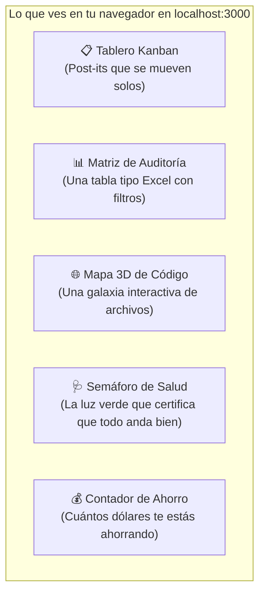

# 08. Centro de Comando y Control: Dashboard C2

> **El panel web visual de AOI explicado para todos: cómo ver el avance de tus agentes, explorar tu código en 3D y vigilar la salud del proyecto sin tocar una terminal.**

---

## 💡 En palabras simples: La Cabina de Control con Pantallas

Imagina que eres el piloto de un avión moderno. Tienes dos opciones para volar:
1. **La opción antigua y difícil:** Mirar cables pelados en el suelo, revisar voltajes con un multímetro a mano y adivinar la altitud mirando por la ventana (eso es trabajar abriendo archivos de texto y mirando terminales llenas de logs incomprensibles).
2. **La opción moderna (Dashboard C2 de AOI):** Sentarte en una cabina cómoda con pantallas táctiles, luces verdes que te dicen que todo está perfecto y un radar que te muestra en tiempo real hacia dónde se mueve el avión.



---

## ⚡ ¿Cómo se abre y cómo se usa?

Solo necesitas escribir un comando en tu terminal:

```bash
pnpm dev:dashboard
```
Tu navegador web se abrirá automáticamente en:  
👉 **`http://localhost:3000`**

---

## 🧭 Los 6 Paneles del Dashboard Explicados sin Tecnicismos

### 1. El Tablero Kanban (`TaskBoard.vue`)
* **¿Qué es?**  
  Una pizarra con columnas de colores: *Borrador*, *Planificada*, *En Desarrollo*, *En Pruebas*, *Completada*.
* **¿Cuál es la magia?**  
  **No tienes que mover las tarjetas a mano**. Cuando un agente de IA empieza a programar, la tarjeta se mueve sola a "En Desarrollo". Cuando termina los tests, se mueve a "En Pruebas".
* **Si haces clic en una tarjeta:**  
  Se abre un panel lateral donde puedes leer los planos, los requerimientos y ver qué archivos tocó.

---

### 2. La Matriz de Auditoría (`TaskTanstackTable.vue`)
* **¿Qué es?**  
  Una tabla interactiva de alta densidad, muy similar a una hoja de cálculo de Google Sheets o Excel.
* **¿Para qué sirve?**  
  Para buscar entre decenas de tareas. Puedes filtrar por nombre de desarrollador, por fecha o ver rápidamente qué tarea consumió más recursos.

---

### 3. El Grafo 3D de Código (`MemoirGraphViewer.vue`)
* **¿Qué es?**  
  Un mapa tridimensional interactivo de todo tu proyecto que parece una galaxia de estrellas.
* **¿Cómo se usa?**  
  Con el mouse puedes rotar el mapa, hacer zoom y hacer clic en cualquier nodo:
  - Cada esfera de color representa un archivo, servicio o función.
  - Las líneas entre esferas muestran quién llama a quién.
* **¿Por qué es útil?**  
  Te permite entender la arquitectura de un proyecto gigantesco en 2 minutos sin leer miles de líneas de código.

---

### 4. El Semáforo AOI Doctor (`DoctorHealthBadge.vue`)
* **¿Qué es?**  
  Una insignia brillante en la esquina superior de la pantalla.
* **¿Qué significan sus luces?**  
  - 🟢 **Verde (360° Healthy):** Tu proyecto está perfecto. Las bases de datos andan, los tests pasan y no hay errores.
  - 🟡 **Amarillo (Degraded):** Advertencia menor (ej. una herramienta opcional no está instalada, pero todo sigue funcionando).
  - 🔴 **Rojo (Critical):** Algo se rompió (ej. la base de datos se bloqueó).
* **Si haces clic en el semáforo:**  
  Se abre una ventana que te dice exactamente qué paso falló y cómo solucionarlo en 1 segundo.

---

### 5. El Panel de Ahorro y Telemetría (`TokenUsagePanel.vue`)
* **¿Qué es?**  
  El medidor de combustible y dinero de tus sesiones de IA.
* **¿Qué métricas te muestra?**  
  - Cuántos tokens se leyeron de la memoria caché (**Prompt Cache Hit Rate**). Si está arriba del 85%, estás en zona **Óptima**.
  - Cuántos dólares te ahorraste en comparación con haber usado agentes tradicionales sin AOI.

---

### 6. El Explorador de Hechos en $O(1)$ (`FactsExplorer.vue`)
* **¿Qué es?**  
  La libreta de contactos de tu proyecto.
* **¿Qué hay adentro?**  
  Datos exactos y fijos que la IA necesita saber todo el tiempo: qué puerto usa el servidor, qué versión de base de datos tenemos, cómo se llama la API externa. Puedes buscarlos y verlos al instante.

---

## 🌐 En Vivo y en Directo (Sin Recargar la Página)

El Dashboard cuenta con tecnología **Server-Sent Events (SSE)**. Esto significa que está conectado por un canal invisible y permanente con tu computadora:
* Cada vez que un agente crea un archivo o cambia el estado de una tarea, la pantalla **se actualiza en vivo al instante** sin que tengas que apretar F5 ni refrescar el navegador.
* Puedes alternar entre **Español e Inglés** con el selector de idioma en cualquier momento.

---

> ➡️ Continúa leyendo en [**09. Optimización de Tokens y Benchmarks**](09-Optimizacion-de-Tokens-y-Benchmarks) para entender por qué AOI ahorra tanto dinero.
