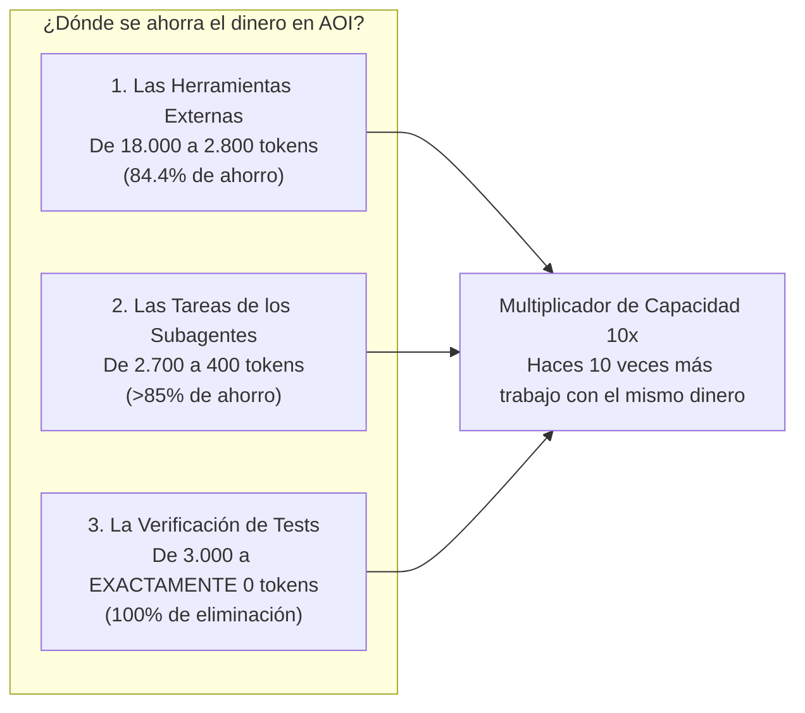

# 09. Optimización de Tokens y Benchmarks Oficiales

> **El ahorro de dinero y tokens explicado para humanos: qué es un token, por qué los agentes convencionales gastan una fortuna y cómo AOI reduce la factura entre un 85% y un 95%.**

---

## 💡 En palabras simples: ¿Qué es un token y por qué te importa?

Imagina que estás enviando cartas por correo tradicional y el cartero te cobra **por cada gramo de peso de la carta**:
* **El método convencional (malo y caro):** Cada vez que quieres hacerle una pregunta simple al cartero (*"¿dónde firmo?"*), le mandas dentro del sobre **la guía telefónica entera de tu ciudad y el árbol genealógico de tu familia**. El sobre pesa 15 kilos. El cartero tarda 20 minutos en cargarlo y te cobra $50 dólares por cada envío.
* **El método AOI (inteligente y veloz):** Le mandas una **tarjeta postal ligera** que pesa 5 gramos con la pregunta exacta. Llega en 1 segundo y te cuesta centavos.

En el mundo de la Inteligencia Artificial, las palabras y símbolos se miden en **tokens** (aproximadamente 1 palabra = 1.3 tokens). Cada vez que un agente lee o escribe tokens, tu proveedor (Anthropic, OpenAI, DeepSeek) te pasa la factura.

---

## 💰 Los 3 Frentes de Ahorro de AOI (Explicados sin Rodeos)

### 1. El Catálogo de Herramientas (Gateway MCP Compressor)
* **¿Qué pasaba antes?**  
  Para que la IA pudiera usar herramientas como buscar en la base de datos o leer el código, el sistema le inyectaba manuales gigantescos en formato JSON en cada turno. Gastabas **18.000 tokens** antes de empezar a programar.
* **¿Qué hace AOI?**  
  Le entrega una lista comprimida de una sola línea por herramienta.
* **El Ahorro:** Pasas de 18.000 a **~2.800 tokens** (**84.4% de ahorro inmediato**).

---

### 2. El Post-it Quirúrgico para Subagentes (Formato TOON)
* **¿Qué pasaba antes?**  
  Cuando el supervisor le pedía al frontend que hiciera un botón, le copiaba y pegaba todo el historial de conversaciones de los últimos 5 días. Payloads gigantes de 2.700 a más de 50.000 tokens.
* **¿Qué hace AOI?**  
  Elimina todo el ruido y le manda una ficha técnica tabular ultracompacta (**TOON**) con 5 líneas precisas.
* **El Ahorro:** Pasas de 2.700 tokens a **~405 tokens** (**más del 85% de ahorro**).

---

### 3. La Verificación Mecánica de Calidad (Mechanical Set Union)
* **¿Qué pasaba antes?**  
  Para saber si las pruebas pasaron o fallaron, los sistemas le mandan 300 líneas de logs a un LLM para que las "lea y resuma", gastando entre 1.500 y 3.000 tokens.
* **¿Qué hace AOI?**  
  Usa un script en JavaScript de 20 líneas en tu computadora. El script revisa el código de salida de los tests en 2 milisegundos.
* **El Ahorro:** **Exactamente 0 tokens de LLM (100% gratis)**.

---

## 🚀 El Multiplicador de Capacidad 10x: ¿Qué significa para ti?

| Métrica | Un Framework Común | Con AOI v2.0.0 | ¿Qué significa para tu día a día? |
| :--- | :--- | :--- | :--- |
| **Gasto por Turno Agéntico** | ~30.000 tokens | ~3.300 tokens | Cada interacción es **89% más liviana**. |
| **Turnos por cada 1M de Tokens** | ~30 turnos | ~300 turnos | **Puedes hacer 10 veces más tareas con el mismo saldo.** |
| **Tokens de Entrada Ahorrados** | 0 | **~830.000 tokens** | Dejas de pagar por re-leer cosas que no cambiaron. |

---

## 💵 Impacto Financiero en Dólares (Por cada 1 Millón de Tokens)

¿Cuánto dinero real te ahorras según el modelo de IA que utilices en tu editor?

| Modelo de Lenguaje | Costo Base sin AOI | Costo con AOI v2.0.0 | **Dinero que te queda en el bolsillo** |
| :--- | :--- | :--- | :--- |
| **DeepSeek-V3 / v4 pro** | ~$0.25 USD | ~$0.04 USD | **Ahorras ~$0.21 USD / 1M** |
| **Claude 3.5 Haiku / GPT-4o mini** | ~$1.20 USD | ~$0.20 USD | **Ahorras ~$1.00 USD / 1M** |
| **Claude 3.5 Sonnet / GPT-4o** | ~$18.00 USD | ~$3.10 USD | **Ahorras ~$14.90 USD / 1M** |
| **Claude Opus / OpenAI o1** | ~$65.00 USD | ~$11.00 USD | **Ahorras ~$54.00 USD / 1M** |

---

## ⚡ El Truco de la Memoria Caché: "Lo de Siempre, por favor"

Imagina que vas todos los días a la misma cafetería. El primer día tienes que explicarle al mozo: *"Quiero café con leche deslactosada, dos de azúcar y una medialuna de grasa"*.  
Al tercer día, el mozo ya te conoce: solo dices *"lo de siempre"* y te cobra con descuento porque no pierde tiempo.

Los proveedores de IA (Anthropic, DeepSeek, OpenAI) hacen lo mismo: si el principio del texto que le envías es idéntico al de hace 5 minutos, **te cobran hasta un 90% más barato** esos tokens (*Prompt Caching*).

* **Sin AOI:** Como el chat anterior cambia todo el tiempo, la IA nunca puede usar la caché (el ratio de acierto es menor al **45%**).
* **Con AOI:** Como los esquemas de herramientas y los formatos TOON son fijos y ordenados, el ratio de acierto sube a **más del 90%**.
* **El Ahorro Real Total:** Al sumar la compresión física de texto más el descuento de la caché, **terminas pagando entre un 92% y un 95% menos de factura**.

---

> ➡️ Continúa leyendo en [**10. Guía Práctica y Ejemplos Reales**](10-Guia-Practica-y-Ejemplos-Reales) para ver cómo se vive esto en un caso práctico real de programación.
