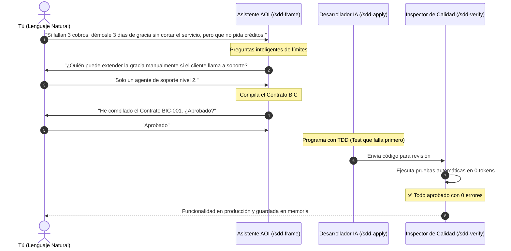
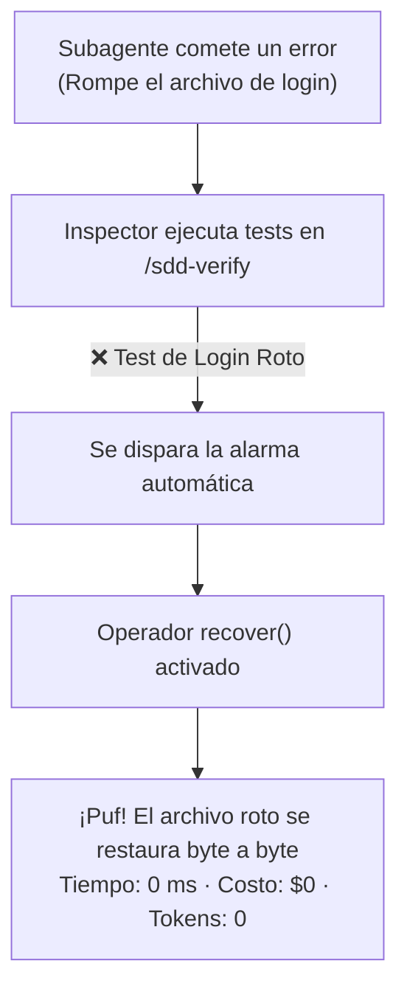

# 10. Guía Práctica y Ejemplos Reales

> **Un recorrido práctico y real explicado de forma sencilla: desde que se te ocurre una idea hasta que está programada, probada y protegida contra fallos.**

---

## 💡 En palabras simples: ¿De qué se trata este ejemplo?

Imagina que tienes una aplicación web con suscripciones mensuales (como Netflix o Spotify).
* **El problema de negocio:** Cuando la tarjeta de un cliente es rechazada por falta de saldo, el sistema antiguo le corta la cuenta de inmediato. Los clientes se enojan y no vuelven más.
* **Lo que queremos lograr:** Queremos darle **3 días de gracia** para que actualice su tarjeta de crédito. Pero con una condición de seguridad fundamental: **mientras deba dinero, no puede pedir préstamos ni contratar planes más caros**.

Veamos cómo se desarrolla esto en AOI paso a paso:

---

## 🚀 Paso a Paso: De la Charla al Código Terminado



---

### Paso 1: Charlar con la IA en Lenguaje Cotidiano (`/sdd-frame`)
Abres tu editor de código favorito (Copilot, Claude, Cursor, etc.) y en el chat escribes como si estuvieras hablando con un amigo:

```text
/sdd-frame
Hola. Quiero que cuando a un cliente le fallen 3 intentos seguidos de cobro, no le cortemos 
la cuenta de golpe. Mejor démosle 3 días de gracia para que pague, pero mientras esté 
en gracia no debe poder pedir préstamos nuevos ni cambiar a un plan más caro.
```

---

### Paso 2: La IA te hace preguntas inteligentes de límites
La IA revisa en 1 milisegundo qué servicios de cobro existen en tu proyecto y te responde:

```text
Entendido. Ya tenemos el servicio de suscripciones (`SubscriptionService`). 
Para que no haya sorpresas en el código, aclaremos estos tres puntos:

1. ¿Qué pasa si el cliente tenía cobros programados para mañana? ¿Se intentan cobrar o se pausan?
2. ¿Quién es la única persona autorizada a darle más días de gracia si el cliente llama a soporte?
```

Tú respondes en una sola frase:
> *"Pausar los cobros automáticos y solo un agente de soporte de nivel 2 puede extender el plazo."*

---

### Paso 3: El Contrato BIC (Tus Reglas Sagradas)
La IA arma el **Contrato Conductual (BIC)** en 4 partes limpias:
1. **El Cambio de Estado:** La cuenta pasa a estado `grace_period` durante 72 horas exactas.
2. **Reglas NUNCA:** Una cuenta en gracia **NUNCA** puede pedir créditos ni subir de plan.
3. **Quién manda:** Solo `support_level_2` puede autorizar excepciones.
4. **La Prueba del Éxito:** Si miramos la base de datos, la fecha de vencimiento debe ser exactamente dentro de 72 horas.

Tú revisas el resumen en español y escribes:
```text
Aprobado
```

---

### Paso 4: Los Planos Técnicos (`/sdd-new` y `/sdd-ff`)
Los agentes de arquitectura entran en acción automáticamente:
* Redactan la especificación técnica formal (`spec.md`).
* Crean los planos técnicos (`plan.md`) y dividen el trabajo en 2 micro-tareas en `tasks.md`.

---

### Paso 5: Programar con la Regla "Falla Primero" (`/sdd-apply`)
El `@backend-developer` se pone a programar, pero con una regla sagrada: **TDD (Test-Driven Development)**:

1. **Primero escribe la prueba:** Crea el archivo de test `billing-grace.test.ts` y lo ejecuta.
   ```bash
   node --test billing-grace.test.ts # ❌ Falla (como debe ser, porque el código aún no existe)
   ```
2. **Luego escribe el código:** Programa la lógica en `billing-grace.service.ts` (manteniéndolo por debajo de 300 líneas).
3. **Vuelve a ejecutar la prueba:**
   ```bash
   node --test billing-grace.test.ts # ✅ Pasa en verde (100% de éxito)
   ```

---

### Paso 6: El Inspector de Calidad (`/sdd-verify`)
El agente `@integration-specialist` ejecuta las pruebas generales:
* Revisa que todas las pruebas del proyecto sigan pasando.
* Comprueba que la regla "NUNCA" se cumpla.
* **Costo de esta revisión:** **Exactamente $0 y 0 tokens de LLM.**

---

### Paso 7: Guardar en el Cerebro Permanente (`/sdd-archive`)
El agente de documentación guarda lo aprendido en la memoria persistente:
```bash
icm memoir add "PeriodoDeGracia" -t "Regla de 72 horas para cobros fallidos"
icm facts set "AOI.billing.dias_gracia" "3"
```
¡Listo! La tarea quedó completada, documentada y la IA nunca la olvidará.

---

## 🛡️ Caso 2: ¿Qué pasa cuando la IA comete un error? (Rollback en 0 Tokens)

Imagina que un subagente de IA se equivocó e intentó modificar un archivo de seguridad de contraseñas (`auth.config.ts`), rompiendo el login del sistema:



### La Diferencia Fundamental:
* **En otros sistemas:** El bot intenta "arreglar" el login inventando contraseñas falsas, gastando $5 dólares en llamadas a la API y dejando el sistema peor de lo que estaba.
* **En AOI:** El sistema detecta el error en las pruebas, activa el botón de deshacer (`recover()`) y restaura el archivo original intacto. **No se perdió ni un milisegundo ni un centavo.**

---

## 🧠 Caso 3: Usar la Memoria de AOI en tu Día a Día

### Para recordarle una decisión importante al proyecto:
```bash
icm store -t decisions-AOI -c "Usaremos siempre iconos de Lucide y estilos en CSS puro sin Tailwind" -i high
```

### Para preguntarle un dato fijo:
```bash
icm facts get "AOI.service.puerto"
# Te responde: 3000
```

---

> ➡️ Continúa leyendo en [**11. Diagnóstico, Gobernanza y AOI Doctor**](11-Diagnostico-Gobernanza-y-AOI-Doctor) para aprender a mantener tu proyecto siempre saludable.
