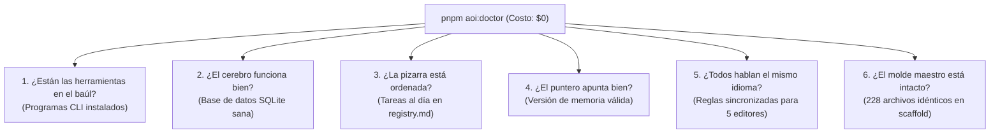
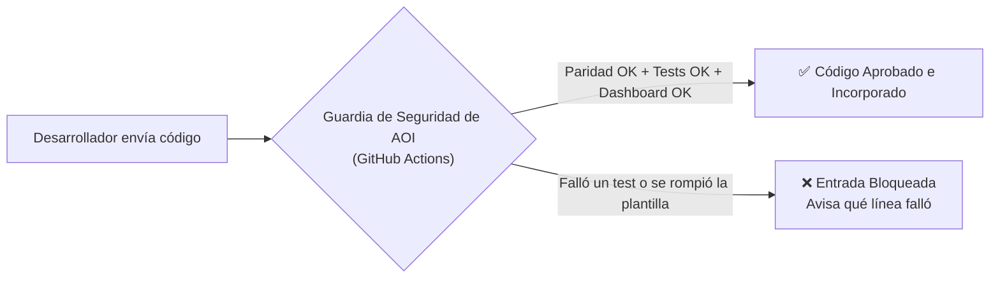

# 11. Diagnóstico, Gobernanza y AOI Doctor

> **El chequeo médico de tu proyecto explicado de forma sencilla: cómo certificar que todo funciona en 1 segundo y mantener a tus agentes en línea.**

---

## 💡 En palabras simples: La VTV (Inspección Técnica) de tu Código

Imagina que llevas tu automóvil a la inspección técnica vehicular (VTV o ITV):
* En 5 minutos, los inspectores revisan los frenos, las luces, los neumáticos y la emisión de gases.
* Si todo está en orden, te pegan una **oblea verde en el parabrisas** y puedes salir a la autopista con total tranquilidad.

En el desarrollo tradicional asistido por IA, los desarrolladores no tienen esa tranquilidad: cruzan los dedos esperando que la IA no haya borrado un archivo de configuración ni roto una base de datos.

**AOI Doctor (`scripts/aoi-doctor.mjs`) es la inspección técnica de tu proyecto:**  
En **menos de 1 segundo** y con **$0 de costo**, revisa 6 partes vitales de tu repositorio y te dice si estás 100% listo para programar.

---

## 🩺 Las 6 Revisiones de AOI Doctor (Explicadas para Humanos)

```bash
pnpm aoi:doctor
```



| Revisión | ¿Qué revisa en cristiano? | ¿Qué pasa si falla? |
| :--- | :--- | :--- |
| **1. Herramientas CLI** | Que tengas instalados en tu computadora los comandos clave (`icm`, `rtk`, `specify`). | Te avisa qué comando te falta para que lo instales con una sola línea. |
| **2. Base de Datos SQLite** | Que el archivo `memories.db` donde la IA guarda sus recuerdos no esté roto ni bloqueado. | Te avisa si hay un proceso colgado para desbloquearlo de inmediato. |
| **3. Pizarra de Tareas** | Que cada tarea anotada en la lista `.tasks/registry.md` tenga su carpeta real en el disco. | Evita que queden tareas fantasmas o archivos perdidos. |
| **4. Versión de Memoria** | Que el archivo `active.json` apunte a una versión válida de los recuerdos del proyecto. | Asegura que la IA no empiece a alucinar con memorias corruptas. |
| **5. Sincronización Multi-Harness** | Que las reglas de Copilot, Claude, Cursor, Antigravity y Cline sean idénticas. | Si detecta diferencias, te recuerda ejecutar `pnpm aoi:sync-rules`. |
| **6. Molde de Scaffold (Principio I)**| Que los 228 archivos de la plantilla de instalación sean una copia exacta del código raíz. | Protege el instalador para que siempre funcione perfecto en proyectos nuevos. |

---

## 🔄 ¿Cómo mantener las reglas de todos los asistentes al día?

Si en tu equipo hay personas que usan **Cursor**, otras que usan **VS Code con GitHub Copilot** y otras que usan **Claude Code**:

1. No tienes que editar 5 archivos diferentes a mano.
2. Abres la carpeta `.github/instructions/` y agregas tu nueva regla (ej. *"todos los endpoints deben usar HTTPS"*).
3. En tu terminal escribes:
   ```bash
   pnpm aoi:sync-rules
   ```
4. En 10 milisegundos, el compilador actualiza las reglas para los 5 editores. Todos tus compañeros quedan alineados al instante.

---

## 💾 Guardar, Mover y Recuperar la Memoria del Proyecto

La memoria de la IA no está en la nube de un tercero; vive en tu propia computadora:

### ¿Quieres hacer una copia de seguridad o llevártela a otra máquina?
Escribe en el chat:
```text
/export-memory-bundle
```
*Se crea un archivo comprimido `.tar.gz` en la carpeta `.exportsmemories/` con un sello criptográfico SHA-256.*

### ¿Quieres cargar esa memoria en la computadora de tu compañero?
Escribe en el chat:
```text
/import-memory-bundle ruta/al/archivo.tar.gz
```
*El sistema fusiona los recuerdos sin borrar nada de lo que tu compañero ya tenía.*

### ¿Quieres volver atrás en el tiempo a un recuerdo anterior?
```text
/rollback-workspace-memory
```
*Restaura la memoria al último punto seguro en 1 segundo.*

---

## 🚪 El Guardia de Seguridad en GitHub Actions (CI/CD)

Cuando creas un Pull Request para subir código al repositorio en GitHub, el archivo `.github/workflows/aoi-gate.yml` actúa como un guardia en la puerta:



> **Tranquilidad Total:** Nadie (ni un humano distraído ni una IA alucinando) puede romper el proyecto en la rama principal. Si algo no está 100% perfecto, la compuerta de GitHub lo frena antes de que toque producción.

---

> ➡️ Continúa leyendo en [**12. Referencia de Comandos y Cheat Sheet**](12-Referencia-de-Comandos-y-Cheat-Sheet) para tener la lista completa de atajos y comandos a mano.
