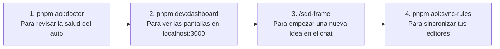
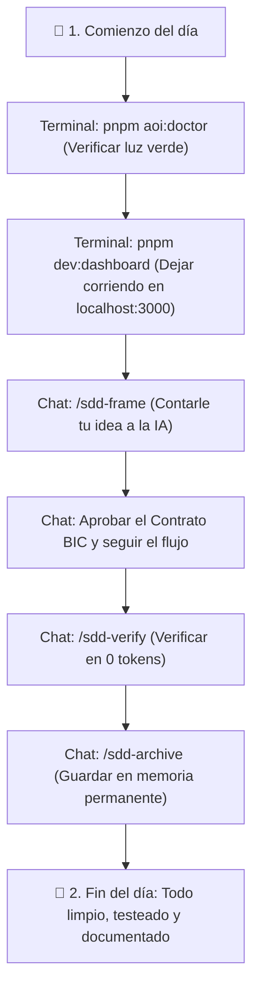

# 12. Referencia de Comandos y Cheat Sheet

> **La chuleta (Cheat Sheet) definitiva de AOI: los 4 comandos que usarás el 90% del tiempo y la lista completa de atajos explicados sin rodeos.**

---

## ⚡ Los 4 Comandos que Usarás el 90% del Tiempo

No necesitas memorizarte 50 comandos para trabajar con AOI todos los días. Con estos 4 tienes todo resuelto:



| ¿Qué quieres hacer? | ¿Dónde lo escribes? | El Comando | ¿Qué hace en cristiano? |
| :--- | :--- | :--- | :--- |
| **Revisar si todo anda bien** | En la Terminal | `pnpm aoi:doctor` | Revisa las 6 áreas vitales en 1 segundo y te da el visto bueno verde en 0 tokens. |
| **Abrir el panel visual** | En la Terminal | `pnpm dev:dashboard` | Abre tu navegador en `http://localhost:3000` con el tablero Kanban y el mapa 3D. |
| **Empezar una funcionalidad** | En el Chat de la IA | `/sdd-frame` | Empieza la charla en español normal para definir qué quieres hacer y qué cosas están prohibidas. |
| **Sincronizar tus editores** | En la Terminal | `pnpm aoi:sync-rules` | Si cambiaste una regla, la copia a Copilot, Claude, Cursor, Antigravity y Cline al instante. |

---

## 💬 Los Comandos Slash (`/`) para el Chat de tu Asistente

### 1. El Ciclo de Desarrollo (SDD)
Escríbelos en el chat de tu editor a medida que avanzas en el trabajo:

* **`/sdd-frame`** ➔ **Fase 0 (Pre-Flight):** Habla con la IA para definir la intención y crear el contrato de reglas NUNCA (BIC).
* **`/sdd-new`** ➔ **Fase 1 (Especificación):** El analista redacta el documento formal de requerimientos (`spec.md`).
* **`/sdd-ff`** ➔ **Fase 2 (Planos):** El arquitecto dibuja los diagramas y crea el plan de tareas (`plan.md`).
* **`/sdd-apply`** ➔ **Fase 3 (Programación):** Los desarrolladores escriben el código con tests que fallan primero (TDD).
* **`/sdd-verify`** ➔ **Fase 4 (Calidad):** El inspector ejecuta todas las pruebas automáticas en 0 tokens. Si algo falló, deshace el cambio.
* **`/sdd-archive`** ➔ **Fase 5 (Cierre):** Guarda lo aprendido en la memoria permanente y cierra la tarea en la pizarra.

---

### 2. Memoria y Copias de Seguridad
* **`/export-memory-bundle`** ➔ Guarda todos los recuerdos y arquitectura de la IA en un archivo `.tar.gz` para llevar a otra máquina.
* **`/import-memory-bundle ruta/al/archivo.tar.gz`** ➔ Carga una copia de memoria en tu computadora.
* **`/rollback-workspace-memory`** ➔ Vuelve atrás en el tiempo al último recuerdo seguro si algo se desconfiguró.

---

### 3. Carpetas de Negocio y Experimentos
* **`/sandbox-new`** ➔ Abre una habitación aislada de pruebas para probar código riesgoso sin tocar tu proyecto real.
* **`/update-resource-governance-structure`** ➔ Si agregaste un archivo en `.resources/userstories/`, este comando se lo enseña a la IA.

---

## 💻 Todos los Scripts de Terminal (pnpm)

Ejecútalos en la raíz de tu proyecto:

| Comando en Terminal | ¿Para qué sirve? |
| :--- | :--- |
| `pnpm aoi:doctor` | Chequeo médico 360° en 0 tokens. |
| `pnpm aoi:sync-rules` | Sincroniza las reglas de los 5 asistentes de IA. |
| `pnpm dev:dashboard` | Lanza la consola web en `http://localhost:3000`. |
| `pnpm test` | Ejecuta la suite de pruebas completa (134 tests). |
| `pnpm test:parity` | Revisa que los 228 archivos del molde de instalación estén idénticos al original. |
| `pnpm build:dashboard` | Compila el dashboard web para producción. |

---

## 🚀 Instalar o Desinstalar AOI en Cualquier Proyecto

### Para instalar AOI en un proyecto nuevo o existente:

#### En macOS o Linux:
```bash
bash "/path/to/AOI/setup.sh" /ruta/a/mi-proyecto
```

#### En Windows (PowerShell):
```powershell
powershell -NoProfile -ExecutionPolicy Bypass -File "C:\path\to\AOI\setup.ps1" "C:\ruta\a\mi-proyecto"
```

---

### Para desinstalar AOI limpiamente (sin tocar tu código fuente):
```bash
bash "/path/to/AOI/teardown.sh" /ruta/a/mi-proyecto
```

---

## 🌅 Tu Rutina Diaria Recomendada (Cheat Sheet Visual)



---

> ⬅️ Regresar al portal principal en [**Inicio (Home)**](Home).
