# AOI — Agentic Operational Infrastructure 🚀

> **La infraestructura operativa definitiva para el desarrollo autónomo de software asistido por agentes de Inteligencia Artificial.**  
> _Memoria infinita persistente, optimización matemática de tokens, contratos conductuales sin ambigüedad y runtime espaciotemporal con reversión atómica de efectos._

---

[](11-Diagnostico-Gobernanza-y-AOI-Doctor)
[](01-Estructura-y-Arquitectura)
[](01-Estructura-y-Arquitectura)
[](06-Funcionalidades-y-Herramientas)
[](https://opensource.org/licenses/MIT)

---

## 💡 ¿Qué es AOI explicado en palabras simples?

Imagina que contratas a un equipo de constructores muy rápidos e inteligentes (los asistentes de IA como Copilot, Claude o Cursor), pero tienen tres problemas graves:

1. **Tienen mala memoria:** Cada vez que cierras la ventana de chat, olvidan todo lo que hicieron y las decisiones que tomaron ayer.
2. **Gastan una fortuna:** Para cambiar un tornillo, releen los planos completos de todo el edificio una y otra vez (desperdiciando miles de tokens y dinero).
3. **A veces rompen cosas:** Cuando algo sale mal, intentan arreglarlo a los golpes, rompiendo paredes sanas y empeorando la situación.

**AOI es el sistema operativo que soluciona esto para siempre:**

- **Les da memoria infinita (ICM v4):** Un cerebro persistente en tu computadora donde guardan recuerdos, planos de arquitectura y datos exactos que nunca se olvidan.
- **Les pone un freno al gasto (Ahorro del 85%+):** Les entrega solo la información exacta que necesitan en formatos compactos, ahorrando hasta un 90% de dinero y tiempo.
- **Crea una red de seguridad mágica (Ctrl+Z en 0 segundos y $0):** Los asistentes trabajan en "cajas de arena" aisladas. Si cometen un error o rompen un test, AOI deshace el cambio al instante de forma automática, sin gastar dinero y sin tocar tu código sano.
- **Reemplaza los pedidos vagos por contratos claros (BIC):** En lugar de decirles _"hazme un botón para cobrar"_, un diálogo guiado les enseña exactamente qué hacer y qué **NUNCA** deben permitir.

---

## 🌟 Los 7 Superpoderes de AOI

| Superpoder                                      | ¿Qué significa en la práctica?                                                                          | ¿Por qué te cambia la vida?                                               |
| :---------------------------------------------- | :------------------------------------------------------------------------------------------------------ | :------------------------------------------------------------------------ |
| **1. Enjambre de 27 Agentes**                   | Tienes 27 especialistas con roles claros (uno para frontend, uno para backend, uno para testing, etc.). | Nadie se pisa los pies; cada tarea la hace el mejor experto.              |
| **2. Memoria Persistente (ICM v4)**             | Una base de datos local con 5 formas de recordar (hechos exactos, recuerdos de sesión, grafos).         | Puedes reiniciar tu computadora o cambiar de chat y la IA recuerda todo.  |
| **3. Contratos Conductuales (BIC)**             | La IA te hace preguntas clave antes de programar para fijar reglas "NUNCA".                             | Cero sorpresas: la IA nunca romperá reglas sagradas de tu negocio.        |
| **4. Reversión en 0 Tokens ($\partial\Gamma$)** | Si un test falla, el sistema vuelve atrás automáticamente en 0 milisegundos.                            | No gastas dinero pidiéndole al bot _"por favor arregla lo que rompiste"_. |
| **5. Ahorro de Tokens (60% al 90%)**            | Comprime las herramientas y la información que le pasas al modelo.                                      | Tu factura de IA baja radicalmente y la IA responde 10 veces más rápido.  |
| **6. Una Sola Verdad (Multi-Harness)**          | Escribes tus reglas una vez y se sincronizan con Copilot, Claude, Cursor, etc.                          | Todo el equipo usa las mismas reglas sin importar qué editor prefiera.    |
| **7. Dashboard C2 en Tiempo Real**              | Un panel web visual con Kanban, gráficos 3D y semáforo de salud.                                        | Ves el avance del proyecto sin tener que leer archivos de terminal.       |

---

## 🗺️ Mapa de Navegación de la Wiki

Explora las guías detalladas organizadas por áreas temáticas:

```mermaid
graph LR
    subgraph Fundamentos["1. Fundamentos & Sistema"]
        A1["01. Estructura y Arquitectura"]
        A2["02. Componentes del Sistema"]
        A3["03. Paradigmas Fundamentales"]
        A4["04. Estudios Científicos"]
    end

    subgraph Operacion["2. Agentes & Operación"]
        B1["05. Ecosistema de Agentes"]
        B2["06. Funcionalidades y Herramientas"]
        B3["07. Ciclo de Vida SDD"]
        B4["08. Dashboard C2"]
    end

    subgraph Practica["3. Práctica & Control"]
        C1["09. Benchmarks de Tokens"]
        C2["10. Guía Práctica y Ejemplos"]
        C3["11. AOI Doctor y Salud"]
        C4["12. Cheat Sheet y Comandos"]
    end

    Fundamentos --> Operacion
    Operacion --> Practica
```



- [**01. Estructura y Arquitectura**](01-Estructura-y-Arquitectura): Conoce qué hace cada carpeta del proyecto y por qué la plantilla `scaffold/` es un espejo exacto.
- [**02. Componentes del Sistema**](02-Componentes-del-Sistema): Los 6 pilares explicados de forma directa: agentes, scripts, dashboard, memoria, recursos y Spec-Kit.
- [**03. Paradigmas Fundamentales**](03-Paradigmas-Fundamentales): Por qué la clásica "historia de usuario" ya no sirve y cómo los Contratos BIC protegen tu software.
- [**04. Estudios y Fundamentos Científicos**](04-Estudios-y-Fundamentos-Cientificos): La matemática y física computacional detrás del botón de "deshacer" en 0 tokens.
- [**05. Ecosistema de Agentes y Roles**](05-Ecosistema-de-Agentes-y-Roles): Quién es quién entre los 27 agentes y cómo colaboran sin desorden.
- [**06. Funcionalidades y Herramientas**](06-Funcionalidades-y-Herramientas): Qué hace cada script en tu terminal (AOI Doctor, compresores, sandboxes).
- [**07. Ciclo de Vida SDD y Flujo Operativo**](07-Ciclo-de-Vida-SDD-y-Flujo-Operativo): El camino desde la idea en tu cabeza hasta el código probado en producción.
- [**08. Dashboard Operativo C2**](08-Dashboard-Operativo-C2): Cómo usar la consola web visual (`localhost:3000`) para controlar todo en vivo.
- [**09. Optimización de Tokens y Benchmarks**](09-Optimizacion-de-Tokens-y-Benchmarks): Pruebas reales de ahorro de dinero y multiplicador de capacidad 10x.
- [**10. Guía Práctica y Ejemplos Reales**](10-Guia-Practica-y-Ejemplos-Reales): Un ejemplo completo de la vida real con código, diálogo y simulación de errores.
- [**11. Diagnóstico, Gobernanza y AOI Doctor**](11-Diagnostico-Gobernanza-y-AOI-Doctor): Cómo revisar la salud de tu entorno en 1 segundo y sincronizar tus reglas.
- [**12. Referencia de Comandos y Cheat Sheet**](12-Referencia-de-Comandos-y-Cheat-Sheet): Todos los atajos, comandos slash (`/`) y scripts listos para copiar y pegar.

---

## ⚡ Comienza en 3 Pasos Simples

```bash
# 1. Revisa que todo esté perfecto (tarda 1 segundo y cuesta 0 tokens)
pnpm aoi:doctor

# 2. Abre el tablero visual de control en tu navegador
pnpm dev:dashboard

# 3. En el chat de tu editor preferido, escribe:
/sdd-frame
```

> [!TIP]
> Si deseas sincronizar esta documentación con la Wiki oficial de tu repositorio en GitHub, simplemente ejecuta:  
> `bash wiki/deploy-wiki.sh`
